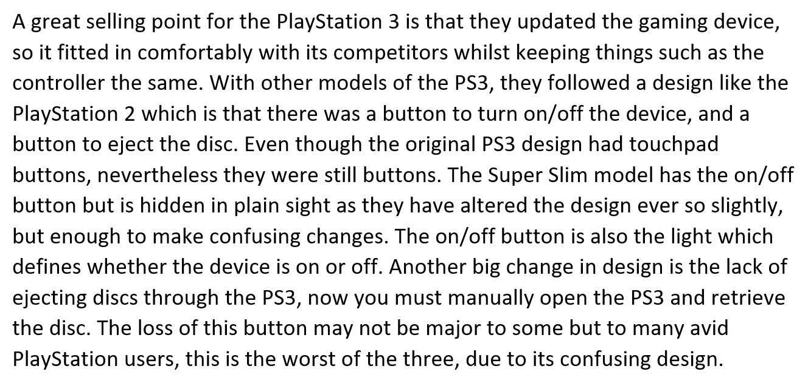
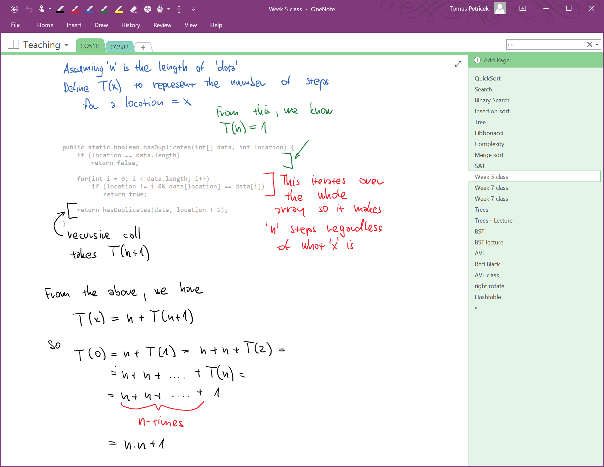
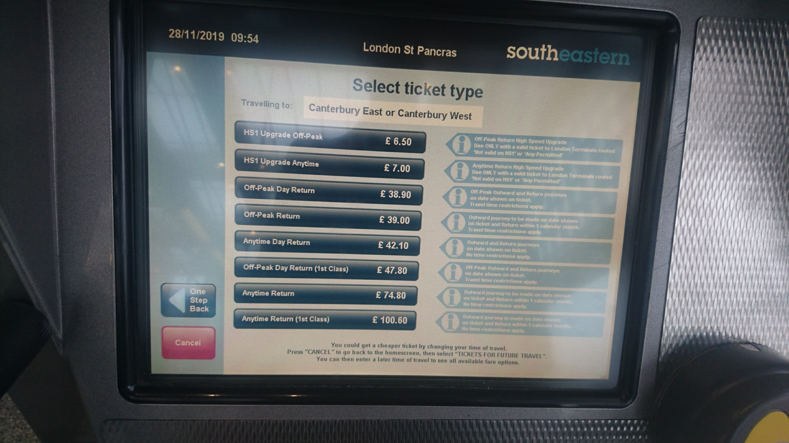

- title : Human Computer Interaction: Feedback on assignment 2
- description : Human Computer Interaction: Feedback on assignment 2
- author : Tomas Petricek
- theme : simple
- transition : none

****************************************************************************************************

# **CO582: Computer Interaction and User Experience**  Feedback on assignment 2

  
   

**Tomas Petricek**

email: [t.petricek@kent.ac.uk](mailto:t.petricek@kent.ac.uk) 
twitter: [@tomaspetricek](http://twitter.com/tomaspetricek) 
office: [S129A](https://www.cs.kent.ac.uk/rooms/S129A.gif) 

****************************************************************************************************
 - class: part

# **General notes**

----------------------------------------------------------------------------------------------------

# General notes
### Common issues

_<i class="fa fa-desktop"></i>_ Is the scope of the analysis reasonable?

_<i class="fa fa-heart"></i>_ Found some interesting love/hate points?

_<i class="fa fa-newspaper"></i>_ This is not a review for a magazine

_<i class="fa fa-university"></i>_ Reference to user interaction principles

_<i class="fa fa-file"></i>_ Readability, structure and formatting

----------------------------------------------------------------------------------------------------

# General notes
### What theories to use?

_<i class="fa fa-list"></i>_ 10 Usability Heuristics by Jakob Nielsen

_<i class="fa fa-book"></i>_ Design principles of Don Norman

_<i class="fa fa-bug"></i>_ Different kinds of errors

_<i class="fa fa-mouse-pointer"></i>_ Fitts' law for mouse navigation

_<i class="fa fa-image"></i>_ Metaphors with fits and misfits

_<i class="fa fa-toggle-on"></i>_ Multiple modes and mode errors

****************************************************************************************************
 - class: part

# **Work examples**

----------------------------------------------------------------------------------------------------

# PlayStation 3

Is there any interface criticism at all?

What is confusing about the button design?

----------------------------------------------------------------------------------------------------

# KFC app

Contrast to highlight the "Scan more get more" deal

Proximity between the banner and the first action

----------------------------------------------------------------------------------------------------

# Smartphone interface

What aspect of smartphone interface is this about?

Notes on Android UI, phone usage, etc.

----------------------------------------------------------------------------------------------------

# Watch and clock

Criticism with reference to specific principles

Choice of a few: alignment and contrast

----------------------------------------------------------------------------------------------------

# Sports app

What is this about  
and who wrote it?

What are major  
topics covered?

What is the picture  
in the corner about?

----------------------------------------------------------------------------------------------------

# NordVPN

Title, author, sections with headings

Figures are clear and have numbers and labels

----------------------------------------------------------------------------------------------------

# Washing machine

Highlights important points about the interface (arrows)

Adds labels for hard to read text

****************************************************************************************************
 - class: part

# **Interface examples**

----------------------------------------------------------------------------------------------------

# Surface Pro keyboard

----------------------------------------------------------------------------------------------------

# Surface Pro keyboard

**Fn key for special keys**  
_Behaves as F1, F2, etc. when turned off_  
_Behaves as volume, brightness when turned on"_

**Genuine usability issues**  
_Closing application when turning sound off!_  
_Navigating in code editor jumps to another page_

**Mode errors**  
_Mode is indicated, but indicator is hard to see_  
_Very easy to switch mode by accident_

----------------------------------------------------------------------------------------------------

# OneNote application

----------------------------------------------------------------------------------------------------

# OnNote application

**Notebook metaphor**  
_OneNote is like a physical notebook_  
_What are the fits and misfits of the metaphor?"_

**Notebook fits**  
_Structure with notebooks and pages_  
_Drawing with a pen, eraser on the back_

**Notebook misfits**  
_Advanced tools for moving text around_  
_It wouldn't occur to you that you can do this_

----------------------------------------------------------------------------------------------------

# Southeastern tickets

----------------------------------------------------------------------------------------------------

# Southeastern tickets

----------------------------------------------------------------------------------------------------

# Southeastern tickets

----------------------------------------------------------------------------------------------------

# Southeastern tickets

----------------------------------------------------------------------------------------------------

# Southeastern tickets

----------------------------------------------------------------------------------------------------

# Southeastern tickets

----------------------------------------------------------------------------------------------------

# Southeastern tickets

**Flexibility and efficiency of use (Nielsen)**  
_Provides easy default option_  
_A button for "Tickets for later travel"_

**Visibility (Norman)**  
_Super off-peak ticket is out of sight_  
_Hidden behind "later travel" when you travel now!_

**Mode errors**  
_Different ticket options shown in different modes_  
_You do not even know there are two modes!_

****************************************************************************************************
 - class: part

# **Summary**

----------------------------------------------------------------------------------------------------

# CO582: Feedback on Assignment 2

**What are the most important lessons**

 - Think about interactions and usability
 - Support your argument with theories
 - Format and structure documents well!

 
 

Tomas Petricek 
_[t.petricek@kent.ac.uk](mailto:t.petricek@kent.ac.uk) | [@tomaspetricek](http://twitter.com/tomaspetricek)_

****************************************************************************************************
 - class: part

# **References**

----------------------------------------------------------------------------------------------------

### Books

- [HCI Models, Theories and Frameworks](https://www.elsevier.com/books/hci-models-theories-and-frameworks/carroll/978-1-55860-808-5), ed. J. Carroll   
  _Chapter 3 (Motor behavior), Chapter 5 (Cognitive dimensions), Chapter 8 (Distributed cognition)_

### Papers

- [Distributed Cognition: an alternative framework for analysing and explaining collaborative working](http://www.dourish.com/classes/ics234bs03/14-RogersEllis-DistCog.pdf)
