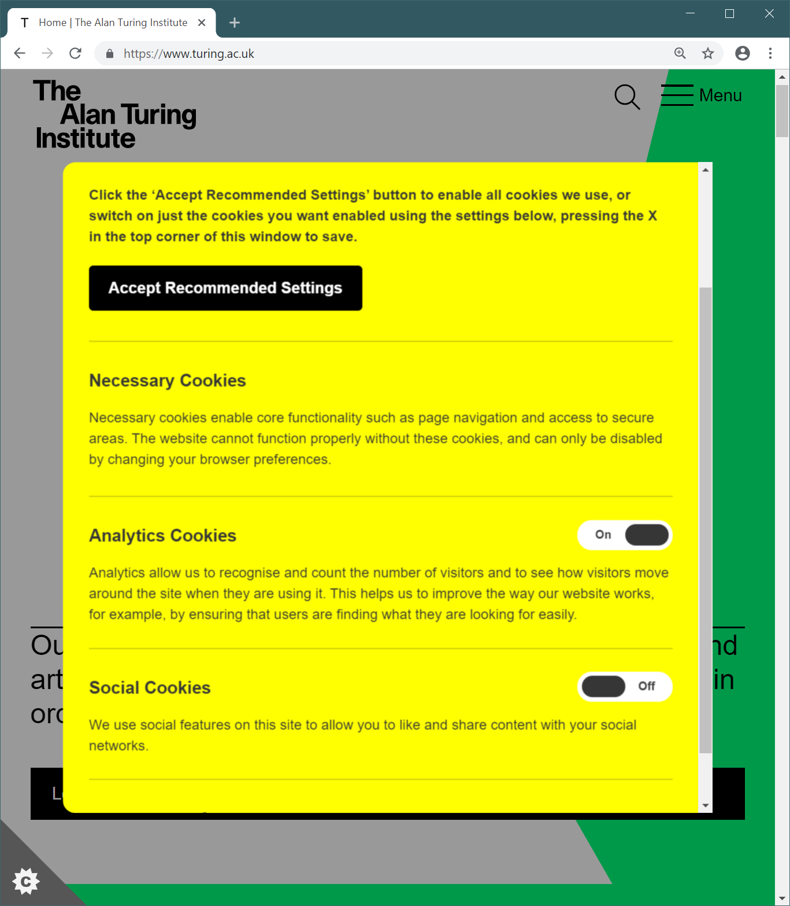
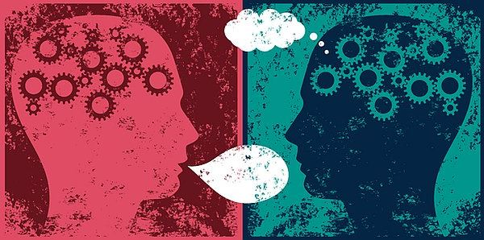
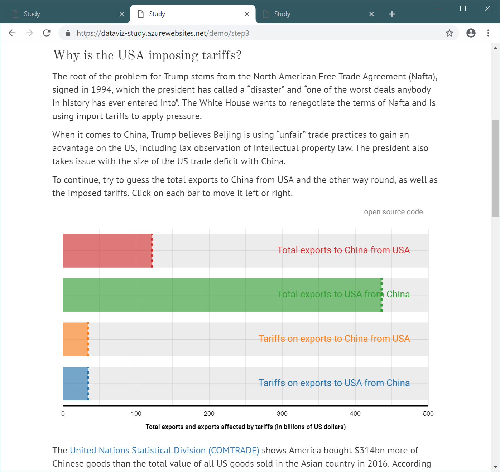
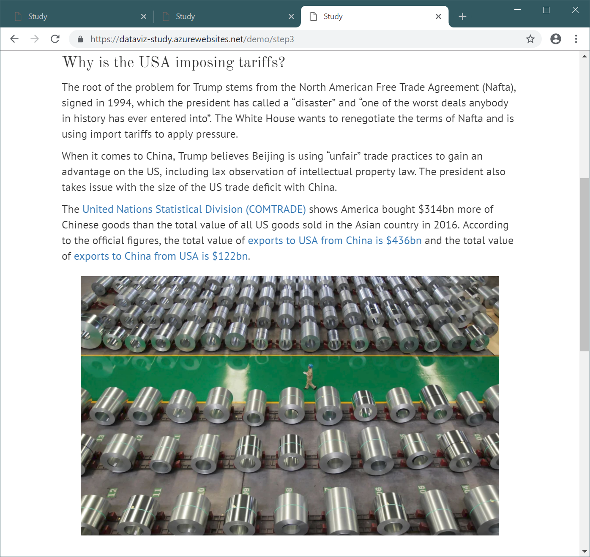

- title : Human Computer Interaction: Evaluation
- description : Human Computer Interaction: Evaluation
- author : Tomas Petricek
- theme : simple
- transition : none
  
****************************************************************************************************

# **CO582: Computer Interaction and User Experience**  Evaluation

  
   

**Tomas Petricek**

email: [t.petricek@kent.ac.uk](mailto:t.petricek@kent.ac.uk) 
twitter: [@tomaspetricek](http://twitter.com/tomaspetricek) 
office: [S129A](https://www.cs.kent.ac.uk/rooms/S129A.gif) 

****************************************************************************************************
 - class: part
 
# **Evaluation in context**

----------------------------------------------------------------------------------------------------

<table class="prettybox">
<tr><td>

1. Usability

</td><td>

2. Accessibility

</td></tr>
<tr><td>

3. Operations

</td><td>

4. Ethics

</td></tr>
</table>

----------------------------------------------------------------------------------------------------

<table class="prettybox">
<tr><td>

1. Usability

</td><td>

2. Accessibility

</td></tr>
<tr><td>

3. Operations

</td><td>

4. Ethics

</td></tr>
</table>

----------------------------------------------------------------------------------------------------

**Does the user interface work?**

_Can users enable cookies they want?_

----------------------------------------------------------------------------------------------------

# Evaluating user experience

### What can we evaluate about user experience?

_<i class="fa fa-wheelchair"></i> Are there any usability issues?_

_<i class="fa fa-stopwatch"></i> Are users more efficient with a new product?_

_<i class="fa fa-brain"></i> Does a design encourage new way of thinking?_

_<i class="fa fa-hand-point-right"></i>_ **How do we know that what we've done works?**

----------------------------------------------------------------------------------------------------

<table class="prettybox">
<tr><td>

1. Usability

</td><td>

2. Accessibility

</td></tr>
<tr><td>

3. Operations

</td><td>

4. Ethics

</td></tr>
</table>

----------------------------------------------------------------------------------------------------

**Taking accessibility seriously**

_What if you need to develop a web that works for everyone?_

----------------------------------------------------------------------------------------------------

# Accessibility needs for government web sites

**Partial list from government accessibility site**

 1. I am colorblind and cannot perceive some colors
 2. I have low vision and need big font in my browser
 3. I am blind and use a screenreader
 4. I am deafblind and use a braille device
 5. Mild motor impairment so struggle to use a mouse 
 6. Severe motor impairment and use voice control
 7. Autistic spectrum & have a literal understanding of text
 8. Epilepsy seizures can be triggered by flashing content

----------------------------------------------------------------------------------------------------

<table class="prettybox">
<tr><td>

1. Usability

</td><td>

2. Accessibility

</td></tr>
<tr><td>

3. Operations

</td><td>

4. Ethics

</td></tr>
</table>

----------------------------------------------------------------------------------------------------

# Can results of evaluation lead to a change?

_<i class="fa fa-square"></i>_ Framing _- what we consider and what we ignore_

_<i class="fa fa-code-branch"></i>_ Alternatives _- what decisions can you make?_

_<i class="fa fa-magic"></i>_ Uncertainties _- could the outcome be by accident?_

_<i class="fa fa-yen-sign"></i>_ Value _- how do you evaluate outcomes?_

_<i class="fa fa-directions"></i>_ Decision maker _- need one person to decide_

_<i class="fa fa-gavel"></i>_ Commitment to action _- will we actually do it?_

----------------------------------------------------------------------------------------------------

<table class="prettybox">
<tr><td>

1. Usability

</td><td>

2. Accessibility

</td></tr>
<tr><td>

3. Operations

</td><td>

4. Ethics

</td></tr>
</table>

----------------------------------------------------------------------------------------------------

**Should we run all experiments?**

_But we're just evaluating two versions of an algorithm!_

----------------------------------------------------------------------------------------------------

# Ethical issues of evaluation

**Studies directly involving users**

 - Always requires informed consent
 - Consider the risk of intervention
 - Explain the purpose of the research
 

**Analytics and remote testing**
 
 - Facebook terms and conditions allow that
 - GDPR lets you get all data about yourself
 - Aggregated tracking vs. manipulation

****************************************************************************************************
 - class: part
 
# **From data to conclusions**

----------------------------------------------------------------------------------------------------

# Data, information and conclusions

**Data is what we collect**  
_Usage statistics, survey data, performance_  
_For example, visited pages on a web site_
 
**Information is what we get by analysis**  
_What groups of users follow what paths_  
_Say, phone users never reach a certain page_
 
**Conclusions is what we decide to do**  
_Interpretation of reasons behind information_  
_For example, make a prominent navigation link!_

----------------------------------------------------------------------------------------------------

# Gathering data

**Data can range from numbers to written reports**

_<i class="fa fa-microphone"></i>_ Interviews _(structured, semi-structured or open)_

_<i class="fa fa-check-square"></i>_ Questionnaires _(offline or online)_

_<i class="fa fa-eye"></i>_ Observation _(in the lab or in the wild)_

_<i class="fa fa-list-ol"></i>_ Logging _(usage data about computer system)_

----------------------------------------------------------------------------------------------------

# Analysing data 

**Qualitative data analysis**

 - Nature of something
 - Themes, patterns, stories
 - Imprecise, but wide scope
 

**Quantitative data analysis**

 - Numerical methods to ascertain size or scale
 - Average values, time spent completing a task
 - Precise information about narrow domain

----------------------------------------------------------------------------------------------------

# Theoretical frameworks for analysis

**Qualitative data analysis**

 - Distributed cognition models
 - Critical incident analysis
 - Categorization by two markers
 

**Quantitative data analysis**

 - Statistical analysis of significance
 - GOMS: Goals, Operators, Methods, Selection
 - Predictive models of user actions

****************************************************************************************************
 - class: part
 
# **Evaluation in controlled setting**

----------------------------------------------------------------------------------------------------

# Evaluation in controlled setting

**Testing a hypothesis**

 - Users can complete a given task
 - Efficiently or without errors
 - One method is better than other
 
**Producing reproducible results**

 - Experimental setup 
 - Control all other variables
 - Statistical analysis (p-value)

----------------------------------------------------------------------------------------------------

**Detecting a tank using neural networks**

_Tank photos on sunny day, other photos rainy_

----------------------------------------------------------------------------------------------------

# Experimental setup

### What to test and how to test

_<i class="fa fa-exclamation-circle"></i> Time to completion, number or scale of errors_

_<i class="fa fa-newspaper"></i> Recall of presented information_

_<i class="fa fa-vials"></i> Labs for fully controlled environment_

_<i class="fa fa-robot"></i> Amazon Mechanical Turk for online studies_

----------------------------------------------------------------------------------------------------

**Making sense of numbers**

_What information people know?_

_What is a good analogy?_

_Does analogy help later recall?_

----------------------------------------------------------------------------------------------------

# To put that in perspective (Riederer et al., 2018)

### Finding and evaluating good analogies

_<i class="fa fa-robot"></i> About 350 Amazon MTurk workers_

_<i class="fa fa-globe-americas"></i>_ **E1:** _Compare different multipliers and states_

_<i class="fa fa-clipboard"></i>_ **E2:** _Is best numerical fit or home state better?_

_<i class="fa fa-calendar-alt"></i>_ **E3:** _Repeat after 6 weeks without perspective_

----------------------------------------------------------------------------------------------------

**Does interactivity make you think?**

https://dataviz-study.azurewebsites.net/demo/step1

_Test recall of numerical values from a newspaper article_

_Interactive, static and text-only versions_

----------------------------------------------------------------------------------------------------

# Statistical analysis of results

_"The article listed top 5 categories of products (...).  
The two largest categories accounted for roughly  
the same amount of total exports. Please select  
the two top categories."_

----------------------------------------------------------------------------------------------------

# Statistical analysis of results

<table>
<thead>
  <tr><th style="width:250px">Group</th>
  <th style="width:130px">Both</th>
  <th style="width:130px">Mach</th>
  <th style="width:130px">Trans</th>
  <th style="width:130px">None</th></tr>
</thead><tbody>
  <tr><td>Interactive</td><td>20</td><td>9</td><td>1</td><td>1</td></tr>
  <tr><td>Static chart</td><td>17</td><td>14</td><td>1</td><td>0</td></tr>
  <tr><td>Text only</td><td>11</td><td>19</td><td>4</td><td>0</td></tr>
</tbody>
</table>

 

**Is the interactive version significantly better?**

----------------------------------------------------------------------------------------------------

# Statistical analysis of results

_The_ **p-value** _is the probability of finding the observed, or more extreme, results when the null hypothesis of a study question is true._

_A small p-value ($\leq$ 0.05) indicates strong evidence against the null hypothesis, so you reject the null hypothesis._

_See also: [Analysis of variance (ANOVA)](https://en.wikipedia.org/wiki/Analysis%20of%20variance), [Chi-squared test](https://en.wikipedia.org/wiki/Chi-squared%20test)_

----------------------------------------------------------------------------------------------------

Taking evaluation seriously

_Medical registered randomized control trials_

----------------------------------------------------------------------------------------------------

# Medical studies

### How (not) to prove what you want to prove

_<i class="fa fa-user-friends"></i> Compare against control group with placebo_

_<i class="fa fa-dice"></i> Assign participants randomly to groups_

_<i class="fa fa-table"></i> Use consistent categorization of effects_

_<i class="fa fa-archive"></i> Register study protocol in advance_

****************************************************************************************************
 - class: part
 
# **Evaluation in natural setting**

----------------------------------------------------------------------------------------------------

# Evaluation in natural setting

**What is the purpose?**

 - Identify new technology needs
 - Understand requirements
 - Inform development
 
**Study methodology**

 - Observation in the field
 - Ethnography studies
 - Participatory design

----------------------------------------------------------------------------------------------------

# Frameworks for observation in the field

**Giving observation more structure**

 1. Space - _What is the physical space?_
 1. Actors - _Who is involved?_
 1. Activities - _What is who doing and why?_
 1. Objects - _What things are present?_
 1. Acts - _What are individual actions?_
 1. Events - _Is it part of an event?_
 1. Time - _What is the sequence of acts?_
 1. Goals - _Why is this happening?_
 1. Feelings - _What is the mood?_

----------------------------------------------------------------------------------------------------

How do people  
learn advanced  
Excel features?

_Observe users  
during their work_

_Ask follow-up interview questions to clarify_

----------------------------------------------------------------------------------------------------

# Evaluation in natural settings

### Studying usage in the wild

_<i class="fa fa-camera"></i> Real-world use of an early prototype_

_<i class="fa fa-edit"></i> Collect quantitative and qualitative data_

_<i class="fa fa-folder"></i> Theoretical frameworks to guide the study_

_<i class="fa fa-volume-up"></i> Think-aloud, diaries, logs and analytics_

****************************************************************************************************
 - class: part
 
# **Evaluation with indirect user involvement**

----------------------------------------------------------------------------------------------------

# Evaluation with indirect user involvement

**Evaluation without participants**

 - Easy and inexpensive setup
 - Social media, web analytics
 - Should you tell the users?
 
**Experimental methods**

 - Expert evaluation of the system
 - Collecting actual usage data 
 - A/B testing to compare variants

----------------------------------------------------------------------------------------------------

# Expert evaluation without users

### Heuristic evaluation and walkthroughs

_<i class="fa fa-cut"></i> Can be used with early prototypes_

_<i class="fa fa-list-ol"></i> Heuristic evaluation using 10 rules_

_<i class="fa fa-walking"></i> Simulating user's problem solving process_

_<i class="fa fa-chart-pie"></i> Five evaluators find 75% of problems_

_<i class="fa fa-file-image"></i> Different rules for different products_

----------------------------------------------------------------------------------------------------

**Web page analytics**

_Statistics on visitors and page views_

_Where they come from, how they behave?_

----------------------------------------------------------------------------------------------------

# Web page analytics

### What can you find on Google Analytics?

_<i class="fa fa-chart-bar"></i> Pages with the largest number of views_

_<i class="fa fa-mobile-alt"></i> Language, country and device used_

_<i class="fa fa-book-open"></i> Number of visitors, visits and views_

_<i class="fa fa-search"></i> Traffic sources and search keywords_

----------------------------------------------------------------------------------------------------

**A/B testing**

_What version is more effective?_

----------------------------------------------------------------------------------------------------

# A/B testing

### Evaluating variations of a product in use

_<i class="fa fa-search"></i> Google in 2001: How many results to show? _

_<i class="fa fa-mouse-pointer"></i> Measure clicks, purchases or likes_

_<i class="fa fa-users"></i> Needs a product you can change and users_

_<i class="fa fa-pencil-alt"></i> Statistical analysis of significance_

****************************************************************************************************
 - class: part
 
# **When to evaluate**

----------------------------------------------------------------------------------------------------

# What, where and when of evaluation

**What to evaluate**  
Lo-fi prototype - _limited, but easy to do early_  
Running software - _need to write it first, but realistic_

**Where to evaluate**  
In a lab - _controlled, but may not be relevant_  
In the wild - _less precise, but may say useful things_

**When to evaluate**  
Early in the process - _get feedback for development_  
Finished product - _assess the quality of the work_

----------------------------------------------------------------------------------------------------
    
# When not to use evaluation?

 

    

If I had asked people what they wanted, they would have said faster horses.

(Incorrectly attributed  to Henry Ford)

----------------------------------------------------------------------------------------------------
    
# When not to use evaluation?

### Limitations of evaluation methods

_<i class="fa fa-image"></i> You can test only what you can imagine_

_<i class="fa fa-book"></i> Users are talking in well understood terms_

_<i class="fa fa-balance-scale"></i> Quantitative can only help you choose_

_<i class="fa fa-lightbulb"></i> Can make it hard to see new ideas_

****************************************************************************************************
 - class: part

# **Summary**

----------------------------------------------------------------------------------------------------

# Different kinds of evaluation

**Evaluation in controlled setting**  
Precise answers to narrow questions   
Test usability, compare methods

**Evaluation in natural setting**  
Broad answers to interesting questions  
How people really use your product  

**Evaluation without direct participants**  
Less expensive, but limited questions  
Expert analysis or data collection

----------------------------------------------------------------------------------------------------

# CO582: Evaluation

**What you should remember from this lecture**

 - Accessibility, ethics and operation
 - Kinds of evaluation and their limits
 - Design lab experiment or an A/B test

 
 

Tomas Petricek 
_[t.petricek@kent.ac.uk](mailto:t.petricek@kent.ac.uk) | [@tomaspetricek](http://twitter.com/tomaspetricek)_

****************************************************************************************************
 - class: part
 
# **References**

----------------------------------------------------------------------------------------------------

**Books**

- [HCI Models, Theories and Frameworks](https://www.elsevier.com/books/hci-models-theories-and-frameworks/carroll/978-1-55860-808-5), ed. J. Carroll   
  _Chapter 7,8 (Data analysis), Chapter 13-15 (Evaluation)_

**Papers and links**

 - [To Put That in Perspective: Generating Analogies That Make Numbers Easier to Understand](http://jakehofman.com/inprint/best_perspective_chi2018.pdf)

 - [Restoring Study 329: efficacy and harms of paroxetine and imipramine in treatment of major depression in adolescence](https://www.bmj.com/content/351/bmj.h4320)

 - [Consider the range of people that  
    will use your product or service](https://accessibility.blog.gov.uk/2016/05/16/consider-the-range-of-people-that-will-use-your-product-or-service/)
