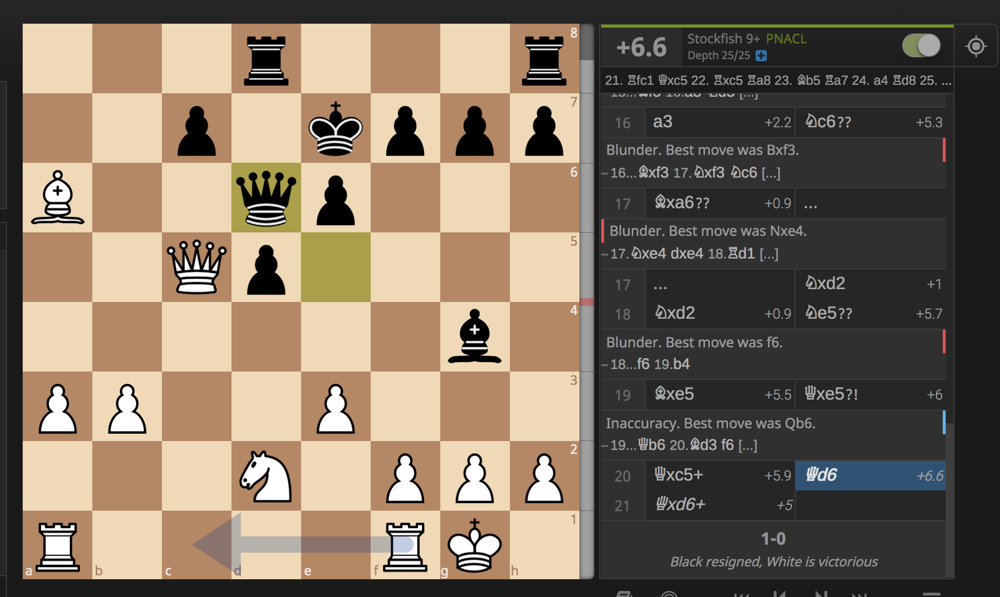

- title : Software Engineering
- description : Software Engineering
- author : Tomas Petricek
- theme : simple
- transition : none

****************************************************************************************************

# **Software Engineering**  What is the module about?

   
   

**Tomas Petricek**

email: [t.petricek@kent.ac.uk](mailto:t.petricek@kent.ac.uk) 
twitter: [@tomaspetricek](http://twitter.com/tomaspetricek) 

----------------------------------------------------------------------------------------------------

**What is more complex software system to build?**

<table style="width:80%;position:relative;left:-50px"><tr>
<td>

_Chess engine that consistently beats grandmasters?_

</td><td>

_Software that calculates taxes for UK & France?_

</td>
</tr></table>

----------------------------------------------------------------------------------------------------

# Complexity in software systems

**No Silver Bullet (Brooks, 1986)**

_Much of the complexity [software engineer] must master is arbitrary
complexity, forced without rhyme or reason by the many human
institutions and systems to which [their] interfaces must confirm._

----------------------------------------------------------------------------------------------------

**NATO Software Engineering Conference** (1968)

_Black art of programming had to make way for the science of software engineering_

----------------------------------------------------------------------------------------------------

# Tackling the complexity of software

**Heavyweight methodologies**

 - _Detailed up-front specification_
 - _Architecture and careful planning_
 - _UML and rigorous methodologies_

**Lightweight methodologies**

 - _Ongoing conversation with customer_
 - _Prototyping, evolving and adapting_
 - _Git, tests, continuous integration_

----------------------------------------------------------------------------------------------------

# Nathan Ensmenger's software paradox

**1960s software crisis?**

_Managers, academics and governments [release] warnings about the desperate state of the software industry with ritualistic regularity._

**2020 software paradox!**

_How can we explain the [seemingly perpetual] crisis
in what is considered one of the most successful  
industries of all time?_

