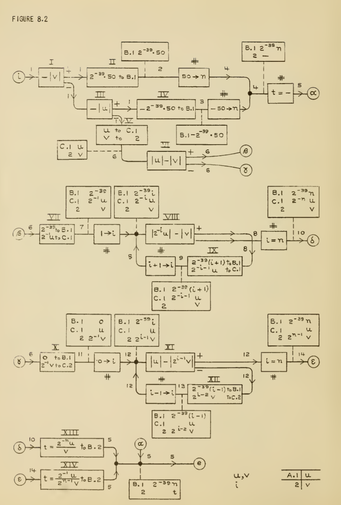
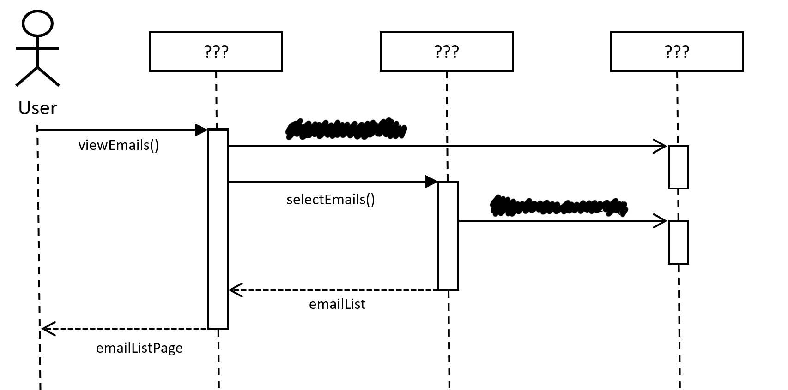
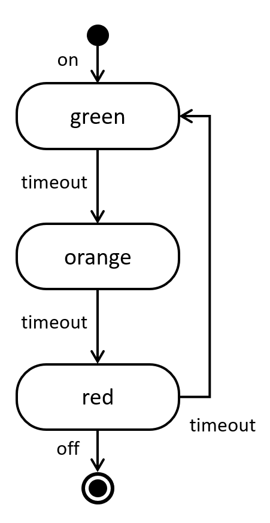
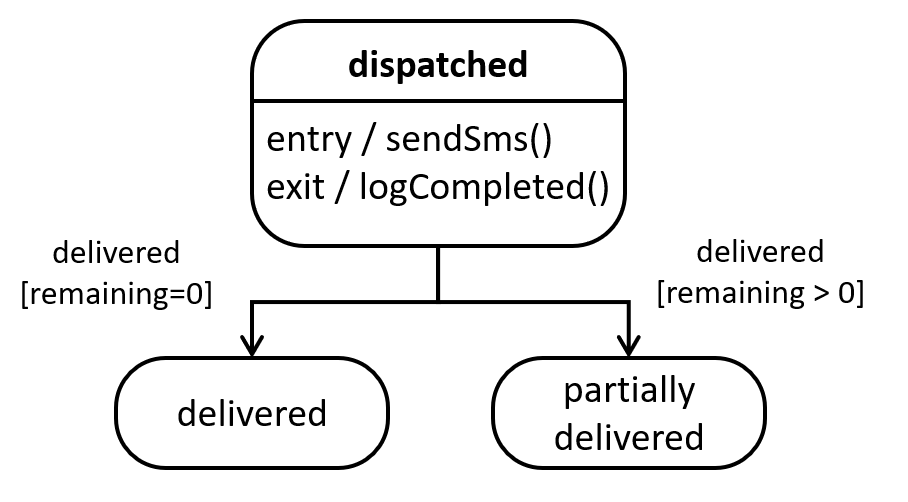

- title : Software Engineering: Modelling behaviour
- description : Software Engineering: Modelling behaviour
- author : Tomas Petricek
- theme : simple
- transition : none

****************************************************************************************************

# **CO886: Software Engineering**  Modelling behaviour

  
   

**Tomas Petricek**

email: [t.petricek@kent.ac.uk](mailto:t.petricek@kent.ac.uk) 
twitter: [@tomaspetricek](http://twitter.com/tomaspetricek) 
office: [S129A](https://www.cs.kent.ac.uk/rooms/S129A.gif) 

****************************************************************************************************
- class: part

# **Prehistory and behaviour modelling**

----------------------------------------------------------------------------------------------------

**Hartree Differential Analyzer**, circa 1935

_Analog computer solving differential equations_

_Information flow between components_

----------------------------------------------------------------------------------------------------

**Herman Goldstine & John von Neumann**, circa 1947

_Program described as a flow diagrams_

_Sequence of individual steps with loops and branching_

----------------------------------------------------------------------------------------------------

# Two aspects of behaviour

**Communication patterns**

 - _Interactions of services_
 - _Sending messages over network_
 - _Communication in teams_

**State change patterns**

 - _Changing state of an object_
 - _Workflow or a process to follow_

----------------------------------------------------------------------------------------------------

# Modelling behaviour

### Tools and practices for state and communication

_<i class="fa fa-chalkboard-teacher"></i> Lightweight use in whiteboard discussions_

_<i class="fa fa-cogs"></i> Heavyweight software tools with code generation_

_<i class="fa fa-layer-group"></i> Range from function logic to business processes_

_<i class="fa fa-code"></i> Various directions of programming language support_

****************************************************************************************************
- class: part

# **Capturing communication using sequence diagrams**

----------------------------------------------------------------------------------------------------

# UML sequence diagrams

**Interactions between objects**

 - _Actions in sequential order_
 - _What is passed between what parts_
 - _Explain how business works_

**Features beyond this lecture**

 - _Actors, objects, anonymous instances_
 - _Deleting and creating entities_
 - _Alternatives, parallelism, options, loops, etc._

----------------------------------------------------------------------------------------------------

# UML sequence diagrams

**Actors and objects**

 - _Stick figures or objects_
 - _Lifeline with periods of activity_
 - _Write_ sys:Sytem _for an instance_

**Communication via messages**

 - _Sequential top-to-bottom process_
 - _Written as function calls_
 - _Different kinds of arrows_

----------------------------------------------------------------------------------------------------

# Fancy arrows

<table style="width:100%" class="tc"><tr>
<td style="width:33%;text-align:center">

**Synchronous**  

_Call another component and wait until it responds_

</td>
<td style="width:33%;text-align:center" class="fragment">

**Asynchronous**  

_Call another component but continue running_

</td>
<td style="width:33%;text-align:center" class="fragment">

**Response**

_Sent at the end of sync or async call_

</td>
</tr></table>

----------------------------------------------------------------------------------------------------

**Guess the components!**

----------------------------------------------------------------------------------------------------

**Guess the components!**

Checking your Gmail

_Web server fetches data from database_

_Logger records  
all events asynchronously_

----------------------------------------------------------------------------------------------------

- class: part

# **Demo:** Modelling PhD application process

----------------------------------------------------------------------------------------------------

# Implementing sequence diagrams

**Object-oriented programming**

_I thought of objects being like biological cells
and/or individual computers on a network, only able to communicate with messages._

**Network and workflows**

 - _HTTP calls between services_
 - _Erlang language and Akka library for Java_

----------------------------------------------------------------------------------------------------

**Programming Language Support**

Formal language  
_model circa 1978_

Session types  
_to check the communication protocol today_

****************************************************************************************************
- class: part

# **Capturing workflows using state diagrams**

----------------------------------------------------------------------------------------------------

# UML state machines

**State change over time**

 - _State of objects or systems_
 - _Standard computer science idea_
 - _Not as easy to see in code_

**Features beyond this lecture**

 - _Hierarchical state machines_
 - _Conditions and actions just briefly_
 - _Orthogonal regions, parallel regions_

----------------------------------------------------------------------------------------------------

# UML state machines

**States**

 - _Initial, regular and final states_
 - _Some systems run infinitely_
 - _Can have entry/exit actions_

**Transitions**

 - _Labels explain what caused them_
 - _Typically correspond to some events_
 - _Conditions can specify when enabled_

----------------------------------------------------------------------------------------------------

**Guess the system!**

Sainsbury's order processing

_When can user  
cancel an order?_

_What can happen  
after shipping?_

----------------------------------------------------------------------------------------------------

- class: part

# **Demo:** States of a PhD application

----------------------------------------------------------------------------------------------------

# Actions and conditions

**Actions**

_What happens when system enters or exits a state_

**Conditions**

_When is the transition allowed to happen_

----------------------------------------------------------------------------------------------------

# State diagrams and programming

### Communication device or a programming tool

_<i class="fa fa-sync-alt"></i> Understand state of objects in OO model_

_<i class="fa fa-mouse-pointer"></i> Model states of a user interface_

_<i class="fa fa-code"></i> Imperative and functional patterns at small scale_

_<i class="fa fa-industry"></i> Complex systems for large scale workflows_

----------------------------------------------------------------------------------------------------

**Enterprise application integration**

_Microsoft BizTalk Server is an Inter-Organizational Middleware System
that enables companies to automate business processes [and connect]
different software systems used in an enterprise._

----------------------------------------------------------------------------------------------------

# Implementing state machines

**State machines and programming**

 - _State of objects or user interfaces _
 - _Java has "classes" but no "states"!_
 - _How can we best encode the idea?_

**Functional and imperative patterns**

 - _Variable to represent current state_
 - _Function to represent current state_

----------------------------------------------------------------------------------------------------

    [lang=csharp]
    enum Light {
      Red, Orange, Green
    };
    class TrafficLight {
      Light state;
      void updateState() {
        switch(state) {
          case Red:
            state = Green;
            break;
          case Orange:
            state = Red;
            break;
          case Green:
            state = Orange;
            break;
        }
      }
    }

**Object with states**

_State stored in a field_

_Update checks state  
and modifies it_

All logic in one method

Transitions are hidden  
in a big _switch_ block

----------------------------------------------------------------------------------------------------

    [lang=csharp]
    void red() {
      // (do some work)
      green();
    }

    void orange() {
      // (do some work)
      red();
    }

    void green() {
      // (do some work)
      orange();
    }

**Functions as states**

Process going through  
multiple states

_State are functions_

_Transitions encoded as
calls to other functions_

Requires good handling  
of recursion and waiting

----------------------------------------------------------------------------------------------------

- class: part

# **Demo:** User interface for drawing squares

****************************************************************************************************
- class: part

# **Summary**

----------------------------------------------------------------------------------------------------

# Modelling behaviour

**Two aspects of behaviour**  
_Communication patterns and state change patterns_  
_Also in analog computers (1930s) and EDSAC (1947)_

**Capturing communication patterns**  
_Basics of UML sequence diagrams_  
_Synchronous, asynchronous and responses_

**Capturing workflows with state diagrams**  
_Basics of UML state machine diagrams_  
_Implementing state machines at small and large scale_

----------------------------------------------------------------------------------------------------

# CO886: Modelling behaviour

**What you should remember from this lecture**

 - Sequence diagrams with sync, async and responses
 - State machines with states and transitions
 - Understand examples and when to use them

 
 

Tomas Petricek 
_[t.petricek@kent.ac.uk](mailto:t.petricek@kent.ac.uk) | [@tomaspetricek](http://twitter.com/tomaspetricek)_

****************************************************************************************************
 - class: part

# **References**

----------------------------------------------------------------------------------------------------

**Academic references**

 - Mark Priestley (2018). [Routines of Substitution - John von Neumann’s Work on Software
    Development, 1945–1948](https://www.springer.com/us/book/9783319916705)

 - Marie-José Durand-Richard (2018). [Towards programming before flowcharts: Diagrams from Babbage to Wilkes](https://programme.hypotheses.org/794)

**Tools, books and articles**

 - [UML 2 State Machine Diagrams: An Agile Introduction](http://agilemodeling.com/artifacts/stateMachineDiagram.htm)
 - [UML 2 Sequence Diagrams: An Agile Introduction](http://www.agilemodeling.com/artifacts/sequenceDiagram.htm)
