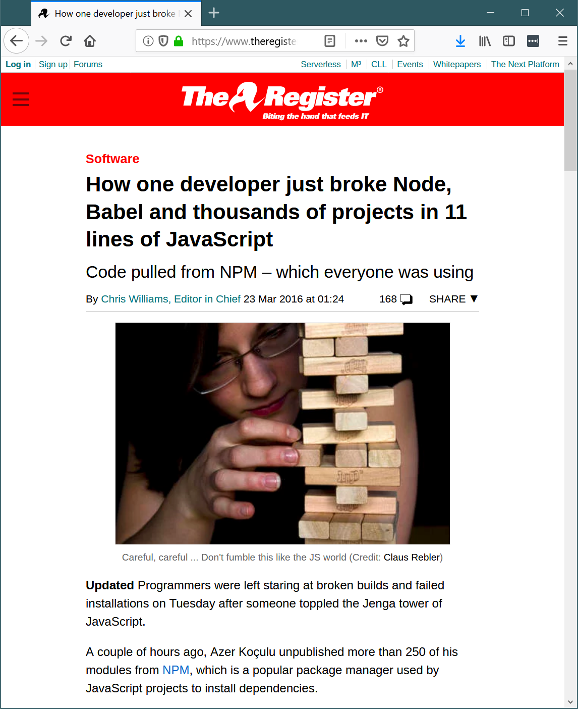
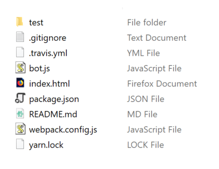
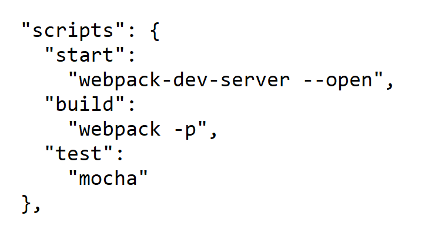

- title : Software Engineering: Continuous development process
- description : Software Engineering: Continuous development process
- author : Tomas Petricek
- theme : simple
- transition : none

****************************************************************************************************

# **CO886: Software Engineering**  Continuous development process

  
   

**Tomas Petricek**

email: [t.petricek@kent.ac.uk](mailto:t.petricek@kent.ac.uk) 
twitter: [@tomaspetricek](http://twitter.com/tomaspetricek) 
office: [S129A](https://www.cs.kent.ac.uk/rooms/S129A.gif) 

****************************************************************************************************
- class: part

# **Modern software development challenges**

----------------------------------------------------------------------------------------------------

# Modern software development challenges

### Context of modern software development

_<i class="fa fa-stopwatch"></i> You can update web application instantly_

_<i class="fa fa-archive"></i> You rarely have full control of all code you use_

_<i class="fa fa-flag-checkered"></i> Development of a system is never done_

_<i class="fa fa-layer-group"></i> Modern tools have complex multi-layer structure_

----------------------------------------------------------------------------------------------------

Can you fix mistakes after product "release"?

**Windows 95**

_Discard all your floppies if you notice early_

_Tell customers to return to the shop for a fix_

----------------------------------------------------------------------------------------------------

**Facebook, modern start-ups and others**

_Do multiple "releases" per day_

_Monitoring to avoid big failures_

_Small issues can be corrected in minutes_

----------------------------------------------------------------------------------------------------

Do you control all the code your system runs?

**Leftpad fiasco**

_11 line helper removed from NPM, breaking thousands of packages the whole world uses_

----------------------------------------------------------------------------------------------------

How complex is your infrastructure?

**UNIX on PDP-11 (circa 1970)**

_You can read all code the system runs_

_Tool is just a C file that you compile & run_

----------------------------------------------------------------------------------------------------

**Modern JavaScript  
web development**

Babel _to compile new JavaScript to JavaScript_

NPM _to find packages  
for everything you need_

WebPack _to combine source files and optimize_

----------------------------------------------------------------------------------------------------

# eXtreme Programming (2000s)

**What is extreme programming**

 - _Reaction to the new situation_
 - _Collection of ideas, some old_
 - _Nobody uses the name anymore_

**Tools and practices of XP**

 - Feedback - _tests, pair programming, code reviews_
 - Continuous process - _frequent small releases_
 - Agreement - _coding styles, reasonable pace_

----------------------------------------------------------------------------------------------------

# The Joel Test: 12 Steps to Better Code (2000)

"If you get these 12 things right, you’ll have a disciplined team that can consistently deliver"
(selection)

1. _Do you use source control?_
2. _Can you make a build in one step?_
3. _Do you make daily builds?_
4. _Do you have a bug database?_
5. _Do you have an up-to-date schedule?_
6. _Do you have a spec?_
7. _Do you do hallway usability testing?_

----------------------------------------------------------------------------------------------------

# Continuous integration

### Ensuring your project is always in a good state

_<i class="fa fa-code-branch"></i> Your `master` branch builds reproducibly_

_<i class="fa fa-desktop"></i> Everything also builds on a clean machine_

_<i class="fa fa-check"></i> All your tests run automatically and pass_

_<i class="fa fa-wrench"></i> Continuous integration tools help with this!_

****************************************************************************************************
- class: part

# **Modern project infrastructure**

----------------------------------------------------------------------------------------------------

# Anatomy of a modern JavaScript project

Code and tests - _your actual code such as
`test`, `bot.js` and `index.html`_

Dependency management - _NPM package info `package.json`
and version lock file `yarn.lock`_

Build configuration - _build scripts in `package.json` and
Webpack server and build config `webpack.config.js`_

Continuous integration - _tool configuration `.travis.yml` and
related commands in `package.json`_

----------------------------------------------------------------------------------------------------

# Anatomy of a modern JavaScript project

### What really matters from the previous slide

_<i class="fa fa-vial"></i>_ Code and tests _- writing and running tests_

_<i class="fa fa-tree"></i>_ Dependency management _- getting versions right_

_<i class="fa fa-cog"></i>_ Build configuration _- build and run with one command_

_<i class="fa fa-cloud"></i>_ Continuous integration _- ensure reproducibility_

----------------------------------------------------------------------------------------------------

# Dependency management

**Package dependencies**

 - _Public repository such as NPM_
 - _Version `1.0.0` major, minor, revision_
 - _Want exact version? Latest revision?_

**Why is choosing versions hard**

 - _Packages depend on other packages_
 - _Transitive dependencies can change_
 - _Packages can have conflicting requirements_

----------------------------------------------------------------------------------------------------

**Solving version hell with lock files**
_and the Yarn for JavaScript_

Give your dependencies  
_Things you directly need_

----------------------------------------------------------------------------------------------------

**Solving version hell with lock files**
_and the Yarn for JavaScript_

Give your dependencies  
_Things you directly need_

Auto-generate lock file  
_Exact versions including transitive dependencies_

----------------------------------------------------------------------------------------------------

# Build configuration

**Build with one command**

 - _Typically pre-processing, compilation, post-processing_
 - _Also dev and testing_
 - _`Makefile` in UNIX world_

**Building in JavaScript world**

 - Specified in the `scripts` section in `package.json`
 - Invoked using `yarn build`, `yarn test` etc.

----------------------------------------------------------------------------------------------------

# Rapid feedback during development

**Forms of feedback when coding**

 - _Syntax and type errors (milliseconds)_
 - _Reload when code changes (seconds)_
 - _Run tests when code changes (minutes)_

**Webpack and Webpack dev server**

 - _Orchestrates various tools of build process_
 - _Automatically reload modified parts of code in browser_

----------------------------------------------------------------------------------------------------
- class: part

# **Demo**: Building and running sample project

****************************************************************************************************
- class: part

# **Testing**

----------------------------------------------------------------------------------------------------

# How and why of unit testing

**Tests for ensuring quality**

 - _Unit tests to prevent regressions_
 - _Write tests after you write code_
 - _Continuous integration to run tests_

**Tests as a feedback mechanism**

 - _Write tests before you write code_
 - _Tests are a lightweight specification_
 - _Command line or automatic background runners_

----------------------------------------------------------------------------------------------------

    [lang=javascript]
    var assert = require('assert');

    describe('Arithmetic', function () {
      it('should add', function () {
        var actual = 40 + 2
        var expected = 42
        assert.equal(actual, expected)
      });

      it('should multiply', function () {
        var actual = 7 * 6
        var expected = 42
        assert.equal(actual, expected)
      });
    });

**Writing JavaScript tests with Mocha**

_You `describe` logic with tests written using `it` notation_

_Run tests from terminal using  
the `mocha` tool_

----------------------------------------------------------------------------------------------------

# Beyond simple tests

### Unit testing and general testing concerns

_<i class="fa fa-bolt"></i> Unit tests are just one, easy to automate kind_

_<i class="fa fa-code"></i> How to structure code to make testing easy?_

_<i class="fa fa-mouse-pointer"></i> How to test not just functions, but user interfaces_

_<i class="fa fa-divide"></i> Property testing to specify more than one case_

****************************************************************************************************
- class: part

# **Continuous integration**

----------------------------------------------------------------------------------------------------

# Continuous integration

**What you need to use CI**

 - _Automatic reproducible build_
 - _Package management, tests_
 - _Service to run your builds!_

**Continuous integration servers**

 - _Build in a hosted cloud or your own servers_
 - _Many options: Travis, Jenkins, TeamCity, AppVeyor_
 - _Travis CI is free with nice GitHub support_

----------------------------------------------------------------------------------------------------

**Continuous integration support on GitHub**

_Runs build and tests every time you `git push`_

_Runs build and tests for every pull request_

_Shows warning when  
PR build fails_

----------------------------------------------------------------------------------------------------
- class: part

# **Demo**: Testing locally and using CI

----------------------------------------------------------------------------------------------------

**Beyond simple CI**

Device testing  
_for mobile applications_

Continuous deployment _to directly release new version of the product_

****************************************************************************************************
- class: part

# **Summary**

----------------------------------------------------------------------------------------------------

# Continuous development process

**Changing context of software development**  
_Release frequency and system complexity_  
_Extreme programming: feedback and continuous process_

**Modern (JavaScript) project infrastructure**  
_One command build to run, test and build_  
_Dependency management, versioning and lock files_  

**Testing and continuous integration tools**  
_Tests for ensuring quality and tests for feedback_  
_Running build automatically with CI systems_

----------------------------------------------------------------------------------------------------

# CO886: Continuous development process

**What you should remember from this lecture**

 - What challenges is continuous process solving
 - Reproducible builds and dependency management
 - Why use tests and continuous integration tools

 
 

Tomas Petricek 
_[t.petricek@kent.ac.uk](mailto:t.petricek@kent.ac.uk) | [@tomaspetricek](http://twitter.com/tomaspetricek)_

****************************************************************************************************
 - class: part

# **References**

----------------------------------------------------------------------------------------------------

**Papers and articles**

 - Joel Spolsky (2000). [The Joel Test: 12 Steps to Better Code](https://www.joelonsoftware.com/2000/08/09/the-joel-test-12-steps-to-better-code/)
 - Chris Williams (2016). [How one developer just broke Node, Babel and thousands of projects in 11 lines of
   JavaScript](https://www.theregister.co.uk/2016/03/23/npm_left_pad_chaos/)

**Libraries and tools**

 - JavaScript tools: [Webpack](https://webpack.js.org/), [Mocha](https://mochajs.org/), [yarn](https://yarnpkg.com).
 - Continuous integration: [Travis](https://travis-ci.com/)
