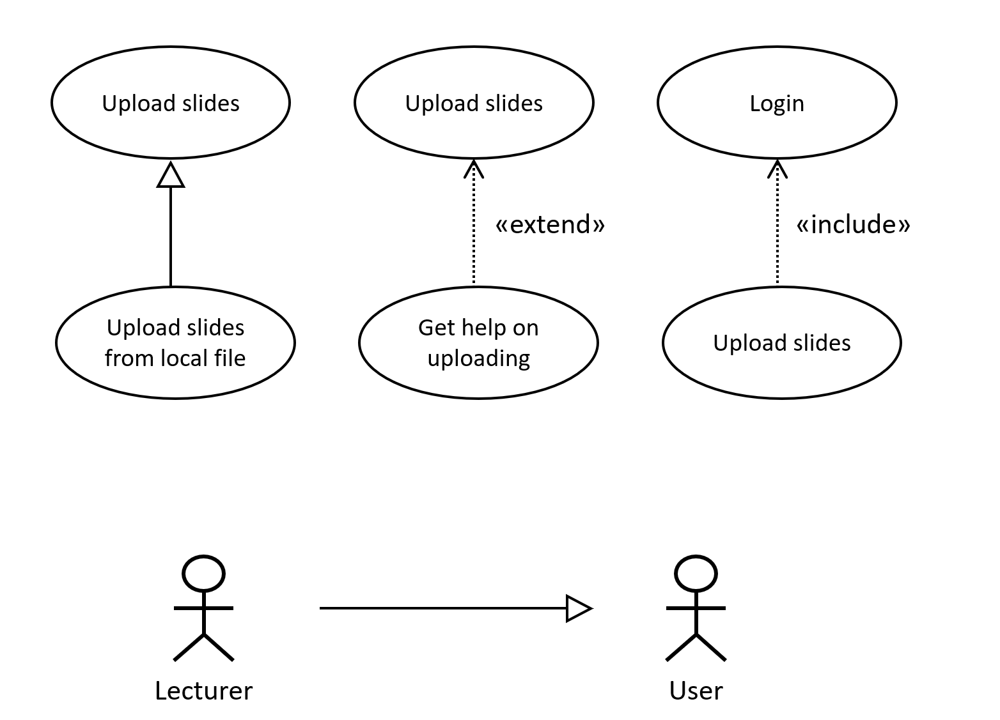
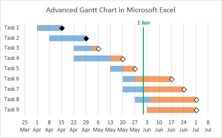
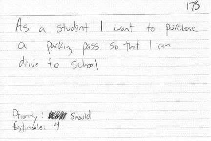

- title : Software Engineering: Modelling requirements
- description : Software Engineering: Modelling requirements
- author : Tomas Petricek
- theme : simple
- transition : none

****************************************************************************************************

# **CO886: Software Engineering**  Modelling requirements

  
   

**Tomas Petricek**

email: [t.petricek@kent.ac.uk](mailto:t.petricek@kent.ac.uk) 
twitter: [@tomaspetricek](http://twitter.com/tomaspetricek) 
office: [S129A](https://www.cs.kent.ac.uk/rooms/S129A.gif) 

****************************************************************************************************
- class: part

# **Specifying and learning**

----------------------------------------------------------------------------------------------------

# Specifying and learning

**Typical clients**

 - _Experts in their domain_
 - _Do not speak computer-speak_
 - _Not sure what is possible_

**Typical software provider**

 - _Hopefully knows how to build software systems_
 - _No idea about trading of energy derivatives and commodity price risk management_
 - _Rare exceptions sometimes happen!_

----------------------------------------------------------------------------------------------------

**Learning unfamiliar domain**

Put knowledge on paper  
_Specification that programmers can understand and follow_

Keep knowledge in brains  
_Not scalable, but developers can use intuition and contribute ideas_

----------------------------------------------------------------------------------------------------

# Modelling, understanding and specifying software

### Three aspects of software systems we can model

❶ Requirements - _What should it be doing_

❷ Structure - _What are individual components_

❸ Interactions - _How does it interact with other systems_

----------------------------------------------------------------------------------------------------

# The role of requirements

**Collecting requirements**

 - _A mix of two roles_
 - _Formal up-front specification_
 - _Means of communication_

**Problems with requirements**

 - _Requirements inevitably evolve over time_
 - _How to keep document in sync with reality?_
 - _How to check we satisfied the requirements?_

****************************************************************************************************
- class: part

# **Use case diagrams**

----------------------------------------------------------------------------------------------------

# Unified Modelling Language (UML)

**Culture and motivations**

 - _Seeking "proper" methods_
 - _Appeared in 1990s along_  
   _with object-oriented paradigm_

**UML diagram types**

 - Use cases - _capture requirements_
 - Class diagrams - _object-oriented structure_
 - Sequence diagrams - _communication patterns_

----------------------------------------------------------------------------------------------------

**Guess the system!**

Specifying Moodle

_Various actors have various requirements_

_Requirements  
can be shared_

----------------------------------------------------------------------------------------------------

# UML use case diagrams

**System boundaries**

 - _Indicate what is in scope_
 - _System or a sub-system_

**What is an actor**

 - _Any external entity_
 - _Human users or other systems_
 - _Anything we cannot control_

----------------------------------------------------------------------------------------------------

Inheritance  
_A more specialized version of a case_

Extends  
_Adds extra optional features to a case_

Include  
_Include necessary partial use case_

----------------------------------------------------------------------------------------------------
- class: part

# **Demo**: Specifying Moodle requirements

----------------------------------------------------------------------------------------------------

# Use cases

### Using use case diagrams

_<i class="fa fa-shopping-cart"></i> Captures human requirements or code requirements_

_<i class="fa fa-list"></i> Can be written as a list or table too_

_<i class="fa fa-exchange-alt"></i> Does not talk about use case relationships_

_<i class="fa fa-check-square"></i> Does not specify how to test implementation_

****************************************************************************************************
- class: part

# **Project management**

----------------------------------------------------------------------------------------------------

**What matters  
in what contexts?**

_Experimental non-critical business project?_

_Critical military system supporting new weapons?_

----------------------------------------------------------------------------------------------------

# Heavyweight project management

### Predictability over efficiency

_<i class="fa fa-money-bill-wave"></i> Estimates are often order-of-magnitude wrong_

_<i class="fa fa-clock"></i> Deliver systems on time and on budget_

_<i class="fa fa-hourglass-start"></i> Sometimes price and scope change does not matter_

_<i class="fa fa-flask"></i> Hopes for "science" of software engineering_

----------------------------------------------------------------------------------------------------

# Use cases and project management

**Planning with use cases**

 - _Time and cost estimates_
 - _Planning and scheduling_

**Does this ever work?**

 - _Use cases with same difficulty_
 - _Varies by team and often project_
 - _Not flexible regarding changes_

----------------------------------------------------------------------------------------------------

# UML use case diagrams

### Use case diagrams in practice

_<i class="fa fa-users"></i> Useful for making customers think_

_<i class="fa fa-clock"></i> Not useful for planning and estimates_

_<i class="fa fa-sync"></i> Often gets out of sync with reality_

_<i class="fa fa-weight-hanging"></i> Heavyweight - a plain list might do_

****************************************************************************************************
- class: part

# **User stories and scenarios**

----------------------------------------------------------------------------------------------------

# Rethinking requirements

**Agile methodologies**

 - _Formal diagrams are too hard_
 - _How do we get customers involved?_
 - _What is a good way of talking to them?_

**User stories**

 - _Not requirements, but_ stories
 - _Use paper or Word or whatever works_
 - As a _user_ I want _something_ so that _benefit_

----------------------------------------------------------------------------------------------------

**Fixed story format**

User _so that we know who needs this_

Benefit _so that  
there is a reason_

----------------------------------------------------------------------------------------------------

# User stories

### User stories in agile practice

_<i class="fa fa-calendar-alt"></i> Stories still help with project plan_

_<i class="fa fa-sort-amount-down"></i>_ Priority - _to engage customers in planning_

_<i class="fa fa-map"></i>_ Estimate - _of difficulty for planning_

_<i class="fa fa-check-square"></i> How do we know we support a given story?_

----------------------------------------------------------------------------------------------------

**From stories  
to scenarios**

_Keep the simple textual format_

_Integration with development process_

----------------------------------------------------------------------------------------------------
- class: part

# **Demo**: Specifying scenarios and features

----------------------------------------------------------------------------------------------------

# Scenarios in practice

### Behaviour-driven development methodology

_<i class="fa fa-th-list"></i> Specify features in terms of scenarios_

_<i class="fa fa-wrench"></i> Cucumber is just one sample tool_

_<i class="fa fa-font"></i> Text keeps the ceremony minimal_

_<i class="fa fa-sync"></i> Ensures code is in sync with scenarios_

****************************************************************************************************
- class: part

# **Summary**

----------------------------------------------------------------------------------------------------

# Modelling requirements

**System development methodologies**  
_Ways of interacting with customers_  
_Upfront specification or conversation_

**UML and use case diagrams**  
_Actors and system boundaries_  
_Inheritance and dependencies_

**User stories and scenarios**  
_User stories and agile methods_  
_Behaviour driven development_

----------------------------------------------------------------------------------------------------

# Social side

### How do you make this work?

_<i class="fa fa-tint"></i> Choose a suitable methodology for a project_

_<i class="fa fa-briefcase"></i> Can it be a useful part of a workflow?_

_<i class="fa fa-pencil-alt"></i> Who is reading and writing requirements?_

_<i class="fa fa-user-tie"></i> What tools are people comfortable with_

----------------------------------------------------------------------------------------------------

# CO886: Modelling requirements

**What you should remember from this lecture**

 - Why people do it and how they fail
 - Draw a basic UML use case diagram
 - Write a story and feature with scenarios

 
 

Tomas Petricek 
_[t.petricek@kent.ac.uk](mailto:t.petricek@kent.ac.uk) | [@tomaspetricek](http://twitter.com/tomaspetricek)_

****************************************************************************************************
 - class: part

# **References**

----------------------------------------------------------------------------------------------------

**Tools, books and articles**

 - [UML 2 Use Case Diagrams: An Agile Introduction](http://agilemodeling.com/artifacts/useCaseDiagram.htm)
 - [User Stories: An Agile Introduction](http://www.agilemodeling.com/artifacts/userStory.htm)
 - [cucumber: Executable specifications](https://docs.cucumber.io/)
