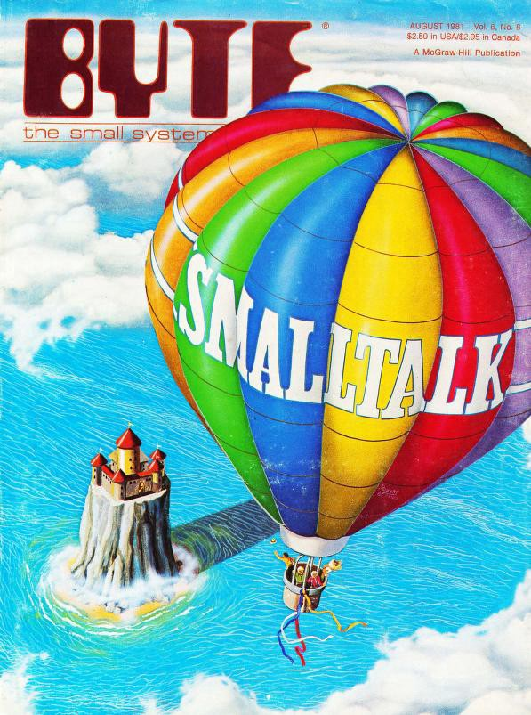
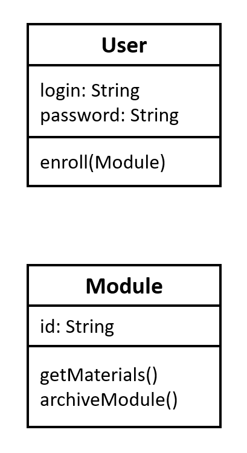
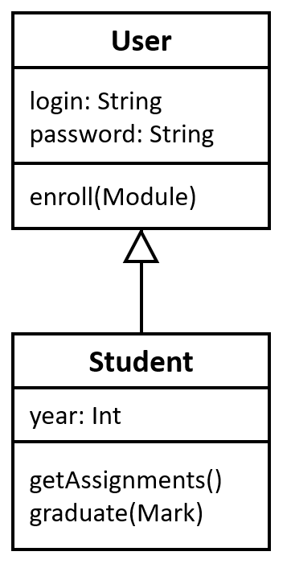
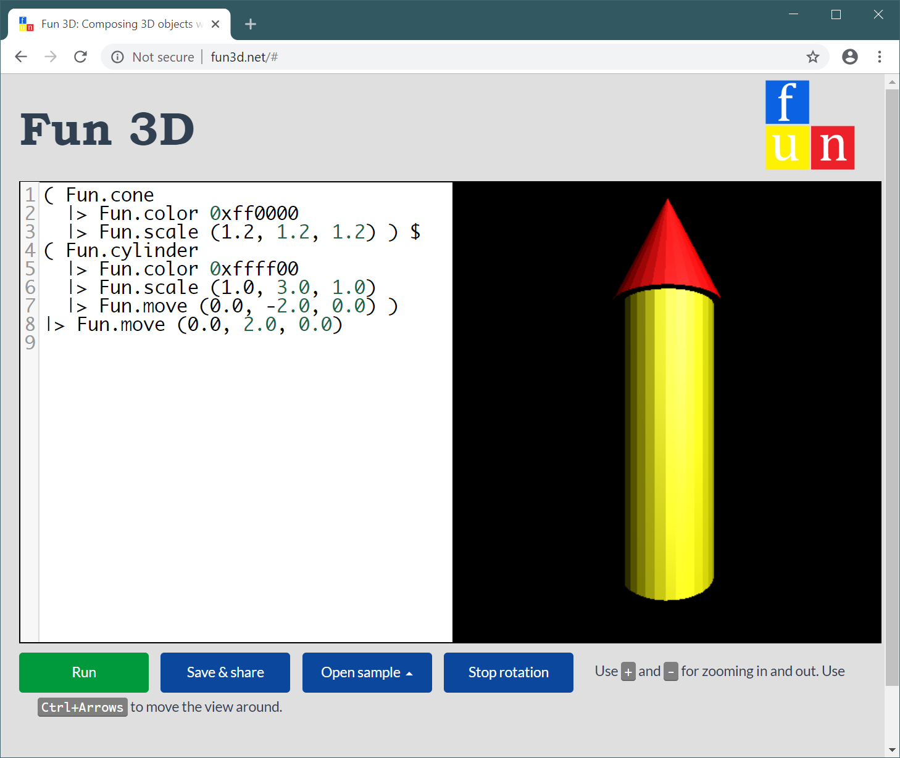
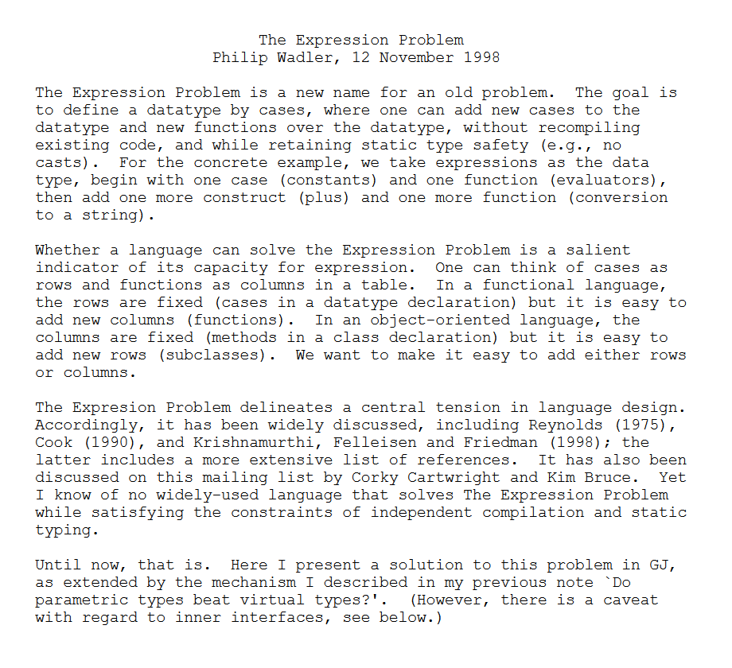
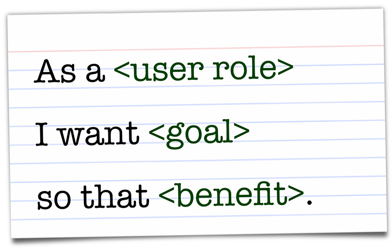

- title : Software Engineering: Modelling structure
- description : Software Engineering: Modelling structure
- author : Tomas Petricek
- theme : simple
- transition : none

****************************************************************************************************

# **CO886: Software Engineering**  Modelling structure

  
   

**Tomas Petricek**

email: [t.petricek@kent.ac.uk](mailto:t.petricek@kent.ac.uk) 
twitter: [@tomaspetricek](http://twitter.com/tomaspetricek) 
office: [S129A](https://www.cs.kent.ac.uk/rooms/S129A.gif) 

****************************************************************************************************
- class: part

# **Decomposing systems into modules**

----------------------------------------------------------------------------------------------------

**David Parnas (1972)**

Conventional  
_Subroutines follow the order of execution_

Unconventional  
_Modules abstract some aspects of implementation_

----------------------------------------------------------------------------------------------------

# How to structure large programs

**Procedural approach**

 - _Programs that run top-to-bottom_
 - _Break program into smaller steps_
 - But _what data is passed between?_

**Logical abstraction**

 - _Identify logical components_
 - _Hide implementation details_
 - _How data is represented, stored, ..._

----------------------------------------------------------------------------------------------------

**Barbara Liskov (1974)**

Abstract data types

_Programming language mechanism for abstraction_

----------------------------------------------------------------------------------------------------

# Object oriented programming

**Origins of objects**

 - _Simulating real-world systems_
 - _World consists of objects_
 - _Created according to a scheme_

**Object-oriented abstraction**

 - _Class defines a template for object_
 - _Multiple instances of a class_
 - _Objects hide implementation details_

----------------------------------------------------------------------------------------------------

**Alan Kay et al. (1972)**

Smalltalk

_"Actually I made up the term "object-oriented", and I can tell you I did not have C++ in mind."_

Galactic scale

_Computer made of small computers that exchange messages_

****************************************************************************************************
- class: part

# **Modelling object-oriented systems**

----------------------------------------------------------------------------------------------------

# UML class diagrams

**Modelling structure**

 - _Relationships between entities_
 - _Capture data and key operations_
 - _Good fit with object-oriented style_

**Class diagrams in practice**

 - Heavyweight: _Upfront application architecture_
 - Lightweight: _Whiteboard architecture discussions_

----------------------------------------------------------------------------------------------------

# UML class diagrams

**Representing a class**

 - _Attributes and methods as in Java_
 - _Can be more abstract than code_
 - _Often, name is all you need_

**Topics not covered**

 - _Representing individual instances_
 - _Marking attributes as private_
 - _Interfaces and other types_

----------------------------------------------------------------------------------------------------

# Fancy arrows

<table style="margin-top:-20px; width:100%" class="tc"><tr>
<td style="width:33%;text-align:center">

**Has-A**  
_Contains another entity_

</td>
<td style="width:33%;text-align:center" class="fragment">

**Is-A**  
_Generalisation or inheritance_

</td>
<td style="width:33%;text-align:center" class="fragment">

**Depends-on**
_Requires/uses another entity_

</td>
</tr></table>

----------------------------------------------------------------------------------------------------

- class: part

# **Demo:** Modelling social networking app

----------------------------------------------------------------------------------------------------

# Using generalisation relation (1/2)

**Social network example**

_Cache can only cache posts with some multi-media content attached_

**Representations**

 - _Link to Post with a comment?_
 - _Link from Cache to Image and Link?_
 - _Are there better options?_

----------------------------------------------------------------------------------------------------

# Using generalisation relation (1/2)

**Social network example**

_Cache can only cache posts with some multi-media content attached_

**Add a new entity!**

 - _Image and Link are MediaPosts, Plain is not_
 - _Good explanation, maybe not needed in code_

----------------------------------------------------------------------------------------------------

# UML class diagrams

### Modelling using class diagrams in practice

_<i class="fa fa-church"></i> Fully describe application architecture_

_<i class="fa fa-coffee"></i> Generate Java from diagrams and add code_

_<i class="fa fa-chalkboard"></i> Whiteboard discussion and then erase_

_<i class="fa fa-search"></i> Generate diagram from code to understand it_

****************************************************************************************************
- class: part

# **Modelling beyond objects**

----------------------------------------------------------------------------------------------------

**DEMO: Fun 3D**   
[_www.fun3d.net_](http://www.fun3d.net)

_Functional programming abstractions_

_Domain-specific languages_

----------------------------------------------------------------------------------------------------

# Two ways of modelling 3D worlds

**Object-oriented class hierarchy**

**Functional algebraic data type**

    type Shape =
      | Cube
      | Move of Shape * float * float * float
      | Combine of Shape list

----------------------------------------------------------------------------------------------------

# Two ways of modelling 3D worlds

**Object-oriented class hierarchy**

 - _Abstract method in the base class_
 - _Implementation in each shape_
 - _Easy to add new shapes_

**Functional algebraic data type**

 - _Separate data from functions_
 - _Render function handles all cases_
 - _Easy to add new operations_

----------------------------------------------------------------------------------------------------

**The Expression Problem**

Object-oriented style  
_Easy to add new types, hard to add operations_

Functional style  
_Easy to add functions, hard to add new types_

Can we get both?

----------------------------------------------------------------------------------------------------

# Domain-specific languages

**Motivation:** When do we need this?

 - _Repeated problem, many variations_
 - _User stories, game logic, contracts_
 - _Accessible to non-programmers_

**Solution:** Build a language for a given domain!

 - External – _New language with custom syntax_
 - Internal – _Library in an existing language_

----------------------------------------------------------------------------------------------------

Domain Specific Languages (DSLs)

**Model**  
What we work with? How does it compose?

**Syntax**  
How can we write it in a human-friendly way?

----------------------------------------------------------------------------------------------------

# Functional and object-oriented DSLs

**Functional languages**  
_Custom operators and function composition_

    (Fun.cone |> Fun.color Color.red) $
    (Fun.cylinder |> Fun.move (0, -1, 0))

**Object-oriented languages**  
_Fluent interfaces and the builder pattern_

    [lang=csharp]
    fun.cone().withColor(color.red).
      combineWith(fun.cylinder().moveBy(0, -1, 0))

----------------------------------------------------------------------------------------------------

# Modelling beyond objects

### Many ways to express problems in code

_<i class="fa fa-not-equal"></i>_ Functional - _separate data and functions_

_<i class="fa fa-language"></i>_ Domain specific languages - _for a specific problem_

_<i class="fa fa-bars"></i>_ Event sourcing - _state as a list of events_

_<i class="fa fa-cogs"></i>_ Microservices - _system as independent servers_

****************************************************************************************************
- class: part

# **Summary**

----------------------------------------------------------------------------------------------------

# Modelling structure

**Decomposing systems into modules**  
_From subroutines to abstract modules and objects_  
_Abstract data types, object-oriented programming_

**Object-oriented modelling**  
_Heavyweight and lightweight methodologies_  
_Is-A, Has-A and dependency relations_

**Beyond object-oriented modelling**  
_Functional programming and the expression problem_  
_Solving repetitive problems with DSLs_

----------------------------------------------------------------------------------------------------

# CO886: Modelling structure

**What you should remember from this lecture**

 - Abstraction and origins of objects
 - Class diagrams and three kinds of arrows
 - Be aware that there are other options!

 
 

Tomas Petricek 
_[t.petricek@kent.ac.uk](mailto:t.petricek@kent.ac.uk) | [@tomaspetricek](http://twitter.com/tomaspetricek)_

****************************************************************************************************
 - class: part

# **References**

----------------------------------------------------------------------------------------------------

**Academic papers**

 - David Parnas (1972). [On The Criteria To Be Used in Decomposing Systems into Modules](https://www.win.tue.nl/~wstomv/edu/2ip30/references/criteria_for_modularization.pdf)
 - Barbara Liskov, Stephen Zilles (1974). [Programming with Abstract Data Types](https://dl.acm.org/citation.cfm?id=807045)
 - Alan Kay (1993). [The Early History of Smalltalk](http://worrydream.com/EarlyHistoryOfSmalltalk/)

**Tools, books and articles**

 - [Domain Specific Languages: The Functional Way](https://vimeo.com/97315970)
 - [The Expression Problem](http://homepages.inf.ed.ac.uk/wadler/papers/expression/expression.txt)
 - [UML Class Diagrams](http://agilemodeling.com/artifacts/classDiagram.htm)
