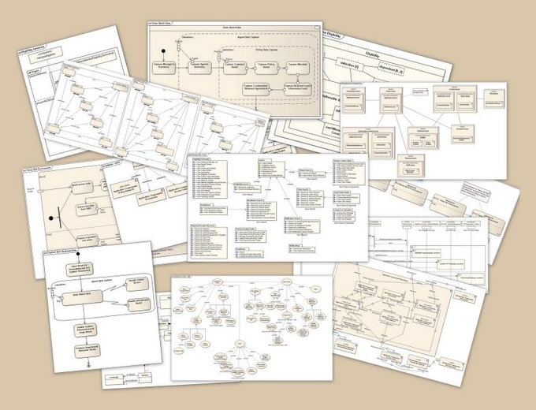
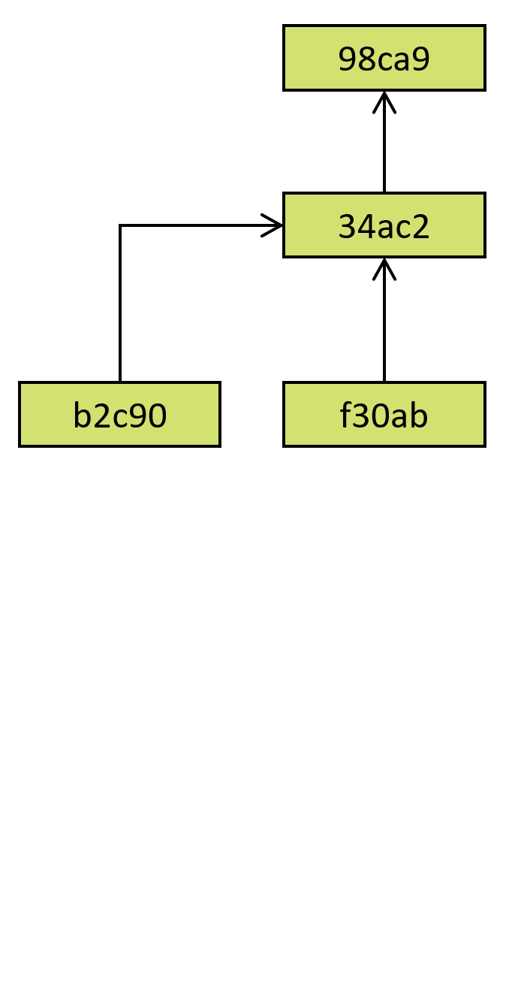

- title : Software Engineering: Source control systems
- description : Software Engineering: Source control systems
- author : Tomas Petricek
- theme : simple
- transition : none

****************************************************************************************************

# **CO886: Software Engineering**  Source control systems

  
   

**Tomas Petricek**

email: [t.petricek@kent.ac.uk](mailto:t.petricek@kent.ac.uk) 
twitter: [@tomaspetricek](http://twitter.com/tomaspetricek) 
office: [S129A](https://www.cs.kent.ac.uk/rooms/S129A.gif) 

****************************************************************************************************
- class: part

# **Software engineering today**

----------------------------------------------------------------------------------------------------

**Mathematician's answer to software engineering**

_Use mathematical methods to prove system correctness_

People don't do it, yet, software mostly works.

----------------------------------------------------------------------------------------------------

**Detailed upfront models**

We know where  
we want to get

_Useful if predictability matters more than cost and delivery time_

----------------------------------------------------------------------------------------------------

# Software engineering today

**In contrast to upfront model**

We know that we continue  
moving in the right direction

**Tools and practices to ensure that**

 - _We can learn from past mistakes_
 - _We're tracking known issues_
 - _Software keeps working when we make changes_
 - _It is easy to improve and contribute_

----------------------------------------------------------------------------------------------------

# Software engineering today

### Some important aspects that we will cover

_<i class="fa fa-file"></i> Source control and collaborative development_

_<i class="fa fa-check-square"></i> Testing and build automation_

_<i class="fa fa-cog"></i> Continuous integration and reproducibility_

_<i class="fa fa-code"></i> How open-source software development works_

----------------------------------------------------------------------------------------------------

**Git and source control**

Version and history tracking systems

_Keep version history because you will need to look back_

_Develop features independently and merge changes_

----------------------------------------------------------------------------------------------------

# Two ways of working

**Graphical user interface**

 - _Eclipse, VS Code, Tortoise, etc._
 - _Great when it works well_
 - _Illusion of this is easy_

**Command line tools**

 - _Everything using the `git` command_
 - _Teaches you more about how it works..._
 - _Fortunately, easy to Google answers!_

----------------------------------------------------------------------------------------------------

**GitHub and collaboration**

Help teams plan and collaborate and organize

_Manage issues, notes, plans, contributions_

_Also a "social network"  
for open source software_

****************************************************************************************************
- class: part

# **Git and source control**

----------------------------------------------------------------------------------------------------

# Git repository

**Everything in one folder**

 - _Your regular files you can edit_
 - _`.git` folder with old versions etc._
 - _`.gitignore` and other special files_

**Versioning and collaboration**

 - _Stage changes from files to "index"_
 - _Save or retrieve from version history_
 - _Push to/pull from remote repositories_

----------------------------------------------------------------------------------------------------

**Working directory**  
_Files you directly edit_

**Staging area**  
_Selection to be archived_

**Local repository**  
_History and versions_

**Remote repositories**  
_Versions on other computer(s)_

----------------------------------------------------------------------------------------------------

# Creating repository and adding files (1/2)

**Initialize empty repository in current folder**

    [lang=text]
    $ git init
    Initialized empty Git repository in C:/Temp/test/.git/

### Add new or modified file to the index

    [lang=text]
    $ git add hello.txt
    $ git status
    Changes to be committed:
            new file:   hello.txt

----------------------------------------------------------------------------------------------------

# Creating repository and adding files (2/2)

**Create new version history record (commit)**

    [lang=text]
    $ git commit
    [master (root-commit) d70e7d9] Adding hello file
     1 file changed, 1 insertion(+)
     create mode 100644 hello.txt

### List the most recent history records

    [lang=text]
    $ git log
    commit d70e7d97c8598b8c55f01da803447cf95d664504 (HEAD -> master)
    Author: Tomas Petricek <tomas@tomasp.net>
    Date:   Sat Feb 9 01:36:40 2019 +0000
        Adding hello file

----------------------------------------------------------------------------------------------------
- class: part

# **Demo:** Creating repository, adding files

****************************************************************************************************
- class: part

# **Using git in practice**

----------------------------------------------------------------------------------------------------

_Warning: This slide contains profanities_

How to write a good commit message?

_Brief summary of the change (70 characters)_

_Add more detailed comment after a newline_

----------------------------------------------------------------------------------------------------

# Git history and branches

### Using git for versioning and features

_<i class="fa fa-code-branch"></i> Use branches for different versions and features_

_<i class="fa fa-leaf"></i> Branch is named pointer to a commit_

_<i class="fa fa-chess-king"></i> Master branch is typically the "main" once_

_<i class="fa fa-industry"></i> Branch for each version running in production_

----------------------------------------------------------------------------------------------------

# Git history and branches (1/3)

**Directed acyclic graph**  
_Commits identified by hash_  
_Arrow to a previous state_

----------------------------------------------------------------------------------------------------

# Git history and branches (2/3)

**Directed acyclic graph**  
_Commits identified by hash_  
_Arrow to a previous state_

**Commits, branches, head**  
_Branch is a pointer to commit_  
_Current branch identified as HEAD_  

----------------------------------------------------------------------------------------------------

# Git history and branches (3/3)

**Directed acyclic graph**  
_Commits identified by hash_  
_Arrow to a previous state_

**Commits, branches, head**  
_Branch is a pointer to commit_  
_Current branch identified as HEAD_  

**Merging changes from branches**  
_Commit with multiple parents_  
_Potential for conflicts_

----------------------------------------------------------------------------------------------------

# Working with branches (1/2)

**Create and switch head to a new branch**

    [lang=text]
    $ git branch testing
    $ git checkout testing
    Switched to branch 'testing'

### Make a change in a new branch

    [lang=text]
    $ git commit -am "Add experimental features"
    [testing 4aaea6a] Add experimental features
     1 file changed, 2 insertions(+), 1 deletion(-)

----------------------------------------------------------------------------------------------------

# Working with branches (2/2)

**List branches and switch to master**

    [lang=text]
    $ git branch -v
    * master  d70e7d9 Yadda
      testing 4aaea6a Adding testing

### Merge changes from another branch

    [lang=text]
    $ git checkout master
    $ git merge testing
    Updating d70e7d9..4aaea6a
    Fast-forward
     hello.txt | 3 ++-
     1 file changed, 2 insertions(+), 1 deletion(-)

----------------------------------------------------------------------------------------------------

- class: part

# **Demo:** Working with branches

****************************************************************************************************
- class: part

# **Summary**

----------------------------------------------------------------------------------------------------

# Git and its alternatives

### When is git a wrong tool and alternatives

_<i class="fa fa-wifi"></i> Uses distributed model with no central server_

_<i class="fa fa-window-restore"></i> There are user interface tools for using git_

_<i class="fa fa-magic"></i> Git is way more complex than it seems_

_<i class="fa fa-list"></i> Alternatives include Subversion, Mercurial, Perforce_

----------------------------------------------------------------------------------------------------

# Source control systems

**Software engineering today**  
From _"we know where we want to get"_  
To _"know we continue moving in the right direction"_

**Using git for version and history tracking**  
_Working dir, staging area, local and remote repositories_  
_Creating, commits, working with branches, merging_

----------------------------------------------------------------------------------------------------

# CO886: Source control systems

**What you should remember from this lecture**

 - How git stores versions and branches
 - Git commit, branch, checkout, pull, push

 
 

Tomas Petricek 
_[t.petricek@kent.ac.uk](mailto:t.petricek@kent.ac.uk) | [@tomaspetricek](http://twitter.com/tomaspetricek)_
