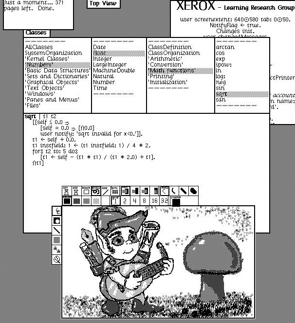
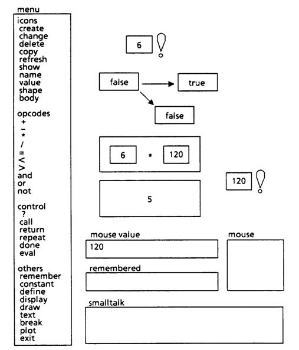

- title: Close look at past and today's programs | Programming language design (NPRG075)

*****************************************************************************************
- template: title

# NPRG075
## Close look at past and today's programs

---

**Tomáš Petříček**, 309 (3rd floor)  
_<i class="fa fa-envelope"></i>_ [petricek@d3s.mff.cuni.cz](mailto:petricek@d3s.mff.cuni.cz)  
_<i class="fa-solid fa-circle-right"></i>_ [https://tomasp.net](https://tomasp.net) | [@tomaspetricek](http://twitter.com/tomaspetricek)

**Lectures:** Monday 12:20, S7  
_<i class="fa-solid fa-circle-right"></i>_ https://d3s.mff.cuni.cz/teaching/nprg075


*****************************************************************************************
- template: subtitle

# Close reading
## Two perspectives

-----------------------------------------------------------------------------------------
- template: content
- class: two-column

# Two perspectives on programs

### Critical code studies

Interpreting the meaning of code, software or systems  
in socio-historical context

*fa-search* **Attention to detail**  
*fa-xx* Variable names

*fa-dragon* **Making broad points**  
*fa-xx* Labyrinths in culture

---

### Complementary science

Use history & philosophy to answer questions science itself neglects

*fa-scale-balanced* **Attention to detail**  
*fa-xx* How exactly did it work

*fa-atom* **Making those relevant**  
*fa-xx* New mode of interaction

-----------------------------------------------------------------------------------------
- template: code

```

// Your first C++ program
#include <iostream>

int main()
{
  std::cout << "Hello World!\n";
  return 0;
}
```

# Close reading

"Close reading is the careful, sustained interpretation of a brief passage of a text"

**What can we learn?**

-----

Not always educational start (Java, Haskell)

Reference to a long-term hacker culture

-----------------------------------------------------------------------------------------
- template: icons

# Close reading
## Programming language design

- *fa-shield-halved* Understand socio-historical context
- *fa-hand-sparkles* Design for better social & cultural use?
- *fa-mercury* Understand lost ideas from the past
- *fa-vial-circle-check* Recover and adapt what may be useful!

*****************************************************************************************
- template: subtitle

# Critical code studies
## Closer look at code

-----------------------------------------------------------------------------------------
- template: image
- class: smaller


# Hello World in Piet

**Why look at esoteric languages?**

----

We must not just observe nature in the raw,
but also "twist the lion's tail" to get at
hidden insights

**May reveal facts about normal languages too!**

-----------------------------------------------------------------------------------------
- template: lists

# The meaning of programs

```text
>++++++++[<+++++++++>-]<
.>++++[<+++++++>-]<+.+++
++++..+++.>>++++++[<++++
+++>-]<++.------------.>
++++++[<+++++++++>-]<+.<
.+++.------.--------.>>>
++++[<++++++++>-]<+.
```

## Speaking code
"Like all codes, [source code] is only interpretable within the context of the overall network of relations that make its operations unstable."

## Meaning of code

- **Meaning for the machine**  
  Relies on technological context - compilers, specification
- **Meaning for a human reader**   
  Relies on socio-cultural context

-----------------------------------------------------------------------------------------
- template: content

# Multiple levels of meaning


-----------------------------------------------------------------------------------------
- template: image
- class: smaller


# Mutual influences

**Social shapes technical**

Programming reflects our thinking about the world  
e.g. division of labour

**Technical shapes social**

Abstractions define how we think about software  
e.g. information hiding

-----------------------------------------------------------------------------------------
- template: image


# Foo, bar, baz, ...
(Lennon, 2018)

-----

**Cultural pointer**

Akin to programming language pointers

Marks work as belonging to a particular culture

-----------------------------------------------------------------------------------------
- template: icons

# Foo, bar, baz...
## As cultural pointers

- *fa-location-pin* Metasyntactic variable / meaning placeholder
- *fa-brain* Variable names and comments are for humans
- *fa-user-tie* Neither $x$ nor `AbstractSingletonProxyFactoryBean`
- *fa-network-wired* ARPANET and Request For Comments (RFCs)

-----------------------------------------------------------------------------------------
- template: image
- class: smaller


# 10 PRINT

**Cultural context of  
a BASIC one-liner**

The birth of microcomputers and tinkerer culture

Randomness and variations of the pattern

Recreating the one-liner in other systems

-----------------------------------------------------------------------------------------
- template: icons

# Critical code studies
## Ideas for programming

- *fa-building-columns* What socio-technical context design uses?
- *fa-users-viewfinder* Design for hackers or non-programmers?
- *fa-book* Analyse what exists, show what could exist
- *fa-masks-theater* "Performative science fiction" demos

-----------------------------------------------------------------------------------------
- template: lists
- class: smaller

# Thimbl: Performative science fiction


## Federated social network (~2011)

- Artwork, not to compete with Twitter
- Built with a different social context
- Can it work without investments?

## How is it supposed to work?

- Built with as little code as possible
- Using SSH and Finger protocol (1970s)
- Low-tech version of ActivityPub (Mastodon)

-----------------------------------------------------------------------------------------
- template: lists
- class: border

# Programming system demos


## Future programming

- Imagining alternative ways
- Often through (limited) demos
- End-user, visual, domain-specific

## Places to look at

- Bret Victor: [worrydream.com](http://worrydream.com/)
- LIVE workshop: [liveprog.org](https://liveprog.org/)
- Ink & Switch: [inkandswitch.com](https://www.inkandswitch.com)

*****************************************************************************************
- template: subtitle

# Complementary science
## Learning from the past

-----------------------------------------------------------------------------------------
- template: image
- class: smaller


# Complementary science

Contribute to scientific knowledge through historical and philosophical investigations

**Effectiveness of science leads to dogmatism**

Narrow focus can result in loss of knowledges

-----------------------------------------------------------------------------------------
- template: image
- class: smaller


# Heat reflection (1791)

**Heat produced by "caloric", cold maybe by another "positive" substance.**

-----

Heat is reflected by mirror!  
Cold is absence of heat?  
But also reflected!

Modern physicists never talk about reflection of cold!

-----------------------------------------------------------------------------------------
- template: content

# Complementary programming?


-----------------------------------------------------------------------------------------
- template: icons

# Complementary science
## Why use it for programming

- *fa-ban* Feel all programming is the same?
- *fa-leaf* Programming has brief but rich history
- *fa-money-bill* Not discarded for experimental failures
- *fa-terminal* Ideas are (relatively) easy to recreate!

-----------------------------------------------------------------------------------------
- template: subtitle

# Demo
## Annoying pop-ups of the 1990s

-----------------------------------------------------------------------------------------
- template: image


# Learning from<br />the 1990s web

**View-source, copy  
and edit culture**

Hosting on Geocities & creative community

Limited user protection (hacks are for fun)

-----------------------------------------------------------------------------------------
- template: content
- class: two-column

# Two eras of the web

### *fa-lock-open* 1990s web

**View source**  
Readable source code

**Copy & paste**  
Self-contained scripts

**Pop-up windows**  
Unchecked window.open

-----

### *fa-lock* 2010s web

**Compiled code**    
Minified with dependencies

**Custom elements**    
Custom pop-ups using `<div>`

**Opaque structure**  
WebAssembly & Canvas

-----------------------------------------------------------------------------------------
- template: lists
- class: border

# Learning from the 90s web


## WebStrates project

- Shareable dynamic media
- Document and code in DOM
- Synchronized across clients
- In-page editor & dev tools

## Further ideas

- How to support reuse by copying?
- Openness and addressability of DOM

-----------------------------------------------------------------------------------------
- template: content
- class: two-column sysprev

# Good old programming systems


**Boxer's naive realism**  
You see all there is

----



**Smalltalk's self-sustainability**  
Built in itself

<style>.sysprev img { max-width:75%; }</style>

-----------------------------------------------------------------------------------------
- template: content
- class: two-column sysprev

# Good old programming systems



**Pygmalion's programming**  
By demonstration

-----


**Hypercard's usability**  
From user to programmer


-----------------------------------------------------------------------------------------
- template: content

xx
