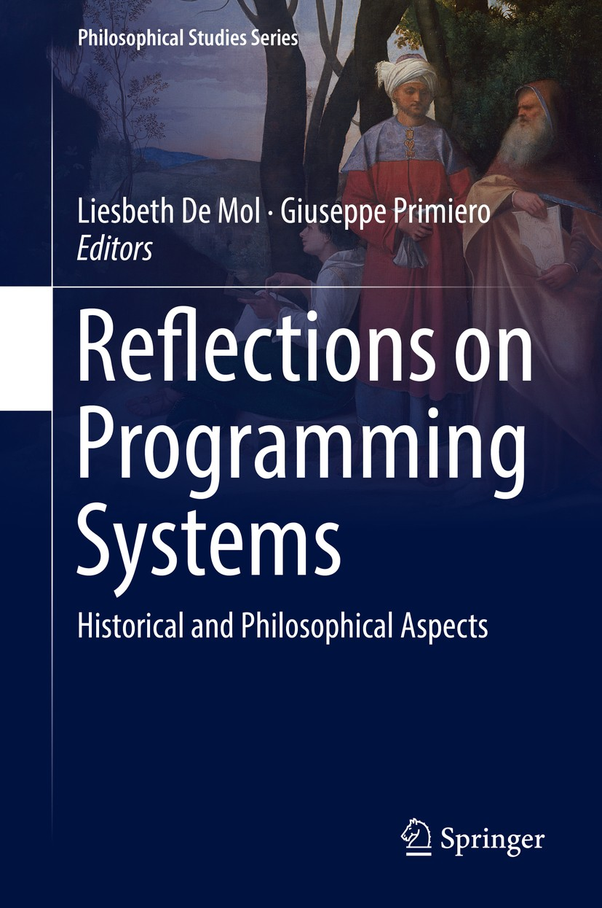
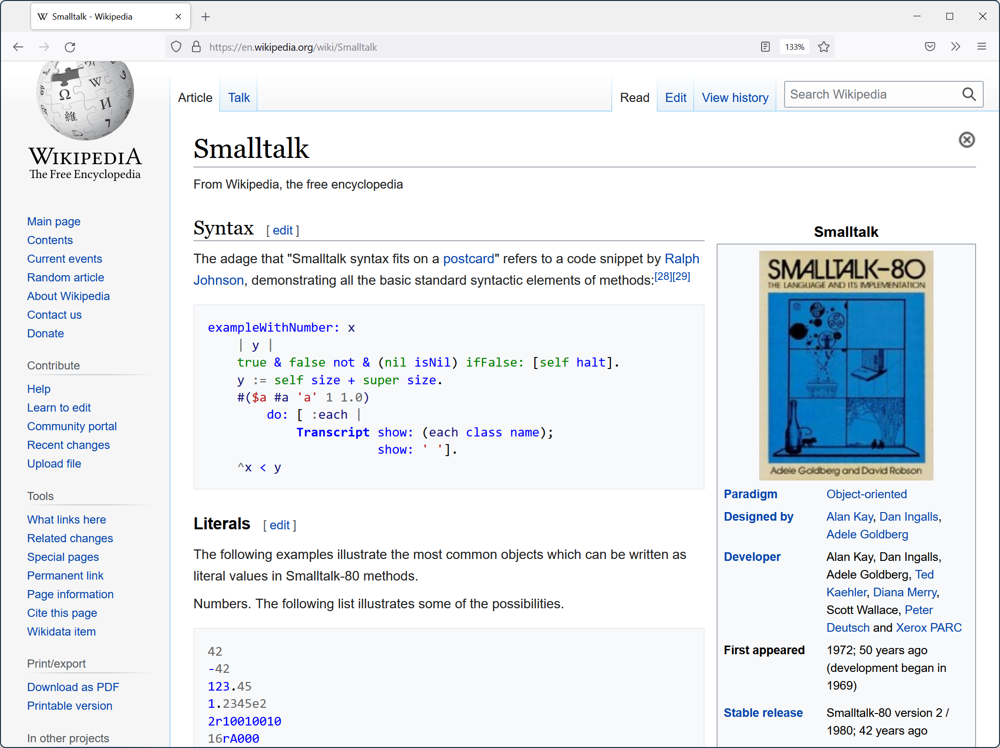
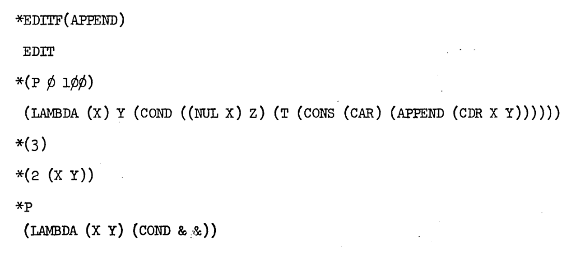
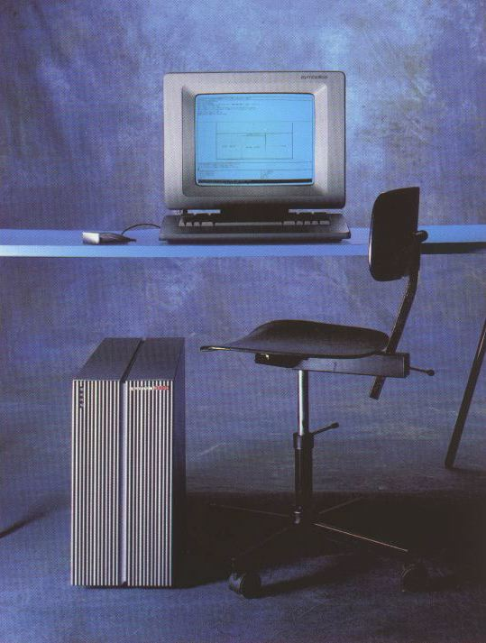
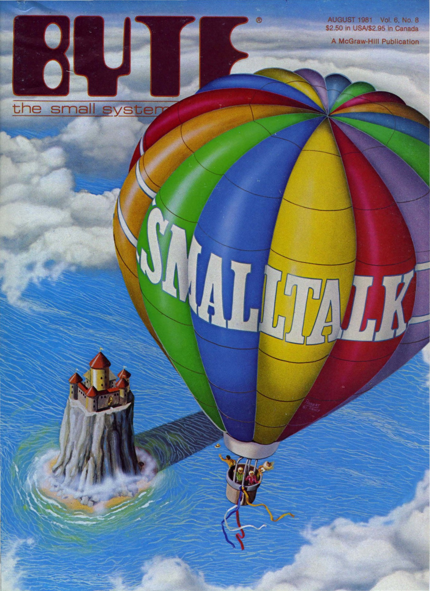

- title: History and philosophy of programming | Programming language design (NPRG075)

*****************************************************************************************
- template: title

# NPRG075
## History and philosophy of programming

---

**Tomáš Petříček**, 309 (3rd floor)  
_<i class="fa fa-envelope"></i>_ [petricek@d3s.mff.cuni.cz](mailto:petricek@d3s.mff.cuni.cz)  
_<i class="fa-solid fa-circle-right"></i>_ [https://tomasp.net](https://tomasp.net) | [@tomaspetricek](http://twitter.com/tomaspetricek)

**Lectures:** Monday 12:20, S7  
_<i class="fa-solid fa-circle-right"></i>_ https://d3s.mff.cuni.cz/teaching/nprg075

*****************************************************************************************
- template: subtitle

# Philosophy of science
## Why does it matter?

-----------------------------------------------------------------------------------------
- template: icons

# Philosophy of science
## What can we learn about programming?

- *fa-fire* What designers assume and never question
- *fa-tape* How to understand odd designs of the past
- *fa-draw-polygon* What is the nature of programming concepts
- *fa-person-dress* What social forces shape programming

-----------------------------------------------------------------------------------------
- template: image

# What do philosophers do?

**Origins languages, systems, correctness**

How could it have  
gone differently?

-----

**Reflections on ethics, politics, development**

What if we took one aspect as primary?

-----------------------------------------------------------------------------------------
- template: content
- class: three-column smaller

# Doing philosophy of programming

### *fa-cog* Methods

Try to explain  
how scientists think and work

-----

### *fa-city* Entities

How concepts evolve & what  
are they?

-----

### *fa-city* Social forces

How social aspects shape technology

*****************************************************************************************
- template: subtitle

# Paradigm shifts
## Classic philosophy of science

-----------------------------------------------------------------------------------------
- template: image
- class: smaller

# Scientific revolutions

**Periods of normal science disrupted by revolutions**

New era with new assumptions when the old ways stop working

**New incommensurable with the old thinking**

-----------------------------------------------------------------------------------------
- template: lists
- class: smaller border

# Philosophy of science

## Research programmes (Lakatos)

- Groups of scientists share assumptions
- Explain failures by blaming  
  secondary auxiliary assumptions

## Against method (Feyerabend)

- No single rule explains science
- Hard to say what is reasonable!

-----------------------------------------------------------------------------------------
- template: image
- class: smaller

# Programming language revolution

(Gabriel, 2012)

**From thinking about programming systems**

Running, with evolving state, modified interactively

**To thinking about programming languages**

Relationships in static code

-----------------------------------------------------------------------------------------
- template: image

# Smalltalk language

"Smalltalk is an object-oriented, dynamically typed reflective programming language"

**What makes it interesting?**

-----------------------------------------------------------------------------------------
- template: image

# Smalltalk as a programming system

Think not about source code, but about evolving system state!

-----------------------------------------------------------------------------------------
- template: icons

# Smalltalk
## Programming system view

- *fa-floppy-disk* Image-based persistence rather than source
- *fa-square-pen* Application ships with developer tools
- *fa-table-columns* Class browser allows inspecting & editing
- *fa-rotate* Reflection lets the system change itself

-----------------------------------------------------------------------------------------
- template: content
- class: noborder

# LISP language

Functional programming language  
derived from the lambda calculus?

-----------------------------------------------------------------------------------------
- template: lists
- class: border

# LISP environment

## Time-sharing

- Batch processing in the 1950s
- TX-0 ('58) allowed interactive use
- Multi-user machines via teletype

## AI research requirements

- Programming with symbolic data
- Interactive experimentation
- Programs that improve themselves

-----------------------------------------------------------------------------------------
- template: image

# LISP editor

(Deutsch, 1967)

**Interactive program editing on the terminal**

Teletype, not a screen!

Print using: `P`  
Delete child: `(3)`  
Replace child: `(2 ..)`

-----------------------------------------------------------------------------------------
- template: lists
- class: border smaller

# Interlisp: Interactive Lisp

## PILOT (1966)
- Edit code via list transformations
- Advising to enhance procedures
- Modifying state of a running system

## DWIM (1974)
- Interactive program correction
- Suggests automatic fixes when error occurs
- Do What I Mean / Damn Warren's Infernal Machine

-----------------------------------------------------------------------------------------
- template: image

# Symbolics Lips Machines (1980s)

Machines optimized for LISP with LISP-based environment

Persistent memory with just cons-cells

**Response to new hardware architecture**

-----------------------------------------------------------------------------------------
- template: icons

# Scientific revolutions
## Paradigm shifts in programming

- *fa-brain* Understand what people really thought!
- *fa-arrow-down-a-z* The invention of a programming language
- *fa-laptop-code* The shift from systems to languages
- *fa-people-group* Functional programming "research programme"

*****************************************************************************************
- template: subtitle

# Entities
## Evolution of programming concepts

-----------------------------------------------------------------------------------------
- template: image
- class: smaller

# How mathematical concepts evolve?

**Polyhedra, space, graph, function, convergence, measurable set**

----

How does the definition change and why?

-----------------------------------------------------------------------------------------
- template: image
- class: smaller

# Polyhedra

**Euler's formula**

$V-E+F=2$

A polyhedron is a solid whose surface consists of polygonal faces?

-----------------------------------------------------------------------------------------
- template: lists
- class: border

# Counter example?

## Convex polygons!

Through any point in space there will be at least one plane whose
cross-section with the polyhedron will consist of one single polygon.

## Monster-barring

I turn aside with a shudder of horror from this
lamentable plague of functions which have no derivatives.  
(Charles Hermite, 1893)

-----------------------------------------------------------------------------------------
- template: icons

# Concepts
## Proofs and refutations

- *fa-dna* Concept definitions are not constant but change
- *fa-square fa-regular* Arising from proofs, counter-examples, lemmas
- *fa-dragon* Monster-barring and exception-barring
- *fa-draw-polygon* Concept stretching when understanding evolves

-----------------------------------------------------------------------------------------
- template: lists
- class: border smaller

# Concepts in programming

## Change over time!

- Data types, logical types
- Monads and "railway" metaphor
- Processes become abstract

## Multiple forces for change

- New implementation of the concept
- Different metaphor for thinking
- New formalization in a proof

-----------------------------------------------------------------------------------------
- template: lists
- class: border smaller condensed

# Evolution of types

## Implementation & formal modality
Data types like records, modelled as sets

## Implementation modality evolves
Abstract data types for modularity  
Type checking ala lambda calculus

## Intuitive modality evolves
Well-typed programs do not go wrong  
New type systems based on this

## Implementation modality evolves
Types for documentation and editor tooling  

-----------------------------------------------------------------------------------------
- template: lists
- class: border smaller condensed

# Evolution of monads

## Formal and intuitive modality
Standard construction in algebraic topology
Monad as a "box" intuition

## Implementation modality appears
Used for sequencing effectful computations  
Definition in terms of _bind_ and _return_

## Implementation & intuition evolves
Monads in Haskell and the `do` notation  
Monad as a "sequencing" intuition

-----------------------------------------------------------------------------------------
- template: icons

# Concepts
## Programming language design

- *fa-tornado* There is more to concepts than just a name
- *fa-virus* Ideas come from logic, linguistics, biology!
- *fa-splotch* Beware of concept stretching as with types?
- *fa-ruler-combined* Capture a new intuition in the design?

*****************************************************************************************
- template: subtitle

# Social forces
## What shapes programming?

-----------------------------------------------------------------------------------------
- template: image
- class: smaller

# Social history  of computing

**How commercial  
interests or gender bias shape computing**

Redefinition of programming as more masculine software engineering in the 1960s

-----------------------------------------------------------------------------------------
- template: content
- class: noborder

# Structured programming

-----------------------------------------------------------------------------------------
- template: lists
- class: border

# Goto considered harmful (1968)

The quality of programmers is a decreasing function of the density  
of go to statements in the programs they produce.

## Problems with goto

- Hard to reason about informally
- Hard to reason about formally
- Code structure does not match runtime behaviour

-----------------------------------------------------------------------------------------
- template: lists
- class: border

# Structured programming

## Not obvious at the time!

- Everyone used to assembly!
- Can the compiler optimize code?
- Is it possible to avoid gotos?

## Structured Programming Theorem (1966)

Us converts waved this interesting bit of news under the noses of the
unreconstructed assembly-language programmers who kept trotting forth
twisty bits of logic and saying, 'I betcha can’t structure this.'

-----------------------------------------------------------------------------------------
- template: image

# Datamation (1973)

**What is structured programming and how to do it in practice**

From engineering concept to managerial concept

-----------------------------------------------------------------------------------------
- template: icons

# Chief programmer teams
## Top-down management technique

- *fa-people-group* Structured programming for organizing people
- *fa-person-chalkboard* Chief-programmer leading & dividing code
- *fa-sitemap* Supported by programmers, secretary, backup
- *fa-comments* Hostile exchanges between Dijkstra and Mills

-----------------------------------------------------------------------------------------
- template: image
- class: noborder smaller

# Conway's law

Any organization that designs a system will produce a
design whose structure is a copy of the organization's communication structure.

-----------------------------------------------------------------------------------------
- template: icons

# Social forces
## Programming language design

- *fa-link* Language features linked to social structures
- *fa-diagram-project* Organizational structure and escape hatches
- *fa-server* Structured, microservices, information hiding
- *fa-tape* Origins of languages - COBOL, Fortran, Algol

*****************************************************************************************
- template: subtitle

# Conclusions
## History and philosophy

-----------------------------------------------------------------------------------------
- template: image
- class: smaller

# History and philosophy

**Learning from the past**

Complex reasons why & how programming ideas work and do not work

-----------------------------------------------------------------------------------------
- template: lists
- class: smaller

# Reading

## 10 PRINT CHR$(205.5+RND(1)); 20 GOTO 10

- 15: REM Variations in Basic
- https://10print.org (look for the PDF)

## Why should you read this?

- Fun look at an unexpected bit of programming history
- What can we learn from the past?

-----------------------------------------------------------------------------------------
- template: title

# Conclusions

**History and philosophy of programming**

- Scientific paradigms and paradigm shifts
- The history of programming concepts
- How social forces shape programming

---

**Tomáš Petříček**, 309 (3rd floor)  
_<i class="fa fa-envelope"></i>_ [petricek@d3s.mff.cuni.cz](mailto:petricek@d3s.mff.cuni.cz)  
_<i class="fa-solid fa-circle-right"></i>_ [https://tomasp.net](https://tomasp.net) | [@tomaspetricek](http://twitter.com/tomaspetricek)  
_<i class="fa-solid fa-circle-right"></i>_ https://d3s.mff.cuni.cz/teaching/nprg075

-----------------------------------------------------------------------------------------
- template: content
- class: condensed

# References

-----------------------------------------------------------------------------------------
- template: content

Turing machine - liesbeth

mathematization of CS, agenda -> Algol
professionalization

Nature of programming
DeMillo & Fetzer

READ: Socio-PLT

https://www.ifis.uni-luebeck.de/~moeller/symbolics-info/index.html

https://www.si.edu/media/NMAH/NMAH-AC1498_Transcript_StephenRussell.pdf
?

https://archive.org/details/bitsavers_datamation_34111538
