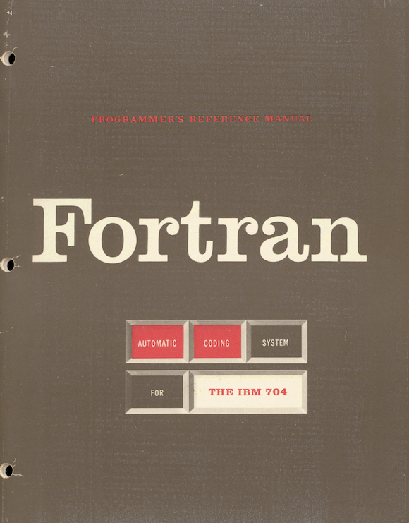
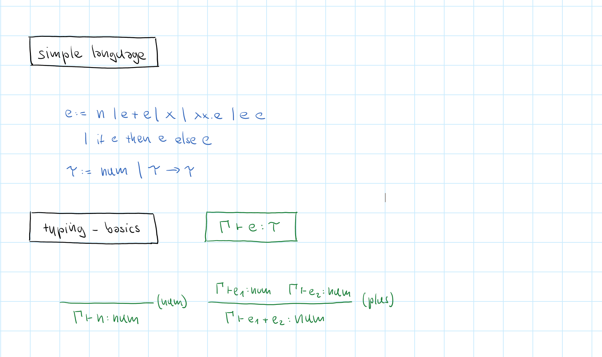
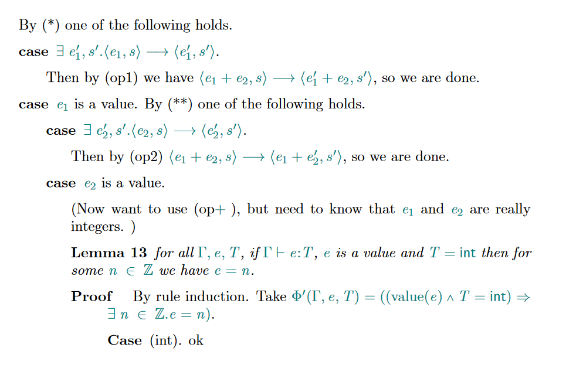

- title: Mathematics and engineering of types | Programming language design (NPRG075)

*****************************************************************************************
- template: title

# NPRG075
## Mathematics and engineering of types

---

**Tomáš Petříček**, 309 (3rd floor)  
_<i class="fa fa-envelope"></i>_ [petricek@d3s.mff.cuni.cz](mailto:petricek@d3s.mff.cuni.cz)  
_<i class="fa-solid fa-circle-right"></i>_ [https://tomasp.net](https://tomasp.net) | [@tomaspetricek](http://twitter.com/tomaspetricek)

**Lectures:** Monday 12:20, S7  
_<i class="fa-solid fa-circle-right"></i>_ https://d3s.mff.cuni.cz/teaching/nprg075

*****************************************************************************************
- template: subtitle

# History
## Where types come from?

-----------------------------------------------------------------------------------------
- template: image
- class: smaller  

# Bertrand Russell

**Use types (1900s) to resolve logical paradoxes**

$p(x)$ true if and only if $\neg x(x)$
But $p(p)$ if and only if $\neg p(p)$

----

Predicate $p$ can be only applied to entities of
lower type hence $p(p)$ is invalid

-----------------------------------------------------------------------------------------
- template: image

# IBM 704 FORTRAN

"Two types of variable are also permissible: fixed point and  
floating point."

-----

**Called "modes" in more formal description!**

Function arguments and results are in one of two modes.

-----------------------------------------------------------------------------------------
- template: image

# COMTRAN, FLOW-MATIC and COBOL

Languages for business data processing

**Built around working with data records**

-----------------------------------------------------------------------------------------
- template: lists
- class: border

# Algol language family

## IAL 58 and Algol 60

- Adopts term "type" before publication
- Used just for primitive numeric types
- No explicit reference to Russell & logic

## Algol 68, Pascal

- Attempts to make business-friendly language
- Add support for records and more
- Mathematical model of "types as sets"

-----------------------------------------------------------------------------------------
- template: image
- class: smaller

# Abstract data types

Clu and Ada in the 1970s

**Type that can be used only through defined operations**

Basis for abstraction, information hiding  
and object-oriented programming

-----------------------------------------------------------------------------------------
- template: icons

# LCF / ML
## Unifying ideas on types

- *fa-square-check* Meta-language for a theorem prover
- *fa-puzzle-piece* Abstract data types to represent theorems
- *fa-not-equal* Type checking using methods of logic
- *fa-table-list* Records and unions for convenience

*****************************************************************************************
- template: subtitle

# Types
## Viewed by different cultures

-----------------------------------------------------------------------------------------
- template: image

# History is messy!

Not just adopting  
logic ideas into programming

Are we even talking about the same thing?

**Think cultures of programming!**

-----------------------------------------------------------------------------------------
- template: content
- class: two-column

# Cultures and types

### *fa-microchip* Hacker

**Types used for checking  
how memory is used**

Fixed and floating point,  
but also data structures

-----

### *fa-divide* Mathematical

**Types used for proving program properties**

Simply typed lambda calculus and safety proofs

-----------------------------------------------------------------------------------------
- template: content
- class: two-column

# Cultures and types

### *fa-archway* Engineering

**Types to support good engineering practices**

Information hiding, editor tooling and documentation

-----

### *fa-user-tie* Management

**Types as a mechanism  
for team structuring**

Division of labor, control programmer access rights

-----------------------------------------------------------------------------------------
- template: largeicons

# Cultural analysis

- *fa-shuttle-space* **Abstract data types in Ada and Clu**  
  Mix of engineering and managerial approaches

- *fa-js fa-brands* **Adding types to JS in TypeScript**  
  Engineering approach, using mathematical ideas

- *fa-magnet* **Type checking in ML, OCaml**  
  Mathematical approach, using engineering ideas

- *fa-rust fa-brands* **Types and ownership in Rust**  
  Mix of hacker and mathematical approaches

*****************************************************************************************
- template: subtitle

# Type systems
## Mathematical look at types

-----------------------------------------------------------------------------------------
- template: icons

# Type systems
## Mathematical look at types

- *fa-square-check* Types as a checking mechanism
- *fa-bolt-lightning* Rule out invalid programs
- *fa-divide* Defined using a formal system
- *fa-arrow-right-arrow-left* Use induction to prove properties

-----------------------------------------------------------------------------------------
- template: content

# Defining a type system

-----------------------------------------------------------------------------------------
- template: content

# Typed lambda calculus

-----------------------------------------------------------------------------------------
- template: icons

# Type systems
## Properties we may want

- *fa-shield-halved* Does it actually prevent bad behaviour?
- *fa-spell-check* Can we check if a program has a given type?
- *fa-hand-sparkles* Can we automatically infer a type?
- *fa-trophy* Does the system assign just one type?

-----------------------------------------------------------------------------------------
- template: content

# Properties, more formally

*****************************************************************************************
- template: subtitle

# Proofs
## Type safety

-----------------------------------------------------------------------------------------
- template: lists
- class: smaller border

# Type safety

## What does it mean

- $5 + (\lambda x.x)$ cannot be reduced!
- Stuck when no evaluation rule applies
- Well-typed programs do not get stuck

## Progress + preservation

- Safety = progress + preservation
- Reduction preserves the type
- Well-typed expression is value or can be reduced

-----------------------------------------------------------------------------------------
- template: content

# Type safety, formally

-----------------------------------------------------------------------------------------
- template: lists
- class: border

# Proofs about types

## What to expect

- Almost always by induction
- Easy with the right property
- Lots of uninspiring cases

## Proofs by induction

- Over the (tree) syntax of the expression
- Over the (tree) typing derivation
- Over the (linear) sequence of reductions

-----------------------------------------------------------------------------------------
- template: content

# Progress proof sketch

-----------------------------------------------------------------------------------------
- template: content

# Preservation proof sketch

*****************************************************************************************
- template: subtitle

# Fancy types
## Interesting type systems

-----------------------------------------------------------------------------------------
- template: subtitle

# Demo
## Control-flow based types

-----------------------------------------------------------------------------------------
- template: content

# Language semantics types

-----------------------------------------------------------------------------------------
- template: content

https://tresnormale.com/collections/philosophers/products/bertrand-russell
https://people.umass.edu/klement/pom/
