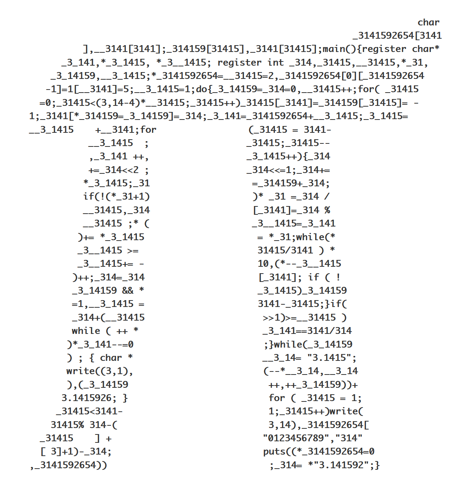

- title: Programming language design (NPRG075)

*****************************************************************************************
- template: title

# NPRG075
## Human-centric language design

---

**Tomáš Petříček**, 309 (3rd floor)  
_<i class="fa fa-envelope"></i>_ [petricek@d3s.mff.cuni.cz](mailto:petricek@d3s.mff.cuni.cz)  
_<i class="fa-solid fa-circle-right"></i>_ [https://tomasp.net](https://tomasp.net) | [@tomaspetricek](http://twitter.com/tomaspetricek)

**Lectures:** Monday 12:20, S7  
_<i class="fa-solid fa-circle-right"></i>_ https://d3s.mff.cuni.cz/teaching/nprg075

*****************************************************************************************
- template: subtitle

# Research methods
## Human-computer interaction

-----------------------------------------------------------------------------------------
- template: image

# Human factors

**Equipment interaction incidents by trained users in World War II**

Design equipment  
to minimize potential for problems

Lab testing and experimental psychology

-----------------------------------------------------------------------------------------
- template: image

# Desktop metaphor

**Created in the  
1970s at Xerox**

Metaphor as a  
design principle

Move from solving problems to building new interfaces

-----------------------------------------------------------------------------------------
- template: image
- class: smaller

# HCI perspective

**Are programming languages user interfaces?**

--------

The means by which the user and a computer system interact (...)

**Shifts focus on users  
and interaction**

-----------------------------------------------------------------------------------------
- template: icons

# Research methods
## What to study and how

- *fa-stopwatch* What is the most effective way of doing X?
- *fa-heart-crack* What mistakes programmers make and why?
- *fa-filter* Can we solve X and Y in a unified way?
- *fa-vr-cardboard* Do systems enable new user experiences?

-----------------------------------------------------------------------------------------
- template: lists
- class: smaller

# Methodological bias

## Hierarchy in science

- Theoreticians over experimentalists
- Everyone knows Einstein's equation
- Nobody Michelson–Morley experiment

## Biases in computing

- Proofs are the most fundamental!
- Can we measure something objective?
- Running a rigorous user experiment?
- All other evaluation is "too soft"!

*****************************************************************************************
- template: subtitle

# Controlled experiments
## Evidence-based language design

-----------------------------------------------------------------------------------------
- template: image

# Evidence-based language design

For each language feature, determine  
the best option experimentally

**How to make user studies as rigorous  
as possible?**

-----------------------------------------------------------------------------------------
- template: lists
- class: smaller

# Randomized controlled trials

## Gold standard in medicine

- Compare treatments or with placebo
- Random allocation of participants
- Blinding and study pre-registration

## Limitations of RCTs

- Very hard to do properly
- Answers only very limited questions
- Even this may not be rigorous enough!

-----------------------------------------------------------------------------------------
- template: content
- class: randomo

# Case study: Perl vs. Randomo

An Empirical Investigation into Programming Language Syntax (Steffik, Siebert, 2013)

-----------------------------------------------------------------------------------------
- template: lists

# Getting it right

## Study setup

- Copy and modify code sample
- Never programmed before
- Age, gender, language balance

## Statistical evaluation

- Verified manual rating of accuracy
- Mauchly's sphericity test
- Repeated-measures ANOVA test

-----------------------------------------------------------------------------------------
- template: image
- class: noborder smaller

# Perl vs. Randomo

While users of Quorum were able to program statistically significantly more
accurately than users of Perl (p = .047), and users of Randomo (p = .004),
Perl users were not able to program significantly more accurately than Randomo users (p = .458).

-----------------------------------------------------------------------------------------
- template: icons

# Experiments
## Studying languages experimentally

- *fa-not-equal* Typing discipline, syntax, errors, inheritance
- *fa-shield-halved* Compare two structurally similar alternatives
- *fa-users* Study participants with similar backgrounds
- *fa-puzzle-piece* Does not help with fundamentally new designs

-----------------------------------------------------------------------------------------
- template: image
- class: smaller

# Does strong typing matter?

"[It] appear[s] that "strong typing is modestly better
than weak typing, and among functional languages, static
typing is also somewhat better than dynamic typing.""

-----------------------------------------------------------------------------------------
- template: image

# Does strong typing matter?

**Attempt to reproduce the study mostly failed**

"I believe [it does] in my heart of hearts, but it's kind of an impossible experiment to run."

*****************************************************************************************
- template: subtitle

# xx
## against

-----------------------------------------------------------------------------------------
- template: content

AGAINST
  Buxton's 3 points about past examples
  Buxton's look at other disciplines
  Olsen

EXAMPLE
  The Gamma
  QR: https://people.cs.uchicago.edu/~brianhempel/Evaluating%20User%20Interface%20Systems%20Research%20-%20Graphical%20Summary.pdf

---

  Evaluating toolkits
  - Demonstrations (c.f. mother of all demos)
  - Heuristics
  - Usage (a/b, etc.)
  - Technical characteristics

  Sketch-n-sketch - case studies, mustard watch
  http://girard.perso.math.cnrs.fr/mustard/page2.html
  Varv

  Demo or die

-----------------------------------------------------------------------------------------
- template: content

x

- https://queue.acm.org/detail.cfm?id=1071731
- norman https://www.basicbooks.com/titles/don-norman/the-design-of-everyday-things/9780465050659/
- hacking https://www.cambridge.org/en/academic/subjects/philosophy/philosophy-science/representing-and-intervening-introductory-topics-philosophy-natural-science
- steffik https://www.vidarholen.net/~vidar/An_Empirical_Investigation_into_Programming_Language_Syntax.pdf
- study https://web.cs.ucdavis.edu/~filkov/papers/lang_github.pdf
- boffins https://arxiv.org/pdf/1901.10220.pdf
