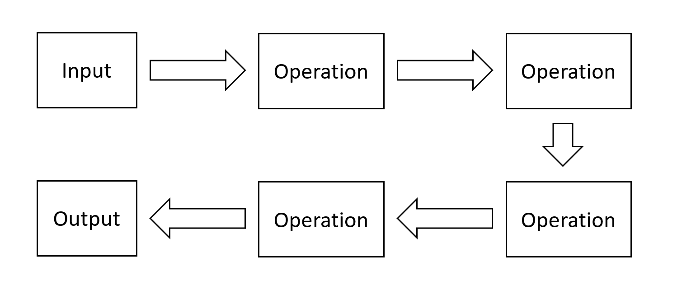

- title : Software Development: Large software architectures
- description : Software Development: Large software architectures
- author : Tomas Petricek
- theme : simple
- transition : none

****************************************************************************************************

# **CO559: Software Development**  Large software architectures

  
   

**Tomas Petricek**

email: [t.petricek@kent.ac.uk](mailto:t.petricek@kent.ac.uk) 
twitter: [@tomaspetricek](http://twitter.com/tomaspetricek) 
office: [S129A](https://www.cs.kent.ac.uk/rooms/S129A.gif) 

****************************************************************************************************
- class: part

# **Software Architecture**

----------------------------------------------------------------------------------------------------

**Software Architecture**

Planning a system before it is built

High-level overview of components

----------------------------------------------------------------------------------------------------

**Christopher Alexander**

A Quality   
Without a Name

_Feeling of satisfaction and contentment engendered by good building_

----------------------------------------------------------------------------------------------------

# Design patterns

**Gang of Four Patterns**

 - _Solutions to common problems_
 - _Specific small-scale scenarios_
 - _Workarounds for Java limitations_

**Beyond Gang of Four**

 - _Balancing of design forces_
 - _Quality without a name_
 - _Architectural patterns/styles_

----------------------------------------------------------------------------------------------------

**Architectural style**

How you approach the problem?

_Form follows function ideal of modernism_

----------------------------------------------------------------------------------------------------

# Architectural patterns

### Thinking about large software systems

_<i class="fa fa-cubes"></i> How is system divided into components?_

_<i class="fa fa-users"></i> How is development divided into teams?_

_<i class="fa fa-comment"></i> How components communicate with each other?_

_<i class="fa fa-code"></i> Styles do not prescribe specific implementation!_

****************************************************************************************************
- class: part

# **Component architectures**

----------------------------------------------------------------------------------------------------

# Component architectures

### What are the components & how they communicate

_<i class="fa fa-cubes"></i> How is the problem divided into component?_

_<i class="fa fa-project-diagram"></i> What components talk to what other components?_

_<i class="fa fa-magic"></i> How is the communication set-up?_

_<i class="fa fa-keyboard"></i> What teams work on what parts of the system?_

----------------------------------------------------------------------------------------------------

**Layered architecture**

Components in several layers

_Can only call components from one layer below!_

----------------------------------------------------------------------------------------------------

# Layered architectures

### Typical use cases for the pattern

_<i class="fa fa-cogs"></i>_ Operating system _with kernel, system, user processes_

_<i class="fa fa-layer-group"></i>_ Enterprise _with presentation, business & persistence_

_<i class="fa fa-file"></i>_ Web apps _with web page, server and database_

_<i class="fa fa-project-diagram"></i>_ Network stack _TCP/IP protocol and such_

----------------------------------------------------------------------------------------------------

# Layered architecture

**Potential advantages**

 - _Can replace individual layers_
 - _Layers need only limited info_
 - _Can be built independently_

**Potential problems**

 - _May lead to inefficient systems_
 - _Changes may be hard to make_

----------------------------------------------------------------------------------------------------

**Three-tier architecture**

_Client-side code_  
_Server-side code_  
_Database_

Communication over network  

Different langua- ges in each layer

----------------------------------------------------------------------------------------------------

**Service-oriented architecture**

Services that call each other

_Different services implement different functionality_

----------------------------------------------------------------------------------------------------

# Service-oriented architectures

### Services in a sample retail system

_<i class="fa fa-box"></i> Order management service to take orders_

_<i class="fa fa-industry"></i> Warehouse management service to manage stock_

_<i class="fa fa-car"></i> Shipping service to handle delivery_

_<i class="fa fa-user"></i> Customer relationship service for communication_

----------------------------------------------------------------------------------------------------

# Service-oriented architectures

**Implementing SOA**

 - _Service description_
 - _Service discovery_
 - _Service deployment_

**Pros and cons**

 - _Separation of logic and teams_
 - _Can get heavy-weight and complex_

----------------------------------------------------------------------------------------------------

# Microservices

### A more modern take on service-orientation

_<i class="fa fa-puzzle-piece"></i> Simpler communication via REST_

_<i class="fa fa-font"></i> Each service can use different language_

_<i class="fa fa-database"></i> Still need discovery and message queues_

_<i class="fa fa-cloud"></i> Can use auto-scaling in cloud (Kubernetes etc.)_

----------------------------------------------------------------------------------------------------

# Publish subscribe pattern

**Information exchange**

- _Who needs to be called?_
- Publish _events to anyone_
- Subscribe _by category or type_

**Application areas**

- _Information exchange in finance systems_
- _RSS feeds for blogs & news_
- _Anything aiming for large extensibility_

****************************************************************************************************
- class: part

# **Information management**

----------------------------------------------------------------------------------------------------

# Information management

### How can information be managed & stored?

_<i class="fa fa-cogs"></i> How to pass information in complex processing?_

_<i class="fa fa-chalkboard"></i> How to facilitate efficient sharing?_

_<i class="fa fa-clock"></i> What component can access what information when?_

_<i class="fa fa-ban"></i> How to avoid losing information on error?_

----------------------------------------------------------------------------------------------------

**Pipeline architecture**

Data processed in a sequence of steps

_Think UNIX pipelines!_

_Data science and scientific computing_

----------------------------------------------------------------------------------------------------

# Pipeline architecture

**Potential benefits**

- _Small composable blocks_
- _Different ways of connecting_
- _Easy to add more tools_

**Open questions**

- _Format of data passed in between_
- _UNIX shell vs. Microsoft PowerShell_
- _Works if data is of a same kind_

----------------------------------------------------------------------------------------------------

**Blackboard architecture**

Data shared globally

_Many different processors can access and transform it_

For example, analysing natural language

----------------------------------------------------------------------------------------------------

# Pipeline architecture

**Implementation**

- _Choosing common data representation_
- _Resolving conflicting solutions_
- _Component implementation_

**Application areas**

- _There is no complete solution_
- _Natural language processing_
- _Classic AI like expert systems_

----------------------------------------------------------------------------------------------------

**Event sourcing architecture**

_Any action in the application is an event_

Store events,   
not final state!

_Banking systems that cannot lose data_

----------------------------------------------------------------------------------------------------

# Event sourcing architecture

**Implementation**

- _Suitable event representation_
- _Event store to keep events_
- _`State * Event -> State` function_

**Application areas**

- _Financial software systems_
- _Functional programming (fold)_
- _Reactive programming (Elm language)_

****************************************************************************************************
- class: part

# **Summary**

----------------------------------------------------------------------------------------------------

# Large software architectures

**Software architecture and patterns**  
_Seeking quality without a name_  
_Gang of Four patterns and beyond_  

**Component-based architectures**  
_Layers and three-tier web applications_  
_From services to microservices_

**Information-oriented architectures**  
_Pipeline in UNIX and Blackboard in AI_  
_Event-sourcing architecture for reliability_

----------------------------------------------------------------------------------------------------

# CO559: Large software architectures

**What you should remember from this lecture**

 - Different architectural patterns discussed
 - Microservice are widely used today!
 - Event sourcing is great in certain areas!

 
 

Tomas Petricek 
_[t.petricek@kent.ac.uk](mailto:t.petricek@kent.ac.uk) | [@tomaspetricek](http://twitter.com/tomaspetricek)_

****************************************************************************************************
 - class: part

# **References**

----------------------------------------------------------------------------------------------------

**Books**

 - Richard P. Gabriel (1996) [Patterns of Software](https://www.dreamsongs.com/Files/PatternsOfSoftware.pdf)
 - Frank Buschmann et al. (1996) [Patterns-Oriented Software Architecture, vol 1](https://www.oreilly.com/library/view/pattern-oriented-software-architecture/9781118725269/)
