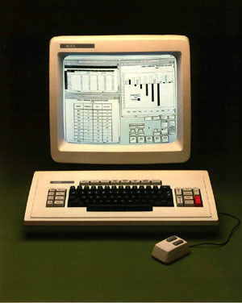

- title : Software Engineering: Living with errors
- description : Software Engineering: Living with errors
- author : Tomas Petricek
- theme : simple
- transition : none

****************************************************************************************************

# **CO559: Software Engineering**<br/> Living with errors

<br /><br />
<br /><br /><br />

**Tomas Petricek**

email: [t.petricek@kent.ac.uk](mailto:t.petricek@kent.ac.uk)<br />
twitter: [@tomaspetricek](http://twitter.com/tomaspetricek)<br />
office: [S129A](https://www.cs.kent.ac.uk/rooms/S129A.gif)<br />

****************************************************************************************************
- class: part

# **Trivial problem or a crisis**

---------------------------------------------------------------------------------------------------

# The birth of a crisis


**Programming is trivial**

 - _Charles Babbage (19th century)_
 - _ENIAC designers (1940s)_

<div class="fragment">

**The birth of a crisis**

 - _Labour crisis (1950s)_
 - _NATO conference (1968)_
 - _Application crisis (1990s)_

---------------------------------------------------------------------------------------------------


Software industry paradox (Ensmenger, 2010)

_How can we explain the [seemingly perpetual] crisis<br />
in what is considered one of the most successful and<br />
profitable industries of all time?_

----------------------------------------------------------------------------------------------------


**How did software  
get reliable?**

<div class="fragment">

Combination of good engineering practices

_Management_  
_Testing_  
_Debugging_  
_Over-engineering_

</div>

---------------------------------------------------------------------------------------------------


Learning to live with errors

_Over time, software engineers developed a range of practical approaches for coping with errors._

----------------------------------------------------------------------------------------------------

# Living with errors (1/2)



**Depends on application domain**

 - _What happens if it goes wrong?_
 - _Is human around to help?_
 - _How quickly do we need the system?_

<div class="fragment">

**Business computing**

 - _Failure costs some money, but not lives_
 - _Balance between correctness and delivery time_
 - _Methods need to support teamwork_

</div>

----------------------------------------------------------------------------------------------------

# Living with errors (2/2)


**Telecommunications**

 - _Hardware errors will happen_
 - _System should recover if possible_
 - _Redundancy can be built-in_

<div class="fragment">

**Computer art**

 - _No lives or money is threatened_
 - _Error as a source of creativity_
 - _Human may find ways to incorporate errors_

</div>

****************************************************************************************************
- class: part

# **Different kinds of errors**

---------------------------------------------------------------------------------------------------

# How did it happen

**<i class="fa fa-map"></i> Mistake** - following a wrong plan  
_This logic is not actually going to sort a list_

**<i class="fa fa-hand-spock"></i>Failure** - error in translation from plan to reality   
_My algorithm is correct, but I implemented it poorly_

**<i class="fa fa-coffee"></i> Slip** - mechanical error when implementing code  
_Syntax error or off by one error in array access_

**<i class="fa fa-calculator"></i> Malfunction** - hardware failures   
_Wrong data received in network communication_

----------------------------------------------------------------------------------------------------


**When do we find out?**

<div class="fragment">

Static error _- when developing the software_

</div><div class="fragment">

Immediate runtime error  
_right when it occurs_

</div><div class="fragment">

Latent runtime error  
_sometime after it occurs_

</div>

----------------------------------------------------------------------------------------------------


What can go wrong when executing a sub-routine?

<div style="padding-top:10px" class="fragment">

**Output error** - _no way of producing valid result  
e.g. file does not exist_

</div>
<div class="fragment">

**Input error** - _operation cannot be done because the inputs are wrong!_

</div>

----------------------------------------------------------------------------------------------------

# Runtime errors technically

**Input error** - _no character at index 99_

```javascript
"hello world".charAt(99)
```

**Input error** - _`null` always represents invalid value_

```javascript
"hello world".replace("world", null)
```

**Output error** - _there's no valid result if file doesn't exist_

```javascript
fs.readFile("c:/temp/non-existent.txt")
```

****************************************************************************************************
- class: part

# **Engineering approach**

----------------------------------------------------------------------------------------------------

# Engineering approach to errors


**Errors are inevitable**

 - _Programmers are just humans_
 - _Cannot possibly check everything_
 - _Time and budget are limited_

<div class="fragment">

**Good practices**

 - _Do not assume errors will not happen_
 - _Make it easy to find out what's wrong_

</div>

----------------------------------------------------------------------------------------------------

# Indicating erroneous situations


**Two ways of indicating errors**

 - Error code - _return `null` or `-1`_
 - Exception - _throw Java exception etc._

<div class="fragment">

**Why modern systems prefer exceptions?**

 - _Cannot be confused with valid result_
 - _They propagate automatically_
 - _Their name explains the reason for error_

---------------------------------------------------------------------------------------------------

# Three ways of handling bad inputs (1/3)

<div class="fragment">

**Ignore bad inputs** _- assume that input is valid_

```javascript
function niceName(name) {
  return name[0].toUpperCase() + name.substr(1);
}
```

</div>
<div class="fragment" style="padding-top:10px">

When will this function not work?

</div>
<div class="fragment">

_The function will fail if `name` is `null`_  
_The function will fail if `name` is empty string_

</div>

---------------------------------------------------------------------------------------------------

# Three ways of handling bad inputs (2/3)

**Recover from bad inputs** _- try to do the best you can_

```javascript
function niceName(name) {
  if (!name || name.length == 0) return "";
  else return name[0].toUpperCase() + name.substr(1);
}
```

<div class="fragment" style="padding-top:10px">

What happens for bad inputs?

_You get an empty name as the result_  
_Is this what you want? It depends..._

</div>

---------------------------------------------------------------------------------------------------

# Three ways of handling bad inputs (3/3)

**Fail when input is bad** _- terminate execution immediately_

```javascript
function niceName(name) {
  if (!name) throw "Name cannot be null"
  if (name.length == 0) throw "Name cannot be empty"
  return name[0].toUpperCase() + name.substr(1);
}
```

<div class="fragment" style="padding-top:10px">

Terminating execution immediately

_Most languages support throwing exceptions_  
_Exception to indicate what was wrong with input_

</div>


---------------------------------------------------------------------------------------------------

# Three ways of handling bad inputs

**Ignore bad inputs**  
_Simple code, but unexpected things may happen_  
_Good enough for local helper functions_

**Recover from bad inputs**  
_Default behaviour may cause serious error later_  
_Good if imperfect result is better than no result_

**Fail when input is bad**  
_Stops execution, but tells you what to fix_  
_Good for public functions called by others_

---------------------------------------------------------------------------------------------------

# Defensive programming

### "Better safe than sorry" programming

_<i class="fa fa-user-secret"></i> Assume that your code might not be called correctly_

_<i class="fa fa-shield-alt"></i> Protect your code by throwing for bad inputs_

_<i class="fa fa-lock"></i> Use extra security measures in low-level code_

_<i class="fa fa-search"></i> Check for `null` values explicitly_

****************************************************************************************************
- class: part

# **Four more approaches**

----------------------------------------------------------------------------------------------------

# Test-based engineering approach


**Prevent errors using tests**

 - _Tests as a method for checking correctness_
 - _Tests as a light-weight specification_

<div class="fragment">

### Testing in practice

 - _Test that we get correct results for sample inputs_
 - _Test expected behaviour for bad inputs_
 - _Test-driven development and writing tests first_
 - _Write tests for known past issues_

</div>

----------------------------------------------------------------------------------------------------

# Mathematical approach


**Prove programs correct**

_Testing can only prove presence of bugs, not their absence.
Rather than testing, we should prove programs correct._

<div class="fragment">

### Mathematical approach in practice

 - _Use_ types _to specify correct behaviour_
 - _More precise types to capture, e.g. non-nullability_
 - _Verification tools for critical software_

</div>

----------------------------------------------------------------------------------------------------

# Recovery-based engineering approach


**The kill-yourself strategy**

_When the process does not know how to react,
it should kill itself and let someone else deal with it._

<div class="fragment">

### Error handling in Erlang

 - _Program consists of many small processes_
 - _Processes communicate via messages_
 - _Supervisor processes handle failures_

</div>

----------------------------------------------------------------------------------------------------

# Artistic approach


_In live coded music performance, there are no errors. Only more or less appropriate
sounds. An error might be a source for creativity._

<div class="fragment">

### Is this just for artists?

 - _Any system with live human involvement_
 - _Exploratory data science process_
 - _Writing live systems to process data_

</div>

****************************************************************************************************
- class: part

# **Summary**

----------------------------------------------------------------------------------------------------

# Living with errors

**History, context and types of errors**  
_Mistakes, failures, slips and malfunctions_  
_Input errors and output errors_

**Engineering approach to error handling**  
_Representing using error codes and exceptions_  
_Three ways of handling bad inputs_

**Four more approaches to error handling**  
_Mathematical proofs and engineering tests_  
_Recovery in telecom and acceptance in art_

----------------------------------------------------------------------------------------------------

# CO559: Living with errors

**What you should remember from this lecture**

 - Appropriate approaches in different contexts
 - Different kinds of errors based on why, how and what
 - Ways of handling errors and mechanisms

<br />
<br />

Tomas Petricek<br />
_[t.petricek@kent.ac.uk](mailto:t.petricek@kent.ac.uk) | [@tomaspetricek](http://twitter.com/tomaspetricek)_

****************************************************************************************************
 - class: part

# **References**

----------------------------------------------------------------------------------------------------

**Selected chapters from books**

 - [Code Complete: A Practical Handbook   
   of Software Construction](https://amzn.to/2BMkEgJ)
 - [Computer boys take over](https://mitpress.mit.edu/books/computer-boys-take-over)

**Papers and articles**

 - [Miscomputation in software:  
   Learning to live with errors](http://programming-journal.org/2017/1/14/)
 - [Exception Handling: Issues and a Proposed Notation](https://web.eecs.umich.edu/~weimerw/2006-615/reading/goodenough-exceptions.pdf)
