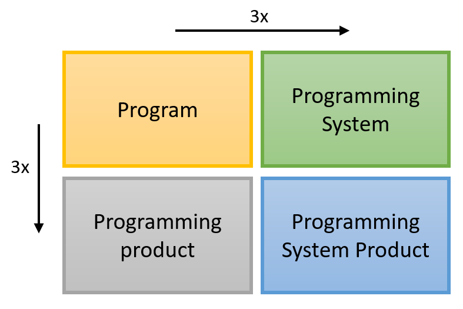
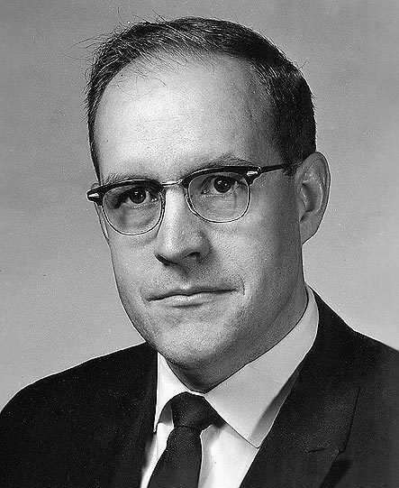
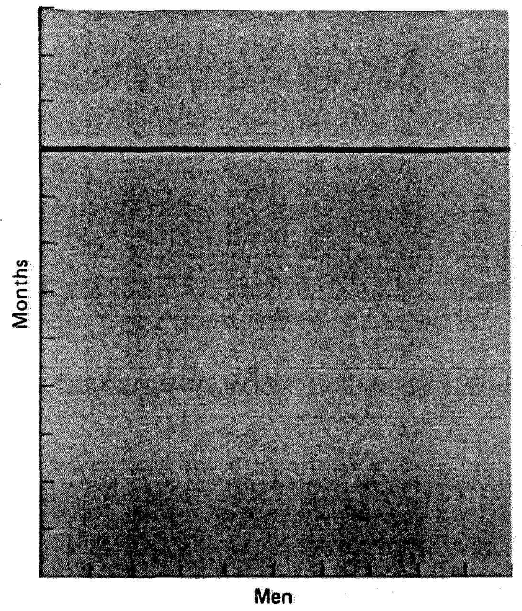
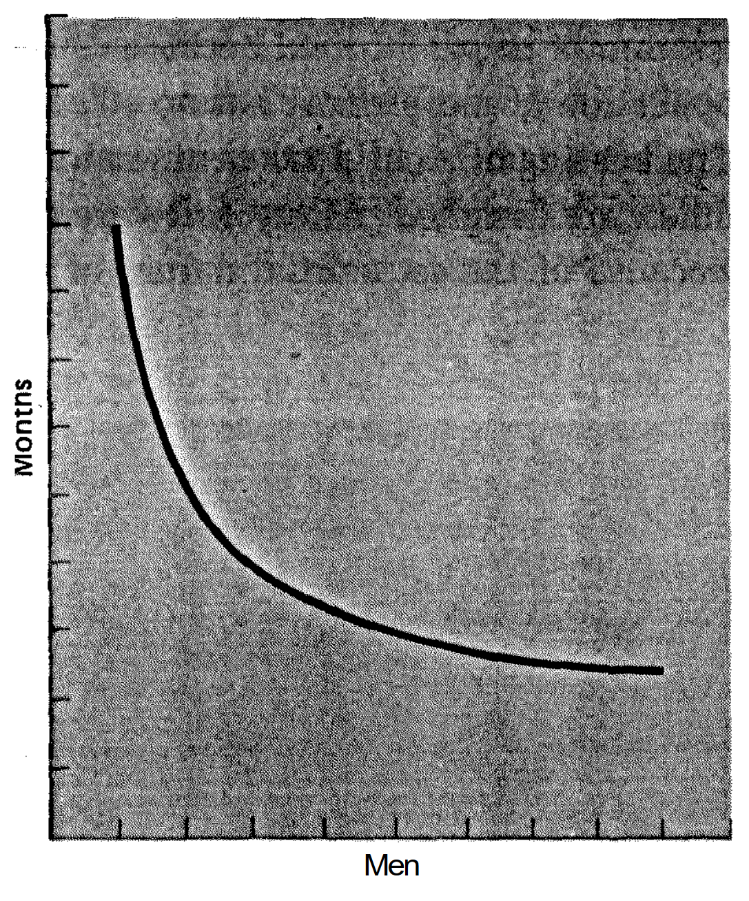

- title : Software Development: Software engineering principles
- description : Software Development: Software engineering principles
- author : Tomas Petricek
- theme : simple
- transition : none

****************************************************************************************************

# **CO559: Software Development**  Software engineering principles

  
   

**Tomas Petricek**

email: [t.petricek@kent.ac.uk](mailto:t.petricek@kent.ac.uk) 
twitter: [@tomaspetricek](http://twitter.com/tomaspetricek) 
office: [S129A](https://www.cs.kent.ac.uk/rooms/S129A.gif) 

****************************************************************************************************
- class: part

# **Motivation**

----------------------------------------------------------------------------------------------------

**Fundamental knowledge**

_What knowledge about software will remain  
relevant in 100 years?_

----------------------------------------------------------------------------------------------------

# Fundamental software engineering knowledge

**The halting problem**

_It is impossible to give a program  
$\Theta$ that, for any other program $p$
decides whether $p$ terminates or not._

**Software engineering**

 - _What is impossible to build?_
 - _Not a formal mathematical problem_
 - _Can we say anything certain at all?_

----------------------------------------------------------------------------------------------------

**Historically situated knowledge**

_Learning from  
the successes and the failures  
of the past_

----------------------------------------------------------------------------------------------------

**Learning from other disciplines**

_Is software engineering like real engineering, writing or urban planning?_

****************************************************************************************************
- class: part

# **Complexity**

----------------------------------------------------------------------------------------------------

**What is more complex software system to build?**

<table><tr>
<td>

_Chess engine that can consistently win against grandmasters?_

</td><td>

_Accounting system that calculates and pay VAT in UK and France?_

</td>
</tr></table>

----------------------------------------------------------------------------------------------------

**IBM System/360**

_OS for a very wide  
range of IBM machines_

_Led by Fred Brooks_

**Mythical Man-Month**

_Reflections on its  
problematic history_

----------------------------------------------------------------------------------------------------

Product  
_General, debugged, tested_

System  
_Set of compatible tools_

**Principle #1**  
_Building programming systems product is 10x harder  than building a program_

----------------------------------------------------------------------------------------------------

# Sources of software complexity

**No Silver Bullet (Brooks, 1986)**

_Much of the complexity [software engineer] must master is arbitrary
complexity, forced without rhyme or reason by the many human
institutions and systems to which his interfaces must confirm._

----------------------------------------------------------------------------------------------------

# No silver bullet (Brooks, 1986)

**Essential complexity**

 - _Large with no two parts alike_
 - _Complexity of logic is essential_
 - _Non-linear nature of software_

**Accidental complexity**

 - _Imperfect programming tools_
 - _Unless this is more than 9/10, order  
   of magnitude improvement is impossible_

----------------------------------------------------------------------------------------------------

**Principle #2**

_There is no single development, in either technology or management technique, which by
itself promises even one  order-of-magnitude improvement within a decade in productivity,
in reliability, in simplicity._

****************************************************************************************************
- class: part

# **Manpower**

----------------------------------------------------------------------------------------------------

**IBM System/360**

Significantly over budget  
_But it did not destroy IBM_

Significantly delayed  
_But it shipped eventually_

IBM hired more programmers  
_But it did not help_

----------------------------------------------------------------------------------------------------

**Unpartionable work**
_Takes the same time regardless of number of people_

**Perfectly partionable**
_Time decreases with number of people $t=w/n$_

----------------------------------------------------------------------------------------------------

 

**Requiring communication**  
_Workers need to coordinate and be trained $t=(w+k)/n$_

**Complex task**  
_Each worker needs to coordinate with each other $t=w/n + k*n*(n-1)$_

----------------------------------------------------------------------------------------------------

**Principle #3**

_Adding manpower to a late software project makes it later._

----------------------------------------------------------------------------------------------------

# Further sources of complexity

### We do not even know what software should do!

_<i class="fa fa-book"></i> Every problem is unique with little repetition_

_<i class="fa fa-book"></i> There might not be a stopping rule_

_<i class="fa fa-book"></i> Solutions are not right or wrong_

_<i class="fa fa-book"></i> Social scientists call this Wicked Problems_

****************************************************************************************************
- class: part

# **Cures**

----------------------------------------------------------------------------------------------------

# Mythical Man-Month

**Second system effect**

_This second is the most dangerous system a man ever designs_

**Throw one away**

_The first system may be too slow, too big, awkward to use, or all three._

----------------------------------------------------------------------------------------------------

# No silver bullet (Brooks, 1986)

**Buy versus build**

 - _The most radical solution for constructing software is not to construct it at all._
 - _Can I use off-the-shelf solution?_

**Do we buy rather than build?**

 - _Nobody builds their own database_
 - _Many tasks done using spreadsheets_
 - _Still, no silver bullet!_

----------------------------------------------------------------------------------------------------

# Information hiding

### Should all information be hidden or exposed?

_<i class="fa fa-film"></i>_ Brooks (1975) - _Regular info updates (microfiche!)_

_<i class="fa fa-box"></i>_ Parnas (1972) - _Modules should hide their internals_

_<i class="fa fa-envelope-open"></i>_ OSS (1980s) - _All source code should be available_

----------------------------------------------------------------------------------------------------

**Conceptual coherence**

_Simplicity proceeds from conceptual integrity. Every part must
reflect the same philosophies and the same balancing of desiderata._

_Conceptual integrity dictates that the design must proceed
from one mind, or very small number of agreeing minds._

****************************************************************************************************
- class: part

# **Summary**

----------------------------------------------------------------------------------------------------

# Software Engineering principles

**Principle #1**  
_Building a programming systems product_  
_is ten times harder than building a program_

**Principle #2**  
_No single development will lead to order-of-magnitude_  
_improvement in productivity and reliability_  

**Principle #3**  
_Adding manpower to a late software project makes it later._

----------------------------------------------------------------------------------------------------

# CO559: Software Engineering principles

**What you should remember from this lecture**

 - Three principles of software engineering
 - Essential and accidental complexity
 - What can be done about it

 
 

Tomas Petricek 
_[t.petricek@kent.ac.uk](mailto:t.petricek@kent.ac.uk) | [@tomaspetricek](http://twitter.com/tomaspetricek)_

****************************************************************************************************
 - class: part

# **References**

----------------------------------------------------------------------------------------------------

**Books and papers**

 - Rebecca Slayton (2013). [Arguments that count](https://mitpress.mit.edu/books/arguments-count)
 - Nathan Ensmenger (2010). [Computer boys take over](https://mitpress.mit.edu/books/computer-boys-take-over)
 - Fred Brooks (1975). [The mythical man-month](https://www.amazon.co.uk/Mythical-Man-Month-Software-Engineering-Anniversary/dp/0201835959)
 - Steve McConnell (1993). [Code Complete: A Practical Handbook of Software Construction](https://amzn.to/2BMkEgJ)
 - David Parnas (1985). [Software aspects of strategic defence systems](https://web.stanford.edu/class/cs99r/readings/parnas1.pdf)
