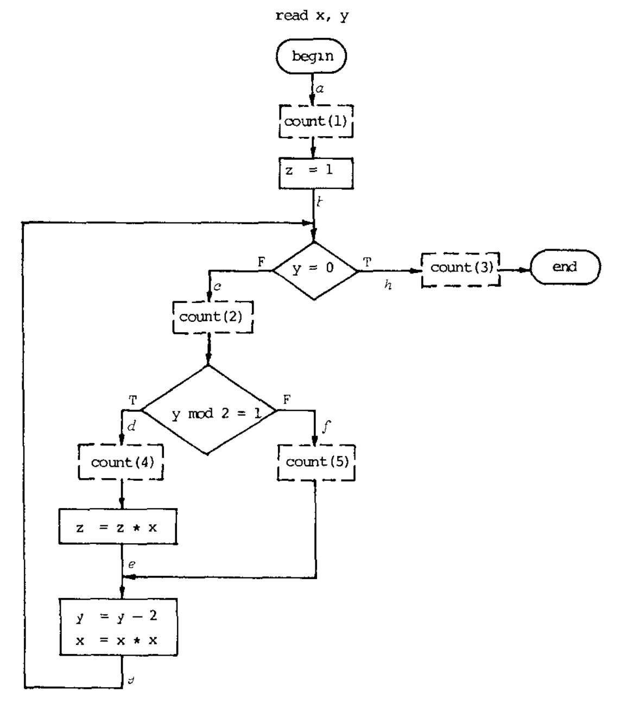
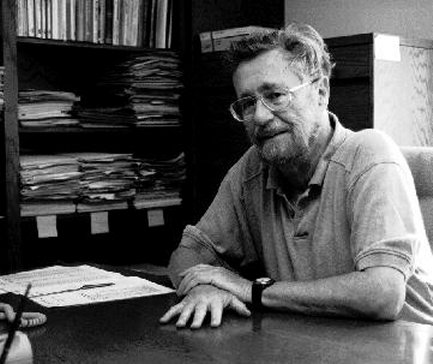

- title : Software Development: Testing tools
- description : Software Development: Testing tools
- author : Tomas Petricek
- theme : simple
- transition : none

****************************************************************************************************

# **CO559: Software Development**  Testing tools

  
   

**Tomas Petricek**

email: [t.petricek@kent.ac.uk](mailto:t.petricek@kent.ac.uk) 
twitter: [@tomaspetricek](http://twitter.com/tomaspetricek) 
office: [S129A](https://www.cs.kent.ac.uk/rooms/S129A.gif) 

****************************************************************************************************
- class: part

# **A brief history of testing**

---------------------------------------------------------------------------------------------------

**Debugging-oriented period** (circa 1940s-1956)

Program checkout involves debugging or testing

_Interpretative checking routines and post-  
mortem dumps_

---------------------------------------------------------------------------------------------------

**Demonstration-oriented period** (1957-1978)

Testing to show program correctness

_Last step in the Waterfall methodology_

_Can we exhaustively  
cover all cases?_

---------------------------------------------------------------------------------------------------

**Destruction-oriented period** (1979-1980s)

Program testing can be used to show the
presence of bugs, but never to show their absence _(Dijkstra, 1970)_

_Professional testers focus on finding bugs through tests._

---------------------------------------------------------------------------------------------------

**Evaluation-oriented period** (1980s-now)

Testing as measurable part of development process

_New theories and tools to support testing_

****************************************************************************************************
- class: part

# **Unit testing**

----------------------------------------------------------------------------------------------------

# How and why of unit testing

**Tests for ensuring quality**

 - _Unit tests to prevent regressions_
 - _Write tests after you write code_
 - _Continuous integration to run tests_

**Tests as a feedback mechanism**

 - _Write tests before you write code_
 - _Tests are a lightweight specification_
 - _Command line or automatic runners_

----------------------------------------------------------------------------------------------------

    [lang=csharp]
    @Test
    public void testHello() {
      String name = "Tomas";
      Greeter g = new Greeter(name);
      String expected = "Hi Tomas";
      String actual = g.greet();
      assertEquals(expected, actual);
    }

**Writing Java tests with JUnit**

_Write `@Test` methods and `assertEqual` to check results._

_Run tests from Eclipse or terminal using Maven_

----------------------------------------------------------------------------------------------------

# Beyond simple tests

### Unit testing and general testing concerns

_<i class="fa fa-bolt"></i> Unit tests are just one, easy to automate kind_

_<i class="fa fa-code"></i> How to structure code to make testing easy?_

_<i class="fa fa-mouse-pointer"></i> How to test not just functions, but user interfaces_

_<i class="fa fa-divide"></i> Property testing to specify more than one case_

----------------------------------------------------------------------------------------------------
- class: part

# **Demo**: Writing simple unit tests

****************************************************************************************************
- class: part

# **Test-driven development**

---------------------------------------------------------------------------------------------------

# Test-driven development (TDD)

**Development methodology**

 - _eXtreme programming practice_
 - _Appeal of a scientific method_

**TDD in practice**

 - _Write tests to capture requirements_
 - _Implement code satisfying tests_
 - _Run tests automatically and frequently_

----------------------------------------------------------------------------------------------------

# Test-driven development

**Red-Green-Refactor**

- Red _- Add failing test for new unimplemented feature_
- Green _- Make it pass using whatever hacks you need_
- Refactor _- Improve quality  without breaking it_

----------------------------------------------------------------------------------------------------

# Test-driven development

### Beyond the basic ideas

_<i class="fa fa-fire-extinguisher"></i> Originated in dynamic languages_

_<i class="fa fa-crosshairs"></i> Active tests vs. types debate!_

_<i class="fa fa-file-alt"></i> Tests as executable user stories (BDD)_

_<i class="fa fa-question-circle"></i> Do people really write tests first?_

****************************************************************************************************
- class: part

# **Advanced testing concepts**

----------------------------------------------------------------------------------------------------

# Writing testable code

**Structuring program logic**

 - _Check output for given input_
 - _But what if it writes to a file?_
 - _Indirection via interfaces!_

**Mocking frameworks**

 - _Don't want to implement full interface_
 - _Just check it is called correctly!_
 - _Create and check using "mock" objects_

----------------------------------------------------------------------------------------------------

    [lang=csharp]
    @Test
    public void testQuery()  {
      Database db =
        mock(Database.class);
      when(db.getUniqueId())
        .thenReturn(42);

      Service s = new Service(db);
      assertEquals(s.toString(),
        "Using database ID 42");
    }

**Using the Java Mockito mocking framework**

_Create object using `mock`_

_Configure its returns using `when` and `thenReturn`_

Use it as a normal object!

----------------------------------------------------------------------------------------------------

# Random testing

**How to cover all cases**

 - _Testing is never exhaustive_
 - _Use insights about code!_
 - _Generate tests semi-randomly!_

**Random testing**

 - _Specify property about code_
 - _Should hold for any inputs_
 - _Generate inputs randomly!_

----------------------------------------------------------------------------------------------------

    [lang=csharp]
    @Property
    boolean stringContainsChar(
      @ForAll String input,
      ForAll @IntRange(min=0, max=9)
        int i
    ) {          
      return (input.size() < i) ||
        input.contains
          (input.substring(i, i+1))
    }

**Using the jqwik tool**

_Mark method as a `@Property`_

_Annotate arguments to specify input ranges_

_Return `true` if the  
property holds!_

----------------------------------------------------------------------------------------------------

# Random testing

### How to come up with good properties

_<i class="fa fa-star"></i> Use simpler working implementation (oracle)_

_<i class="fa fa-equals"></i> Use mathematical property (e.g., average)_

_<i class="fa fa-book"></i> Check for more basic facts_

_<i class="fa fa-circle"></i> Algebraic properties like associativity_

****************************************************************************************************
- class: part

# **Summary**

----------------------------------------------------------------------------------------------------

# Testing tools

**Brief history of testing**  
_Debugging-oriented, demonstration-oriented_  
_destruction-oriented & evaluation-oriented_

**Unit testing and tools**  
_Unit testing library, test runners,_  
_tools for mocking and random testing_

**Test-driven development**  
_"Scientific" XP development methodology_  
_Done through the red-green-refactor cycle_

----------------------------------------------------------------------------------------------------

# CO559: Testing tools

**What you should remember from this lecture**

 - Test-driven development
 - What is a mock and how to create one
 - Come up with properties for random testing

 
 

Tomas Petricek 
_[t.petricek@kent.ac.uk](mailto:t.petricek@kent.ac.uk) | [@tomaspetricek](http://twitter.com/tomaspetricek)_

****************************************************************************************************
 - class: part

# **References**

----------------------------------------------------------------------------------------------------

**Papers and articles**

 - [The growth of software testing (1988)](https://dl.acm.org/doi/abs/10.1145/62959.62965)
