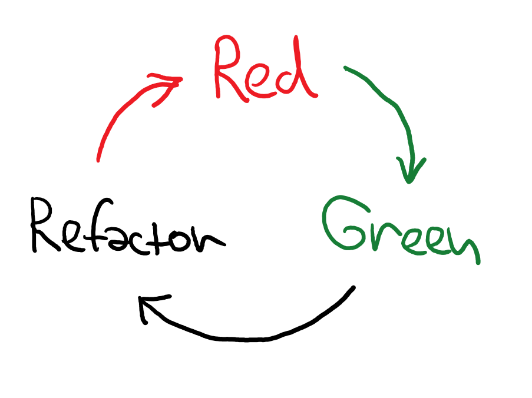
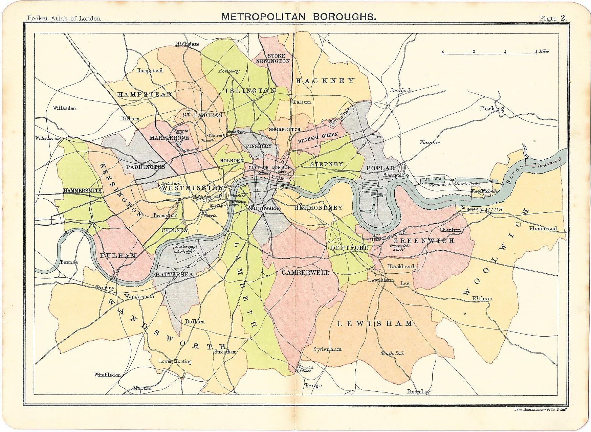

- title : Software Development: Testing theory
- description : Software Development: Testing theory
- author : Tomas Petricek
- theme : simple
- transition : none

****************************************************************************************************

# **CO559: Software Development**<br/> Testing theory

<br /><br />
<br /><br /><br />

**Tomas Petricek**

email: [t.petricek@kent.ac.uk](mailto:t.petricek@kent.ac.uk)<br />
twitter: [@tomaspetricek](http://twitter.com/tomaspetricek)<br />
office: [S129A](https://www.cs.kent.ac.uk/rooms/S129A.gif)<br />

****************************************************************************************************
- class: part

# **Cultures of programming and testing**

---------------------------------------------------------------------------------------------------

# Cultures of programming

### Different ways of thinking about programming

_<i class="fa fa-code"></i>_ Hacker _- hands-on practice learned through tinkering_

_<i class="fa fa-equals"></i>_ Mathematical _- formal activity relying on proofs_

_<i class="fa fa-user-tie"></i>_ Managerial _- organized factory-like production process_

_<i class="fa fa-wrench"></i>_ Engineering _- relying on good tools and practices_

---------------------------------------------------------------------------------------------------


**Hacker culture**

Program checkout comprising testing  
and debugging

_Early days of testing, still dominant in debugging_

---------------------------------------------------------------------------------------------------


**Mathematical culture**

_Program testing can be used to show the
presence of bugs, but never to show their absence_

(Dijkstra, 1970)

---------------------------------------------------------------------------------------------------


**Managerial culture**

Testing as a part of a structured development process

_From Waterfall to  
Agile methods_

---------------------------------------------------------------------------------------------------


**Engineering culture**

Tools and good practices for testing

_What to test? How to test? How can tools help?_

****************************************************************************************************
- class: part

# **Managerial take on testing**

---------------------------------------------------------------------------------------------------

# Role of testing


**Verification**

 - _Software conforms to specification_
 - _Are we building it right?_
 - _Defect testing to check for bugs_

<div class="fragment">

**Validation**

 - _Software does what user wants_
 - _Are we building the right thing?_
 - _Validation testing to check requirements_

</div>

---------------------------------------------------------------------------------------------------


**Testing as part of a development lifecycle**

Many different approaches!

_When should you  
design tests?_

_When should you  
start testing?_

---------------------------------------------------------------------------------------------------


**Waterfall (1950s)**

Testing happens  
after coding

_Verification and validation of a done system_

_Errors can get expensive_

---------------------------------------------------------------------------------------------------


**V-Model (1990s)**

Matching development and testing phases

_Plan testing in advance during development_

---------------------------------------------------------------------------------------------------

# V-Model

### Matching development and test phases

_<i class="fa fa-user-tie"></i>_ Requirements _plan for_ Acceptance test

_<i class="fa fa-desktop"></i>_ System design _plan for_ System test

_<i class="fa fa-building"></i>_ Architecture _plan for_ Integration test

_<i class="fa fa-code"></i>_ Coding _plan for_ Unit tests

---------------------------------------------------------------------------------------------------

# Agile critique


**V Model does not work**

- _Too simple management view_
- _Fails to respond to change_
- _Only looks for what is expected_

<div class="fragment">

**Testing in Agile methods**

 - _Unit testing as engineering tool_
 - _Acceptance tests derived from user stories_
 - _Test-driven development method_

</div>

----------------------------------------------------------------------------------------------------

# Test-driven development (TDD)



**TDD in practice**

 - _Write tests to capture requirements_
 - _Implement code satisfying tests_
 - _Test automatically and frequently_

<div class="fragment">

**Development process**

- _Structured approach to development_
- _Mostly focused on engineering side_
- _Red-green-refactor method_

</div>

****************************************************************************************************
- class: part

# **Engineering & mathematical take on testing**

---------------------------------------------------------------------------------------------------


**Questions about testing**

_How do we know our  
tests are good?_

_How to design good tests?_

What tools and theories can help us?

---------------------------------------------------------------------------------------------------

# White and black box testing


**Black-box (functional)**

 - _Without looking at code_
 - _Tests based only on specification_
 - _Focuses on representative inputs_

<div class="fragment">

**White-box (structural)**

- _Access to code structure_
- _Test based on program logic_
- _Cover as much code as possible_

</div>

---------------------------------------------------------------------------------------------------

# Equivalence class partitioning


**Equivalence classes**

 - _Subset of inputs that are equivalent_
 - _Program works the same way_
 - _Code follows the same path_

<div class="fragment">

**Designing tests**

 - _Identify ranges of values for<br/> which the behaviour is the same_
 - _Pick one sample input from each class_

</div>

---------------------------------------------------------------------------------------------------
- class: part

# **Demo**: Equivalence class partitioning

---------------------------------------------------------------------------------------------------

# Quadratic equation solver (1/6)

Find $x$ such that: $$ax^2+bx+c=0$$

<div class="fragment" style="margin-top:40px">

Can use the formula: $$x=\frac{-b\pm \sqrt{b^2-4ac}}{2a}$$
</div>

---------------------------------------------------------------------------------------------------

# Quadratic equation solver (2/6)

What are the classes of possible inputs?

$$x=\frac{-b\pm \sqrt{b^2-4ac}}{2a}$$

<div class="fragment" style="margin-top:-10px">

$b^2-4ac$ positive - _two real solutions_

</div>
<div class="fragment" style="margin-top:-10px">

$b^2-4ac$ is $0$ - _only one solution_

</div>
<div class="fragment" style="margin-top:-10px">

$b^2-4ac$ negative - _no real solutions_

</div>
<div class="fragment" style="margin-top:-10px">

$a=0$ - _equation becomes linear_

</div>
<div class="fragment" style="margin-top:-10px">

$a=0$ and $b=0$ - _either true or false_

</div>

---------------------------------------------------------------------------------------------------

# Quadratic equation solver (3/6)

First attempt, with just $+$ and no checks...

```js
function solve(a,b,c) {
  var dis = b*b-4*a*c;
  return (-b + sqrt(dis)) / (2*a)
}
```

---------------------------------------------------------------------------------------------------

# Quadratic equation solver (4/6)

Fixed test for _two real solutions_ case

```js
function solve(a,b,c) {
  var dis = b*b-4*a*c;
  return [
    (-b + sqrt(dis)) / (2*a),
    (-b - sqrt(dis)) / (2*a)
  ];
}
```

---------------------------------------------------------------------------------------------------

# Quadratic equation solver

Fixed test for _one and no real solutions_  
based on the discriminant value

```js
function solve(a,b,c) {
  var dis = b*b-4*a*c;
  if (dis<0) return null;
  else if (dis==0)
    return [ -b / (2*a) ],
  else return [
    (-b + sqrt(dis)) / (2*a),
    (-b - sqrt(dis)) / (2*a)
  ];
}
```

---------------------------------------------------------------------------------------------------

# Quadratic equation solver

Fixed test for _linear equation_ case

```js
function solve(a,b,c) {
  var dis = b*b-4*a*c;
  if (dis<0) return null;
  else if (a==0)
    return [ -c/b ];
  else if (dis==0)
    return [ -b / (2*a) ],
  else return [
    (-b + sqrt(dis)) / (2*a),
    (-b - sqrt(dis)) / (2*a)
  ];
}
```

---------------------------------------------------------------------------------------------------




**Boundary value analysis**

_Heuristic for finding good partition representatives_

Use boundary values!

---------------------------------------------------------------------------------------------------

# Code coverage


**White-box testing metric**

 - _How much code is run by tests?_
 - _The more the better!_
 - _Still no absolute guarantee!_

<div class="fragment">

**Coverage metrics**

 - Statement coverage
 - _What individual statements are run_
 - Decision coverage
 - _What branches of conditionals_

</div>

****************************************************************************************************
- class: part

# **Summary**

----------------------------------------------------------------------------------------------------

# Testing theory

**Cultures of programming**  
_Hacker culture, mathematical culture_  
_Engineering culture, managerial culture_

**Managerial take**  
_Testing as part of a development process_  
_Waterfall, V-model, agile methods_

**Mathematical and engineering take**  
_White box vs. black box methods_  
_Equivalence class partitioning etc._

----------------------------------------------------------------------------------------------------

# CO559: Testing tehory

**What you should remember from this lecture**

 - Validation vs. verification
 - V-model, Waterfall and TDD
 - Equivalence classes & boundary analysis

<br />
<br />

Tomas Petricek<br />
_[t.petricek@kent.ac.uk](mailto:t.petricek@kent.ac.uk) | [@tomaspetricek](http://twitter.com/tomaspetricek)_

****************************************************************************************************
 - class: part

# **References**

----------------------------------------------------------------------------------------------------

**Online resources**

 - [V-Model](https://www.sciencedirect.com/topics/engineering/v-model)
