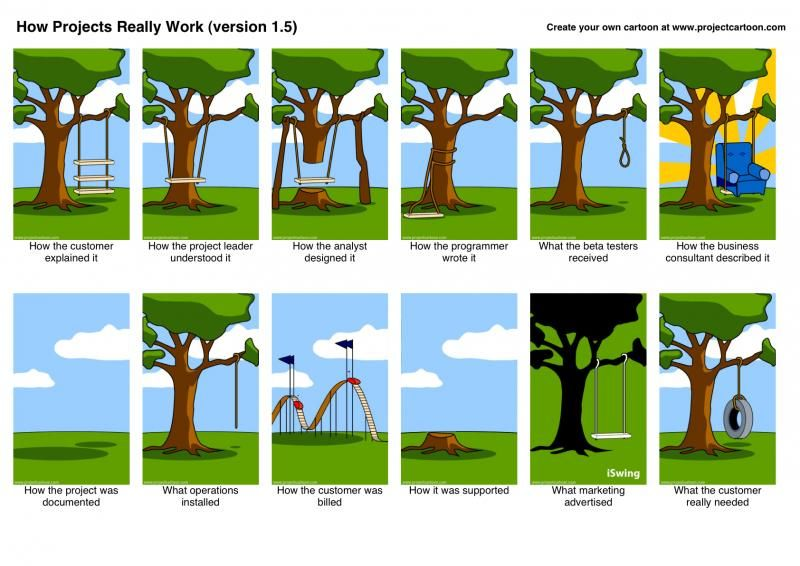

- title : Software Engineering: Agile Development
- description : Software Engineering: Agile Development
- author : Tomas Petricek
- theme : simple
- transition : none

****************************************************************************************************

# **CO886: Software Engineering**  Agile Development

  
   

**Tomas Petricek**

email: [t.petricek@kent.ac.uk](mailto:t.petricek@kent.ac.uk) 
twitter: [@tomaspetricek](http://twitter.com/tomaspetricek) 
office: [S129A](https://www.cs.kent.ac.uk/rooms/S129A.gif) 

****************************************************************************************************
- class: part

# **Development methodologies**

----------------------------------------------------------------------------------------------------

# How to build software well?

**Development methodologies**

 - _Is there a "scientific method" for SW?_
 - _Follow some kind of structured process_
 - _Starts with reasonable principles..._
 - _May end with mindless rule following!_

**Methodologies have context**

 - _Culture it originates from - engineer vs. manager?_
 - _Product vs. process oriented_

----------------------------------------------------------------------------------------------------

**Process vs. product**

_Do we have a specification or adapt continually?_

**Manager vs engineer**

_Focus on process and team structure or tools and code?_

----------------------------------------------------------------------------------------------------

**Semi-Automatic Ground Environment (SAGE)**

_First attempt at a methodology_

_Focused on product  
and management_

Multi-stage process

----------------------------------------------------------------------------------------------------

# Waterfall methodology

Multi-stage process  
_Royce (1987)_

1. _Gather requirements_
2. _Analyse and design_
3. _Programming_
4. _Testing_
5. _Deployment_

----------------------------------------------------------------------------------------------------

**Chrysler Comprehensive Compensation System (C3)**

_Rapid software system development (in Smalltalk)_

_Focused on process  
and engineering_

First project using  
Extreme Programming (XP)

----------------------------------------------------------------------------------------------------

# Extreme Programming

### Engineering practices drive the process

_<i class="fa fa-book"></i>_ User stories _to capture requirements_

_<i class="fa fa-dice"></i>_ Planning game _to plan the next iteration_

_<i class="fa fa-user-friends"></i>_ Pair programming _to build shared understanding_

_<i class="fa fa-keyboard"></i>_ Continuous integration _to always have running system_

_<i class="fa fa-traffic-light"></i>_ Test-driven development _process_

----------------------------------------------------------------------------------------------------

# **The New New Product Development Game**

_In today's fast-paced, fiercely competitive
world (...) [c]ompanies are increasingly
realizing that the old, sequential approach to developing
new products simply won't get the job done._

_Instead, companies in Japan and the United States are using a holistic
method - as in rugby, the ball gets passed within the team as it moves as a unit up the field._

Takeuchi, Nonaka (1986)

----------------------------------------------------------------------------------------------------

**SCRUM methodology**

_Following the Rugby terminology_

Managerial, but process oriented

----------------------------------------------------------------------------------------------------

# Manifesto for Agile Software Development (2001)

Popularized _process-oriented_ or _agile_ methodologies.

**We have come to value:**

- _Individuals and interactions over processes and tools_
- _Working software over comprehensive documentation_
- _Customer collaboration over contract negotiation_
- _Responding to change over following a plan_

****************************************************************************************************
- class: part

# **Requirements and user stories**

----------------------------------------------------------------------------------------------------

----------------------------------------------------------------------------------------------------

# Specifying and learning

**Typical clients**

 - _Experts in their domain_
 - _Do not speak computer-speak_
 - _Not sure what is possible_

**Typical software provider**

 - _Hopefully knows how to build software systems_
 - _No idea about trading of energy derivatives and commodity price risk management_
 - _Rare exceptions sometimes happen!_

----------------------------------------------------------------------------------------------------

**Learning unfamiliar domain**

Put knowledge on paper  
_Specification that programmers can understand and follow_

Keep knowledge in brains  
_Not scalable, but developers can use intuition and contribute ideas_

----------------------------------------------------------------------------------------------------

# Lightweight requirement capture

**Agile methodologies**

 - _Formal specifications are too hard_
 - _How do we get customers involved?_
 - _What is a good way of talking to them?_

**User stories**

 - _Not requirements, but_ stories
 - _Use paper or Word or whatever works_
 - As a _user_ I want _something_ so that _benefit_

----------------------------------------------------------------------------------------------------

**Fixed story format**

User _so that we know who needs this_

Benefit _so that  
there is a reason_

----------------------------------------------------------------------------------------------------

# User stories

### Three critical aspects

_❶_ Card _- artefact representing requirement_

_❷_ Conversation _- exchange of ideas with customer_

_❸_ Confirmation _- customer-defined acceptance test_

----------------------------------------------------------------------------------------------------

# **As an** online customer, **I want to** save my cart,  **so that** I can complete the purchase later

_Q: For how long should the cart be saved?_  
**A: For 3 days from the last access.**

_Q: What is an item in the cart becomes unavailable?_  
**A: When item becomes unavailable,  
remove it and warn the user.**

_Q: Can the user modify the cart after saving?_  
**A: Yes, the user can modify the cart after saving.**

----------------------------------------------------------------------------------------------------

# Where do requirements come from?

**Who is the customer**

- Product Owner _in SCRUM_
- _Actual system customer in XP_

**Being a customer is hard!**

- _Will Extreme Programming  
  kill your customer? (2001)_
- Marie DeArment _in the Chrysler project_

****************************************************************************************************
- class: part

# **SCRUM development process**

----------------------------------------------------------------------------------------------------

**Management of:**

Team structure  
_Who does what_

Project planning  
_How to progress_

Interactions  
_What to do when_

----------------------------------------------------------------------------------------------------

# Scrum roles

### Who does what in the team?

_<i class="fa fa-cog"></i>_ Product owner - _customer representative_  
_<i class="fa fa-empty"></i> Defines stories, prioritizes tasks, business-focus_

_<i class="fa fa-cog"></i>_ Scrum master - _process facilitator_  
_<i class="fa fa-empty"></i> Mentors team, removes obstacles, controls process_

_<i class="fa fa-cog"></i>_ Development team - _cross-functional team_  
_<i class="fa fa-empty"></i> Contribute to coding, testing, debugging, planning_

----------------------------------------------------------------------------------------------------

**SCRUM process**

**Backlog** of user stories to implement

**Planning** based  
on _value*effort_

**Sprints** add functio-  
nality in 1-2 weeks

----------------------------------------------------------------------------------------------------

# SCRUM ceremonies

**Daily scrum 15 minute meeting**

 - _What you did yesterday_
 - _Pick the next task_
 - _What is blocking you_

**Sprint-related meetings**

 - Planning _to choose tasks for iteration_
 - Review _to engage with stakeholders_
 - Retrospective _to continuously improve_

****************************************************************************************************
- class: part

# **Summary**

----------------------------------------------------------------------------------------------------

# Agile development

**Development methodologies**  
_Waterfall, extreme programming, SCRUM_  
_Managerial vs. engineering; process vs. product_

**Capturing requirements as stories**  
As a _CO886 lecturer_, I want _you to remember this,_  
so that _you can use user stories in your projects!_  

**SCRUM development methodology**  
_Product owner, scrum master, development team_  
_Backlog, sprint meetings, daily scrum meeting_

----------------------------------------------------------------------------------------------------

# CO886: Agile Development

**What you should remember from this lecture**

 - What context determines a methodology?
 - Write user stories & have conversations
 - Roles and ceremonies in the SCRUM process

 
 

Tomas Petricek 
_[t.petricek@kent.ac.uk](mailto:t.petricek@kent.ac.uk) | [@tomaspetricek](http://twitter.com/tomaspetricek)_

****************************************************************************************************
 - class: part

# **References**

----------------------------------------------------------------------------------------------------

**Academic papers**

- Winston Royce (1987). [Managing the Development of Large Software Systems](http://www-scf.usc.edu/~csci201/lectures/Lecture11/royce1970.pdf)
- Hirotaka Takeuchi, Ikujiro Nonaka (1986). [The New New Product Development Game](https://www.agilepractice.eu/wp-content/uploads/2016/09/Product-Development-Scrum-1986.pdf)

**Relevant books**

- Kent Back (1999). [Extreme Programming Explained](https://www.oreilly.com/library/view/extreme-programming-explained/0201616416/)

**Online material**

- Ron Jeffries (2001). [Essential XP: Card, Conversation, Confirmation](https://ronjeffries.com/xprog/articles/expcardconversationconfirmation/)
