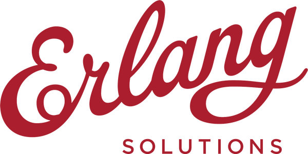
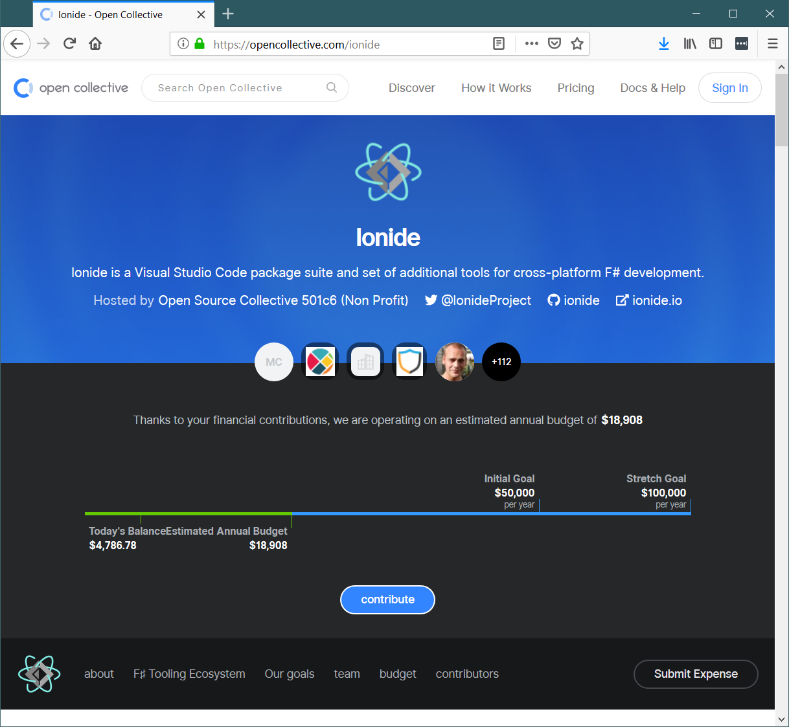

- title : Software Engineering: Open source software
- description : Software Engineering: Open source software
- author : Tomas Petricek
- theme : simple
- transition : none

****************************************************************************************************

# **CO886: Software Engineering**  Open source software

  
   

**Tomas Petricek**

email: [t.petricek@kent.ac.uk](mailto:t.petricek@kent.ac.uk) 
twitter: [@tomaspetricek](http://twitter.com/tomaspetricek) 
office: [S129A](https://www.cs.kent.ac.uk/rooms/S129A.gif) 

****************************************************************************************************
- class: part

# **Background**

----------------------------------------------------------------------------------------------------

**MIT Hacker Culture**  
The Tech Model Railroad Club

_Access to computers should be unlimited_

_All information  
should be free_

----------------------------------------------------------------------------------------------------

**Free software**  
Free as in freedom, not as in free beer

**GNU GPL (1989)**

Restrictive - _you must release changes using the same license_

Hacker-centric - _user is also a programmer_

----------------------------------------------------------------------------------------------------

# Commercial Windows vs. Free Linux (1990s-2000s)

**Commercial software**

 - _Business approach to software_
 - _Source owned by corporations_
 - _Funded by selling software_

**Free software**

 - _Hacker culture of software_
 - _Code is free to modify and reuse_
 - _Funded by additional services_

----------------------------------------------------------------------------------------------------

**Microsoft <i class="fa fa-heart" style="margin:0px -5px 0px 15px"></i> Linux**

Commercial interests _not selling software but providing services_

New generation of OSS _open-source without the "cancer" license clause_

----------------------------------------------------------------------------------------------------

# Open-source software

### It's much more than free vs. commercial license

_<i class="fa fa-book"></i> A lot of software is not a final end-user product_

_<i class="fa fa-dollar-sign"></i> Search for sustainable open-source funding_

_<i class="fa fa-chess-king"></i> Who is in control of open-source software?_

_<i class="fa fa-handshake"></i> Contributing and accepting contributions_

----------------------------------------------------------------------------------------------------

**Sustainable open-source funding**

_Crucial safe internet infrastructure receives donations of $2000 per month to pay one developer._

----------------------------------------------------------------------------------------------------

**Welcoming community**

_Please just kill yourself now. The world will be a better place._

Becoming contributor  
_is hard without guidance_

Attracting contributors  
_takes a lot of energy_

----------------------------------------------------------------------------------------------------

**Code of conduct**  
_"Be nice" is not enough_

Clear set of rules
_to be followed, even by "key" contributors_

Process _for resolving and reporting issues that arise_

****************************************************************************************************
- class: part

# **Open-source models**

----------------------------------------------------------------------------------------------------

# Free software model

**Philosophy and ideals**

 - _Built by hackers for hackers_
 - _Pay not with money, but with code_
 - _Open decisions (rarely the case)_

**Licenses and tools**

 - _GPL license requires publishing changes_
 - _LGPL allows linking in proprietary software_
 - _Distributed version control (git)_

----------------------------------------------------------------------------------------------------

# Dual licensing model

**Philosophy and ideals**

 - _Free for hackers, paid otherwise_
 - _Pay with either money or code_
 - _Commercial, but open ownership_

**Licenses and tools**

 - _AGPL closes service provider loophole_
 - _Using database forces you to share your code_
 - _Commercial license if you don't want to_

----------------------------------------------------------------------------------------------------

# Consulting model

**Philosophy and ideals**

 - _Share code and allow all uses_
 - _Find alternative funding source_
 - _Commercial services, trainings_

**Licenses and tools**

- _MIT, BSD and Apache licenses_
- _Allow unrestricted use without requirements_

----------------------------------------------------------------------------------------------------

# Corporate open-source model

**Philosophy and ideals**

 - _Developer tools should be open_
 - _Even those from companies_
 - _Supports other profitable business_
 - _Project ownerships remains corporate_

**Licenses and tools**

- _MIT, BSD and Apache licenses (again)_
- _Share code on GitHub for community reasons_

----------------------------------------------------------------------------------------------------

**Community open source model**

Alternative for community projects

_Free as in free beer  
(with donations)_

_Like corporate model without corporations_

_Is this sustainable?_

****************************************************************************************************
- class: part

# **Contributing to open-source**

----------------------------------------------------------------------------------------------------

_Life of an open-source project maintainer can be tough!_

----------------------------------------------------------------------------------------------------

# Contributing to open-source

### What open-source projects need to live?

_<i class="fa fa-lock-open"></i>_ **Maintainer** _- 1 hour a day, week or month_   
_Someone to merge changes, build releases, explain issues_

_<i class="fa fa-code"></i>_ **Core developers** _- irregular, but more time_   
_To implement major new features in the software_

_<i class="fa fa-cogs"></i>_ **Contributors** _- a couple of hours or days_  
_Improvements, fixing bugs, better documentation_

----------------------------------------------------------------------------------------------------

# Contributing to open-source

**Even small things matter**

 - _Minor bug fixes and typos_
 - _Documentation improvements_
 - _Good bug reports_

**How to do it well**

 - _Follow style and contributing guidelines_
 - _Report issues with minimal example_
 - _Small to large builds trust & communicate well_

----------------------------------------------------------------------------------------------------

**Good contributing**

Read the guidelines  
_On Github typically in `CONTRIBUTING.md` file_

Follow guidelines    
_Where to discuss, how to comment and explain_

----------------------------------------------------------------------------------------------------

**Good contributing**

Follow coding style  
_Code indentation, brackets, etc._

Explain things well  
_Good title and detailed description_

----------------------------------------------------------------------------------------------------

# Reporting issues is also contribution!

### Writing a good issue is a valuable skill

_<i class="fa fa-book"></i>_ Minimal - _As little code and data as possible_

_<i class="fa fa-book"></i>_ Complete - _Provide all relevant parts of code_

_<i class="fa fa-book"></i>_ Verifiable - _Describe and test the behaviour_

----------------------------------------------------------------------------------------------------

# Minimal, complete, verifiable example

_Broken function to check palindromes_

    [lang=javascript]
    function palindrome(s) {
      for(var i = 0; i < s.length / 2 - 1; i++)
        if (s[i] != s[s.length-1-i]) return false;
      return true;
    }

_Mostly works, but not always!_

_<i class="fa fa-check"></i>_ `palindrome("step on no pets") == true`  
_<i class="fa fa-check"></i>_ `palindrome("hello world") == false`  
_<i class="fa fa-times"></i>_ `palindrome("step onto pets") == true`

----------------------------------------------------------------------------------------------------

# Minimal, complete, verifiable example (1/2)

_I tried calling `palindrome(text)` and it does not work!_

_<i class="fa fa-times"></i>_ Complete - _what is the message used as input?_  
_<i class="fa fa-times"></i>_ Verifiable - _in what way does it not work?_  

_I tried `palindrome("step onto pets")`, it does not work!_

_<i class="fa fa-check"></i>_ Complete - _sample input is now included_  
_<i class="fa fa-times"></i>_ Verifiable - _in what way does it not work?_  

----------------------------------------------------------------------------------------------------

# Minimal, complete, verifiable example (2/2)

_When I call `palindrome("step onto pets")`,   
I get `true` but the input string it not a palindrome!_

_<i class="fa fa-check"></i>_ Complete - _sample input is included_  
_<i class="fa fa-check"></i>_ Verifiable - _gives expected and actual result_  
_<i class="fa fa-times"></i>_ Minimal - _input is longer than necessary_  

_When I call `palindrome("x12x")`, I get `true`   
but the string `"x12x"` it's not a palindrome!_

****************************************************************************************************
- class: part

# **Summary**

----------------------------------------------------------------------------------------------------

# Software Engineering: Open source 

**Recent history of open source software**  
_How Microsoft adopted open source_  
_Sustainable funding and welcoming community_

**Open source philosophies and funding**  
_Free software or dual licensing model_  
_Consulting, corporate and community model_

**Contributing to open source software**  
_Following style, code and comment guidelines_  
_Reporting minimal, complete, verifiable examples_

----------------------------------------------------------------------------------------------------

# CO886: Open source software

**What you should remember from this lecture**

 - Free, dual, consulting, corporate OSS model
 - Contributing, minimal complete verifiable example
 - Freedom (GPL etc.) vs free beer (MIT, BSD, Apache)

 
 

Tomas Petricek 
_[t.petricek@kent.ac.uk](mailto:t.petricek@kent.ac.uk) | [@tomaspetricek](http://twitter.com/tomaspetricek)_

****************************************************************************************************
 - class: part

# **References**

----------------------------------------------------------------------------------------------------

**Online resources**

 - [How to create a Minimal, Complete, and Verifiable example](https://stackoverflow.com/help/mcve) - StackOverflow.com
