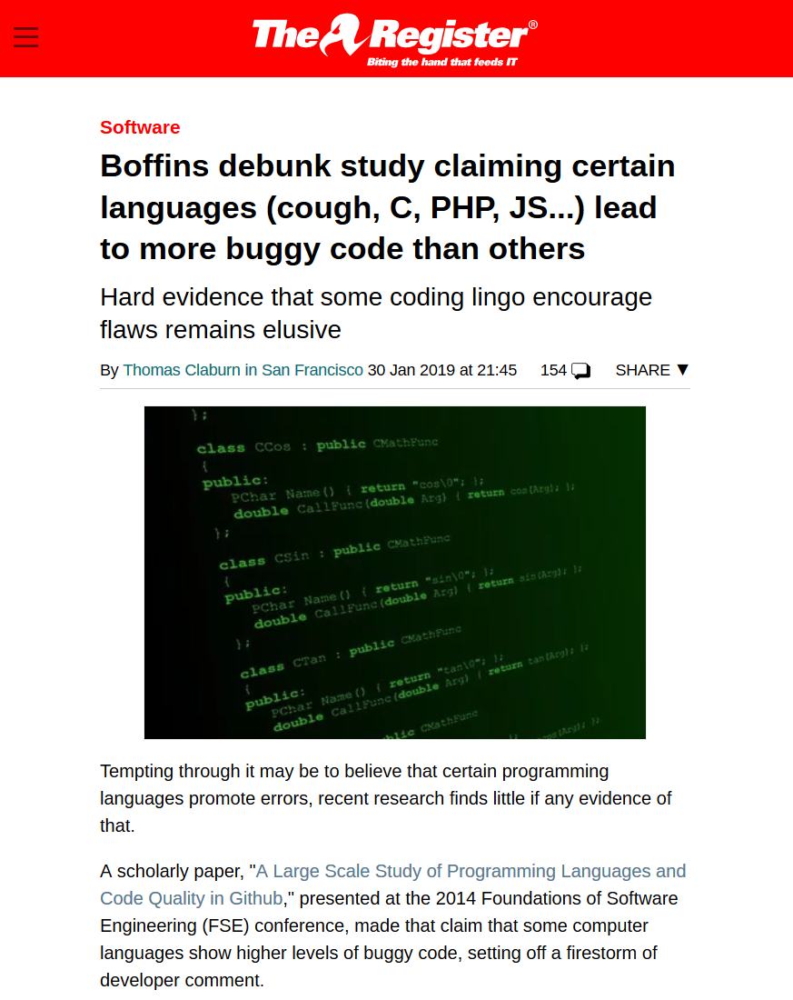
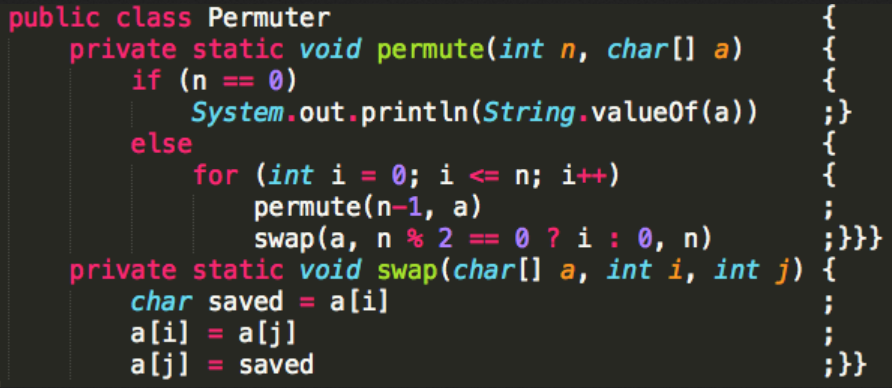

- title : Software Engineering: Readable code
- description : Software Engineering: Readable code
- author : Tomas Petricek
- theme : simple
- transition : none

****************************************************************************************************

# **CO886: Software Engineering**  Readable code

  
   

**Tomas Petricek**

email: [t.petricek@kent.ac.uk](mailto:t.petricek@kent.ac.uk) 
twitter: [@tomaspetricek](http://twitter.com/tomaspetricek) 
office: [S129A](https://www.cs.kent.ac.uk/rooms/S129A.gif) 

****************************************************************************************************
- class: part

# **Software engineering today**

----------------------------------------------------------------------------------------------------

**Mathematician's answer to software engineering**

_Use mathematical methods to prove system correctness_

People don't do it, yet, software mostly works.

----------------------------------------------------------------------------------------------------

**Detailed upfront models**

We know where  
we want to get

_Useful if predictability matters more than cost and delivery time_

----------------------------------------------------------------------------------------------------

# Software engineering today

**In contrast to upfront model**

We know that we continue  
moving in the right direction

**Tools and practices to ensure that**

 - _We can learn from past mistakes_
 - _We're tracking known issues_
 - _Software keeps working when we make changes_
 - _It is easy to improve and contribute_

----------------------------------------------------------------------------------------------------

# Software engineering today

### Some important aspects that we will cover

_<i class="fa fa-file"></i> Source control and collaborative development_

_<i class="fa fa-check-square"></i> Testing and build automation_

_<i class="fa fa-cog"></i> Continuous integration and reproducibility_

_<i class="fa fa-users"></i> How open-source software development works_

_<i class="fa fa-code"></i> Code quality, naming and "good code"_

****************************************************************************************************
- class: part

# **Code quality**

----------------------------------------------------------------------------------------------------

**Software Maintenance**

_You spend more time reading and modifying code than writing it._

Investing into readability when writing pays off

----------------------------------------------------------------------------------------------------

# eXtreme Programming (2000s)

**Keeping code simple**

- _Write self-documenting code_
- _Reduce need for comments_
- _You Ain't Gonna Need It (YAGNI)_

**Shared understanding in a team**

- _Common coding standards_
- _Pair programming_
- _Use of code reviews_

----------------------------------------------------------------------------------------------------

**Code for readability**

_Always code as if the person maintaining
your code will be a violent psychopath who knows where you live._

The person maintaining it will likely be future you.

----------------------------------------------------------------------------------------------------

# What is good quality code?

**Hacker culture**

- _Quality is learned by experience_
- _Apprenticeships if coding was craft_
- _Good examples, but no written rules_

**Coding standards**

- _Explicit rules that one can follow_
- _There are often exceptions_
- _Good starting point, but not ultimate answer_

----------------------------------------------------------------------------------------------------

**Do programming languages matter?**

_[It] appear[s] that strong typing is modestly better
than weak typing, and among functional languages, static typing is also somewhat better than dynamic typing._

----------------------------------------------------------------------------------------------------

**Do programming languages matter?**

Attempt to reproduce the study mostly failed

_"I believe they do in my heart of hearts, but it's kind of an impossible experiment to run."_

----------------------------------------------------------------------------------------------------

# Code quality

**Aspects of code quality**

 - _Variable and function names_
 - _Structure of code logic_
 - _Organization of functionality_

**Processes for keeping quality**

 - _Improving quality through refactoring_
 - _Ensuring code quality using tools_
 - _Ensuring code quality using social processes_

****************************************************************************************************
- class: part

# **Naming**

----------------------------------------------------------------------------------------------------

**Good naming is easy today!**

_Computers supports  
lower case letters!_

_Long names fit in  
computer memory_

_Auto-complete helps  
you avoid typos_

----------------------------------------------------------------------------------------------------

# Naming of variables (1/3)

What is the following function doing?

    [lang=javascript]
    function conv(x) {
      return x * 9 / 5 + 32;
    }

Converting temperature from Celsius to Fahrenheit!

    [lang=javascript]
    function celsiusToFahrenheit(temperature) {
      return temperature * 9 / 5 + 32;
    }

----------------------------------------------------------------------------------------------------

# Naming of variables (2/3)

Was that descriptive enough?

    [lang=javascript]
    function convertTemperatureFromCelsiusToFahrenheit
        (temperatureInCelsius) {
      return temperatureInCelsius * 9 / 5 + 32;
    }

Can we improve this by using abbreviations?

    [lang=javascript]
    function convTempFromCelsToFahr(tempInCels) {
      return tempInCels * 9 / 5 + 32;
    }

----------------------------------------------------------------------------------------------------

# Naming of variables (3/3)

Are all variable names in this example descriptive?

    [lang=javascript]
    var result = 0;
    for(var i = 0; i < data.length; i++) result += data[i];
    return result;

This is too much. Sensible exceptions allowed!

    [lang=javascript]
    var resultNumber = 0;
    for(var dataIndex = 0; dataIndex < data.length; dataIndex++)
      resultNumber += data[dataIndex];
    return resultNumber;

----------------------------------------------------------------------------------------------------

# Naming of variables

### Descriptive names of reasonable length

_<i class="fa fa-book"></i> Name should add semantic information_

_<i class="fa fa-font"></i> No need to say it's number, string, etc._

_<i class="fa fa-ruler-horizontal"></i> Longer names are good, but don't overdo it!_

_<i class="fa fa-users"></i> Follow common conventions where applicable_

_<i class="fa fa-bars"></i> The more local, the less it matters_

----------------------------------------------------------------------------------------------------

# Naming of variables, functions and classes

**Combining words in names**

- `PascalCase`
- `camelCase`
- `snake_case`

**Using spaces in a name**

 - _Would makes code nightmare to parse_
 - _Some language allow escaping e.g._ \`\`funny name!\`\`

----------------------------------------------------------------------------------------------------

# Naming of classes and methods in Java

Is the following naming consistent or not?

    [lang=csharp]
    public class Program {
       public Program(Boolean adminMode) {
         // Some actual logic here
       }
       public static void main(String []args) {
          Program prog = new Program(false);
       }
    }

Pascal case `Program`, camelCase `adminMode`, `main`    

----------------------------------------------------------------------------------------------------

# Naming classes and other issues

### Coding standards and exceptions

_<i class="fa fa-check-square"></i> Java standards use `PascalCase` for class names_

_<i class="fa fa-check-square"></i> `camelCase` is used for variables and method names_

_<i class="fa fa-thumbs-up"></i> You should generally follow coding standards_

_<i class="fa fa-pencil-alt"></i> Exceptions such as numerical code: `P` or `alpha`_

****************************************************************************************************
- class: part

# **Whitespace**

----------------------------------------------------------------------------------------------------

**How does compiler understand structure**

_Indentation or  curly brackets?_

Compiler may ignore whitespace, but human brain does not!

----------------------------------------------------------------------------------------------------

# Consistent code indentation (1/2)

What is the right spacing and line breaks?

    [lang=javascript]
    if (isAvailable( product ))
      {
        if (!isHidden(product)) {
        return getProductPage(product);
        } else
            return null;
    } else
    return null;

Compiler ignores whitespace, but humans do not!

----------------------------------------------------------------------------------------------------

# Consistent code indentation (2/2)

_Follow style of a project or a language;_ be consistent!

_Indent nested code by the same number of spaces or tabs_

    [lang=javascript]
    if (isAvailable(product)) {
        if (!isHidden(product)) {
            return getProductPage(product);
        } else {
            return null;
        }
    } else {
        return null;
    }

****************************************************************************************************
- class: part

# **Summary**

----------------------------------------------------------------------------------------------------

# Code quality

**Software engineering today**  
_Process that ensures things keep improving_  
_Supported by tools and good practices_

**What is code quality and why it matters**  
_More time is spent reading code than writing it_  
_Extreme programming - simplicity & shared understanding_

**Specific rules for keeping high code quality**  
_Naming variables, upper/lower case_  
_Follow consistent indentation rules_  

----------------------------------------------------------------------------------------------------

# CO886: Readable code

**What you should remember from this lecture**

 - Role of code quality in modern SWE
 - Rules for good naming and lower/upper case
 - Practice making your code look nice!

 
 

Tomas Petricek 
_[t.petricek@kent.ac.uk](mailto:t.petricek@kent.ac.uk) | [@tomaspetricek](http://twitter.com/tomaspetricek)_

****************************************************************************************************
 - class: part

# **References**

----------------------------------------------------------------------------------------------------

**Selected chapters from books**

 - [Code Complete: A Practical Handbook of Software Construction](https://amzn.to/2BMkEgJ)
 - [Clean Code: A Handbook of Agile Software Craftsmanship](https://amzn.to/2SUm7we)

**Papers and articles**

 - [A Large Scale Study of Programming Languagesand Code Quality in Github](http://web.cs.ucdavis.edu/~filkov/papers/lang_github.pdf)
 - [Boffins debunk study claiming certain languages lead to more buggy code than others](https://www.theregister.co.uk/2019/01/30/programming_bugs/)
