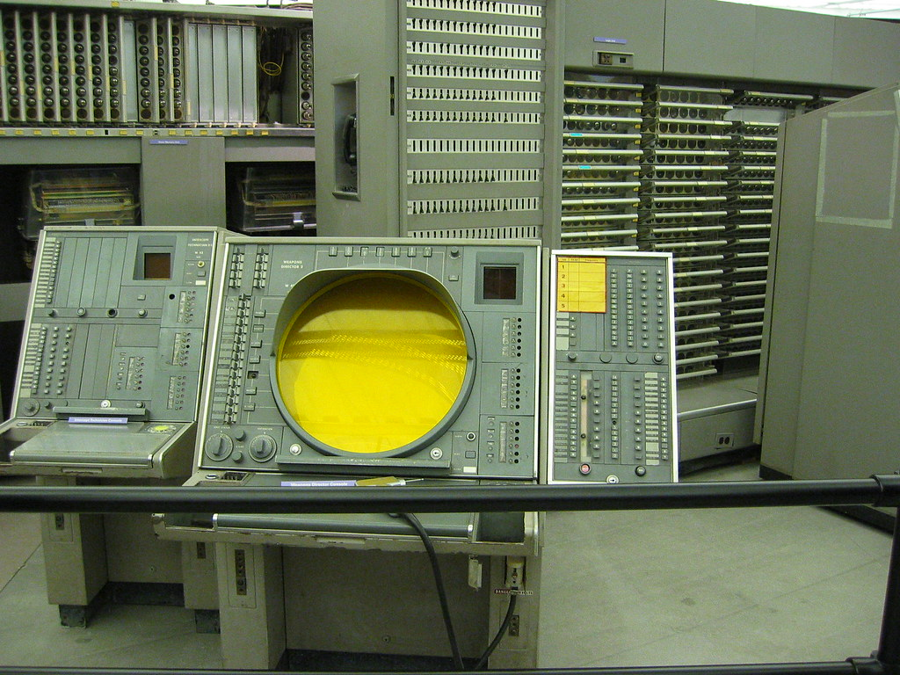
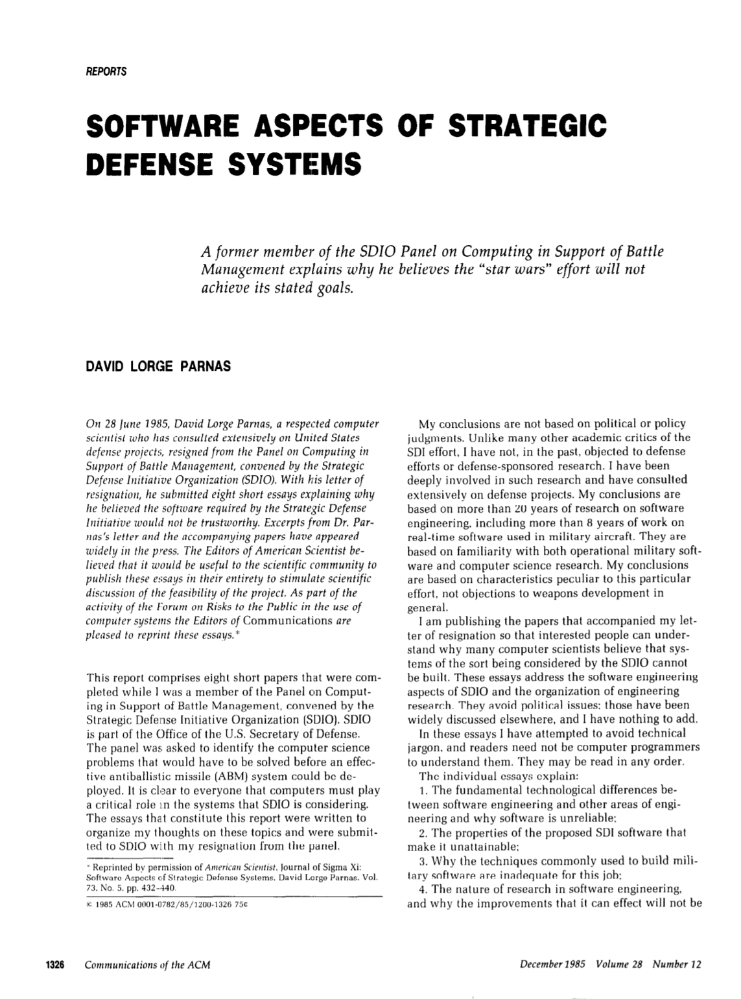

- title : Software Engineering: Environment and defence software
- description : Software Engineering: Environment and defence software
- author : Tomas Petricek
- theme : simple
- transition : none

****************************************************************************************************

# **CO886: Software Engineering**  Environment and defence software

  
   

**Tomas Petricek**

email: [t.petricek@kent.ac.uk](mailto:t.petricek@kent.ac.uk) 
twitter: [@tomaspetricek](http://twitter.com/tomaspetricek) 
office: [S129A](https://www.cs.kent.ac.uk/rooms/S129A.gif) 

****************************************************************************************************
- class: part

# **Motivation**

----------------------------------------------------------------------------------------------------

**SAGE (1950s)**

_Processing radar images of entire US airspace_

_Coordinate response to nuclear attack_

----------------------------------------------------------------------------------------------------

**Strategic Defence Initiative (1980s)**

_System intended to protect US against ballistic missiles_

_Ground launched and space launched concepts_

----------------------------------------------------------------------------------------------------

**Patriot Missile (1990s-)**

_Anti-ballistic missile in operation nowadays_

_Software error in 1991 led to 28 deaths_

----------------------------------------------------------------------------------------------------

**Can such system ever work?**

Union of Concerned Scientists opposition on political grounds

_But is there also a   
technical reason?_

****************************************************************************************************
- class: part

# **Nature**

----------------------------------------------------------------------------------------------------

# Why is software complex?

**Analog systems**  
_Small change in input causes small change in output_  
_Analog computers of 1930s, audio synthesizers_

**Digital systems with repeated components**  
_Non-linear, but we can test components in isolation_  
_CPU units and much of modern hardware_

**Digital systems without repetition**  
_Non-linear and very hard to test_  
_Any modern software system!_

----------------------------------------------------------------------------------------------------

# Categories

### Three categories of software systems

_<i class="fa fa-book"></i>_ S-programs  
_<i class="fa fa-xxx"></i> Written according to exact specification_

_<i class="fa fa-chess"></i>_ P-programs  
_<i class="fa fa-xxx"></i> Completely determined what it can do_

_<i class="fa fa-rocket"></i>_ E-programs  
_<i class="fa fa-xxx"></i> Closely linked to changing environment_

----------------------------------------------------------------------------------------------------

# Laws of software evolution (Lehman, 1980)

**Continuing change**  
_E-type system must be continually adapted or it becomes progressively less satisfactory_

**Increasing complexity**  
_As E-type system evolves, its complexity increases_

****************************************************************************************************
- class: part

# **Environment**

----------------------------------------------------------------------------------------------------

# Environment expectations

### Typical software development approaches

_<i class="fa fa-bicycle"></i> Start with imperfect and make it gradually better_

_<i class="fa fa-flask"></i> Employ careful controlled user testing_

_<i class="fa fa-phone"></i> Check with customer to see if we're getting close_

_<i class="fa fa-bug"></i> Have "on call" duty to resolve any bugs_

----------------------------------------------------------------------------------------------------

**Star Wars (1980s)**

_Fully automatic software system to track and shoot down Soviet nuclear missiles_

What development methods will fail?

----------------------------------------------------------------------------------------------------

# Arguments that count (Slayton, 2013)

**System would be unreliable**

_Since we have no spare planets on which to fight trial nuclear wars, testing of a global ABM system is impossible._

**Enemy has it easier**

_Very expensive defenses could give the Soviet Union an incentive to invest in relatively
cheap offensive countermeasures, creating arms race instabilities._

----------------------------------------------------------------------------------------------------

**Principle**

_Complex software can only be mastered if it is developed progressively, with the aid of
extensive testing, and then operated more or less continually in a somewhat lenient and forgiving environment._

----------------------------------------------------------------------------------------------------

**Electronic Voting Systems**

_What properties of the environment make those hard to build?_

----------------------------------------------------------------------------------------------------

# Environment expectations

### When can complex software be mastered

_<i class="fa fa-signal"></i> It is developed progressively_

_<i class="fa fa-plug"></i> Using extensive testing_

_<i class="fa fa-stopwatch"></i> Operated more or less continually_

_<i class="fa fa-globe"></i> In a somewhat forgiving environment_

****************************************************************************************************
- class: part

# **Metaphors**

----------------------------------------------------------------------------------------------------

**1968 NATO Conference**

_Programming started to make the transition from being a craft for a long-haired
programming priest-hood to becoming a real engineering discipline._

Why software **engineering**?

----------------------------------------------------------------------------------------------------

# Cultures of programming

**<i class="fa fa-user-secret"></i> Individualistic hacker culture**  
_Programming as elusive black magic_

**<i class="fa fa-user-tie"></i> Business and military engineering culture**  
_Programmers are replaceable and can be trained_

**<i class="fa fa-tree"></i> Organic and human-centric cultures**  
_Programming as a craft to be done well_

----------------------------------------------------------------------------------------------------

# Why metaphors for programming matter?

Metaphor _may offer a different way of thinking about problems and shift emphasis to different aspects_

**Example software metaphors**

 - Building software systems  
   _Focus on careful planning_
 - Programming is writing code  
   _Focus on communication, expression_
 - Programming is growing system  
   _Focus on long-term maintainability_

****************************************************************************************************
- class: part

# **Summary**

----------------------------------------------------------------------------------------------------

# Environment and defence software

**What makes software systems complex**  
_Digital system without repeated components_
_E-type systems and their environment_  

**Importance of system environment**  
_Developed progressively using extensive testing_  
_Operated continuously, in forgiving environment_  

**Metaphors for programming**  
_Software engineering and NATO conference_  
_Programming as writing, growing, building_

----------------------------------------------------------------------------------------------------

# CO886: Environment and defence software

**What you should remember from this lecture**

 - Three categories of software systems
 - What software can be effectively mastered
 - Hacker, business and human-centric cultures

 
 

Tomas Petricek 
_[t.petricek@kent.ac.uk](mailto:t.petricek@kent.ac.uk) | [@tomaspetricek](http://twitter.com/tomaspetricek)_

****************************************************************************************************
 - class: part

# **References**

----------------------------------------------------------------------------------------------------

**Books and papers**

 - Rebecca Slayton (2013). [Arguments that count](https://mitpress.mit.edu/books/arguments-count)
 - Nathan Ensmenger (2010). [Computer boys take over](https://mitpress.mit.edu/books/computer-boys-take-over)
 - Fred Brooks (1975). [The mythical man-month](https://www.amazon.co.uk/Mythical-Man-Month-Software-Engineering-Anniversary/dp/0201835959)
 - Steve McConnell (1993). [Code Complete: A Practical Handbook of Software Construction](https://amzn.to/2BMkEgJ)
 - David Parnas (1985). [Software aspects of strategic defence systems](https://web.stanford.edu/class/cs99r/readings/parnas1.pdf)
