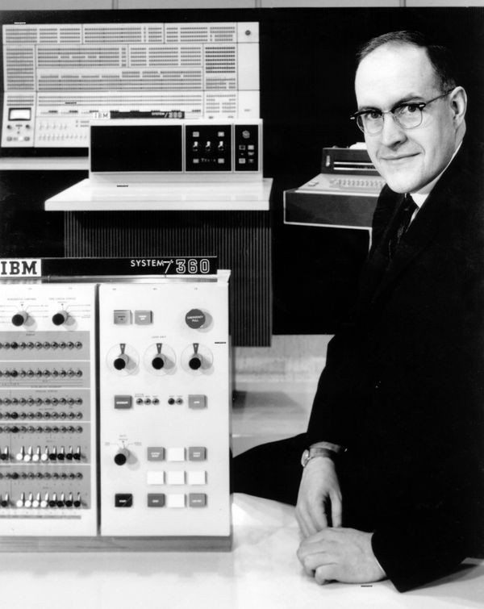
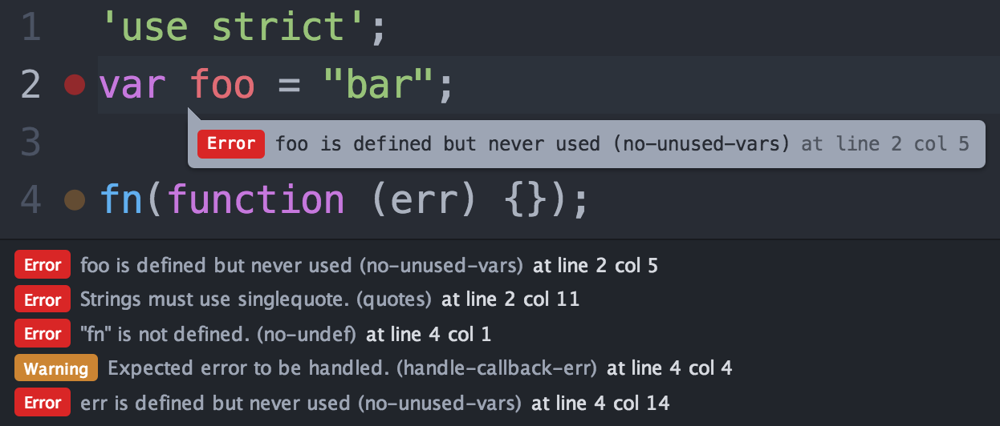

- title : Software Engineering: Understandable code
- description : Software Engineering: Understandable code
- author : Tomas Petricek
- theme : simple
- transition : none

****************************************************************************************************

# **CO886: Software Engineering**<br/> Understandable code

<br /><br />
<br /><br /><br />

**Tomas Petricek**

email: [t.petricek@kent.ac.uk](mailto:t.petricek@kent.ac.uk)<br />
twitter: [@tomaspetricek](http://twitter.com/tomaspetricek)<br />
office: [S129A](https://www.cs.kent.ac.uk/rooms/S129A.gif)<br />

****************************************************************************************************
- class: part

# **Understanding on a small scale**

----------------------------------------------------------------------------------------------------


**GOTO considered harmful**

<div class="fragment" style="padding:0px 0px 0px 480px">

_Can you tell what this does?_

    [lang=vb]
    10: I = 1
    20: PRINT "HI"
    30: I = I + 1
    40: IF I <= 10 THEN GOTO 20

</div>
<div class="fragment" style="padding:20px 0px 0px 480px">

_And what about this?_

    [lang=vb]
    FOR I = 1 TO 10 DO
      PRINT "HI"
    NEXT

</div>

----------------------------------------------------------------------------------------------------
- class: part

# **Understanding on a large scale**

----------------------------------------------------------------------------------------------------


**David Parnas (1972)**

<div class="fragment">

Conventional  
_Subroutines follow the order of execution_

Unconventional  
_Modules abstract some aspects of implementation_

</div>

----------------------------------------------------------------------------------------------------

# How to structure large programs


**Procedural approach**

 - _Programs that run top-to-bottom_
 - _Break program into smaller steps_
 - But _what data is passed between?_

**Logical abstraction**

 - _Identify logical components_
 - _Hide implementation details_
 - _How data is represented, stored, ..._

----------------------------------------------------------------------------------------------------


**Barbara Liskov (1974)**

<div class="fragment">

Abstract data types

_Programming language mechanism for abstraction_

</div>

----------------------------------------------------------------------------------------------------

# Object oriented programming


**Origins of objects**

 - _Simulating real-world systems_
 - _World consists of objects_
 - _Created according to a scheme_

**Object-oriented abstraction**

 - _Class defines a template for object_
 - _Multiple instances of a class_
 - _Objects hide implementation details_

----------------------------------------------------------------------------------------------------


<div style="margin-top:-20px">

**Alan Kay et al. (1972)**

</div>
<div class="fragment">

Smalltalk

_"Actually I made up the term "object-oriented", and I can tell you I did not have C++ in mind."_

</div>
<div class="fragment">

Galactic scale

_Computer made of small computers that exchange messages_

</div>

****************************************************************************************************
- class: part

# **Logical structure at a small scale**

----------------------------------------------------------------------------------------------------

# Keeping program logic simple

Is there an easier way to write this?

    [lang=javascript]
    if (isAdministrator(user) || isOwner(user)) return true;
    else return false;

<div class="fragment" style="padding-top:10px">

You do not need conditional statement at all!

    [lang=javascript]
    return isAdministrator(user) || isOwner(user);

</div>

----------------------------------------------------------------------------------------------------

# Keeping program logic ... logical (1/2)

When does the following return a product page?

    [lang=javascript]
    if (isAvailable(product)) {
      if (isHidden(product))
        return null;
      return getProductPage(product);
    } else {
      return null;
    }

<div class="fragment" style="padding-top:10px">

_When product is available and not hidden!_

_Which branch is the "happy path" branch?_

</div>

----------------------------------------------------------------------------------------------------

# Keeping program logic ... logical (2/2)

Keep the happy path branches consistent!

    [lang=javascript]
    if (isAvailable(product)) {
      if (!isHidden(product)) {
        return getProductPage(product);
      } else return null;
    } else return null;

<div class="fragment" style="padding-top:10px">

Reduce unnecessary nesting

    [lang=javascript]
    if (!isAvailable(product)) return null;
    if (isHidden(product)) return null;
    return getProductPage(product);

</div>

----------------------------------------------------------------------------------------------------

# Program logic

### Encoding logic in a readable way

_<i class="fa fa-brush"></i> Use appropriate language constructs_

_<i class="fa fa-directions"></i> Make sure you're not complicating things_

_<i class="fa fa-long-arrow-alt-right "></i> Keep "happy path" through code clear_

_<i class="fa fa-boxes"></i> Do not use unnecessary nesting of logic_

----------------------------------------------------------------------------------------------------

# Writing useful comments

<div class="fragments">

Are you explaining something you cannot see from code?

```javascript
// Return product page if product is available
if (isAvailable(product))
  return getProductPage(product);
```

</div>
<div class="fragment" style="padding-top:10px">

Also applies to Java inline documentation for methods

```javascript
/**
 * Returns the product price
 */
float getProductPrice(Product product)  { /* ... */ }
```

</div>

----------------------------------------------------------------------------------------------------

# Comments and structure

### Making code easy to read and understand

_<i class="fa fa-ban"></i> Don't use comments if you have nothing to add_

_<i class="fa fa-landmark"></i> Comments should add history, motivation, context_

_<i class="fa fa-code"></i> Use consistent spacing and indentation_

_<i class="fa fa-align-center"></i> Keep nesting and length of functions sensible_

----------------------------------------------------------------------------------------------------
- class: part

# **Demo**: Improving quality of a poor code snippet

----------------------------------------------------------------------------------------------------

<div class="smallercode">

    [lang=javascript]
    // Answers a given query
    function answerQuery(query) {
      var query_lower = v.lowerCase(query);
      if (v.includes(query_lower, "rain") || v.includes(query_lower, "sun"))
        { return "I do not care too much about weather"; }
      if (!v.includes(query_lower, "football"))
          { return "Sorry Dave, I cannot do that." }
      return "Football is the ballet of the masses."
    }

    // Handles a say click
    function HandleSayClick()
    {
      var el = document.getElementById('message');
      var ml = el.value.toLowerCase();
      var cv = document.getElementById('conversation');
      var an = answerQuery(ml)
               conversation.innerHTML += "<p>" + ml + "</p>";
               conversation.innerHTML += "<p>" + an + "</p>";
    }

</div>

----------------------------------------------------------------------------------------------------

<div class="smallercode">

    [lang=javascript]
    // Searches the query for known keywords (rain, sun
    // and football) and returns bot's response
    function answerQuery(query) {
      var queryLower = v.lowerCase(query);
      if (v.includes(queryLower, "rain") || v.includes(queryLower, "sun"))
        return "I do not care too much about weather";
      if (v.includes(queryLower, "football"))
        return "Football is the ballet of the masses.";
      return "Sorry Dave, I cannot do that.";
    }

    // Gets message from the user and appends
    // it together with an answer to the conversation
    function HandleSayClick() {
      var messageEl = document.getElementById('message');
      var messageLower = messageElement.value.toLowerCase();
      var conversationEl = document.getElementById('conversation');
      var answer = answerQuery(messageLower)
      conversation.innerHTML += "<p>" + messageLower + "</p>";
      conversation.innerHTML += "<p>" + answer + "</p>";
    }

</div>

****************************************************************************************************
- class: part

# **Code that fits your brain**

----------------------------------------------------------------------------------------------------



_Any product that is sufficiently big or urgent to require the
effort of many minds thus encounters a peculiar difficulty: the
result must be conceptually coherent to the single mind of the
user and at the same time designed by many minds._

Fred Brooks (1995 [1975])

----------------------------------------------------------------------------------------------------

----------------------------------------------------------------------------------------------------


**DEMO: Fun 3D**   
[_www.fun3d.net_](http://www.fun3d.net)

<div class="fragment">

_Functional programming abstractions_

_Domain-specific languages_

</div>

----------------------------------------------------------------------------------------------------

# Object-oriented model of shapes

    [lang=csharp]
    class Shape {
      abstract public void Render(Scene scene);
    }
    class Combine extends Shape {  
      public void Render(Scene scene) {
        s1.Render(scene);
        s2.Render(scene);
      }
    }
    class Cube extends Shape {
      public void Render(Scene scene) {
        // Render cube onto the scene
      }
    }

----------------------------------------------------------------------------------------------------

# Two ways of modelling 3D worlds

**Object-oriented class hierarchy**


<div class="fragment">

**Functional algebraic data type**

<div style="margin:0px 150px 0px 50px">

    type Shape =
      | Cube
      | Move of Shape * float * float * float
      | Combine of Shape list

</div>
</div>

----------------------------------------------------------------------------------------------------

# Two ways of modelling 3D worlds


**Object-oriented class hierarchy**

 - _Abstract method in the base class_
 - _Implementation in each shape_
 - _Easy to add new shapes_

<div class="fragment">

**Functional algebraic data type**

 - _Separate data from functions_
 - _Render function handles all cases_
 - _Easy to add new operations_

</div>

----------------------------------------------------------------------------------------------------

# Domain-specific languages


<div class="fragment">

**Motivation:** When do we need this?

 - _Repeated problem, many variations_
 - _User stories, game logic, contracts_
 - _Accessible to non-programmers_

</div>
<div class="fragment">

**Solution:** Build a language for a given domain!

 - External – _New language with custom syntax_
 - Internal – _Library in an existing language_

</div>

----------------------------------------------------------------------------------------------------


Domain Specific Languages (DSLs)

<div class="fragment" style="padding-top:20px">

**Model**  
What we work with? How does it compose?

</div>
<div class="fragment" style="padding-top:20px">

**Syntax**  
How can we write it in a human-friendly way?

</div>

----------------------------------------------------------------------------------------------------

# Functional and object-oriented DSLs

**Functional languages**  
_Custom operators and function composition_

    (Fun.cone |> Fun.color Color.red) $
    (Fun.cylinder |> Fun.move (0, -1, 0))

<div class="fragment" style="margin-top:50px">

**Object-oriented languages**  
_Fluent interfaces and the builder pattern_

    [lang=csharp]
    fun.cone().withColor(color.red).
      combineWith(fun.cylinder().moveBy(0, -1, 0))

----------------------------------------------------------------------------------------------------

# From objects and beyond

### Many ways to express problems in code

_<i class="fa fa-object-group"></i>_ Object-oriented - _decompose into entities_

_<i class="fa fa-not-equal"></i>_ Functional - _separate data and functions_

_<i class="fa fa-language"></i>_ Domain specific languages - _for a specific problem_

_<i class="fa fa-bars"></i>_ Event sourcing - _state as a list of events_

_<i class="fa fa-cogs"></i>_ Microservices - _system as independent servers_

****************************************************************************************************
- class: part

# **Maintaining and improving quality**

----------------------------------------------------------------------------------------------------

# Maintaining code quality


<div style="margin-top:-10px">

**Social approaches**

 - Pair programming _- all code writing is done in pairs_
 - Code reviews _- colleague reads code before merging_

**Technological solutions**

 - Compiler _- only checks if computer can understand_
 - Style checkers _or_ linters _- check stylistic errors and suspicious constructs_

</div>

----------------------------------------------------------------------------------------------------

# Code smells
### Hints that code has poor quality

_<i class="fa fa-list"></i> Long parameter list (bloaters)_

_<i class="fa fa-object-group"></i> Switch statement (OO abuse)_

_<i class="fa fa-magic"></i> Speculative generality (dispensables)_

----------------------------------------------------------------------------------------------------

# Improving code quality


**Refactoring**

_Is a code transformation that_

<div style="margin:-15px 0px 20px 30px">

_(i) Does not change meaning_  
_(ii) Improves quality of code_

</div>
<div class="fragment" style="padding-top:10px">

**Test-driven development**

- Red _- Add failing test for new unimplemented feature_
- Green _- Make it pass using whatever hacks you need_
- Refactor _- Improve quality without breaking it_

</div>

----------------------------------------------------------------------------------------------------

# Example of refactoring (1/2)

The name of the function and input argument are poor

```javascript
function conv(x) {
  return x * 9 / 5 + 32;
}
```

<div class="fragment">

_Improve quality using_ **rename refactoring**

```javascript
function celsiusToFahrenheit(temperature) {
  return temperature * 9 / 5 + 32;
}
```

_Note that we use new name in all calls to `conv`_  

</div>

----------------------------------------------------------------------------------------------------

# Example of refactoring (2/2)

What is wrong with this function?

_Comment indicates it does two separate things_  
_In reality it would be very long_  

```javascript
function printOwing(invoice) {
  printBanner();
  var outstanding = calculateOutstanding();

  // Print details
  print("name: $" + invoice.customer);
  print("amount: $" + outstanding);
}
```


----------------------------------------------------------------------------------------------------

# Example of refactoring (2/2)

_Improve quality using_ **extract function** _refactoring_

```javascript
function printDetails(invoice, outstanding) {
  print("name: $" + invoice.customer);
  print("amount: $" + outstanding);
}

function printOwing(invoice) {
  printBanner();
  let outstanding = calculateOutstanding();
  printDetails(invoice, outstanding);
}
```

_Note that comment becomes a function name!_

****************************************************************************************************
- class: part

# **Summary**

----------------------------------------------------------------------------------------------------

# Code quality

**What is code quality and why it matters**  
_More time is spent reading code than writing it_  
_Extreme programming - simplicity & shared understanding_

**Understandability on small and large scale**  
_Keeping the happy path clear_  
_Conceptually coherent code structure_  

**Maintaining and improving code quality**  
_Social and technological approaches to quality_  
_Refactoring and red-green-refactor methodology_

----------------------------------------------------------------------------------------------------

# CO886: Understandable code

**What you should remember from this lecture**

 - The idea of a happy path
 - Conceptual coherence of structure
 - Refactoring and red-green-refactor

<br />
<br />

Tomas Petricek<br />
_[t.petricek@kent.ac.uk](mailto:t.petricek@kent.ac.uk) | [@tomaspetricek](http://twitter.com/tomaspetricek)_

****************************************************************************************************
 - class: part

# **References**

----------------------------------------------------------------------------------------------------

**Academic papers**

 - David Parnas (1972). [On The Criteria To Be Used in Decomposing Systems into Modules](https://www.win.tue.nl/~wstomv/edu/2ip30/references/criteria_for_modularization.pdf)
 - Barbara Liskov, Stephen Zilles (1974). [Programming with Abstract Data Types](https://dl.acm.org/citation.cfm?id=807045)
 - Alan Kay (1993). [The Early History of Smalltalk](http://worrydream.com/EarlyHistoryOfSmalltalk/)

**Tools, books and articles**

 - [Domain Specific Languages: The Functional Way](https://vimeo.com/97315970)
 - [The Expression Problem](http://homepages.inf.ed.ac.uk/wadler/papers/expression/expression.txt)
