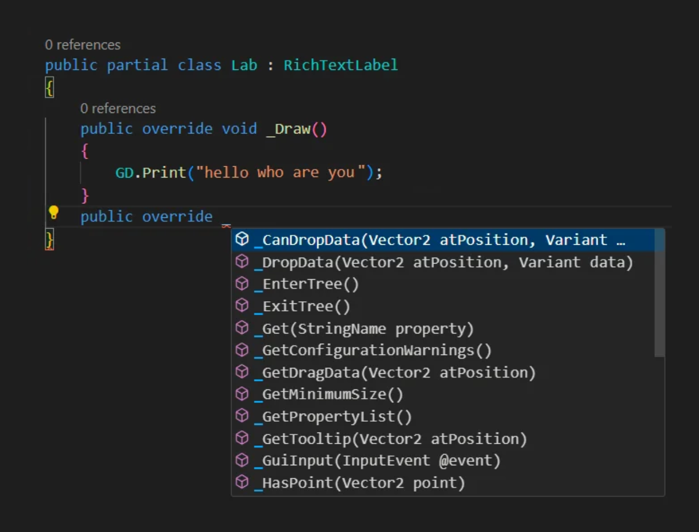
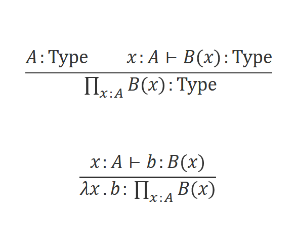

- title: Advanced types in TypeScript (NPRG014)

****************************************************************************************************
- template: title
- class: nologo

# NPRG014
## **Advanced types in TypeScript**<br /> Guest lecture

---

**Tomáš Petříček**, 309 (3rd floor)  
_<i class="fa fa-envelope"></i>_ [petricek@d3s.mff.cuni.cz](mailto:petricek@d3s.mff.cuni.cz)  
_<i class="fa-solid fa-circle-right"></i>_ [https://tomasp.net](https://tomasp.net) | [@tomaspetricek](http://twitter.com/tomaspetricek)  
_<i class="fa-solid fa-circle-right"></i>_ https://d3s.mff.cuni.cz/people/tomaspetricek/

----------------------------------------------------------------------------------------------------
- template: largeicons

# Where I'm coming from?

- *fa-landmark* **PhD, University of Cambridge**  
  Types for context-aware programming

- *fa-industry* **Microsoft Research Cambridge**  
  F# and applied functional programming

- *fa-city* **The Alan Turing Institute, London**  
  Expert and non-expert tools for data science

- *fa-church* **University of Kent, Canterbury**  
  Programming systems and history

----------------------------------------------------------------------------------------------------
- template: image
- class: smaller


# What is my quest?

**More programming lan&shy;guage research in Prague**

Ask about reading group!  
Do a PL project or thesis!  
Join us for a PhD?

****************************************************************************************************
- template: subtitle

# Language design
## Different approaches

----------------------------------------------------------------------------------------------------
- template: image


# Formal properties

**Language should be based on sound formal foundations!**

Haskell and pure functional languages

Self and pure object-oriented programming

----------------------------------------------------------------------------------------------------
- template: image


# Implementation properties

**Should be easy to compile and close to the underlying system!**

Fortran, C but also  
the Go language

----------------------------------------------------------------------------------------------------
- template: image



# User experience properties

**Language should integrate well with the rest of the ecosystem**

Scratch, HyperTalk, BASIC and aspects of Visual Basic

-----------------------------------------------------------------------------------------
- template: content

# Case study: LINQ

LINQ queries in Visual Basic .NET and C#

```
Dim db As New northwindDataContext
Dim ukCompanies =
  From cust In db.Customers
  Where cust.Country = "UK"
  Select cust.CompanyName, cust.City
```

----------

Why confuse programmers familiar with SQL?

```sql
SELECT [CompanyName], [City]
WHERE [Country] = 'UK'
FROM dbo.[Northwind]
```

****************************************************************************************************
- template: subtitle

# TypeScript
## Design & history

-----------------------------------------------------------------------------------------
- template: icons

# TypeScript
## Language design motivations

- *fa-shoe-prints* Full compatibility with JavaScript
- *fa-trowel* Support large-scale development
- *fa-check* Provide checking where possible  
- *fa-brands fa-github* Work with existing JavaScript code!

----------------------------------------------------------------------------------------------------
- template: image
- class: smaller


# Retrofitting programming language to code?

---

**Well, actually...**

TypeScript by Microsoft  
Hack by Facebook

Any new language version?

----------------------------------------------------------------------------------------------------
- template: image


# Retrofitting Java&shy;Script with types

External definitions for existing libs (`.d.ts`)

Not everything can be typed (allow `any`)

JavaScript quirks  
(`null` vs. `undefined`)

----------------------------------------------------------------------------------------------------
- template: lists
- class: noborder smaller

# TypeScript types evolution


## Version <2 (2012-16)

- Conservative extension of JavaScript
- Type system follows the 80%/20% rule

## Versions 2, 3 (2016-20)

- More type-level gymnastics, closer to 90%

## Version >=4 (2020-...)

- Even more fancy types, closer to 99%?
- Allows some scary type system hacks!


****************************************************************************************************
- template: subtitle

# TypeScript
## Practical types

----------------------------------------------------------------------------------------------------
- template: subtitle

# Demo
## Typing the createElement function

----------------------------------------------------------------------------------------------------
- template: code

```typescript
// Union type and null type

getElementById(elementId:string):
  HTMLElement | null

// Overloaded function
// String literal types

createElement(tagName:"input"):
  HTMLInputElement

createElement(tagName:"button"):
  HTMLButtonElement
```

# Types concepts

**Overloaded functions**  
But with single implementation!

**Flow-sensitive typing**  
To eliminate nulls

**Union and literal types**  
More generally useful

----------------------------------------------------------------------------------------------------
- template: lists

# "Clean" functional design


## Options instead of nulls

```fsharp
type Option<'T> =
  | Some of 'T // Option has a value
  | None       // Option has no value
```

## Matching instead of flow

```fsharp
match optElement with
| None -> failwith "out element missing"
| Some element ->
    el.appendChild(input)
    el.appendChild(btn)
```

----------------------------------------------------------------------------------------------------
- template: icons

# Analysis
## Flow-sensitive typing

- *fa-folder* Compatible with existing JavaScript code
- *fa-code* No need for extra syntax
- *fa-hat-wizard* Somewhat unexpected behaviour!
- *fa-arrow-up-a-z* Type of variable changes with scope
- *fa-square-xmark* Valid patterns do not pass

----------------------------------------------------------------------------------------------------
- template: subtitle

# Task #1
## Break flow-sensitive typing!

----------------------------------------------------------------------------------------------------
- template: lists
- class: noborder smaller

# Literal and union types


## Union types
- Value of one of several types
- Safe languages prefer tagged unions!
- Flow-sensitive typing with `typeof` works

## Literal types

- Type of a unique TypeScript value
- Works on values beyond strings, e.g. `[42]`
- Composes with other types, e.g. `[0|1, number]`

----------------------------------------------------------------------------------------------------
- template: subtitle

# Demo
## Unions, typeof, array literal types

----------------------------------------------------------------------------------------------------
- template: subtitle

# Task #2
## Implement bit increment

----------------------------------------------------------------------------------------------------
- template: code
- class: smallcode

```
// Multiple overload signatures
function speak(animal:"dog") : void
function speak(animal:"cat") : void

// One compatible implementation
function speak(animal:string) {
  switch(animal) {
    case "dog":
      console.log("woof")
      return
    case "cat":
      console.log("meow")
      return
  }
}
```

# Function type overloading

Implementation signature is hidden

Overload signature has to be compatible with the implementation

**Overloads can differ  
in return type!**

----------------------------------------------------------------------------------------------------
- template: subtitle

# Task #3
## Implementing createAnimal function

----------------------------------------------------------------------------------------------------
- template: largeicons

# Special types

- *fa-face-meh* **void** - No value, but usable as return type
- *fa-face-meh-blank* **never** - No value, represent unreachable code
- *fa-face-flushed* **unknown** - Cannot be used in any way
- *fa-face-dizzy* **any** - Unknown, but can be used anywhere
- *fa-face-tired* **undefined** - Special undefined value
- *fa-face-sad-cry* **null** - Special null value

----------------------------------------------------------------------------------------------------
- template: subtitle

# Demo
## What can and cannot be done with never

----------------------------------------------------------------------------------------------------
- template: lists
- class: noborder smaller

# Union and intersection types


## Union (`T1 | T2`)
- Represents set union of  
  the values of the two types

## Intersection (`T1 & T2`)
- Represents set intersection  
  of the values of the types

----------------------------------------------------------------------------------------------------
- template: subtitle

# Demo
## Record extension via intersection types

****************************************************************************************************
- template: subtitle

# TypeScript
## Algebraic data types

----------------------------------------------------------------------------------------------------
- template: code

```fsharp
// Algebraic data type that
// represents an expression
type Expr =
  // Numerical constant
  | Const of int

  // Named variable
  | Variable of string

  // Unary & binary operators
  | Unary of string * Expr
  | Binary of string * Expr * Expr

  // Function with arguments
  | Function of string * Expr list
```

# Algebraic types

Popular functional modelling tool

**Entity consists of multiple sub-entities**
(operator + arguments)

**Entity can be one of several options**
(number, variable, ...)

----------------------------------------------------------------------------------------------------
- template: subtitle

# Demo
## Algebraic data types in TypeScript

----------------------------------------------------------------------------------------------------
- template: lists

# Algebraic data types


## Literal & union types

- Tag to represent the kind of type
- `{ t:"s1" } | { t:"s2" }`  
  `= { t:"s1" | "s2" }`

## Flow-sensitive typing

- Check for a tag determines case
- Similar to pattern matching
- Works well with `switch`!

----------------------------------------------------------------------------------------------------
- template: subtitle

# Task #4
## Write a simple expression evaluator

----------------------------------------------------------------------------------------------------
- template: code
- class: smallcode smaller

```ts
// Contact is an algebraic type
type Contact =
    ContactEmail
  | ContactPhone
  | ContactAll

interface ContactEmail {
  type: 'email'
  email: string
}
interface ContactPhone {
  type: 'phone'
  number: number[]
}
interface ContactAll {
  type: 'all'
  email: string
  number: number[]
}
```

# Compare two representations

**Do they represent the same data?**

```ts
interface Student1 {
  name: string
  email: string | null
  number: number[] | null
}

interface Student2 {
  name: string
  contact: Contact
}
```

-----------------------------------------------------------------------------------------
- template: lists

# Calculating with types


## Type constructor algebra

- Record behaves as $A * B$ or $A \times B$
- Unions behave as $A + B$ or $A \cup B$
- Functions `A->B` behave as $B^A$
- Unit type is $1$ and void (never) is $0$

## Usual algebraic laws work!

- $A*(B+C) = A*B + A*C$
- $A * 1 = A$ and $A * 0 = 0$

-----------------------------------------------------------------------------------------
- template: content

# Calculating with types

$Contact = (Phone * Email) + Email + Phone$  
$Student2$  
$\quad =Name * Contact$   
$\quad {\color{green}=Name * ((Phone * Email) + Email + Phone)}$

---

$Student1$  
$\quad = Name * (Phone+1) * (Email+1)$  
$\quad = Name * ((Phone+1) * Email + (Phone+1) * 1)$  
$\quad = {\color{blue}Name * ((Phone * Email) + Email + Phone }{\color{red}\;+\;1})$

****************************************************************************************************
- template: subtitle

# TypeScript
## Type-level computation

----------------------------------------------------------------------------------------------------
- template: code
- class: smallcode

```js

// Returns book information consisting
// of title and year and description
// (only when detailed=true)
function getBook(index, detailed) {
  let b = lookup(index);
  if (detailed)
    return {
      title:b.title, year:b.year,
      description:b.description }
  else
    return {
      title:b.title, year:b.year }
}
```

# Motivation

How to check more dynamic behaviour?

---

**Dependent types!?**

Return type depends on the value (type) of the argument

----------------------------------------------------------------------------------------------------
- template: lists

# Dependent types



## Serious type theory business!

- Types corresponding to  
  terms in  predicate logic
- Used in theorem provers

## More practical uses exist

- Track number of elements in a list `List n T`
- `List n T -> List m T -> List (n+m) T`

----------------------------------------------------------------------------------------------------
- template: code
- class: smaller

```
type LabelOrId<T> =
  // If T is a number,
  // result has id:number
  T extends number ?
    { id:number } :
    // If T is a string
    // result has label:string
    T extends string ?
      { label:string } :
      // Otherwise return
      // unusable type
      never;
```

# Conditional types

`cond ? type1 : type2`

**Result type depends  
on another type**

Condition can only check using `extends` (subtype)

----------------------------------------------------------------------------------------------------
- template: subtitle

# Demo
## Book info with optional details

----------------------------------------------------------------------------------------------------
- template: lists

# Transforming record types


## Keyof types

- Union type of type's keys as literals
- `{ age:number; name:string }`
- `keyof(P) = "age"|"name"`

## Indexed access types

- Type of a property of a type
- `P["age"] = number`
- `P[keyof P] = "number"|"string"`

----------------------------------------------------------------------------------------------------
- template: subtitle

# Demo
## Filtering book records by key

----------------------------------------------------------------------------------------------------
- template: subtitle

# Task
## Implement well-typed join operation

----------------------------------------------------------------------------------------------------
- template: subtitle

# Demo
## Transforming record types using keyof

----------------------------------------------------------------------------------------------------
- template: image


# Galaxy brain?

Pattern matching at the type
level using infer/extends

Type level array and string interpolation

Representing numbers at the type level

----------------------------------------------------------------------------------------------------
- template: subtitle

# Demo
## Flattening array types

----------------------------------------------------------------------------------------------------
- template: subtitle

# Demo
## Strings & type-level numbers

----------------------------------------------------------------------------------------------------
- template: image


# Arithmetic

**You can do (big) arithmetic in TypeScript types**

Why?

Good question...  
but maybe matrix operations?

----------------------------------------------------------------------------------------------------
- template: subtitle

# Task
## Figure out how ts-arithmetic works!

****************************************************************************************************
- template: subtitle

# TypeScript
## Conclusions

----------------------------------------------------------------------------------------------------
- template: largeicons

# Excuse to talk about

- *fa-paintbrush* **Programming language design**  
  Design based on existing codebase is funny!
- *fa-shapes* **Algebraic data types**  
  Nice and powerful modelling tool
- *fa-not-equal* **Dependent type system concepts**  
  Weird in TypeScript, but interesting!
- *fa-industry* **Some practical TypeScript tricks**  
  Lets you do lots of useful things...

----------------------------------------------------------------------------------------------------
- template: image


# PL project ideas?

Safe data manipulation or charting libraries in TypeScript?

Types for untyped languages with existing codebase (R, Python)?

----------------------------------------------------------------------------------------------------
- template: title

# Conclusions

**Advanced types in TypeScript**

- Hidden surprises in a widely used language
- Happens to be unsafe and undecidable!
- Going beyond 80:20 requires lots of magic
- Talk to me about projects & PL reading group!

---

**Tomáš Petříček**, 309 (3rd floor)  
_<i class="fa fa-envelope"></i>_ [petricek@d3s.mff.cuni.cz](mailto:petricek@d3s.mff.cuni.cz)  
_<i class="fa-solid fa-circle-right"></i>_ [https://tomasp.net](https://tomasp.net) | [@tomaspetricek](http://twitter.com/tomaspetricek)  
_<i class="fa-solid fa-circle-right"></i>_ https://d3s.mff.cuni.cz/teaching/nprg077

----------------------------------------------------------------------------------------------------
- template: content

- https://github.com/microsoft/TypeScript/issues/14833
- https://www.javiercasas.com/articles/typescript-dependent-types
- https://www.hacklewayne.com/dependent-types-typescript-seriously
- https://gertjan423.github.io/FPLPclub/slides/Typescript_Dependent_Typing.pdf
- https://www.learningtypescript.com/articles/extreme-explorations-of-typescripts-type-system
- https://github.com/arielhs/ts-arithmetic  
