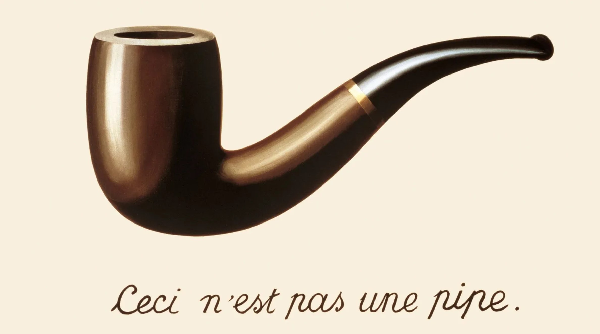

- title: TinyBASIC interpreter | Write your own tiny programming system(s)! (NPRG077)

*****************************************************************************************
- template: title
- class: nologo

# NPRG077
## TinyBASIC: A tiny interactive <br /> imperative programming system

---

**Tomáš Petříček**, 309 (3rd floor)  
_<i class="fa fa-envelope"></i>_ [petricek@d3s.mff.cuni.cz](mailto:petricek@d3s.mff.cuni.cz)  
_<i class="fa-solid fa-circle-right"></i>_ [https://tomasp.net](https://tomasp.net) | [@tomaspetricek](http://twitter.com/tomaspetricek)  
_<i class="fa-solid fa-circle-right"></i>_ https://d3s.mff.cuni.cz/teaching/nprg077


-----------------------------------------------------------------------------------------
- template: image
- class: smaller


# Dijkstra on BASIC

It is practically impossible to teach good program&shy;ming to students that have
had a prior exposure to BASIC: as potential prog&shy;rammers they are mentally
mutilated beyond hope of regeneration.

---

**BASIC as a language?** Meh.

-----------------------------------------------------------------------------------------
- template: lists

# Why look at BASIC?


## BASIC as a programming system

- Right at the birth of microcomputers
- Part of an early computing culture
- Interesting mode of interaction!

## BASIC as a programming problem

- Interpreter with richer state
- Statements vs. expressions
- More interesting F# programming!


*****************************************************************************************
- template: subtitle

# BASIC
## Interaction and emulators

-----------------------------------------------------------------------------------------
- template: image


# Demo
## Writing BASIC in C64 emulator

Realistic machine-level system emulator

All the clever hacks with `POKE` work!

See: [C64 emulator](https://virtualconsoles.com/online-emulators/c64/)

-----------------------------------------------------------------------------------------
- template: lists

# What is interesting about it?


## Learnability
- Your computer boots into BASIC
- Copy games code from magazines

## From novice to hacker
- Simple, but you can do lots with `POKE`

## Interaction mode
- Code editor and REPL at the same time

-----------------------------------------------------------------------------------------
- template: image


# Demo
## My C64 essay

**Explore the interaction**  
How it helps write, test and debug code?

**Not fully accurate**  
Program does not live in memory, `POKE` offsets are wrong

*****************************************************************************************
- template: subtitle

# The F# language
## What you need to know

-----------------------------------------------------------------------------------------
- template: icons

# TinyBASIC
## What F# do you need to know

* *fa-dragon* Project, console and tail recursion
* *fa-scroll* F# language logic and data types
* *fa-shapes* Records, functions, tuples, patterns
* *fa-list-check* List processing using built-in functions

-----------------------------------------------------------------------------------------
- template: subtitle

# Demo
## Project, console, recursion

-----------------------------------------------------------------------------------------
- template: code
- class: smallcode

```ocaml
let point = (1, 10)
let (x, y) = point

(* (int*int) -> (int*int) *)
let rotate (x, y) = (y, x)

(* int -> (int*int) -> (int*int) *)
let moveX by (x, y) = (x + by, y)

(* (int*int) -> int *)
let area (x, y) =
  match x, y with
  | 0, _ | _, 0 -> 0
  | x, y -> x * y

(* (int*int) -> int *)
let area pt =
  match pt with
  | ((0, _) | (_, 0)) -> 0
  | x, y -> x * y
```

# Tuples, patterns and functions

**Tuple type** `int * int` is just another ordinary type of values

**Pattern** `(x,y)` can appear in multiple locations in code

**Functions** can mix arguments and tuples

-----------------------------------------------------------------------------------------
- template: subtitle

# SKETCH
## Tuples and patterns

-----------------------------------------------------------------------------------------
- template: code
- class: smallcode

```ocaml
let l1 = [1; 2; 3; 4]
let l2 = 1::2::3::4::[]
let l3 = [1..4]

(* Pattern matching lists *)
match list with
| [e1; e2] -> (...)
| el::els -> (...)
| [] -> (...)

(* Possible, but not very useful *)
let (e::es) = list
let foo [e1;e2] = (...)

(* Higher-order list functions *)
let twice x = x * x
List.map twice [1..10]
List.map (fun x -> x * x) [1..10]
List.sum [1..10]
```

# List constructors and list patterns

**List type** written as
`list<int>` or `int list`

Constructed using `::` (rare) and
`[..]` (often)

Patterns `::` and `[..]` can appear anywhere, but are partial

-----------------------------------------------------------------------------------------
- template: subtitle

# Demo
## Real-world list processing

-----------------------------------------------------------------------------------------
- template: image



# The pipe operator

**Fluent style for functional data processing**

`let (|>) x f = f x`

In bash scripting (`|`), adopted by R (`%>%`), maybe JavaScript

-----------------------------------------------------------------------------------------
- template: subtitle

# Demo
## Real-world list processing (2/2)

*****************************************************************************************
- template: subtitle

# TinyML
## Interpreter structure

-----------------------------------------------------------------------------------------
- template: code
- class: smaller smallcode

```ocaml
type Value = (* .. *)
type Expression = (* .. *)

type Command =
  (* Jumps and subroutines *)
  | Goto of int
  | GoSub of int
  | Return
  (* I/O operations *)
  | Clear
  | Print of Expression list
  | Input of string
  (* If, variables and control *)
  | If of Expression * Command
  | Assign of string * Expression
  | Run
  | Stop

```

# BASIC interpreter structure (1/2)

**Expressions** evaluate to **Values** and are simple

**Commands** contain all the operations that modify the program state

-----------------------------------------------------------------------------------------
- template: code
- class: smaller smallcode

```ocaml
(* State of the interpreter stores
   program lines as sorted list,
   variables in a dictionary,
   generator for the RND function
   and stack for GOSUB/RETURN *)
type State =
  { Program : list<int * Command>
    Variables : Map<string, Value>
    Random : System.Random
    ReturnStack : int list }

(* Evaluate a command and then
   run the next one (if any)
   until the program ends.
 : State -> (int * Cmd) -> State *)
let rec runCommand state (line, cmd) =
  (* ... *)

(* Find the next line after 'line'
   and run that or stop if none *)
and runNextLine state line =
  (* .. *)
```

# BASIC interpreter structure (2/2)

**State** is the program source code, variables  
(and a few extras)

**Current line** is also  
a part of the state  
(function argument)

-----------------------------------------------------------------------------------------
- template: subtitle

# Demo
## BASIC Hello World

*****************************************************************************************
- template: subtitle

# TinyBASIC
## How the BASIC language works

-----------------------------------------------------------------------------------------
- template: code
- class: smaller

```basic
REM You can write comments!
REM Jumping and calls
GOTO 10
GOSUB 10
RETURN

REM Printing to the screen
POKE 1024 CHR$(42)
PRINT "HELLO ";X

REM Variables and ifs
X=10
IF (X>0) GOTO 10

REM Control
RUN
STOP
```

# BASIC basics

`GOSUB` jumps, but keeps return location on stack  
for `RETURN`

`PRINT` takes a sequence of expressions (and we ignore cursor moving)

`POKE` writes a byte to memory (we will cheat)

We ignore command chaining (`:`)

-----------------------------------------------------------------------------------------
- template: subtitle

# Demo
## Elegant programs with GOSUB :-)

*****************************************************************************************
- template: subtitle

# TinyBASIC
## A bit of theory

-----------------------------------------------------------------------------------------
- template: lists

# Meaning of programs


## Functional languages
- Compositional semantics
- Define meaning of $e_1 + e_2$ in  
  terms of the meaning of $e_1$ and $e_2$

## Imperative languages
- What is the meaning of `PRINT "HI"`?
- What is the meaning of `GOTO 10`?
- Whatever the interpreter does..
- Not very good for program proofs!

-----------------------------------------------------------------------------------------
- template: code
- class: smaller

```basic
 00 REM FACTORIAL IN BASIC
 10 Q=5                                  
 20 N=1                                  
 30 F=1                                  
 40 IF N=Q THEN GOTO 100                 
 50 N=N+1                                
 60 F=F*N                                
 70 GOTO 40                              
100 PRINT F
```

# Reasoning about BASIC programs

**Hoare triples** $\{P\}c\{Q\}$

**Pre-condition $P$** what is true before the command execution

**Post-condition $Q$** what is true after the command execution

-----------------------------------------------------------------------------------------
- template: image
- class: smaller


# Reasoning about BASIC programs

**Postconditions** of a command before have to match
**preconditions** of a command after

Coming up with the right properties is tricky!

*****************************************************************************************
- template: subtitle

# Lab overview
## TinyBASIC system step-by-step

-----------------------------------------------------------------------------------------
- template: content

# TinyBASIC - Basic tasks

1. **Add `GOTO` and better `PRINT` for infinite loop fun!**  
Evaluation of expressions, finding of the next line

1. **Implement interactive program editing**  
Handle commands that edit the program code

3. **Add variables, conditionals, integers and bools**  
Needs `Map<string, Value>` in the program state

3. **Random function and (not quite correct) `POKE`**  
To be able to generate random stars!

4. **A few more functions and operators**  
As required by the Nim (subtraction) game

-----------------------------------------------------------------------------------------
- template: content

# TinyBASIC - Bonus tasks

1. **Add support for more elegant programs with GOSUB**   
Needs `list<int>` (stack of return line numbers) in state

2. **Refactor our Nim code sample to use it**  
Dijkstra will still not be happy, but we avoid repetition

2. **Implement an "AI" player for our Nim game**  
Wikipedia says this is a solved problem :-)

*****************************************************************************************
- template: subtitle

# Closing
## A tiny imperative programming system

-----------------------------------------------------------------------------------------
- template: title

# Conclusions

**A tiny interactive imperative programming system**

- Evaluation logic not that far from TinyML!
- Imperative interpreter needs much more state
- How exactly interactive editing worked?!
- Parsing & interactive editing out of scope :-(

---

**Tomáš Petříček**, 309 (3rd floor)  
_<i class="fa fa-envelope"></i>_ [petricek@d3s.mff.cuni.cz](mailto:petricek@d3s.mff.cuni.cz)  
_<i class="fa-solid fa-circle-right"></i>_ [https://tomasp.net](https://tomasp.net) | [@tomaspetricek](http://twitter.com/tomaspetricek)  
_<i class="fa-solid fa-circle-right"></i>_ https://d3s.mff.cuni.cz/teaching/nprg077
