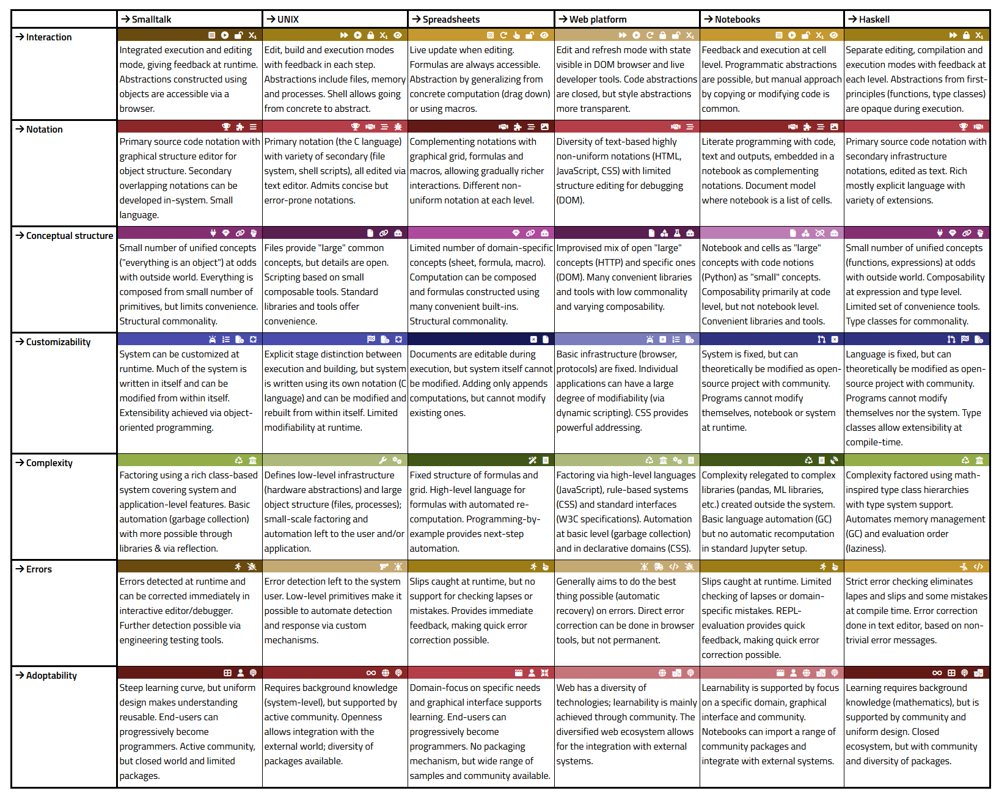
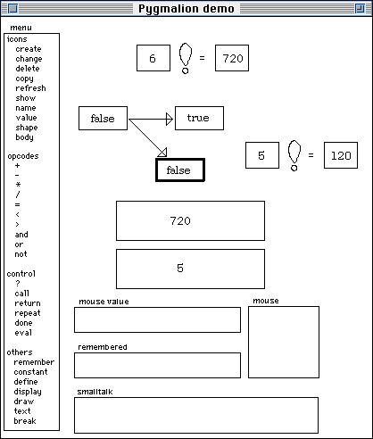
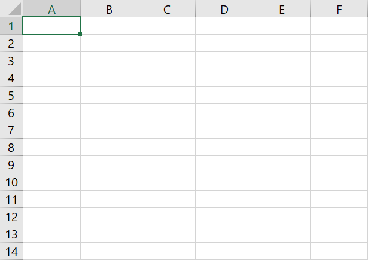
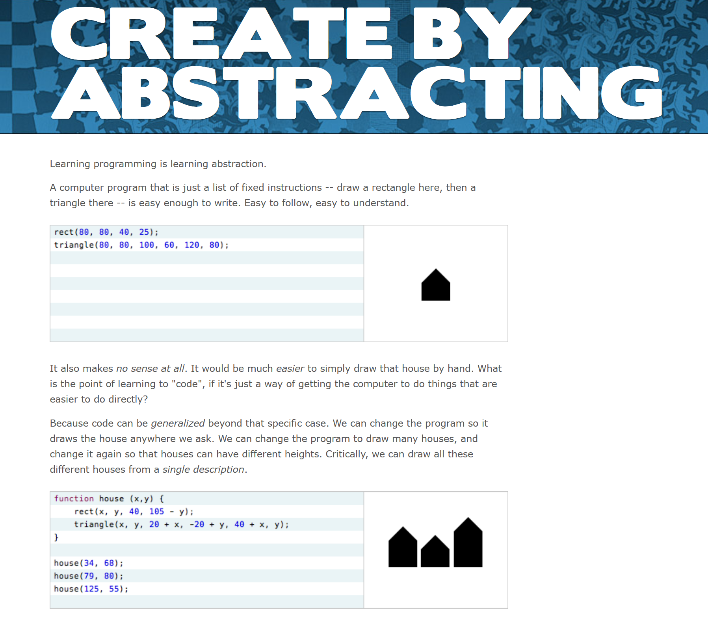

- title: TinyExcel: Tiny incremental spreadsheet system | Write your own tiny programming system(s)! (NPRG077)

*****************************************************************************************
- template: title
- class: nologo

# NPRG077
## **TinyExcel**: Tiny incremental<br /> spreadsheet system

---

**Tomáš Petříček**, 309 (3rd floor)  
_<i class="fa fa-envelope"></i>_ [petricek@d3s.mff.cuni.cz](mailto:petricek@d3s.mff.cuni.cz)  
_<i class="fa-solid fa-circle-right"></i>_ [https://tomasp.net](https://tomasp.net) | [@tomaspetricek](http://twitter.com/tomaspetricek)  
_<i class="fa-solid fa-circle-right"></i>_ https://d3s.mff.cuni.cz/teaching/nprg077


-----------------------------------------------------------------------------------------
- template: content
- class: two-column xtn


# Is Excel real programming?

### It is Turing-complete!

Encoded using "drag-down"


---

### It is widely-used!

Simple, but can do a lot...


<style>.xtn img { max-width:60%; margin:20px 0px 0px 20px; }
.xtn h3 { margin-bottom:10px !important; }</style>

-----------------------------------------------------------------------------------------
- template: icons

# TinyExcel
## What makes spreadsheets interesting?

- *fa-users* Most accessible programming tools!
- *fa-city* Program in a two-dimensional space
- *fa-pen-to-square* Edit and view in the same environment
- *fa-arrows-rotate* Automatic and live sheet recomputation

-----------------------------------------------------------------------------------------
- template: image



# Technical Di&shy;mensions of Programming Systems

(Jakubovic et al., 2023)

**What matters about stateful interactive systems?**

-----------------------------------------------------------------------------------------
- template: subtitle

# Demo
## Excel data exploration basics

-----------------------------------------------------------------------------------------
- template: image
- class: smaller noborder


# Abstraction is hard

**Drag-down for formulas makes abstraction easy**

You only ever work with concrete values

Always see sample inputs & verify sample outputs

-----------------------------------------------------------------------------------------
- template: icons

# TinyExcel
## Scope of the tiny version

- *fa-table-cells* Two-dimensional space with references
- *fa-down-long* "Drag-down" to apply formula to a column
- *fa-file-invoice-dollar* Relative and absolute cell references
- *fa-diagram-project* Incremental computational engine

*****************************************************************************************
- template: subtitle

# TinyExcel
## Technical dimensions

-----------------------------------------------------------------------------------------
- template: lists

# The good and the bad


## High usability

- Live exploratory programming
- Work with concrete values
- Learning from examples

## High-profile errors

- "Growth in the time of debt" errors
- SEPT2, MARCH1 gene names  
  (Septin, Membrane-Associated Ring Finger)

-----------------------------------------------------------------------------------------
- template: largeicons

# Confusing terminology

 - *fa-magnifying-glass* **Exploratory programming**  
   Write, run, rethink with easy editing
 - *fa-image* **Live programming**  
   See results of your program immediately
 - *fa-music* **Live coding**  
   Run immediately, typically audio performance
 - *fa-laptop-code* **Interactive programming**  
   Modify stateful programming system

-----------------------------------------------------------------------------------------
- template: image


# Spreadsheets are...

**Exploratory** - easy to fiddle with data

**Live** - you see results (almost) immediately

-----------------------------------------------------------------------------------------
- template: image


# Concreteness

**Unimate industrial robot (1961)**

Program by moving  
the robotic hand

Macro recording  
but done right

-----------------------------------------------------------------------------------------
- template: lists

# Concrete programming



## Programming by demonstration

- Think macro recording
- How to generalize & re-apply
- "Drag down" in spreadsheets

## Programming by example

- Generalize from input/output list
- Search for fitting program
- Also FlashFill in Excel

-----------------------------------------------------------------------------------------
- template: subtitle

# Demo
## FlashFill in Excel

-----------------------------------------------------------------------------------------
- template: lists

# How people learn Excel


## From existing spreadsheets

- View source of formulas
- Learn how functions work
- Logic needs to be visible!

## Going to the expert

- Every office has Excel "guru"
- Needed for harder aspects
- Needed for use that does not have a "trace"

-----------------------------------------------------------------------------------------
- template: image



# The grid power!

**Humans are good at working with space**

Programs are not typically spatial...

Grid is limiting, but powerful concept

-----------------------------------------------------------------------------------------
- template: icons

# TinyExcel
## Learning from spreadsheets?

- *fa-user-tie* More programming for non-programmers?
- *fa-arrows-rotate* Immediate live feedback is great!
- *fa-shapes* Abstractions from working with concrete values
- *fa-map-location* Programs should exist in understandable space

-----------------------------------------------------------------------------------------
- template: image



# Could "normal" programming be more like this?

**Demos by Bret Victor**


Learnable Program&shy;ming: Designing a programming system for understanding programs
([online](http://worrydream.com/LearnableProgramming/))

*****************************************************************************************
- template: subtitle

# TinyExcel
## Implementation techniques

-----------------------------------------------------------------------------------------
- template: image


# Inter-cell dependencies

In what order to evaluate sheet?

Avoid evaluating  
a cell repeatedly!

What to re-evaluate  
when cells change?

-----------------------------------------------------------------------------------------
- template: image
- class: smaller


# Dependency graphs

Dependencies via cell  
and range references

---

**Cyclic dependencies**

Excel does a fixed maximal number of iterations

---

**Explicit or implicit in code**

Graph data structure vs. event listeners

-----------------------------------------------------------------------------------------
- template: lists
- class: noborder

# Reactive programming


## Different implementations
- Functional Reactive Programming
- ReactiveX (rxjs, RxJava, Rx.Net)
- Elm software architecture

## Implementation techniques
- **Push-based** - Changes propagated from source
- **Pull-based** - Update required by the consumer
- **Builder-based** - Computation to be instantiated

-----------------------------------------------------------------------------------------
- template: icons

# TinyExcel
## Implementation techniques

- *fa-ghost* Naive non-cached recursive starting point
- *fa-bolt* Cell is as graph node with "Updated" event
- *fa-headphones-simple* Depending nodes listen, recompute & notify
- *fa-heart-crack* Tricky error and update handling...

*****************************************************************************************
- template: subtitle

# The F# language
## What we need for Excel

-----------------------------------------------------------------------------------------
- template: lists
- class: condensed

# What we need to write Excel


## Event handling

- F# events are objects (values)
- Can trigger & register handlers

## More tips & tricks

- Collection processing
- Fancy patterns and active patterns

## Finally a user interface?

- Would be nice, but setup costs high...
- Write sheet as HTML document & open

-----------------------------------------------------------------------------------------
- template: content

# Generating lists

**List comprehensions with the yield keyword**

```fsharp
let worldInfo =
  [ yield addr "A1", Const(String "Continent")
    yield addr "B1", Const(String "Population (thousands)")
    for i, (cont, pop) in Seq.indexed continents do
      yield addr ("A"+string(i+2)), Const(String cont)
      yield addr ("B"+string(i+2)), Const(Number pop) ]
```

- `yield` adds another item to the list
- `for` and other constructs to write generators
- `Seq.indexed` trick to get item index

-----------------------------------------------------------------------------------------
- template: subtitle

# Demo
## Extending the List module

-----------------------------------------------------------------------------------------
- template: code

```fsharp
// Decares event value
let evt = Event<int>()

// Trigger event
evt.Trigger(1)
evt.Trigger(2)
evt.Trigger(3)

// Object for listening
evt.Publish

// Listen and print
evt.Publish.Add(fun n ->
  printfn "Got: %d" n)
```

# F# Events

**Regular F# objects**  
Not special constructs

Corresond to `IObservable` in C#

Add and remove handlers using `AddHandler` and `RemoveHandler`

-----------------------------------------------------------------------------------------
- template: subtitle

# Demo
## Working with F# events

-----------------------------------------------------------------------------------------
- template: content

# Writing and opening HTML files

**If you know C#, you can use other options too!**

```fsharp
let demo () =
  let f = Path.GetTempFileName() + ".html"
  use wr = new StreamWriter(File.OpenWrite(f))
  wr.Write("""<html><body><h1>Hello world!</h1></body></html>""")
  wr.Close()
  Process.Start(f)
```

- `GetTempFileName` gives you a file in TEMP folder
- `use` to make sure stream gets closed on error
- `Process.Start` can (sometimes) open files too

*****************************************************************************************
- template: subtitle

# TinyExcel
## Implementation structure

-----------------------------------------------------------------------------------------
- template: code

```fsharp
// In column, row format
// e.g. A1 becomes (1, 1)
type Address = int * int

// Note error is a value!
type Value =
  | Number of int
  | String of string
  | Error of string

// Operators are functions
type Expr =
  | Const of Value
  | Reference of Address
  | Function of string * Expr list

// Using immutable F# map
type Sheet = Map<Address, Expr>
```

# Simple start

**Standard ML-like expression language**

References (instead  
of variables) are evaluated recursively

**Sheet maps (filled) addresses to expressions**

-----------------------------------------------------------------------------------------
- template: code

```fsharp
// Expression and value are
// mutable. Updated triggered
// when they change.
type CellNode =
  { mutable Value : Value
    mutable Expr : Expr
    Updated : Event<unit> }

// Immutable map
// of mutable cells
type LiveSheet =
  Map<Address, CellNode>
```

# Version with the dependency graph

**Value evaluated**  
on creation which prevents circular refs

**Expression stored**  
"drag down" expansion

**Updated event**  
to notify of changes

-----------------------------------------------------------------------------------------
- template: lists

# Advanced extensions


## Ranges and array values

```fsharp
type Value = // (...)
  | Array of Value list

type Expr = // (...)
  | Range of Address * Address
```

## Absolute addresses

```fsharp
type Index = Fixed of int | Normal of int
type RawAddress = int * int
type Address = Index * Index
```


*****************************************************************************************
- template: subtitle

# Lab overview
## TinyExcel step-by-step

-----------------------------------------------------------------------------------------
- template: content

# TinyExcel - Basic tasks

1. **Simple expression evaluator**  
   With grid references by cell address

1. **"Drag down" formula expanding**  
   Relocating relative references in formula

1. **Reactive event-based computation**  
   Implicit dependency graph via events

1. **Rendering sheets as HTML pages**  
   First step towards a user interface

-----------------------------------------------------------------------------------------
- template: content

# TinyExcel - Bonus and super tasks

1. **Absolute and relative addresses**  
   Alongside with improved "drag down"

1. **Adding range selection and array values**  
   Required for the SUM function

1. **Support for sheet live editing**  
   Updating cells and dependency graph nodes

1. **Adding change visualization**  
   Tracking and showing what has changed

*****************************************************************************************
- template: subtitle

# Closing
## Tiny incremental spreadsheet system

-----------------------------------------------------------------------------------------
- template: lists

# Where can you use this...


## Financial systems

- Live financial models
- Incremental computation  
  with dependency graph

## Interesting programming systems

- Live programming systems
- Future more usable programming tools!

-----------------------------------------------------------------------------------------
- template: title

# Conclusions

**A tiny incremental spreadsheet system**

- Computation as dependency graph
- Working with two-dimensional grid
- Good old (ML-like) expressions

---

**Tomáš Petříček**, 309 (3rd floor)  
_<i class="fa fa-envelope"></i>_ [petricek@d3s.mff.cuni.cz](mailto:petricek@d3s.mff.cuni.cz)  
_<i class="fa-solid fa-circle-right"></i>_ [https://tomasp.net](https://tomasp.net) | [@tomaspetricek](http://twitter.com/tomaspetricek)  
_<i class="fa-solid fa-circle-right"></i>_ https://d3s.mff.cuni.cz/teaching/nprg077

-----------------------------------------------------------------------------------------
- template: content

https://direct.mit.edu/books/book/3071/Spreadsheet-Implementation-TechnologyBasics-and
(hard to get...)

https://www.theregister.com/2020/12/04/microsoft_excel_lambda/

https://www.felienne.com/archives/2974

https://arxiv.org/ftp/arxiv/papers/1807/1807.08578.pdf

https://theconversation.com/the-reinhart-rogoff-error-or-how-not-to-excel-at-economics-13646

https://genomebiology.biomedcentral.com/articles/10.1186/s13059-016-1044-7

https://advait.org/publications-web/sarkar-2018-spreadsheet-learning
