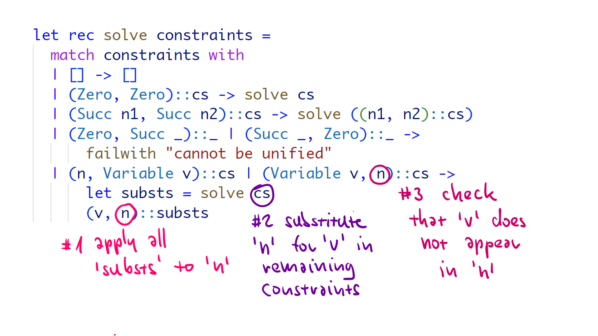

- title: TinyHM: Tiny Hindley-Milner type inference | Write your own tiny programming system(s)! (NPRG077)

*****************************************************************************************
- template: title
- class: nologo

# NPRG077
## **TinyHM**: Tiny Hindley-Milner<br /> type inference

---

**Tomáš Petříček**, 309 (3rd floor)  
_<i class="fa fa-envelope"></i>_ [petricek@d3s.mff.cuni.cz](mailto:petricek@d3s.mff.cuni.cz)  
_<i class="fa-solid fa-circle-right"></i>_ [https://tomasp.net](https://tomasp.net) | [@tomaspetricek](http://twitter.com/tomaspetricek)  
_<i class="fa-solid fa-circle-right"></i>_ https://d3s.mff.cuni.cz/teaching/nprg077


-----------------------------------------------------------------------------------------
- template: largeicons

# Not a programming system!?

- *fa-keyboard* **An important part of the ML experience**  
  Makes ML practical and OCaml efficient

- *fa-hat-wizard* **Learn some subtle aspects of F# type inference**  
  Some discovered late through proofs and errors

- *fa-cogs* **Good example of constraint solving...**  
  Important technique, used in Prolog & elsewhere

-----------------------------------------------------------------------------------------
- template: image
- class: smaller


# Origins of ML

**LCF theorem prover**

ML used for writing  
meta-programs to generate proofs

Types used to ensure  
the validity of proofs

-----------------------------------------------------------------------------------------
- template: icons

# Hindley-Milner
## A brief history of type inference

- *fa-scroll* **Hindley (1969)** for Combinatory Logic
- *fa-code* **Milner (1978)** for ML with polymorphism
- *fa-square* **Damas (1985)** with formal analysis and proofs
- *fa-rocket* **Since then** - type classes, other extensions

-----------------------------------------------------------------------------------------
- template: image


# Demo
## Coeffects playground

[Constraint solver  
code on GitHub](https://github.com/coeffects/coeffects-playground/blob/master/solver.fs)

*****************************************************************************************
- template: subtitle

# ML type inference
## How does F# figure out the types?

-----------------------------------------------------------------------------------------
- template: subtitle

# Demo
## Basic type inference in F#

-----------------------------------------------------------------------------------------
- template: lists

# How F# type inference works


## Constraint-based
- Collect & solve constraints
- No annotations needed for ML!

## Let polymorphism
- Infer generic type of let-bound functions

## Limitations in ML and F#
- Value restriction for generic values
- Harder to deal with .NET objects

-----------------------------------------------------------------------------------------
- template: subtitle

# Demo
## Type inference limitations in F#

*****************************************************************************************
- template: subtitle

# TinyHM
## A bit of theory

-----------------------------------------------------------------------------------------
- template: lists
- class: bigger

# Type systems


## Typing rules

Given a typing context $\Gamma$, the   
expression $e$ has a type $\tau$

## The problem in general

We know some of these,  
want to figure out the rest

-----------------------------------------------------------------------------------------
- template: lists

# Type systems


## Type checking
- Know it all. Check derivation exists!
- Easy for syntax-driven rules

## Type inference
- Know expression. Figure out the type!
- Ideally most general (best) type

## Program synthesis
- Not typical setting, but for completeness...

-----------------------------------------------------------------------------------------
- template: image


# Principal type (most general)

**Best type of  
an expression**

Any other type of the expression is a special case (subtype) of it

-----------------------------------------------------------------------------------------
- template: icons

# Type inference

- *fa-square-check* **How Hindely-Milner type inference works?**  
  Produces most general type (for ML)

- *fa-square-xmark* **How Hindely-Milner type inference breaks?**  
  Nominal types with members, interfaces, etc.

- *fa-circle-question* **Alternative methods for type inference**  
  Bidirectional - combines checking and inference

*****************************************************************************************
- template: subtitle

# TinyHM
## Constraint generation & solving

-----------------------------------------------------------------------------------------
- template: image


# Two phase process

**Generate constraints**  
Recursively over expression

**Solve constraints**  
Recursively over constraint set

---

In the "Algorithm W", the two are combined.
We separate them!

-----------------------------------------------------------------------------------------
- template: code
- class: smaller

```ocaml
(* Basic types with
   type variables *)
type Type =
  | TyNumber
  | TyVariable of string
  | TyFunction of Type * Type
  | TyList of Type

(* Constraint specifies
   that one type should be
   unified with another *)
type Constraint =
  Type * Type
```

# What is a constraint?

**A pair of types that  
should be unified**

Easy or impossible  
`int = int -> int`  
`int list = int list`

Tricky with variables  
`'a = int -> 'b`  
`'a = 'c -> int`

-----------------------------------------------------------------------------------------
- template: icons

# TinyHM
## Constraint generation

- *fa-arrows-rotate* Generate type and constraints recursively
- *fa-spray-can-sparkles* Generate new fresh type variables as needed
- *fa-book* Variables with new type variables in context
- *fa-list-check* Most checking done via constraints

-----------------------------------------------------------------------------------------
- template: subtitle

# Sketch
## Generating constraints

-----------------------------------------------------------------------------------------
- template: lists

# Constraint solver structure


## Simplest possible example
- Peano numbers: `Zero`, `Succ(x)`
- Equality constraints with variables
- e.g. `Succ(x) = Succ(Succ(Zero))`

## Creating a solver
- Discharge matching constraints
- Fail on mismatching constraints
- Generate more for matching nested
- Needs to handle substitutions...

-----------------------------------------------------------------------------------------
- template: subtitle

# Demo
## Solving numerical constraints

-----------------------------------------------------------------------------------------
- template: image



# Remaining work

**Substitution (#1)**
Replace variable in remaining constraints

**Substitution (#2)**  
Apply substitutions  
to assigned type

**Occurs check (#3)**
Check for unsolvable constraints

-----------------------------------------------------------------------------------------
- template: subtitle

# Demo
## Substitutions and occurs check

*****************************************************************************************
- template: subtitle

# TinyHM
## Inference code structure

-----------------------------------------------------------------------------------------
- template: code

```ocaml
(* All possible types you may
   support: type variables,
   primitives and composed *)
type Type =
  | TyVariable of string
  | TyBool
  | TyUnit
  | TyNumber
  | TyFunction of Type * Type
  | TyTuple of Type * Type
  | TyUnion of Type * Type
  | TyList of Type
  | TyForall of string * Type

(* Types of known variables *)
type TypingContext =
  Map<string, Type>  
```

# Types supported

**Type variables**  
For constraint solving!

**Primitive types**  
Match/mismatch

**Composed types**  
Generate one or two new constraints

**Polymorphic type**  
Forall (bonus)


-----------------------------------------------------------------------------------------
- template: code

```ocaml
(* Given a list of
   constraints, produce a
   list of substitutions *)
val solve :
  list<Type * Type>
  -> list<string * Type>

(* Given a typing context
   (known variables) and
   expression, return the type
   of the expression and
   list of constraints *)
val generate :
  TypingContext
  -> Expression
  -> Type * list<Type * Type>
```

# Type inference operations

**Constraint solving**  
Takes constraints  
Produces substitution

**Constraint generating**
Takes an expression  
Produces constraints  
Also check variables

*****************************************************************************************
- template: subtitle

# Lab overview
## Tiny Hindley-Milner step-by-step

-----------------------------------------------------------------------------------------
- template: content

# TinyHM - Basic tasks

1. **Complete the simple numerical constraint solver**  
Add the two missing substitutions to make it work!

1. **Solving type constraints with numbers and Booleans**   
Follow the same structure, but now for type constraints...

1. **Type inference for binary operators and conditionals**  
Add constraint generation for a subset of TinyML

1. **Supporting more TinyML expressions**  
Add let, functions, application and occurs check

1. **Adding simple data types**  
Constraint generation for tuples

-----------------------------------------------------------------------------------------
- template: content

# TinyHM - Bonus & super tasks

1. **Supporting more TinyML data types**  
Add type checking for discriminated unions

1. **Type inference for lists - poor method**  
Add recursion & units and try this on list code!

1. **Adding proper support for generic lists**  
New type, but without explicit type declarations

1. **Inferring polymorphic code for let bindings**  
Implementing proper Hindley-Milner let-polymorphism  

1. **Exploring pathological cases**  
Did you know HM has DEXPTIME complexity?

*****************************************************************************************
- template: subtitle

# Closing
## Tiny Hindley-Milner type inference

-----------------------------------------------------------------------------------------
- template: title

# Conclusions

**Tiny Hindley-Milner type inference**

- A remarkable quality of ML language(s)
- Cannot expect users to write types by hand!
- Nice introduction to constraint solving
- Much more can be done with this idea...

---

**Tomáš Petříček**, 309 (3rd floor)  
_<i class="fa fa-envelope"></i>_ [petricek@d3s.mff.cuni.cz](mailto:petricek@d3s.mff.cuni.cz)  
_<i class="fa-solid fa-circle-right"></i>_ [https://tomasp.net](https://tomasp.net) | [@tomaspetricek](http://twitter.com/tomaspetricek)  
_<i class="fa-solid fa-circle-right"></i>_ https://d3s.mff.cuni.cz/teaching/nprg077

