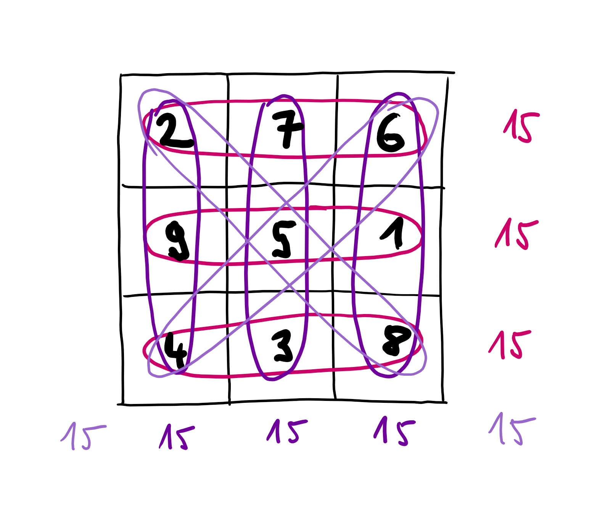

- title: TinyProlog: Tiny declarative logic programming language | Write your own tiny programming system(s)! (NPRG077)

*****************************************************************************************
- template: title
- class: nologo

# NPRG077
## **TinyProlog**: Tiny declarative logic programming language

---

**Tomáš Petříček**, 309 (3rd floor)  
_<i class="fa fa-envelope"></i>_ [petricek@d3s.mff.cuni.cz](mailto:petricek@d3s.mff.cuni.cz)  
_<i class="fa-solid fa-circle-right"></i>_ [https://tomasp.net](https://tomasp.net) | [@tomaspetricek](http://twitter.com/tomaspetricek)  
_<i class="fa-solid fa-circle-right"></i>_ https://d3s.mff.cuni.cz/teaching/nprg077


-----------------------------------------------------------------------------------------
- template: icons

# Logic programming

- *fa-receipt* **Declarative style** - specify what, but not how
- *fa-list-check* Programs consists of **facts and rules**
- *fa-lightbulb* Evaluation by clever **inference engine**
- *fa-database* **Prolog, Datalog** and basis of other systems
- *fa-language* Origins in AI and **natural language**

-----------------------------------------------------------------------------------------
- template: content
- class: noborder two-column

# From inference to programming

### Type inference

- Program analysis
- Generated constraints
- Unification of types
- Infer type assignment
- Unification + substitution

----

### Logic programming

- Program evaluation
- Handwritten programs
- Unification of terms
- Infer variable assignment
- Unification + substitution

-----------------------------------------------------------------------------------------
- template: image


# A bit of history

Natural language processing in the late 1960s & early 1970s

**SHRDLU, PLANNER**

"Find a block which is taller than the one you are holding and put it into the box."

-----------------------------------------------------------------------------------------
- template: lists
- class: noborder

# Prolog then and now


## Alain Colmerauer, Marseilles (1972)

- Natural language processing
- Automatic theorem proving

## Fifth generation systems (1980s)

- 10 year initiative in Japan
- Epoch-making knowledge processing

## Prolog (and Datalog) today

- Used in real-world in specialized domains
- Basic of many reasoning & solving systems

*****************************************************************************************
- template: subtitle

# TinyProlog
## Logic programming by example

-----------------------------------------------------------------------------------------
- template: lists

# Prolog "Hello world"


## Family tree querying

- Simple database querying
- Search for data patterns
- Grandparent (parent of a parent)  
  Father (parent who is male)

## List processing

- Linked lists with "cons" and "nil"
- Matching lists with patterns
- Many functions become multi-purpose

-----------------------------------------------------------------------------------------
- template: subtitle

# Demo
## Family tree and lists

-----------------------------------------------------------------------------------------
- template: image



# Magic squares

**Naive method**  
Generate & test  
all permutations

**Better approaches**  
Try adding only reasonable options

**Naive is fine for us!**

-----------------------------------------------------------------------------------------
- template: subtitle

# Demo
## Generating magic squares


*****************************************************************************************
- template: subtitle

# TinyProlog
## A bit of theory

-----------------------------------------------------------------------------------------
- template: lists

# Model of knowledge


## Closed world assumption

- Only declared facts are true
- No unknown children exist!
- Shapes the semantics of Prolog

## Negation in Prolog

- **Yes** means provably true
- **No** means not provably true  
- False only in a closed world

-----------------------------------------------------------------------------------------
- template: lists

# Theory behind resolution


## Prolog programs as logic clauses

- Horn clause: $A \leftarrow B_1 \wedge B_2 \wedge \ldots \wedge B_n$  
- Equivalent: $A \vee \neg B_1 \vee \neg B_2 \vee \ldots \vee \neg B_n$

## SLD resolution in Prolog

- Sound and refutation-complete  
  resolution for Horn clauses
- Will prove 'false' if possible

-----------------------------------------------------------------------------------------
- template: content

# Variables in Prolog clauses

Universally quantified over formula, existentially over body

$\forall x \forall y (grandparent(x, y) \leftarrow \exists z (parent(x, z) \wedge parent(z, y)))$  

---

Transformed using standard logical operations

$\forall x \forall y (grandparent(x, y) \vee \neg \exists z (parent(x, z) \wedge parent(z, y)))$
$\forall x \forall y (grandparent(x, y) \vee \forall z \neg (parent(x, z) \wedge parent(z, y)))$
$\forall x \forall y \forall z (grandparent(x, y) \vee \neg parent(x, z) \vee \neg parent(z, y))$

---

We need to use free variables when applying rule!

-----------------------------------------------------------------------------------------
- template: icons

# Numbers
## Calculating inside Prolog

- *fa-forward-step* Peano arithmetic encoded as zero & successor
- *fa-plug* Constraint Logic Programming (CLP) extensions
- *fa-arrow-up-1-9* CLP(Z) adds a specialized solver for integers
- *fa-layer-group* CLP(B), CLP(Q), CLP(R) and more

-----------------------------------------------------------------------------------------
- template: lists

# Cyclic terms and occurs check


## Occurs check
- Avoid terms of the form `A = f(A)`
- Supports rational trees (cyclic terms)
- Not checking is faster, but not right

## Practical Prolog
- Some operations can fail:  
  `A = 1 + A, B is A.`
- Checks can be turned on:  
  `set_prolog_flag(occurs_check, true).``

-----------------------------------------------------------------------------------------
- template: subtitle

# Demo
## Enabling occurs check

*****************************************************************************************
- template: subtitle

# TinyProlog
## Implementation structure

-----------------------------------------------------------------------------------------
- template: image


# TinyProlog programs

**Program is a list of clauses which are:**

1) Rules (head + body)
2) Facts (head)

**A term can be:**

1) Variable  
2) Atom  
3) Predicate  

-----------------------------------------------------------------------------------------
- template: code

```ocaml
(* Recursive term definition *)
type Term =
  | Atom of string
  | Variable of string
  | Predicate of
      string * Term list
  | Call of Term * Term list

(* Facts have empty Body *)
type Clause =
  { Head : Term
    Body : Term list }

(* Create a fact clause *)
let fact p =
  { Head = p; Body = [] }

(* Create a rule clause *)
let rule p b =
  { Head = p; Body = b }
```

# TinyProlog programs

Encoded as F# types!

**Atom vs. variable**

Atom is a single data item, thing that exists.

Variable is a place&shy;holder that we want to assign a term to.

-----------------------------------------------------------------------------------------
- template: largeicons

# Prolog resolution logic

- *fa-magnifying-glass* **Start with user query as the goal**  
  Single (or multiple) term(s) with unbound variables

- *fa-cat* **Find applicable rule/fact by matching its head**  
  Unification to check if the rule can be applied

- *fa-book* **Generate substitution from the matching**  
  Substitution generated by unification process  

- *fa-rotate-right* **Add goals based on the rule body**  
  Apply substitution and repeat until all goals solved

-----------------------------------------------------------------------------------------
- template: lists

# The unification process


## Tiny implementation
- Similar to our type inference code!
- `unify` and `unifyLists` functions
- Generate substitution for variables

## Used in Prolog context
- Same 2 uses of substitution
- Occurs check done optionally
- Use fresh set of variables when  
  reusing rules from program database!

-----------------------------------------------------------------------------------------
- template: code
- class: smallcode

```ocaml
let rec unifyLists l1 l2 =
  match l1, l2 with
  | [], [] ->
      (* empty substitution*)
  | h1::t1, h2::t2 ->
      match unify h1 h2 with
      | Some(s) -> (*
         1. substitution 's' to
            unify 'h1' and 'h2'
         2. now unifiy 't1' and 't2'
            recursively & compose
         3. if not possible, fail *)
      | _ -> (* fail *)
  | _ -> (* fail *)

and unify t1 t2 =
  match t1, t2 with
  | Atom(a1), Atom(a2) -> (* does 'a1' match 'a2'? *)
  | Variable(v), t | t, Variable(v) ->
      (* return a substitution *)
  | Predicate(p1, args1), Predicate(p2, args2) ->
      (* if p1 = p2, unify arguments recursively *)
  | _ -> None
```

# Unification logic

Split into two functions for better readability

`unify` matches terms

`unifyLists` matches two lists using `unify`

-----------------------------------------------------------------------------------------
- template: code
- class: smaller

```prolog
% Number: 0
zero

% Number: 1
one = s(zero)

% Number: 5
five = s(s(s(s(s(zero)))))

% Empty list
empty

% List [1]
cons(one, empty)

% List [1; 5]
cons(one, cons(five, empty))
```

# Adding support for numbers and lists

**Nothing extra is needed!**

Good enough for a tiny implementation.

Terribly inefficient and limited if you want to calculate anything!

*****************************************************************************************
- template: subtitle

# The F# language
## Useful advanced features

-----------------------------------------------------------------------------------------
- template: lists

# Advanced F# features


## Active patterns

- Custom patterns for use in `match`
- Match number with `Odd` or `Even`
- Recognize special forms of terms
- Complete or partial patterns

## Sequence expressions

- Write code that generates a sequence of items
- Comprehensions (Haskell), generators (JS), ...
- Lazy `seq {..}` or eager `[..]` or arrays `[|..|]`

-----------------------------------------------------------------------------------------
- template: subtitle

# Demo
## Advanced F# features

*****************************************************************************************
- template: subtitle

# Lab overview
## TinyProlog system step-by-step

-----------------------------------------------------------------------------------------
- template: content

# TinyProlog - Basic tasks

1. **Implementing basic unification of terms**  
   Recursively match atoms, variables and predicates

2. **Composing and applying substitutions**  
   To handle multiple occurrences of a variable correctly

3. **Searching clauses & variable renaming**  
   Find applicable rules and relevant facts in program

4. **Generating and proving goals recursively**  
   The key trick! Generate and solve goals in a loop

5. **Adding numbers to TinyProlog**  
   Representing, calculating and pretty printing

-----------------------------------------------------------------------------------------
- template: content

# TinyProlog - Bonus and super tasks

6. **Lazy search and support for lists**  
   Refactoring for readability and more pretty printing

7. **Generating magic squares in TinyProlog**  
   In which we find out how slow our implementation is :-)

8. **Implementing call and functional maplist**  
   Adding special predicate for higher-order programming

9. **Adding support for occurs checks**  
   If you want to make it slower and more correct

10. **Implementing Prolog-style cut operator**  
   Super-bonus if you are into Prolog programming...

*****************************************************************************************
- template: subtitle

# Closing
## A tiny logic programming language

-----------------------------------------------------------------------------------------
- template: title

# Conclusions

**A tiny declarative logic programming language**

- Remarkably similar to ML type inference!
- This is not a coincidence...
- Evaluation as search, not a sequence of steps
- Much work needed to make this practical

---

**Tomáš Petříček**, 309 (3rd floor)  
_<i class="fa fa-envelope"></i>_ [petricek@d3s.mff.cuni.cz](mailto:petricek@d3s.mff.cuni.cz)  
_<i class="fa-solid fa-circle-right"></i>_ [https://tomasp.net](https://tomasp.net) | [@tomaspetricek](http://twitter.com/tomaspetricek)  
_<i class="fa-solid fa-circle-right"></i>_ https://d3s.mff.cuni.cz/teaching/nprg077

-----------------------------------------------------------------------------------------
- template: content

http://alain.colmerauer.free.fr/alcol/ArchivesPublications/PrologHistory/19november92.pdf

https://www.metalevel.at/prolog/clpz

https://github.com/Naereen/Tiny-Prolog-in-OCaml/

https://yanniss.github.io/next-paradigm-onward19.pdf

https://tgifernando.files.wordpress.com/2013/01/sld_resolution-4spp.pdf
