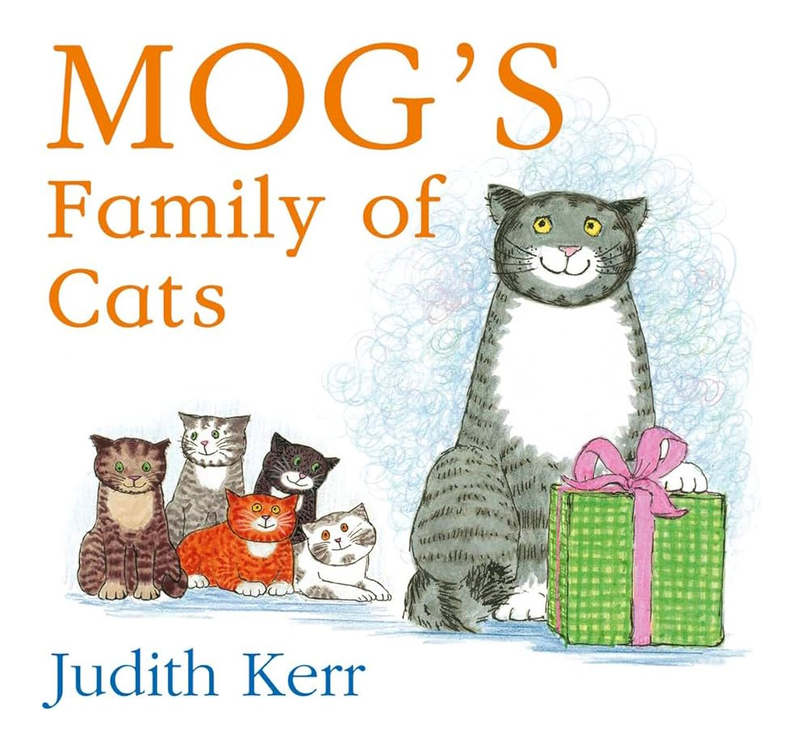
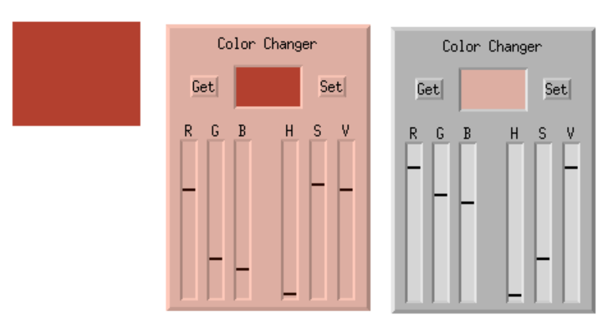
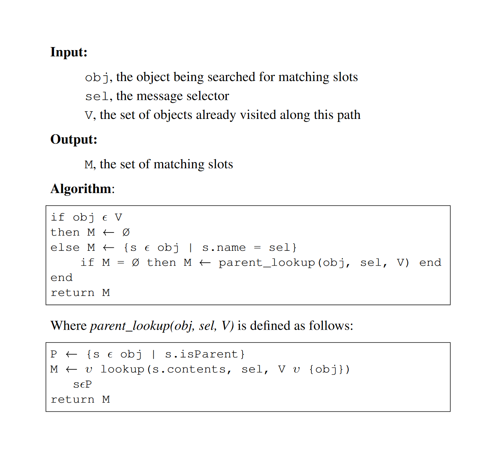
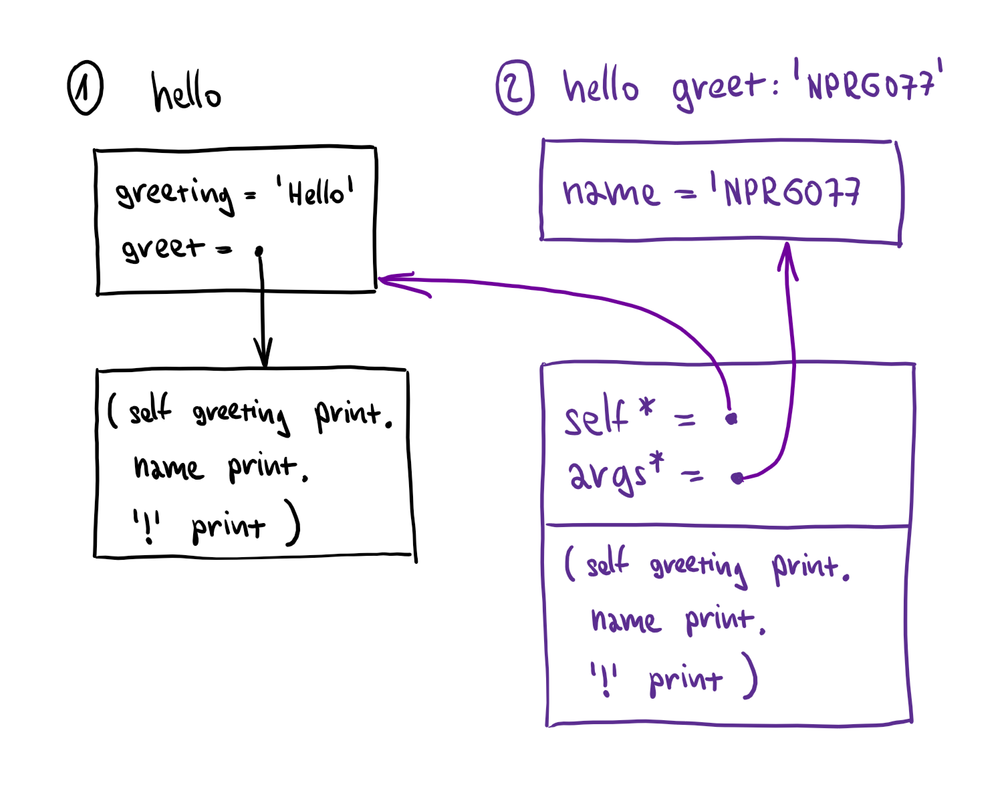
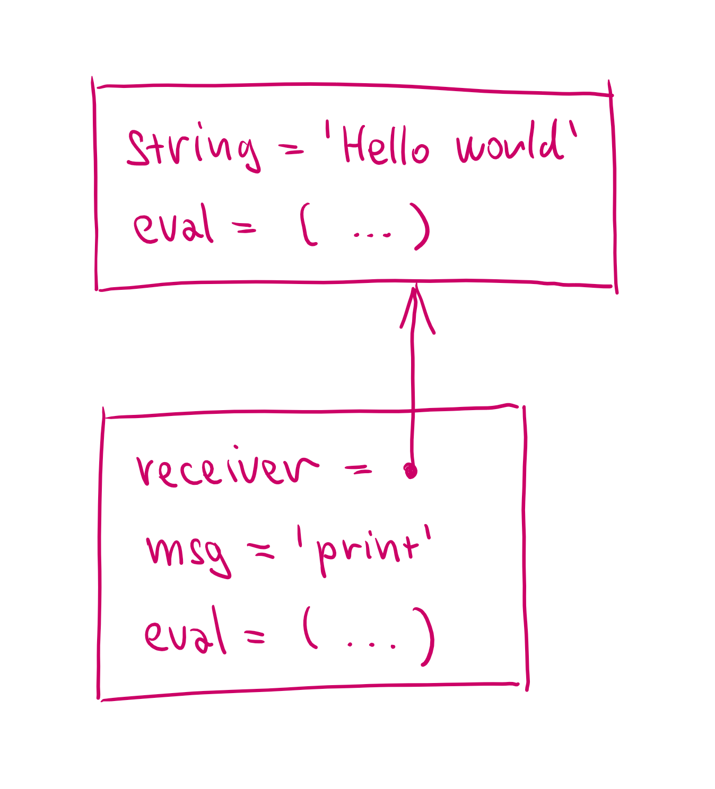

- title: TinySelf: Tiny prototype-based object-oriented language | Write your own tiny programming system(s)! (NPRG077)

*****************************************************************************************
- template: title
- class: nologo

# NPRG077
## **TinySelf**: Tiny prototype-based<br /> object-oriented language

---

**Tomáš Petříček**, 309 (3rd floor)  
_<i class="fa fa-envelope"></i>_ [petricek@d3s.mff.cuni.cz](mailto:petricek@d3s.mff.cuni.cz)  
_<i class="fa-solid fa-circle-right"></i>_ [https://tomasp.net](https://tomasp.net) | [@tomaspetricek](http://twitter.com/tomaspetricek)  
_<i class="fa-solid fa-circle-right"></i>_ https://d3s.mff.cuni.cz/teaching/nprg077


-----------------------------------------------------------------------------------------
- template: image
- class: smaller


# Object-orientation

**Dynamic lookup** - object chooses how to respond

**Abstraction** - object state can be hidden from user

**Subtyping** - any compatible object can be used

**Inheritance** - reuse to implement a new object

-----------------------------------------------------------------------------------------
- template: content
- class: three-column

# Brief history

### Origins of object orientation _(1960s-70s)_

Algol-based and scientific Simula  

Tools for thought and messaging in Smalltalk

---

### Conceptual development _(1980s)_

Rigorous Eiffel and "serious" C++  

Prototypes and materialized objects in Self

---

### Commercial refinement _(1990s-2000s)_

Class-based safe Java and C#

Prototypes in JavaScript and typed TypeScript

-----------------------------------------------------------------------------------------
- template: lists

# Why TinySelf?


## "Pure" object-orientation

- Simple, uniform system
- Everything is an object (for real)
- Simpler than class-based Smalltalk

## Shows the potential of objects

- Not Java-style organization of code
- Objects and graphical interfaces!
- Objects with introspection and debugging!

-----------------------------------------------------------------------------------------
- template: image
- class: smaller


# Self & Morphic user interface framework

**Visual programming**

Programming by graphically manipulating objects on screen

**Direct programming**

Objects on screen *are* objects in the system

-----------------------------------------------------------------------------------------
- template: subtitle

# Demo
## (Not so) Tiny Smalltalk

-----------------------------------------------------------------------------------------
- template: icons

# TinySelf
## Scope of the implementation

- *fa-diagram-project* Prototype-based multiple inheritance
- *fa-play* Methods with simple interpreted code
- *fa-table-list* Explaining basic runtime structures
- *fa-gear* Inaccurate interpreter in "Self style"
- *fa-square-check* Sketch of what UI framework might look like

*****************************************************************************************
- template: subtitle

# TinySelf
## Self programming paradigm

-----------------------------------------------------------------------------------------
- template: lists

# Everything is an object


## Really everything

- Objects, methods, lambdas, expressions, activation records
- Object has lists of slots and   
  optionally contains code

## Obect = slots* + code?

- Data object has just slots
- Method object has code
- Closure has code and slots!
- Data object has methods as slots

-----------------------------------------------------------------------------------------
- template: code

```fsharp

// Object consists of zero or more
// slots and optionally code
type Objekt =
  { mutable Code : Objekt option
    mutable Slots : Slot list }

// A slot has name and contents;
// Some slots are parents
and Slot =
  { Name : string
    Contents : Objekt
    IsParent : bool }

```

# TinySelf objects

**Object consists of zero or more slots and optional code!**

In Self parent slot names end with *

TinySelf objects can  
also be special things

-----------------------------------------------------------------------------------------
- template: content
- class: catsimg




<style type="text/css">.catsimg img {
  max-width:360px;
  max-height:360px; float:left; margin:20px; }</style>

-----------------------------------------------------------------------------------------
- template: image
- class: noborder smaller


# Prototypes and slots

Message send looks at target object first,
then searches parents

```csharp
cheshire name  // OK
cheshire book  // OK

larry name  // OK
larry book  // Fail
```

Message send fail if none or multiple slots found

-----------------------------------------------------------------------------------------
- template: subtitle

# Demo
## Representing cats in Self

-----------------------------------------------------------------------------------------
- template: code

```js
"""Data object with name"""
(| book = 'Alice in Wonderland' |)

"""Method with  some code"""
( self name printLine )

"""Data object with parent
 slot and a 'speak' method"""
(| parent* = cat
   name = 'Cheshire Cat'
   speak = (
     self sound printLine
   )
|)

"""Data access or method call"""
cheshire name
cheshire speak
```

# Message sending

Lookup slot with a matching name, then:

* If it contains data object, it is returned
* If it contains method, the method is called

Assignment slots and special calls differ...

-----------------------------------------------------------------------------------------
- template: subtitle

# Demo
## Hello world, traits and cloning

-----------------------------------------------------------------------------------------
- template: lists

# The power of simplicity...



## Simplicity and uniformity

- All objects can be opened!
- Activation records for debugging
- Self-sustainable system

## Morphic framework

- Things on screen are objects!
- Object with a morph prototype can draw itself
- User interface is just morphs - no special code!

-----------------------------------------------------------------------------------------
- template: subtitle

# Demo
## Morphic and graphical objects

*****************************************************************************************
- template: subtitle

# The F# language
## What we need for TinySelf

-----------------------------------------------------------------------------------------
- template: lists
- class: smaller

# Mutable records in F#


## Defining mutable objects

- Records with `mutable` fields
- We could use classes too

## Equality and records

- Still use structural equality by default
- Not if records (can) contain functions!
- `ReferenceEquality` attribute to override

-----------------------------------------------------------------------------------------
- template: code

```fsharp
type Person =
  { mutable Name : string
    mutable Book : string option }

let setName n p =
  p.Name <- n
let setBook b p =
  p.Book <- Some b

let x = { Name = "Bill"; k = None }
x |> setName "William"
x |> setBook "Alice in Wonderland"

match x with
| { Book = Some book } ->
  printfn "%s likes %s" x.Name book
| _ ->
  printfn "%s is sad :-(" x.Name
```

# Mutable records

**Helper functions**  
Make code a bit nicer  
Can support `|>` pipe

**Pattern matching**  
Same as immutable  
Nice data extraction!

-----------------------------------------------------------------------------------------
- template: subtitle

# Demo
## Working with mutable records

-----------------------------------------------------------------------------------------
- template: content
- class: two-column smallcode

# TinySelf programming style

### Different than before!

**Everything is an `Objekt`**  
Type definition stays  
We change what we put in!

**Uniformity has drawbacks**
Everything type checks!

---

### Helper methods

**Simplify object construction**

```fsharp
let makeString s =
  makeDataObject [
    makeParentSlot "parent*"
      stringPrototype
    makeSlot "value"
      (makeSpecial(String s))
    makeAssignmentSlot "value"
  ]
```

*****************************************************************************************
- template: subtitle

# TinySelf
## Key implementation tricks

-----------------------------------------------------------------------------------------
- template: icons

# TinySelf
## Key implementation tricks

- *fa-display* How Self puts things on screen!
- *fa-diagram-project* Slot lookup in parent objects
- *fa-envelope* Message send to method/data slots
- *fa-table-list* Activation records and calling
- *fa-code* How TinySelf represents expressions

-----------------------------------------------------------------------------------------
- template: image
- class: smaller


# How Self-like systems put things on screen?

---

**Escape hatch is a must**  
Smalltalk system calls  
Self primitive calls  
(primitives primitiveList)

**TinySelf special objects**  
Primitive string values  
Native F# methods

-----------------------------------------------------------------------------------------
- template: code
- class: smallcode

```fsharp
// Special TinySelf objects!
type Special =
  | String of string
  | Native of (Objekt -> Objekt)

// Optionally special object
and Objekt =
  { mutable Code : Objekt option
    mutable Special : Special option
    mutable Slots : Slot list }

// Code to clone an object
let cloneCode =
  { Slots = []; Code = None
    Special = Some(Native(fun arcd ->
      lookupSlotValue "self*" arcd
      |> cloneObject )) }

// Method with special code object
let cloneMethod =     
  { Slots = []; Special = None;
    Code = Some cloneCode }
```

# Special objects

**String values**

No other way to represent strings!

**Native methods**

F# function taking "activation record" and returning the result

Used as method code

-----------------------------------------------------------------------------------------
- template: subtitle

# TinySelf
## Lookup and message sending

-----------------------------------------------------------------------------------------
- template: image



# Slot lookup logic

1) Search target object

2) Search parents and union the results

3) Avoid infinite loops!

-----------------------------------------------------------------------------------------
- template: content
- class: two-column

# Message sending logic

### Self handbook

> A normal send does a look&shy;up to obtain the target slot;
>
> If the slot contains a data object, then the data object is simply returned.
>
> If the slot contains a method, an activation is created and run.

----

### TinySelf translation

1. Find slot using lookup!
2. Check it is exactly one
3. If there is no code, return it
4. If there is code, run it...
   * Create activation record
   * Run (non-)native code

-----------------------------------------------------------------------------------------
- template: image
- class: smaller



# Activation record

Lookup in activation record to get all our code needs!

**Clone of method**  
It could have data!

**Self as parent**  
Access target's slots!

**Arguments as parent**  
Access arguments!

-----------------------------------------------------------------------------------------
- template: lists

# Representing TinySelf code


## AST is a tree of objects
- All nodes have `eval` method
- Called with `activation` as argument
- Objects store sub-expressions etc.

## Benefits and drawbacks
- Differs from normal Self or Smalltalk!
- Much simpler than compiled methods
- Beware! Values and expressions are `Objekt`!

-----------------------------------------------------------------------------------------
- template: image
- class: smaller2x



# Simple expression

`'Hello world' print`

<br />

**Send expression**  
Receiver, message, arguments to be used

**String expression**  
String value to be returned

---

To make this nicer, put eval code into prototypes...

*****************************************************************************************
- template: subtitle

# Lab overview
## TinySelf system step-by-step

-----------------------------------------------------------------------------------------
- template: content

# TinySelf - Basic tasks

1. **Implementing slot lookup**  
   Traversing the prototype hierarchy to find slots

1. **Implementing (basic) message sending**  
   Handling of data objects and (native) methods

1. **Cloning and mutating TinySelf objects**  
   Assignment slots and clonable trait

1. **Representing & interpreting TinySelf expressions**  
   Creating expression objects with `eval` method

-----------------------------------------------------------------------------------------
- template: content

# TinySelf - Bonus and super tasks

1. **Arguments and sequencing of expressions**  
   Adding more types of expressions to TinySelf

1. **Booleans and 'if' as a message send!**  
   Booleans are just objects with an `if` method

1. **Objects as lists and more expressions**  
   Adding more infrastructure before the next step...

1. **Creating web-based visualizers**  
   A small step towards TinyMorphic framework

*****************************************************************************************
- template: subtitle

# Closing
## A tiny prototype-based OO language

-----------------------------------------------------------------------------------------
- template: image
- class: smaller


# TinySelf and OO

**Dynamic lookup**  
Find method using lookup

**Abstraction**  
No private slots in TinySelf

**Subtyping**  
Object with required slots

**Inheritance**  
By setting a parent slot

-----------------------------------------------------------------------------------------
- template: image


# What is missing

**Self-sustainable**  
Complete basic library  
Reflection capabilities

**Reflection via mirrors**  
Mirror objects  
Inspect & modify    
Done in Nanospeak

-----------------------------------------------------------------------------------------
- template: title

# Conclusions

**A tiny prototype-based object-oriented language**

- Basic logic of object-oriented languages
- Shows how to build self-sustainable system  
- Different implementation - everything is object
- Hard to implement! Need debuggers, not types

---

**Tomáš Petříček**, 309 (3rd floor)  
_<i class="fa fa-envelope"></i>_ [petricek@d3s.mff.cuni.cz](mailto:petricek@d3s.mff.cuni.cz)  
_<i class="fa-solid fa-circle-right"></i>_ [https://tomasp.net](https://tomasp.net) | [@tomaspetricek](http://twitter.com/tomaspetricek)  
_<i class="fa-solid fa-circle-right"></i>_ https://d3s.mff.cuni.cz/teaching/nprg077

-----------------------------------------------------------------------------------------
- template: content

https://bibliography.selflanguage.org/

https://bibliography.selflanguage.org/_static/self-power.pdf

https://handbook.selflanguage.org/SelfHandbook2017.1.pdf

https://sin-ack.github.io/posts/a-tour-of-self/

https://github.com/sin-ack/zigself/ ??

https://github.com/tpetricek/nanospeak/

https://www.cambridge.org/core/books/concepts-in-programming-languages/1C05841AB47B49D12C7FC48D1022F11E

http://blog.rfox.eu/en/Programming/Series_about_Self/index.html

http://blog.rfox.eu/en/Programming/tinySelf.html
