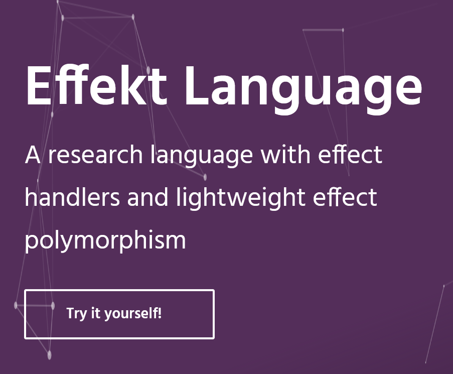
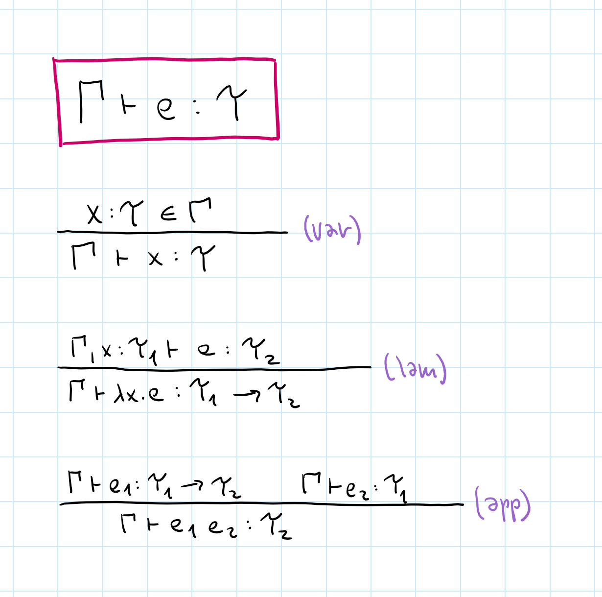
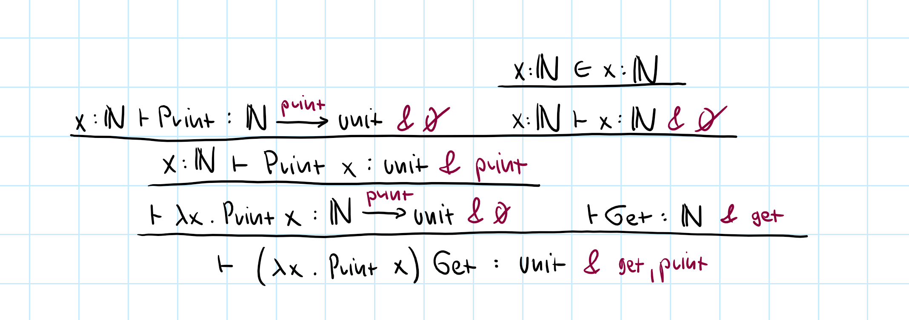
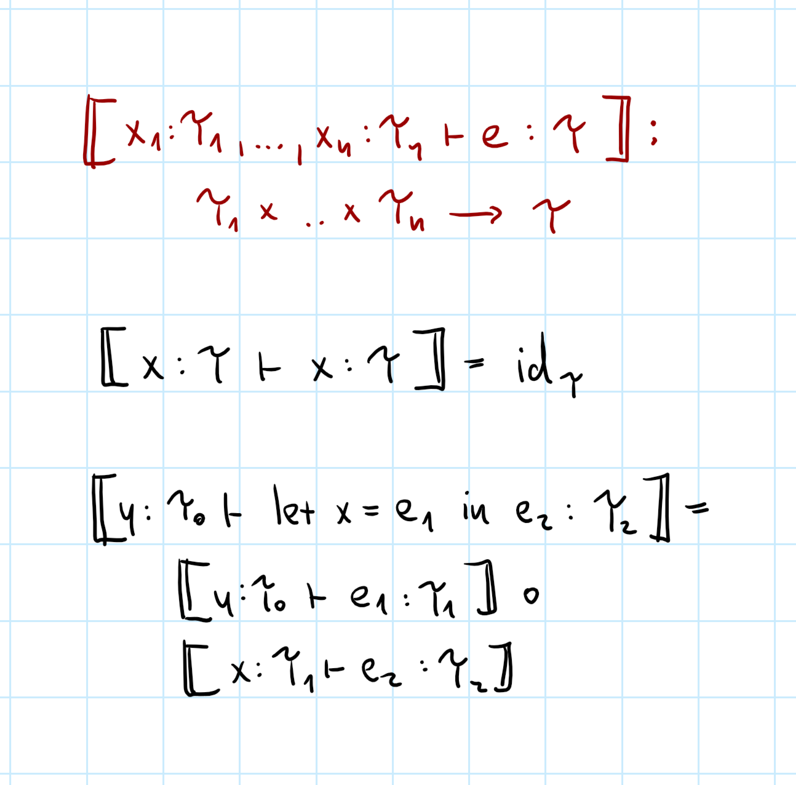
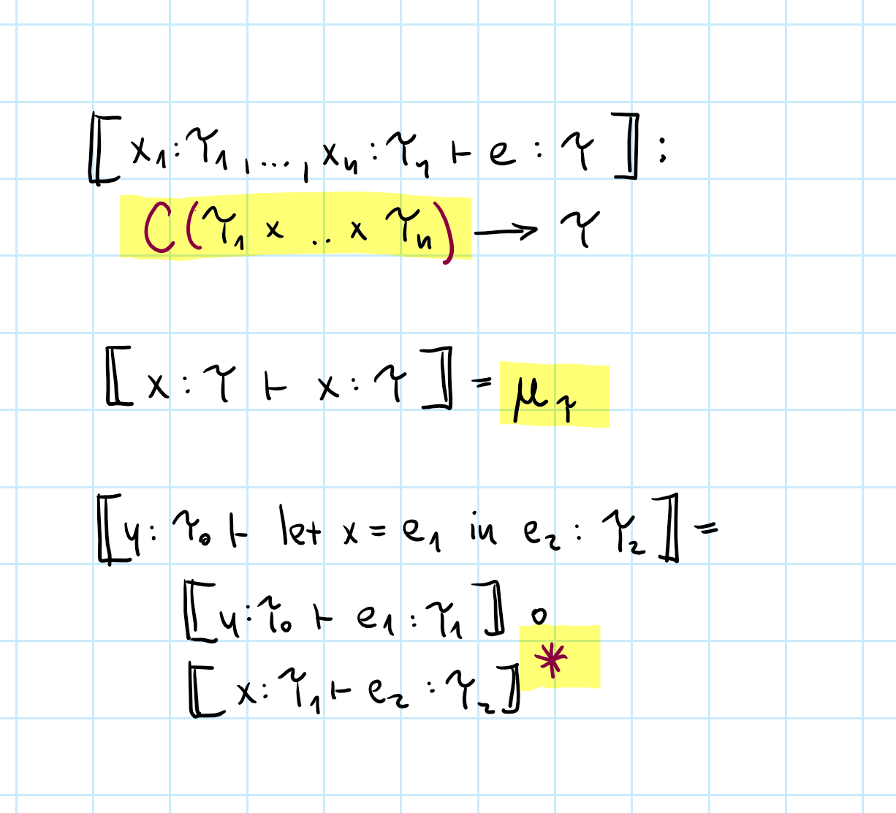

- title: Effects and Coeffects (NAIL097)

****************************************************************************************************
- template: title
- class: nologo

# NAIL097
## **Effects and coeffects**<br /> Guest lecture

---

**Tomáš Petříček**, 309 (3rd floor)  
_<i class="fa fa-envelope"></i>_ [petricek@d3s.mff.cuni.cz](mailto:petricek@d3s.mff.cuni.cz)  
_<i class="fa-solid fa-circle-right"></i>_ [https://tomasp.net](https://tomasp.net) | [@tomaspetricek](http://twitter.com/tomaspetricek)  
_<i class="fa-solid fa-circle-right"></i>_ https://d3s.mff.cuni.cz/people/tomaspetricek/

----------------------------------------------------------------------------------------------------
- template: largeicons

# Where I'm coming from?

- *fa-landmark* **PhD, University of Cambridge**  
  Types for context-aware programming

- *fa-industry* **Microsoft Research Cambridge**  
  F# and applied functional programming

- *fa-city* **The Alan Turing Institute, London**  
  Expert and non-expert tools for data science

- *fa-church* **University of Kent, Canterbury**  
  Programming systems and history

----------------------------------------------------------------------------------------------------
- template: image
- class: smaller


# What is my quest?

**More programming lan&shy;guage research in Prague!**

Ask about reading group!  
Do a PL project or thesis!  
Join us for a PhD?

****************************************************************************************************
- template: subtitle

# Side-effects
## Monads and monad transformers

----------------------------------------------------------------------------------------------------
- template: code

```fsharp
// Random number generators
let rnd = Random()
rnd.Next()

// Get the current time
System.DateTime.Now

// Throw an exception
raise "Something went wrong"

// Write to a file
File.WriteAllText(
  "/tmp/test.txt", "Hello!")

// Use mutable state
let mutable counter = 0
counter <- counter + 1
```

# Side-effects

**Sooner or later, you need to do them!**

Communicating with the outside (network, files, input/output)

Expressing things on the inside (threads, mutable state, non-determinism, exceptions)

----------------------------------------------------------------------------------------------------
- template: icons

# Side effects
## Different approaches

- *fa-utensils* Allow anywhere but use cautiously
- *fa-box-archive* Implement and track using monads
- *fa-shield* Allow but track using effect systems
- *fa-hand-dots* Implement and track sing effect handlers

----------------------------------------------------------------------------------------------------
- template: lists

# Monads and monad transformers


## Capture effect as monadic type
- Can fail: `a -> Maybe b`
- Uses state: `a -> State b`
- Interactive:  `a -> IO b`

## Issues with monads
- They cannot be easily combined!
- Neither: `a -> State (Maybe b)`
- Nor: `a -> Maybe (State b)`

----------------------------------------------------------------------------------------------------
- template: image
- class: smaller2x noborder


# Monad transformers

Wrap another monad to produce a new one

---

**Works but not great...**

Only some combinations  
Not an automatic process  
Code becomes ugly  

****************************************************************************************************
- template: subtitle

# Effect systems
## Effects and effect handlers

----------------------------------------------------------------------------------------------------
- template: lists

# Effects and effect handlers



## Effect systems (1980s-90s)

- Information about effects in types
- Memory, networking, IO
- Mostly theoretical papers

## Effect handlers (2010s-20s)

- New implementation method
- Better tracking in the type system
- Effekt, Eff, Koka, Haskell, OCaml, Scala, ...

----------------------------------------------------------------------------------------------------
- template: subtitle

# Demo
## Eff programming language

----------------------------------------------------------------------------------------------------
- template: image


# Type systems

**Given a variable context $\Gamma$, an exp&shy;ression $e$ has a type $\tau$.**

Explain idea in a simple $\lambda$-calculus language

Ignore practical aspects like type inference!


----------------------------------------------------------------------------------------------------
- template: image



# Type system

**Derivation rule for each expression**

Expression has a type if there is a derivation

Does not specify  
type inference!

----------------------------------------------------------------------------------------------------
- template: content

# Sample typing derivation


They are quite tedious to write by hand!

----------------------------------------------------------------------------------------------------
- template: image


# Effect systems

----------------------------------------------------------------------------------------------------
- template: image


# Effect systems

**Adds effect annotations**

Added to expression
and function type

Var access & lambda creation are pure

Application unions  
all effects

----------------------------------------------------------------------------------------------------
- template: subtitle

# Demo
## Type system of Eff

----------------------------------------------------------------------------------------------------
- template: image
- class: smaller


# Language with effects

**Effect handlers can be defined and handled like exceptions**

Here just `print` and `get`

Types of `Get` and `Print` introduce `get` and `print`

----------------------------------------------------------------------------------------------------
- template: content

# Typing effectful expression



Effect annotations combined using union!

----------------------------------------------------------------------------------------------------
- template: icons

# Effects
## Interesting and tricky aspects

- *fa-trophy* More fine-grained than monads!
- *fa-paw* Polymorphism is hard to get right
- *fa-list-ul* Complicates all higher-order functions
- *fa-circle-half-stroke* Generalizing to other structures than unions

****************************************************************************************************
- template: subtitle

# Monads and effects
## How are they related?

----------------------------------------------------------------------------------------------------
- template: image
- class: smaller


# Monads and effects
(Moggi, 1991)

Monads can be used to model the semantics of side-effects

**Two tiny languages**

One with built-in effects  
One with effects as feature

----------------------------------------------------------------------------------------------------
- template: lists
- class: smaller

# Monads and category theory


## Programming language semantics

- Formally define what programs mean
- Explain subtle language features
- Reason about programs

## Category theory

- Lots of algebraic structures for use!
- Composition is a central concept
- For compositional (functional) programs too!

----------------------------------------------------------------------------------------------------
- template: content

# Category = objects + arrows

A category $\mathcal{C}$ consists of objects $obj(\mathcal{C})$ and arrows $arr(\mathcal{C})$ between objects, i.e.
$f : A \rightarrow B$ where $A, B \in obj(\mathcal{C})$ with:

 - **Arrow composition**  
   Given $f : A \rightarrow B, g : B \rightarrow C$, there is $f\circ g:A \rightarrow C$.

 - **Associativity**  
   Given $f, g, h$, it holds that $(f\circ g)\circ h = f\circ (g\circ h)$

 - **Identity arrow for all** $B$  
   $id_B : B \rightarrow B$ such that $id_B \circ f = f$ and $g \circ id_B = g$

----------------------------------------------------------------------------------------------------
- template: lists
- class: smaller

# Interesting categories


## Mathematical structures

- Sets with functions between them
- Numbers with less/greater than
- Vector, topological spaces etc.

## Programming structures

- Types with functions between them (more or less)
- Classes with subtyping relationship
- Version control with parent relationships (maybe)

----------------------------------------------------------------------------------------------------
- template: content
- class: img80

# Types = objects, functions = arrows


**Arrow composition is function composition!**  
Haskell's `isZero.fst` becomes $\textit{fst}\,\circ\textit{isZero}$

----------------------------------------------------------------------------------------------------
- template: content
- class: larger

# Categorical semantics

**What is the meaning of `a+b`?**

$\qquad a\!:\!int,b\!:\!int \;\vdash\, a+b\!:\!int$

---

Arrow or morphism between two objects:

$\qquad int\times int\rightarrow int$

Yes, you can read this as a function too...

----------------------------------------------------------------------------------------------------
- template: content
- class: larger

# Categorical semantics

**What is the meaning of $e$?**

$\qquad v_1\!:\!\tau_1,\ldots,v_n\!:\!\tau_n\vdash e : \tau$

Arrow or morphism between two objects:

$\qquad \tau_1\times\ldots\times\tau_n \rightarrow \tau$

Maps (categorical) product of inputs to output

----------------------------------------------------------------------------------------------------
- template: image



# Categorical semantics

**Basics map nicely**  
Variable access is  
identity, composition  
is composition

**But more is needed**  
Cartesian Closed Categories

----------------------------------------------------------------------------------------------------
- template: content
- class: larger

# Categorical semantics

**But what if there are side-effects?**

$\qquad v_1\!:\!\tau_1,\ldots,v_n\!:\!\tau_n\vdash e : \tau \htmlStyle{color:#8A003B;}{ \,\&\, s}$

The result is wrapped with a monad $\htmlStyle{color:#8A003B;}{M}$!

$\qquad \tau_1\times\ldots\times\tau_n \rightarrow \htmlStyle{color:#8A003B;}{M}\,\tau$

"Monad is just a monoid in the category of endofunctors. What is the problem?"

----------------------------------------------------------------------------------------------------
- template: content
- class: larger

# Definition of a monad

Given a category $\mathcal{C}$, a _monad_ is a functor $\htmlStyle{color:#8A003B;}{M} : \mathcal{C} \rightarrow \mathcal{C}$  
together with mappings (or _natural transformations_):

 - $\eta_\tau : \tau \rightarrow \htmlStyle{color:#8A003B;}{M}(\tau) $

 - $(-)^*$ which turns an arrow $f : \tau_1 \rightarrow \htmlStyle{color:#8A003B;}{M}(\tau_2)$  
    into an arrow $f^* :  \htmlStyle{color:#8A003B;}{M}(\tau_1) \rightarrow \htmlStyle{color:#8A003B;}{M}(\tau_2)$

----------------------------------------------------------------------------------------------------
- template: image


# Monadic semantics

----------------------------------------------------------------------------------------------------
- template: image


# Monadic semantics

**Monad (functor) wraps the output type**

Unit and bind is what we need to compose!

----------------------------------------------------------------------------------------------------
- template: lists
- class: smaller noborder

# Graded monads


## What about effect annotations?

- We had effects $r, s, t$ but just a monad $M \tau$!
- Annotate the monad structure as $M^r \tau$
- Monad composition composes annotations

## Graded monads for effects

- Unit $\eta_\tau : \tau \rightarrow M^0(\tau) $
- Bind $(-)^* : (\tau_1 \rightarrow M^r(\tau_2)) \rightarrow (M^s(\tau_1) \rightarrow M^{s\oplus r}(\tau_2))$
- List of length $n$ with $*$
- State with lattice of access rights

----------------------------------------------------------------------------------------------------
- template: content
- class: img80

# Semantics with graded monads


****************************************************************************************************
- template: subtitle

# Comonads and coeffects
## The dual of effects is?

----------------------------------------------------------------------------------------------------
- template: lists

# Context-dependent computations


## Programming problems

- Different compilation targets
- Systems with different resources
- Neighbourhood in simulations

## Actual examples of coeffects

- Tracking of resources (implicit parameters)
- History in data flow languages
- Variable liveness (used or not)

----------------------------------------------------------------------------------------------------
- template: code

```fsharp
// Reading global state
System.DateTime.Now

// Data-flow computations
(x + prev x) / 2

// Implicit parameters
let foo() = ?x + 1
let ?x = 1 in foo()

// Game of life
let this = (* am I alive *)
let nbr = (* # of neighbours *)
(this && (nbr = 2 || nbr = 3))
|| (not this && nbr = 3)
```

# Context-awareness

**Reader monad is product comonad**

`a -> M b`  
`a -> (s -> b)`  
`a * s -> b`  
`C a -> b`  

Other context-related problems

----------------------------------------------------------------------------------------------------
- template: content
- class: larger

# Definition of a monad (again)

Given a category $\mathcal{C}$, a _monad_ is a functor $\htmlStyle{color:#8A003B;}{M} : \mathcal{C} \rightarrow \mathcal{C}$  
together with mappings (or _natural transformations_):

 - $\eta_\tau : \tau \rightarrow \htmlStyle{color:#8A003B;}{M}(\tau) $

 - $(-)^*$ which turns an arrow $f : \tau_1 \rightarrow \htmlStyle{color:#8A003B;}{M}(\tau_2)$  
    into an arrow $f^* :  \htmlStyle{color:#8A003B;}{M}(\tau_1) \rightarrow \htmlStyle{color:#8A003B;}{M}(\tau_2)$


----------------------------------------------------------------------------------------------------
- template: content
- class: larger

# Definition of a monad

Given a category $\mathcal{C}$, a _comonad_ is a functor $\htmlStyle{color:#8A003B;}{C} : \mathcal{C} \rightarrow \mathcal{C}$  
together with mappings (or _natural transformations_):

 - $\mu_\tau : \htmlStyle{color:#8A003B;}{C}(\tau) \rightarrow \tau$

 - $(-)^*$ which turns an arrow $f : \htmlStyle{color:#8A003B;}{C}(\tau_1) \rightarrow \tau_2$  
    into an arrow $f^* :  \htmlStyle{color:#8A003B;}{C}(\tau_1) \rightarrow \htmlStyle{color:#8A003B;}{C}(\tau_2)$

----------------------------------------------------------------------------------------------------
- template: subtitle

# Demo
## Stencil computations

----------------------------------------------------------------------------------------------------
- template: image


# Monadic semantics

----------------------------------------------------------------------------------------------------
- template: image



# Comonadic semantics

**Monad (functor) wraps the input type**

Variable context handling becomes tricky!

----------------------------------------------------------------------------------------------------
- template: largeicons

# Coeffects and graded comonads

- *fa-book* **Fewer good examples of comonads**  
  Non-empty list, product (reader), stencils
- *fa-superscript* **Graded comonad capture more than comonads**  
  Maybe works, because $\textnormal{Maybe}^{\textnormal{hasValue}} \tau \rightarrow \tau$
- *fa-crutch* **Needs extra stuff because of variables!**  
  $C(\tau_0)\times C(\tau_1 \times \ldots \times \tau_n) \rightarrow C(\tau_0 \times \ldots \times \tau_n)$
- *fa-circle-xmark* **Composition + merging and splitting of contexts**  
  Composition $\otimes$ with context merging $\oplus$ and splitting $\vee$

----------------------------------------------------------------------------------------------------
- template: image


# Effect systems

----------------------------------------------------------------------------------------------------
- template: image


# Coeffect systems

**Adds coeffect annotations**

Variable access is pure

Lambda combines available contexts

Application becomes  
a bit tricky!

----------------------------------------------------------------------------------------------------
- template: subtitle

# Demo
Derivations in coeffect playground

----------------------------------------------------------------------------------------------------
- template: image


# Dataflow coeffects

**Two extra operations**

Composition (multipication)

Split context into two (requires max)

Merge two contexts (requires min)

****************************************************************************************************
- template: subtitle

# Effects and coeffects
## Conclusions

----------------------------------------------------------------------------------------------------
- template: largeicons

# Excuse to talk about

- *fa-paintbrush* **Programming language design**  
  Design based on existing codebase is funny!
- *fa-shapes* **Algebraic data types**  
  Nice and powerful modelling tool
- *fa-not-equal* **Dependent type system concepts**  
  Weird in TypeScript, but interesting!
- *fa-industry* **Some practical TypeScript tricks**  
  Lets you do lots of useful things...

----------------------------------------------------------------------------------------------------
- template: image
- class: smaller


# Project, thesis or PhD on programming?

Languages and applications with effects, coeffects & capabilities

Semantics of interactive programming systems

Types for data science scripting in Python or R

----------------------------------------------------------------------------------------------------
- template: title
- class: condensed

# Conclusions

**Effects and Coeffects**

- **Effects can be modelled as monads**  
  But you need grading and more structures
- **Coeffects to track context-dependence**  
  Dual to effects, but need different extras!
- **Coeffects can be modelled as comonads**  
  But you need grading for interesting cases

---

**Tomáš Petříček**, 309 (3rd floor)  
_<i class="fa fa-envelope"></i>_ [petricek@d3s.mff.cuni.cz](mailto:petricek@d3s.mff.cuni.cz)  
_<i class="fa-solid fa-circle-right"></i>_ [https://tomasp.net](https://tomasp.net) | [@tomaspetricek](http://twitter.com/tomaspetricek)  
_<i class="fa-solid fa-circle-right"></i>_ https://d3s.mff.cuni.cz/teaching/nprg077

----------------------------------------------------------------------------------------------------
- template: content

# References

- https://www.adit.io/posts/2013-04-17-functors,_applicatives,_and_monads_in_pictures.html
- https://en.wikibooks.org/wiki/Haskell/Monad_transformers
