- title: Unexpected perspectives on types | Programming language design (NPRG075)

*****************************************************************************************
- template: title

# NPRG075
## Unexpected perspectives on types

---

**Tomáš Petříček**, 204 (2nd floor)  
_<i class="fa fa-envelope"></i>_ [petricek@d3s.mff.cuni.cz](mailto:petricek@d3s.mff.cuni.cz)  
_<i class="fa-solid fa-circle-right"></i>_ [https://tomasp.net](https://tomasp.net) | [@tomaspetricek](http://twitter.com/tomaspetricek)

**Lectures:** Tuesday 12:20, S6  
_<i class="fa-solid fa-circle-right"></i>_ https://d3s.mff.cuni.cz/teaching/nprg075


*****************************************************************************************
- template: subtitle

# Beyond types
## Recent developments

-----------------------------------------------------------------------------------------
- template: image
- class: noborder

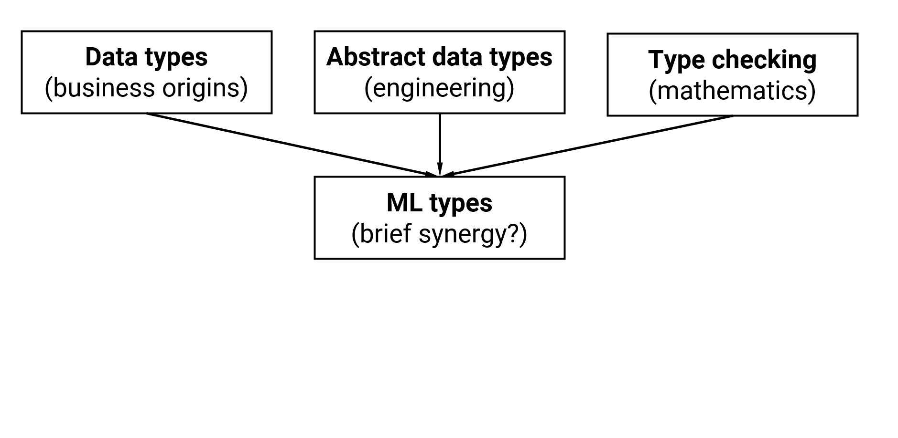

# Convergences<br/>and divergences

ML brings together data types, abstract types and checking

**End of the history?**

-----------------------------------------------------------------------------------------
- template: image
- class: noborder

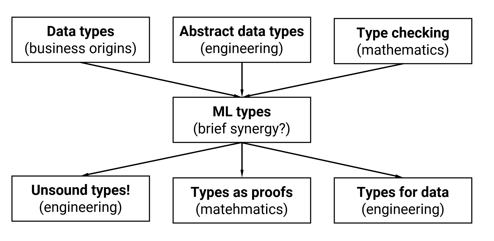

# Convergences<br/>and divergences

ML brings together data types, abstract types and checking

**End of the history?**

Developments in new directions in engineering and mathematics!

*****************************************************************************************
- template: subtitle

# Types
## Mathematical connections

-----------------------------------------------------------------------------------------
- template: icons

# Types
## Mathematical connections

- *fa-plus-minus* Type constructors as algebraic operations
- *fa-arrow-right* Proofs in propositional & predicate logic
- *fa-diamond* Linear logic and modal logics
- *fa-arrow-right-arrow-left* Types and cartesian closed categories

-----------------------------------------------------------------------------------------
- template: content
- class: two-column

# Example

Are these two type  
definitions equivalent?

```fsharp
type Contact =
  | Email of string
  | Phone of digits
  | Both of string * digits

type Customer =
  { Name : string
    Contact : Contact }
```

---

Can one represent some  
values the other cannot?

```fsharp
type Option<'T> =
  | Some of 'T
  | None

type Customer =
  { Name : string
    Phone : Option<digits>
    Email : Option<string> }
```

-----------------------------------------------------------------------------------------
- template: lists

# Calculating with types


## Type constructor algebra

- Record behaves as $A * B$ or $A \times B$
- Unions behave as $A + B$ or $A \cup B$
- Functions `A->B` behave as $B^A$
- Unit type is $1$ and void (never) is $0$

## Usual algebraic laws work!

- $A*(B+C) = A*B + A*C$
- $A * 1 = A$ and $A * 0 = 0$

-----------------------------------------------------------------------------------------
- template: content

# Calculating with types

$Contact = (Phone * Email) + Email + Phone$  
$Customer1$  
$\quad =Name * Contact$   
$\quad {\color{green}=Name * ((Phone * Email) + Email + Phone)}$

---

$Customer2$  
$\quad = Name * (Phone+1) * (Email+1)$  
$\quad = Name * ((Phone+1) * Email + (Phone+1) * 1)$  
$\quad = {\color{blue}Name * ((Phone * Email) + Email + Phone }{\color{red}\;+\;1})$

-----------------------------------------------------------------------------------------
- template: lists
- class: smaller

# What else works?


## Binary trees

- Derivative of a binary tree?
- $btree = leaf + btree * btree$
- Treat $btree$ as the variable

## Derivatives

- Rules in case you forgot:  
  [tinyurl.com/nprg075-diff](http://tinyurl.com/nprg075-diff )

-----------------------------------------------------------------------------------------
- template: lists
- class: smaller border

# Derivatives and zippers

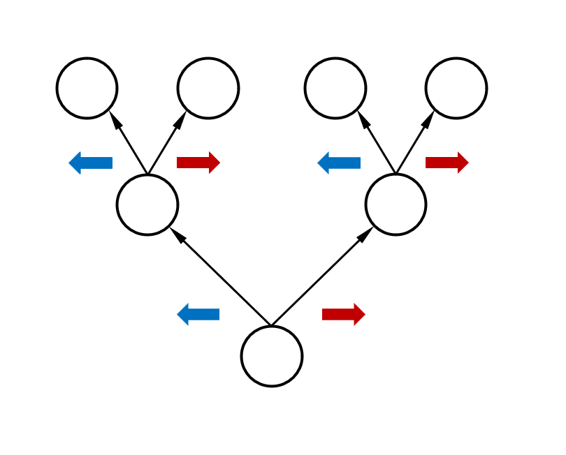

## Navigating through a tree

- Record path through a tree
- At each step, turn left or right
- Remember the other tree

## Derivative of a binary tree

- $btree = leaf + (btree^2)$
- $btree' = 2*btree$
- Steps for iterating over containers
- Path is a list of $btree'$ contexts

*****************************************************************************************
- template: subtitle

# Types
## Curry-Howard isomorphism

-----------------------------------------------------------------------------------------
- template: image
- class: smaller

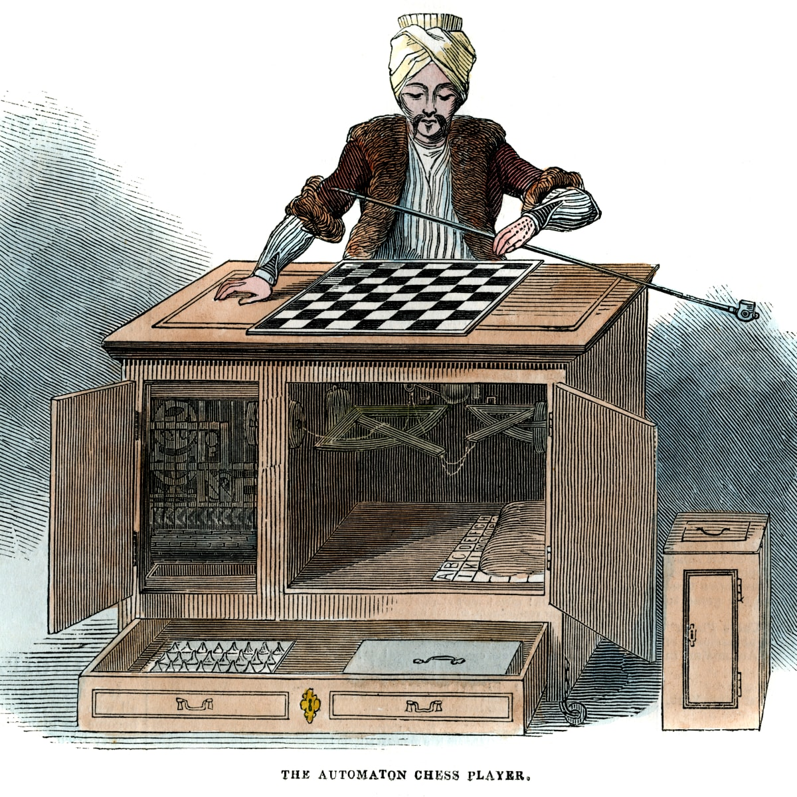

# Miraculous link?

Types in programming are propositions in logic!

Programs are proofs!

-----

**Not that surprising..**

Hard work to make it fit

Same origins in foundations of mathematics

-----------------------------------------------------------------------------------------
- template: content

# Curry-Hoard isomorphism

### Types as propositions

Function $A\rightarrow B$ corresponds to implication

Product $A\times B$ corresponds to conjunction $A \wedge B$

Union $A + B$ corresponds to disjunction $A \vee B$

----

### Proofs are programs

A well-typed program of type $A$ is a proof of $A$

Write program to show that a property holds!

-----------------------------------------------------------------------------------------
- template: image
- class: noborder

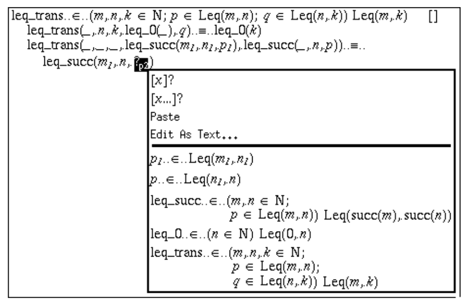

# Theorem provers

**Alf, Coq, Agda & more**

Construct proofs by interactively creating programs

Show resulting program (Agda) or list of interactions (Coq)

**Programs can run too**

-----------------------------------------------------------------------------------------
- template: content

# Programs as proofs

### Function composition

Proposition: $((A \rightarrow B) \wedge (B \rightarrow C)) \rightarrow (A \rightarrow C)$

----

Program as proof: $\lambda (f, g). \lambda a.g (f a)$

----

### Distributivity

Proposition: $A \wedge (B \vee C) \rightarrow (A \wedge B) \vee (A \wedge C)$

----

Program as proof: $\lambda (a, \textbf{inl}~b). \textbf{inl}~(a, b)$  
$~~~~~~~~~~~~~~~~~~~~~~~~~~~~~~~~~\; \lambda (a, \textbf{inr}~c). \textbf{inr}~(a, c)$

-----------------------------------------------------------------------------------------
- template: content

# Inference rules for types and logic

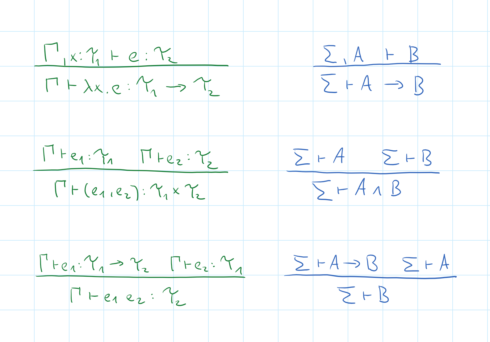

-----------------------------------------------------------------------------------------
- template: icons

# Language design
## Importing ideas via maths

- *fa-rotate* Simplifying types using algebraic laws
- *fa-star-half-stroke* Making sense of units and empty types
- *fa-clock* Types inspired by linear and modal logic?
- *fa-infinity* Types for universal and existential quantifiers?

-----------------------------------------------------------------------------------------
- template: image

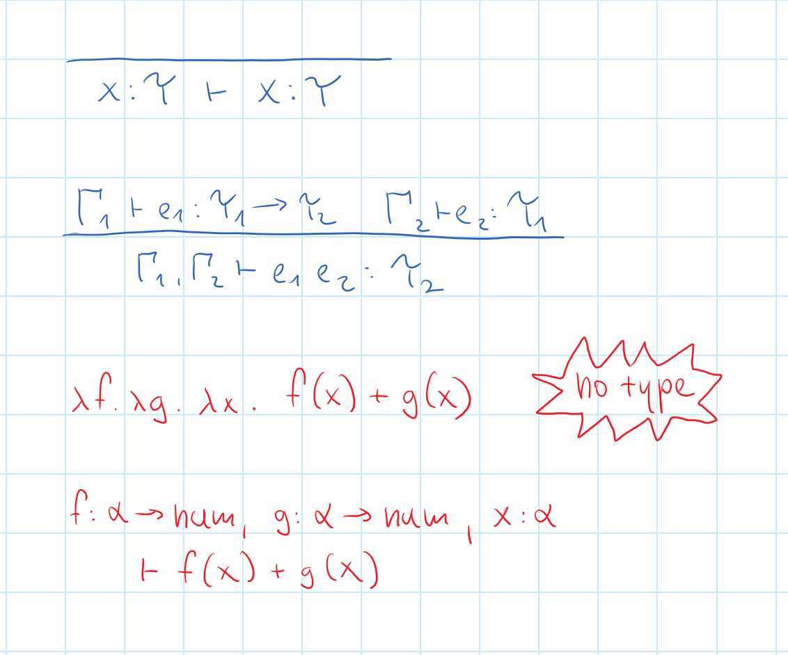

# Linear types

Variable must be  
used exactly once!

**Resource usage in programming!**

Avoid aliasing, efficient memory management

Generalizations to control sharing

-----------------------------------------------------------------------------------------
- template: lists
- class: smaller

# Types for modal logics

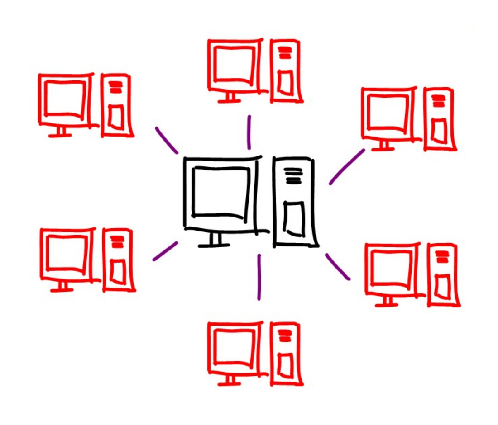

## Necessity and possibility
- $\diamond A$ - possibility - in a possible world
- $\square A$ - necessity - all possible worlds

## Distributed systems
- Value $A$, address $\diamond A$, mobile code $\square A$
- Axiom $\square A \rightarrow A$ - run mobile code to get value
- Axiom $A\rightarrow \diamond A$ - take address of local value
- Axiom $\diamond A\rightarrow \square\diamond A$ - address is mobile

-----------------------------------------------------------------------------------------
- template: content

# Dependent types

### Capture precise information

Vector of a known length `Vec (n:int) A`  
Other properties, like sortedness of a list

### Programming with fancy types

Dependent pair and function

`vectWithLength : (n:int) * Vec n string`  
`initVector : (x:int) -> (v:A) -> Vec x A`


-----------------------------------------------------------------------------------------
- template: lists
- class: smaller

# Dependent types


## Dependent function type

- Universal quantification $\forall (x:A).B(x)$  
- Dependent return type `(x:A) -> B(x)`
- Functions like `initVector`

## Dependent pair type  
- Existential quantification $\exists (x:A).B(x)$  
- Second type dependent `(x:A) * B(x)`
- Values like `vectWithLength`

-----------------------------------------------------------------------------------------
- template: icons

# Types
## Mathematical inspirations

- *fa-not-equal* Algebraic properties have practical use!
- *fa-square*  Dependent types and theorem provers
- *fa-circle-question* Design inspiration, interesting problems
- *fa-language*  Agda and Coq, but also in Haskell or Scala

*****************************************************************************************
- template: subtitle

# Types
## Engineering perspectives

-----------------------------------------------------------------------------------------
- template: subtitle

# Demo
## Checking weather in F#

-----------------------------------------------------------------------------------------
- template: lists

# Type providers

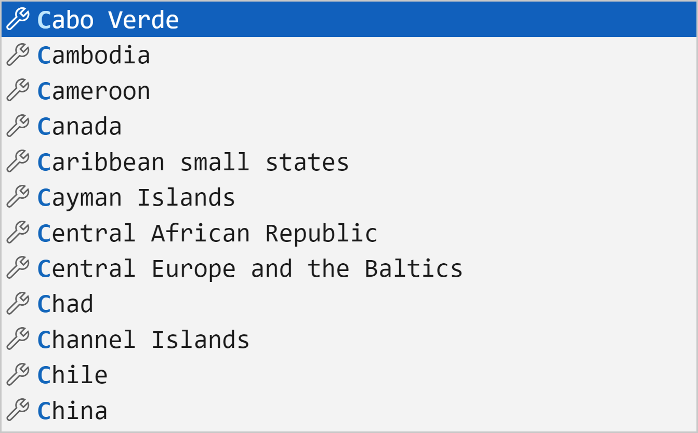

## What is a type provider?

- Extension run at compile-time
- Can run arbitrary code
- Generates classes with members

## What can they be used for?

- Infer structure of JSON, XML, CSV
- Import explicit database schema
- Interface with a foreign API

-----------------------------------------------------------------------------------------
- template: image
- class: noborder smaller

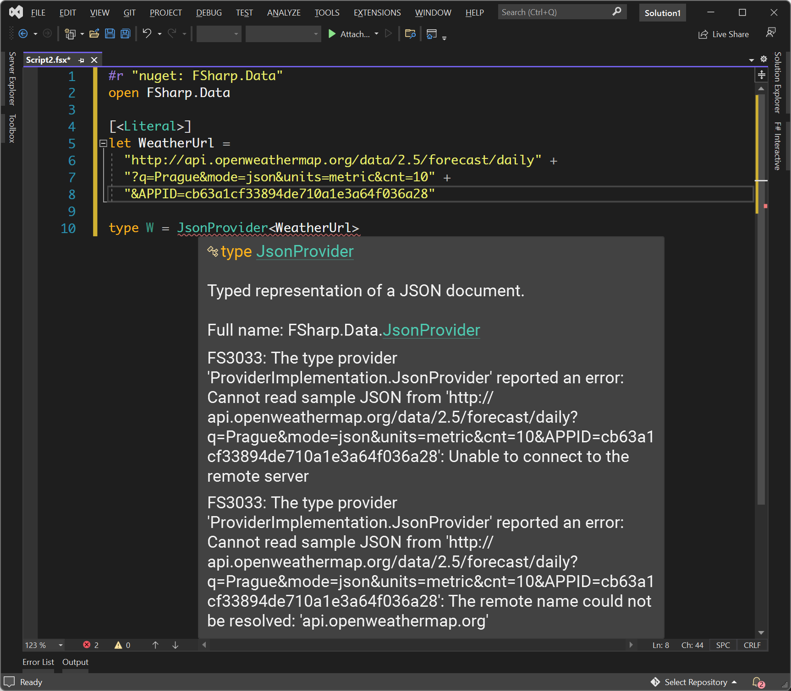

# Static type checking?

**Type error on a train!**

More useful when external service changes format

-----

**Well-typed programs  
do not go wrong?**

Except when the world breaks assumptions  
about the schema

-----------------------------------------------------------------------------------------
- template: icons

# Types
## Engineering perspective

- *fa-shapes* Types have to be useful, not always right
- *fa-bridge-circle-exclamation* Even unsound types help software engineers
- *fa-toolbox* Invaluable for tooling (completion, checking)
- *fa-file-contract* Documentation and structuring mechanism

-----------------------------------------------------------------------------------------
- template: image

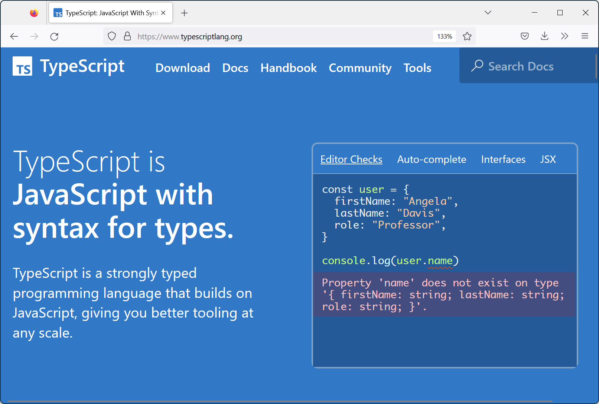

# TypeScript types

**Unsound because of 'any', covariance, unchecked imports**

Checking works  
well enough!

More reliable editor auto-completion

-----------------------------------------------------------------------------------------
- template: subtitle

# Demo
## Type providers in The Gamma

-----------------------------------------------------------------------------------------
- template: lists

# The Gamma design

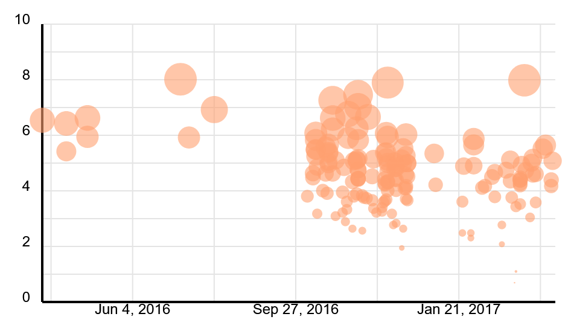

## Iterative prompting

- Do everything via a type provider
- Construct SQL-like queries & more
- What are the limits of this?

## Type provider tricks

- Lazy type generation for "big" types
- Parameterized (dependent) providers
- Fancy types for the masses

-----------------------------------------------------------------------------------------
- template: content

# Fancy types for the masses

### Row types

$$$
\frac
  {\Gamma \vdash e : {\color{red}[f_1:\tau_1, \ldots, f_n:\tau_n]}}
  {\Gamma \vdash e.\text{drop}~f_i : {\color{cc} [f_1:\tau_1, \ldots, f_{i-1}:\tau_{i-1}, f_{i+1}:\tau_{i+1}, \ldots, f_n:\tau_n]}}

----

### Embed as classes

$$$
\frac
  {\Gamma \vdash e : {\color{blue} C_1}}
  {\Gamma \vdash e.\text{drop}~f_i : {\color{blue} C_2}}
\qquad\qquad\qquad\qquad\qquad\qquad\qquad\qquad\quad

----

$$$
\begin{array}{l}
{fields({\color{blue} C_1}) = {\color{blue} \{f_1:\tau_1, \ldots, f_n:\tau_n\}}}\\
{fields({\color{blue} C_2}) = {\color{blue} \{f_1:\tau_1, \ldots, f_{i-1}:\tau_{i-1}, f_{i+1}:\tau_{i+1}, \ldots, f_n:\tau_n\}}}
\end{array}

*****************************************************************************************
- template: subtitle

# Conclusions
## Unexpected perspectives on types

-----------------------------------------------------------------------------------------
- template: image
- class: smaller


# Engineering and mathematical views  

**Complementary ways of designing & evaluating**

Import ideas using maths, prove them correct

Adapt ideas for engineering purpose, show they work

-----------------------------------------------------------------------------------------
- template: lists
- class: smaller

# Reading


**When Technology Became Language:** The Origins of the Linguistic Conception of Computer Programming  
From [davidnofre.com](https://www.davidnofre.com) or [direct link](https://pure.uva.nl/ws/files/2419813/154677_Alberts_Nofre_Priestly_Technol_Culture_55_1_2014.pdf)

## What to read and how

- The birth of programming languages
- Dramatic change in thinking!
- Longer, so read what you like...

-----------------------------------------------------------------------------------------
- template: title

# Conclusions

**Unexpected perspectives on types**

- Many ideas imported through mathematics!
- Dependent, linear and modal types
- Making it work in practice is a challenge

---

**Tomáš Petříček**, 204 (2nd floor)  
_<i class="fa fa-envelope"></i>_ [petricek@d3s.mff.cuni.cz](mailto:petricek@d3s.mff.cuni.cz)  
_<i class="fa-solid fa-circle-right"></i>_ [https://tomasp.net](https://tomasp.net) | [@tomaspetricek](http://twitter.com/tomaspetricek)  
_<i class="fa-solid fa-circle-right"></i>_ https://d3s.mff.cuni.cz/teaching/nprg075

-----------------------------------------------------------------------------------------
- template: content
- class: condensed

# References (1/2)

**Curry-Howard and dependent types**

- Wadler, P. (2015). [Propositions as Types](https://homepages.inf.ed.ac.uk/wadler/papers/propositions-as-types/propositions-as-types.pdf). ACM
- Magnusson, L., Nordström, B. (1994).. [The Alf proof editor and its proof engine. Types for Proofs and Programs](https://sci-hub.se/https://link.springer.com/chapter/10.1007/3-540-58085-9_78). TYPES
- Murphy VII, T (2008). [Modal Types for Mobile Code](http://tom7.org/papers/modal-types-for-mobile-code.pdf). PhD Thesis
- Walker, D. (2004). [Substructural type systems](https://mitpress-request.mit.edu/sites/default/files/titles/content/9780262162289_sch_0001.pdf). MIT

**Type providers & related**

- Petricek, T. et al. (2016). [Types from data: Making structured data first-class citizens in F#](http://tomasp.net/academic/papers/fsharp-data/fsharp-data.pdf). PLDI
- Petricek, T. (2017). [Data exploration through dot-driven development](http://tomasp.net/academic/papers/pivot/pivot-ecoop17.pdf). Proceedings of ECOOP
- Wand, M. (1991). [Type inference for record concatenation and multiple inheritance](https://www.sciencedirect.com/science/article/pii/089054019190050C). Information and Computation

-----------------------------------------------------------------------------------------
- template: content
- class: condensed

# References (2/2)

**Algebraic types**

- McBride, C. (2001). [The Derivative of a Regular Type is its Type of One-Hole Contexts](https://citeseerx.ist.psu.edu/document?repid=rep1&type=pdf&doi=4286bcc299ab34b0581cbd62d6241794fc9052de). Online (unpublished draft)
- Abbott, M., et al. (2005). [d for Data: Differentiating Data Structures](http://www.strictlypositive.org/dfordata.pdf). Fundamenta Informaticae
- Petricek, T. (2013). [Power of mathematics Reasoning about functional types](http://tomasp.net/blog/types-and-math.aspx/). Online (blog post)
- Marshall, D., Orchard, D. (2022). [How to Take the Inverse of a Type](https://starsandspira.ls/docs/ecoop22-draft.pdf). Proceedings of ECOOP
