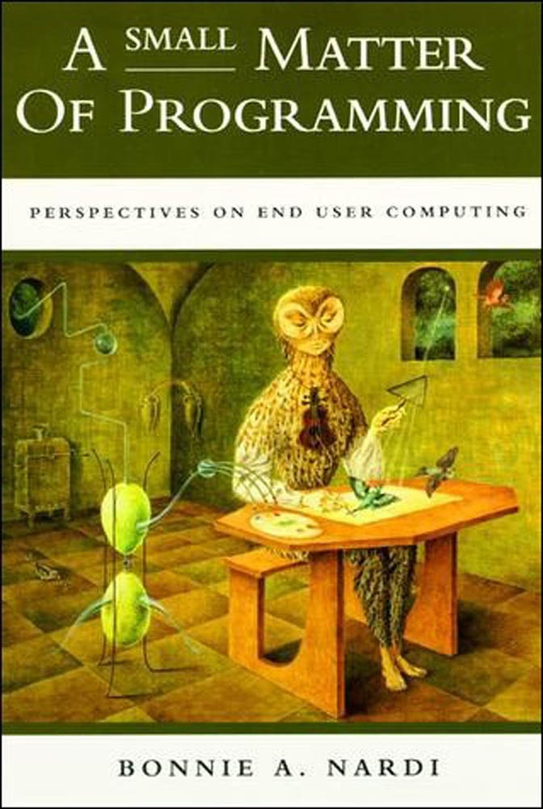
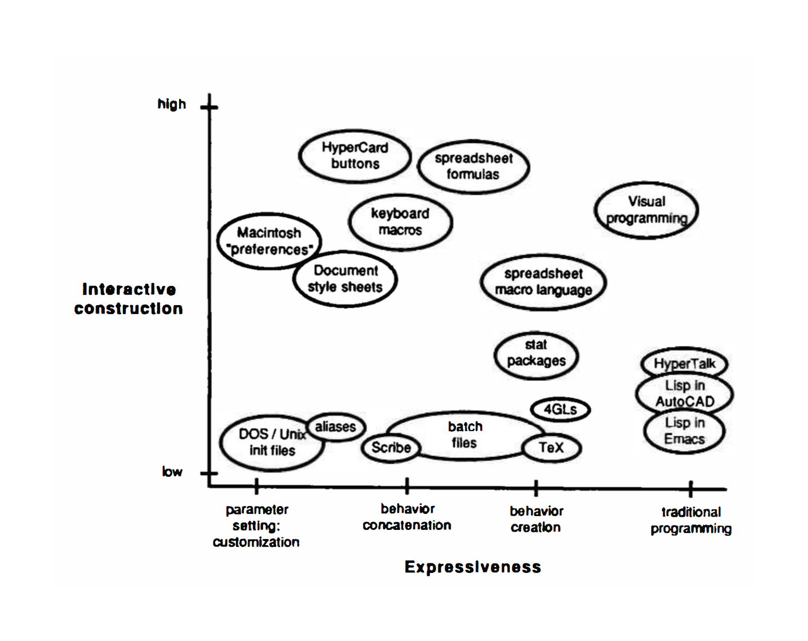
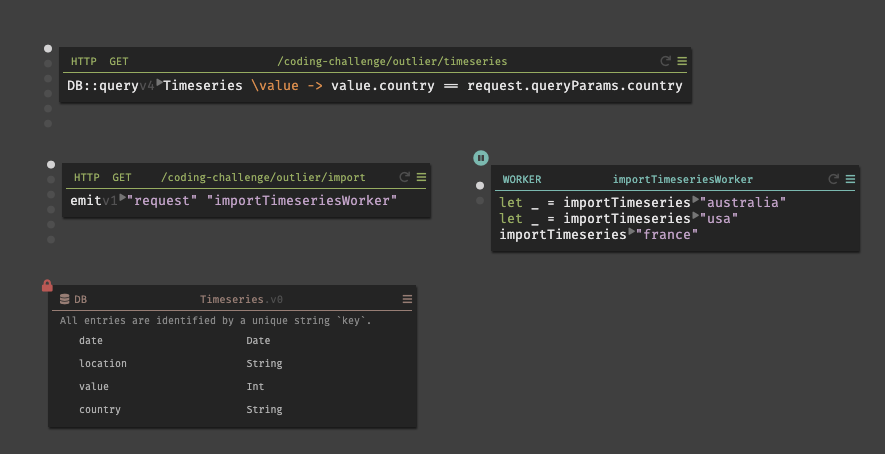
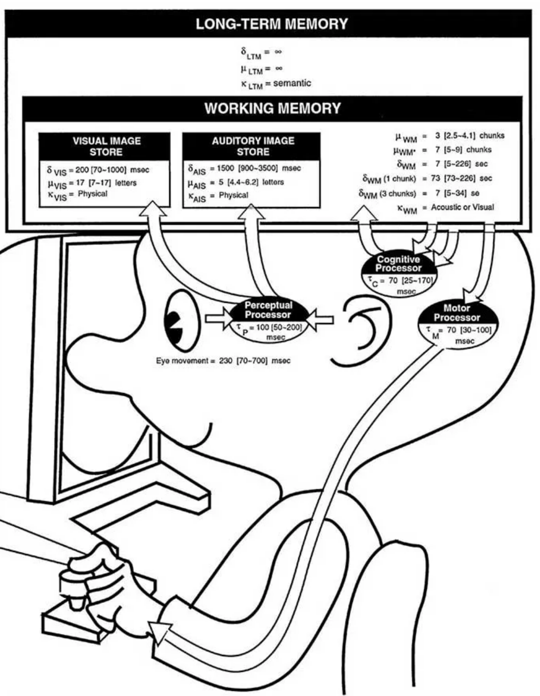
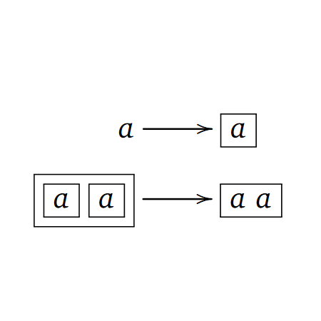

- title: Making programming easier and learnable | Programming language design (NPRG075)

*****************************************************************************************
- template: title

# NPRG075
## Making programming<br />easier and learnable

---

**Tomáš Petříček**, 204 (2nd floor)  
_<i class="fa fa-envelope"></i>_ [petricek@d3s.mff.cuni.cz](mailto:petricek@d3s.mff.cuni.cz)  
_<i class="fa-solid fa-circle-right"></i>_ [https://tomasp.net](https://tomasp.net) | [@tomaspetricek](http://twitter.com/tomaspetricek)

**Lectures:** Tuesday 12:20, S6  
_<i class="fa-solid fa-circle-right"></i>_ https://d3s.mff.cuni.cz/teaching/nprg075


*****************************************************************************************
- template: lists

# Course feedback


## What do you think

- I would love to hear from you!
- [tinyurl.com/nprg075-feedback](https://tinyurl.com/nprg075-feedback)

## Some things to consider

- Topics covered in the course?
- Conventional lecture format?
- Alternatives to assignment?

*****************************************************************************************
- template: subtitle

# Introduction
## Programming for non-programmers

-----------------------------------------------------------------------------------------
- template: icons

# What & why
## Programming for non-programmers

- *fa-image* Augmenting human intellect research theme
- *fa-sack-dollar* Reducing costs of programming for businesses
- *fa-school* Computer science & general education
- *fa-brain* Thinking about how to think when programming!

-----------------------------------------------------------------------------------------
- template: image


# Computational thinking

Is that teaching everyone to code?

What to teach and  
how to best do it?

**Designing languages for education?**

-----------------------------------------------------------------------------------------
- template: image
- class: smaller


# LOGO (1967)

Characteristics of the era

**Not just a programming language for kids**

Computer environment: people, things, ideas

Computer culture: a way of thinking about thinking

-----------------------------------------------------------------------------------------
- template: image


# No-code and<br />low-code

Platforms for creating applications with minimal code

**A new take on end-user programming**

-----------------------------------------------------------------------------------------
- template: image


# FLOW-MATIC

High-level business oriented predecessor of COBOL (1957)

**Makes coding so easy your company will not need programmers!**

-----------------------------------------------------------------------------------------
- template: icons

# Methodology
## Programming for non-programmers

- *fa-person-walking* Metaphors for explaining programming
- *fa-brain* Cognitive models to understand human thinking
- *fa-hands* Finding more manageable kinds of interactions
- *fa-heart-crack* Understanding & assisting with common errors

*****************************************************************************************
- template: subtitle

# End-user programming
## Making programming super easy

-----------------------------------------------------------------------------------------
- template: lists
- class: smaller

# A small matter of programming



## End-user programming (1993)

- Spreadsheets, CAD systems,  
  statistical packages
- Task specific systems

## An elusive dream?

- Can anyone become a programmer?
- Beyond task-specific?
- Programmable end-user systems?

-----------------------------------------------------------------------------------------
- template: image
- class: smaller



# End-user programming

**① Very high-level**  
Domain-specific languages

**② Spreadsheets**  
CAD & statistical systems

**③ User interaction**  
New kinds of specifying

-----------------------------------------------------------------------------------------
- template: image


# High-level languages

**FLOW-MATIC (1960s)**  
English; easily taught to clerical workers

**DSLs (2000s)**  
Small languages for specific problems

**Low-code (2020s)**  
GUI-based entire  
app development

-----------------------------------------------------------------------------------------
- template: image



# Case study: Darklang

**Domain-specific abstractions for server-less backends**

- HTTP handler  
- Worker  
- Database  
- CRON job

-----------------------------------------------------------------------------------------
- template: icons

# Notations
## Limits of high-level notations

- *fa-broom* Requires a "tidy" problem domain
- *fa-language* There is no universal language
- *fa-wrench* Adaptable notations tend to be complex
- *fa-microphone* Cannot (should not?) accept human vagueness

-----------------------------------------------------------------------------------------
- template: lists
- class: smaller border

# What makes programming hard?



## Cognitive obstacles

- Loss of direct manipulation  
  (and the frame problem)
- Use of (specialized) notation
- Abstraction for complexity

## Attention investment model

- Cognitive obstacles have cost
- Programming as an investment
- When is the gain worth it?

-----------------------------------------------------------------------------------------
- template: largeicons

# Eliminating cognitive obstacles

* *fa-table* **Spreadsheet-based interfaces**  
  Avoid abstraction and give immediate feedback

* *fa-sterling-sign* **Programming by example**  
  No need for notation and abstraction

* *fa-hand-pointer* **Direct manipulation**  
  Manipulate concrete entities & post-hoc abstraction

-----------------------------------------------------------------------------------------
- template: lists

# Spreadsheets as programming


## Are they really programming?

- Domain-specific, but powerful
- Turing-complete (in a way)
- Lambdas, macros, extensions

## Spreadsheets & programming

- IDEs can learn about liveness
- Spreadsheets can learn about software engineering
- TechDims: Abstraction construction, feedback loops

-----------------------------------------------------------------------------------------
- template: image
- class: noborder


# General-purpose spreadsheets?
(Marasoiu, 2019)

**Spreadsheet-based data visualization**

Spreadsheet interface for constructing custom charts

What else could we express this way?

-----------------------------------------------------------------------------------------
- template: image
- class: smaller


# Direct manipulation

**Complete task manually, have computer repeat it**

Industrial robots, graphics editing, task automation, geometry, formatting

How to allow for small variation in behaviour?

-----------------------------------------------------------------------------------------
- template: image


# Wrangler
(Kandel et al, 2011 )

**Data wrangling by direct manipulation**

User cleans with data

System builds a script

Attempts to generalize concrete interactions

-----------------------------------------------------------------------------------------
- template: lists
- class: border

# Programming by example


## FlashFill and FlashExtract

- Write (or select) examples
- System infers patterns
- Refine examples to clarify

## Implementation

- Synthesize programs to match
- Using carefully chosen small language
- And a suitable search algorithm


*****************************************************************************************
- template: subtitle

# Education
## Teaching programming & thinking

-----------------------------------------------------------------------------------------
- template: lists
- class: border

# MIT Artificial Intelligence Lab


## Minsky & Papert

"Seymour Papert and Marvin  
Minsky thought about thinking,
about children's thinking and  
about machine's thinking."

## LOGO project & language

- Computers as "native speakers" of mathematics
- Teach creative and logical thinking
- Giving children tools to learn (Montessori)

-----------------------------------------------------------------------------------------
- template: lists

# LOGO as a language


## Language features

- Interactive and LISP-inspired
- Lists, recursion, functional
- More of an idea than a language

## LOGO for education

- Learning through microworlds
- Give kids the most powerful language created
- Powerful ideas: anthropomorphization, metalanguage

-----------------------------------------------------------------------------------------
- template: code

```basic
TO NOUN
  OUTPUT PICK [BIRDS DOGS ..]
END
TO VERB
 OUTPUT PICK [HATE BITE LOVE]
END
TO ADJECTIVE
  OUTPUT PICK [RED PECULIAR ..]
END

PRINT (SENTENCE ADJECTIVE
  NOUN VERB ADJECTIVE NOUN)
```

# Microworlds

**A small domain-specific language for exploring ideas**

Turtle graphics is best known example

First LOGO example was for word plays

-----------------------------------------------------------------------------------------
- template: image
- class: smaller


# Turtle microworld

On-screen and floor robots

----

**Great for teaching**

Debug by pretending to be the turtle & follow program

Does not blame students ("the turtle has a bug")

-----------------------------------------------------------------------------------------
- template: icons

# Computer science education
## Teaching programming thinking today

- *fa-leaf* From 1960s idealism to 2020s pragmatism
- *fa-microscope* Focus on what we can convincingly study
- *fa-video-slash* Improving teaching practices & methods
- *fa-brain* Developing better conceptual frameworks

-----------------------------------------------------------------------------------------
- template: lists

# Notional machines


## Models for thinking

- Model of a computer operation
- Helps understand computation
- A "useful lie" for teaching

## Example notional machines

- Objects and message passing of Smalltalk
- LOGO "little people" metaphor
- Computation as railway track

-----------------------------------------------------------------------------------------
- template: image


# Little people metaphor

**A powerful idea for understanding how programs work**

Function instantiation as a "little men" doing (one step of) work

-----------------------------------------------------------------------------------------
- template: image


# Linked lists (1/2)

**Boxes with pointers as connecting arrows**

Let's insert 3 in the list between 2 and 4...

-----------------------------------------------------------------------------------------
- template: image


# Linked lists (2/2)

**Boxes with pointers as connecting arrows**

Let's insert 3 in the list between 2 and 4...

**Useful but does not explain everything that pointers can do!**

-----------------------------------------------------------------------------------------
- template: icons

# Computing education
## Basic disagreements about the problem

- *fa-wind* Computational thinking & algorithms for all?
- *fa-icons* Creativity as with LOGO and Sonic Pi?
- *fa-lock* History and philosophical problems?
- *fa-industry* How to best teach present-day technology?

*****************************************************************************************
- template: subtitle

# Metaphors
## Thinking about programming

-----------------------------------------------------------------------------------------
- template: lists
- class: smaller border

# Metaphors for programming


## Essence of human thought?
- Time as resource, Up as positive, ...
- Apparent through our language
- Basic for constructing mathematics?
- Each has fits and misfits

## Metaphors for programming
- Notional machines (LISP, Smalltalk)
- Thinking about variables, monads

-----------------------------------------------------------------------------------------
- template: lists

# Two metaphors for variables


## Variable as a box

- You store value in a box
- Variable "contains" a value
- What is stored in a `name`?

## Variable as a label

- Label you place on a value
- Variable "is" a value
- What is a `name`?

-----------------------------------------------------------------------------------------
- template: icons

# Misconceptions
## Does the metaphor for variables matter?

- *fa-angles-left* What is the meaning of multiple assignment?
- *fa-box-archive* Box can contain multiple values!
- *fa-circle-plus* Label will be for computation or addition
- *fa-trophy* Box metaphor wins, but beware of misfits

-----------------------------------------------------------------------------------------
- template: code
- class: smaller

```haskell

class Monad m where
 (>>=)  ::
  m a -> (a -> m b) -> m b
 return ::   
  a -> m a
```

# Metaphors for monads

Interface capturing a class of computations

Used for effectful computations in Haskell

**How programmers  
think about them?**

-----------------------------------------------------------------------------------------
- template: content
- class: three-column

# Three metaphors for monads

### Symbolic

Meaningless symbolical entity satisfying laws


----

### Box

Container that can be transformed and un-nested



----

### Track

Computation that can proceed in multiple ways


-----------------------------------------------------------------------------------------
- template: icons

# Misconceptions
## Common errors in thinking

- *fa-ban* Loops terminate when condition turns false
- *fa-align-left* Sequential statements do not wait
- *fa-language* Variable name has effect on its behaviour
- *fa-crosshairs* Missing else branch stops program

*****************************************************************************************
- template: subtitle

# Conclusions
## Easier and learnable

-----------------------------------------------------------------------------------------
- template: title

# Thank you!

**Please do keep in touch!**

- Do a final project (and get credit as a bonus)
- Sign-up for a follow-up seminar
- Get in touch about MSc or PhD projects

---

**Tomáš Petříček**, 204 (2nd floor)  
_<i class="fa fa-envelope"></i>_ [petricek@d3s.mff.cuni.cz](mailto:petricek@d3s.mff.cuni.cz)  
_<i class="fa-solid fa-circle-right"></i>_ [https://tomasp.net](https://tomasp.net) | [@tomaspetricek](http://twitter.com/tomaspetricek)  
_<i class="fa-solid fa-circle-right"></i>_ https://d3s.mff.cuni.cz/teaching/nprg075

-----------------------------------------------------------------------------------------
- template: content
- class: condensed

# References (1/3)

**End-user programming**

 - UNIVAC FLOW-MATIC (1957). [Introducing a new language for automatic programming](http://s3data.computerhistory.org/brochures/univac.flowmatic.1957.102646140.pdf). Sperry Rand Corporation
 - Bonnie A. Nardi (1993). [A Small Matter of Programming](https://mitpress.mit.edu/9780262140539/a-small-matter-of-programming/). MIT
 - Blackwell, A. F. (2002). [First Steps in Programming: A Rationale for Attention Investment Models](https://www.cl.cam.ac.uk/~afb21/publications/HCC02a.pdf). VL/HCC
 - Blackwell, A.F., Burnett, M. (2002). [Applying Attention Investment to End-User Programming](https://ieeexplore.ieee.org/document/1046337). VL/HCC

**Spreadsheets**

- Marasoiu, M. et al. (2019). [Cuscus: An End User Programming Tool for Data Visualisation](https://link.springer.com/chapter/10.1007/978-3-030-24781-2_8). IS-EUD

-----------------------------------------------------------------------------------------
- template: content
- class: condensed

# References (2/3)

**Programming by demonstration**

- Smith, D. C. (1977). [Pygmalion: A Computer program to Model and Stimulate Creative Thought](https://link.springer.com/book/10.1007/978-3-0348-5744-4). ISR
- Kandel, S., et al. (2011). [Wrangler: Interactive Visual Specification of Data Transformation Scripts](http://vis.stanford.edu/files/2011-Wrangler-CHI.pdf). CHI
- Cypher A (ed.) (1993). [Watch What I Do: Programming by Demonstration](https://mitpress.mit.edu/9780262527965/watch-what-i-do/). MIT

**Programming by example**

- Gulwani, S. et al. (2016). [Programming by Examples](https://www.microsoft.com/en-us/research/wp-content/uploads/2016/12/pbe16.pdf). DSSE
- Vu Le, Gulwani S. (2014). [FlashExtract: A Framework for Data Extraction by Examples](http://www-cs-students.stanford.edu/~adityagp/courses/cs598/papers/flash-extract.pdf). PLDI

-----------------------------------------------------------------------------------------
- template: content
- class: condensed

# References (3/3)

**Programming education**

 - Solomon, C. et al. (2020). [History of LOGO](https://ora.ox.ac.uk/objects/uuid:2f350f11-e986-4a08-a5dc-9cf6d5a9d1d4). HOPL
 - Papert S. (1980). [Mindstorms: Childern, Computers and Powerful Ideas](http://worrydream.com/refs/Papert%20-%20Mindstorms%201st%20ed.pdf). Basic Books
 - Fincher, S. A. & Robins A. V. (eds.) (2019). [The Cambridge Handbook of Computing Education Research](https://www.cambridge.org/core/books/cambridge-handbook-of-computing-education-research/F8CFAF7B81A8F6BF5C663412BA0A943D). Cambridge

**Metaphors & misconceptions**

 - Lakoff, G. & Nunez, R. (2001). [Where Mathematics Come From](https://www.basicbooks.com/titles/george-lakoff/where-mathematics-come-from/9780465037711/)
 - Petricek, T. (2018). [What we talk about when we talk about monads](http://tomasp.net/academic/papers/monads/monads-programming.pdf)
 - Hermans, F. et al. (2018). [Thinking out of the box: comparing metaphors for variables in programming education](https://pure.tudelft.nl/ws/portalfiles/portal/47760609/box_label_vars.pdf). WiPSCE
 - Swidan, A. et al. (2018). [Programming Misconceptions for School Students](https://dl.acm.org/doi/10.1145/3230977.3230995). ICER
