- title: Heuristic evaluation of programming systems | Programming language design (NPRG075)

*****************************************************************************************
- template: title

# NPRG075
## Heuristic evaluation of programming systems

---

**Tomáš Petříček**, 204 (2nd floor)  
_<i class="fa fa-envelope"></i>_ [petricek@d3s.mff.cuni.cz](mailto:petricek@d3s.mff.cuni.cz)  
_<i class="fa-solid fa-circle-right"></i>_ [https://tomasp.net](https://tomasp.net) | [@tomaspetricek](http://twitter.com/tomaspetricek)

**Lectures:** Tuesday 12:20, S6  
_<i class="fa-solid fa-circle-right"></i>_ https://d3s.mff.cuni.cz/teaching/nprg075

*****************************************************************************************
- template: subtitle

# Programming systems
## What really matters?

-----------------------------------------------------------------------------------------
- template: icons

# Programming systems
## What can we study?

- *fa-not-equal* Formal semantics and type safety
- *fa-keyboard* Learnability for novice programmers
- *fa-person-dots-from-line* Socio-technical context of the system
- *fa-lines-leaning* Principles behind the system design

-----------------------------------------------------------------------------------------
- template: image

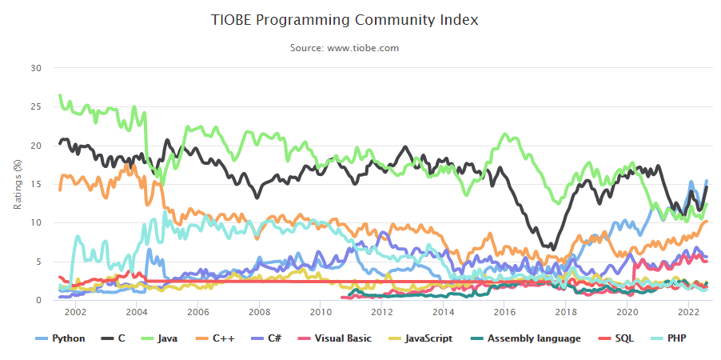

# What makes a language popular

**None of the things  
we talked about?**

----

Popular $\neq$ Good  

The index has its flaws  

Still, a reason to think!

-----------------------------------------------------------------------------------------
- template: image

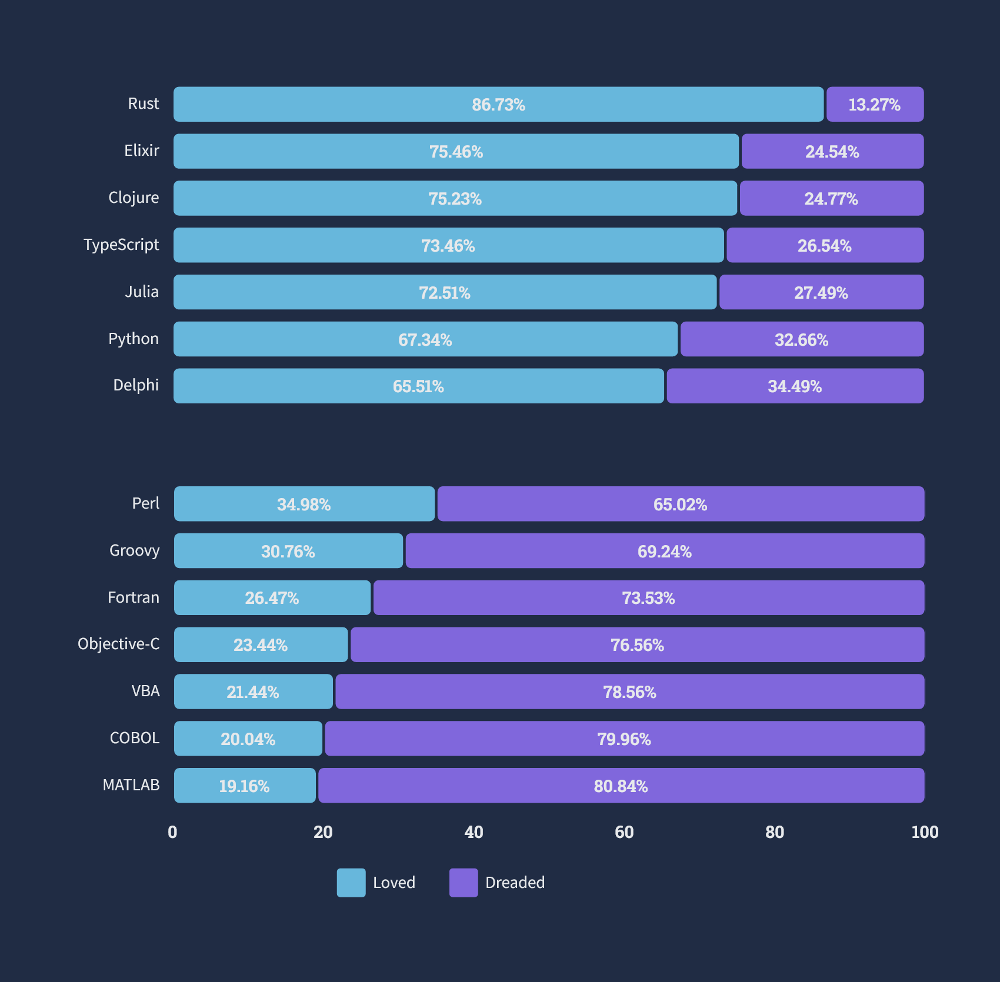

# Most loved or   most dreaded?

Enthusiastic community?  
Good tooling?  
Clean idea?  
Practicality?

-----

**Need to talk about  
less exact things!**

-----------------------------------------------------------------------------------------
- template: lists
- class: smaller

# Analysis of language perceptions

## Survey analysis

- Survey of language characteristics
- Feature and language correlations
- [tinyurl.com/nprg075-socio](https://lmeyerov.github.io/projects/socioplt/viz/index.html)

## Adoption of languages

- Libraries matter
- Legacy and history matter
- Flexibility more important than correctness

-----------------------------------------------------------------------------------------
- template: icons

# Programming systems
## Important but hard to study

- *fa-signature* Expressivity of the programming notation
- *fa-object-group* Unifying conceptual model ("everything is ...")
- *fa-hand-point-up* Style of interaction with the system
- *fa-gears* Extensibility and flexibility of the language

-----------------------------------------------------------------------------------------
- template: image
- class: smaller

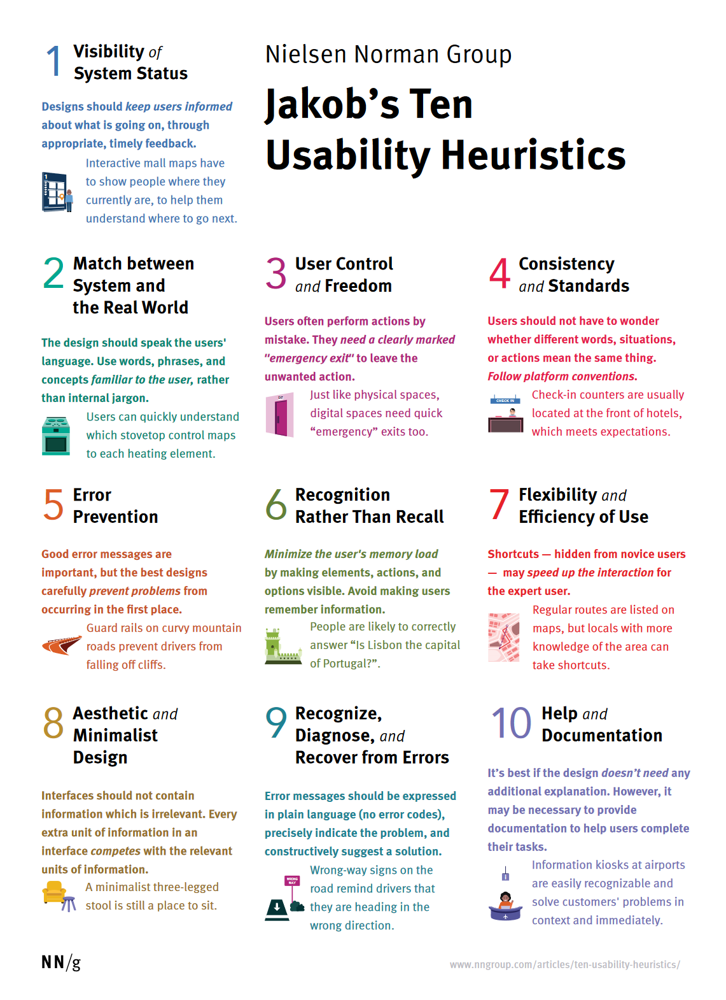

# Heuristic analysis

**High-level rules, characteristics or principles**

Developed by experts, based on reviews and experience

Useful for evaluation, classifying, analysis,  
new design

-----------------------------------------------------------------------------------------
- template: icons

# Programming systems
## Heuristic frameworks

- *fa-arrows-rotate* Levels of liveness of programming systems
- *fa-microchip* Memory models of programming languages
- *fa-brain* Cognitive dimensions of notation
- *fa-pen-to-square* Technical dimensions of programming systems

*****************************************************************************************
- template: subtitle

# Programming systems
## Liveness and memory models

-----------------------------------------------------------------------------------------
- template: image
- class: smaller

# From batch processing ...

**Coding at the computer prohibitively expensive**

Write program, punch on cards, submit & wait

A few day feedback cycle!

-----------------------------------------------------------------------------------------
- template: content
- class: lcm

# ... to live coded music performance

<iframe width="840" height="472" src="https://www.youtube.com/embed/KGzqyGaYyqs" title="YouTube video player" frameborder="0" allow="accelerometer; autoplay; clipboard-write; encrypted-media; gyroscope; picture-in-picture" allowfullscreen></iframe>

-----------------------------------------------------------------------------------------
- template: image
- class: noborder smaller

# Visual programming

Planning and coding of problems for an electronic computing instrument (Goldstine, von  
Neumann, 1948)

-----------------------------------------------------------------------------------------
- template: image
- class: smaller

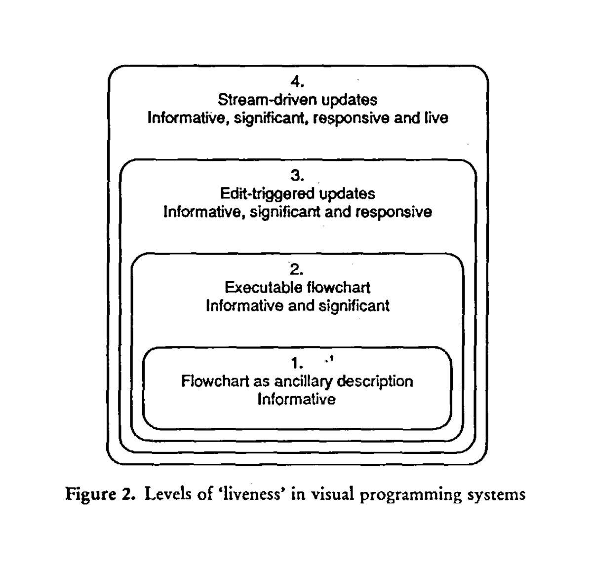

# Liveness levels

(Tanimoto, 1990)

**Level 1**  
Flowchart that exists independently of a program

**Level 4**  
Continuous processing with immediate dynamic change of behaviour

-----------------------------------------------------------------------------------------
- template: icons

# Liveness levels
## Programming system heuristic

- *fa-ruler* Single property of specific systems
- *fa-temperature-half* Can be used for comparing systems
- *fa-rocket* Imagines step beyond the state-of-the-art
- *fa-puzzle-piece* Can be used for designing new systems

-----------------------------------------------------------------------------------------
- template: lists
- class: border smaller

# Memory models of systems

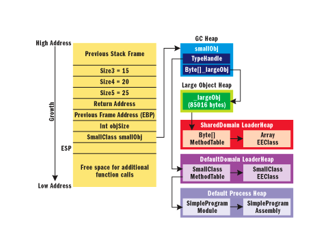

## Primary representation

- How things are represented
- Defines what can be done
- Defines how to think!

## Six major conceptualizations

- COBOL, LISP and FORTRAN
- SQL, UNIX and tape storage
- In reality, it's always a mix!

-----------------------------------------------------------------------------------------
- template: largeicons

# Language memory models

- *fa-clipboard* **COBOL - Memory is a nested record (tax form)**  
  No need for pointers, but no sharing allowed
- *fa-diagram-project* **LISP - Memory is an object graph (symbol list)**   
  Flexible, but serialization & efficiency tricky
- *fa-table-list* **FORTRAN - Memory is a bunch of arrays (vector)**  
  Close to the metal, but no semantic checking

-----------------------------------------------------------------------------------------
- template: largeicons

# Storage memory models

- *fa-arrow-right-arrow-left* **PIPES - Magnetic tape model (I/O streams)**  
  Specific, but great for some problems (MapReduce)
- *fa-folder-tree* **MULTICS - Tree with blob leaves (file system)**   
  Legible, allows separation; rarely used in full
- *fa-table* **SQL - Memory is a set of relations (tables)**  
  Expressive query language, c.f. Prolog and similar

-----------------------------------------------------------------------------------------
- template: icons

# Memory models
## Programming system heuristic

- *fa-keyboard* Single property of any programming system
- *fa-layer-group* Categorical rather than ordinal
- *fa-book* Sheds light on what exists
- *fa-clipboard-question* Open to questioning, e.g., is that all there is?

*****************************************************************************************
- template: subtitle

# Notations
## Cognitive dimensions

-----------------------------------------------------------------------------------------
- template: lists

# Notations and humans

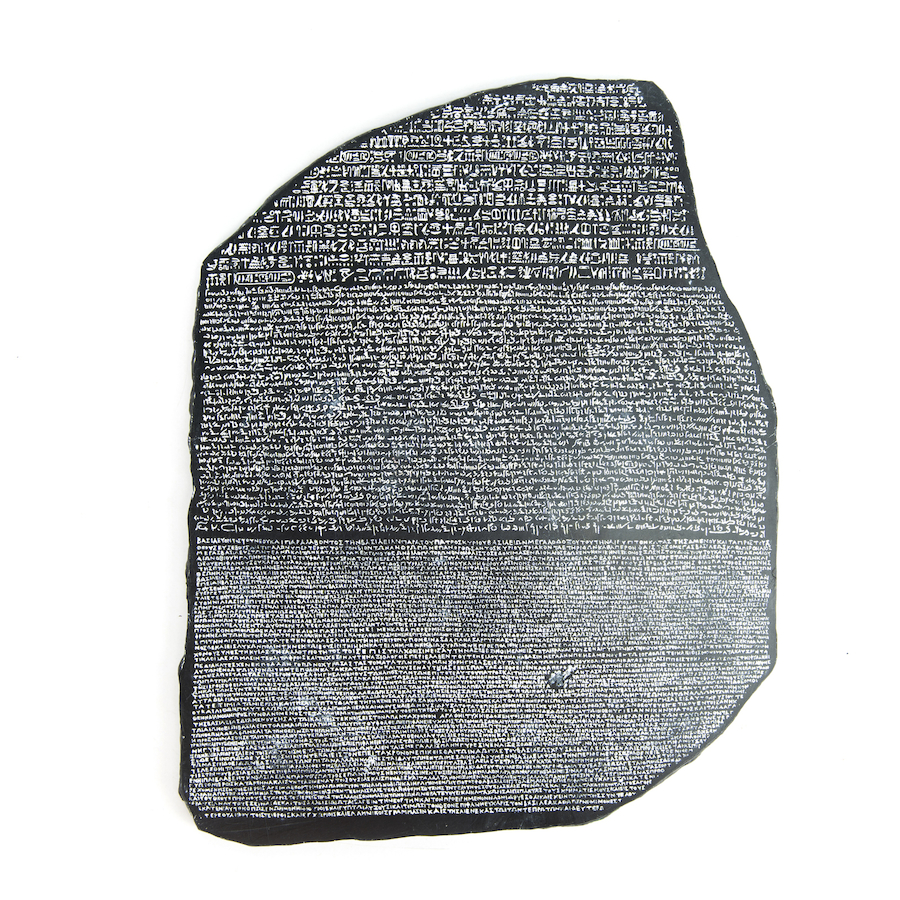

## Notations in computing

 - Programming languages  
 - Markup and config files
 - Rule and macro editors

## User experience questions

 - Does the notation structure support activities of the user?
 - Is one notation the best?

----------------------------------------------------------------------------------------------------
- template: icons

# Cognitive dimensions
## Programming system heuristic

 - *fa-paint-brush* Comprehensible broad-brush evaluation
 - *fa-user* Understandable for non-specialists
 - *fa-shoe-prints* Distinguish different user needs
 - *fa-eye* Prompt designers to see more choices

----------------------------------------------------------------------------------------------------
- template: image

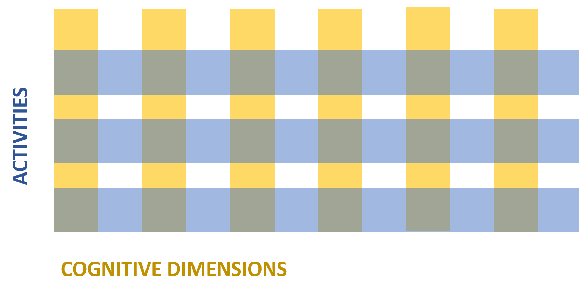

# Dimensions × Activities

Variety of dimensions  
For a given activity

----

**Activities**

Generic activities  
involving notations

Each has different notational needs

----------------------------------------------------------------------------------------------------
- template: largeicons

# Activities with different needs

- *fa-plus-circle* **Incrementation** - adding formulas to spreadsheet
- *fa-copy* **Transcription** - copying data from paper
- *fa-edit* **Modification** - changing formula in a spreadsheet
- *fa-certificate* **Exploratory design** - designing software structure
- *fa-search* **Searching** - finding uses of a function
- *fa-filter* **Exploratory understanding** - understanding code

----------------------------------------------------------------------------------------------------
- template: image

# Dimensions × Activities

Variety of dimensions  
For a given activity

**Dimensions**

Characteristic  
of the notation

Human-computer interaction analysis perspective

----------------------------------------------------------------------------------------------------
- template: largeicons

# Example cognitive dimensions (1/2)

- *fa-ban* **Viscosity** - Resistance to change
- *fa-eye* **Visibility** - Ability to view components easily
- *fa-location-arrow* **Premature commitment** - Need to decide too early
- *fa-archive* **Hidden dependencies** - Important links not visible
- *fa-key* **Role-expressiveness** - Purpose of an entity is clear

----------------------------------------------------------------------------------------------------
- template: largeicons

# Example cognitive dimensions (2/2)

- *fa-atom* **Error-proneness** - Notation invites mistakes
- *fa-calculator* **Abstraction** - Types and availability of mechanisms
- *fa-align-center* **Consistency** - Similar syntax has similar semantics
- *fa-font* **Diffuseness** - Verbosity of language
- *fa-lightbulb* **Hard mental operations** - High cognitive demand

----------------------------------------------------------------------------------------------------
- template: image

# Case study

Two ways of specifying email filters

**Visual rule editor** vs.  
**scripting language**

----------------------------------------------------------------------------------------------------
- template: content
- class: two-column prf2

# Two ways of specifying email filters

### Visual editor

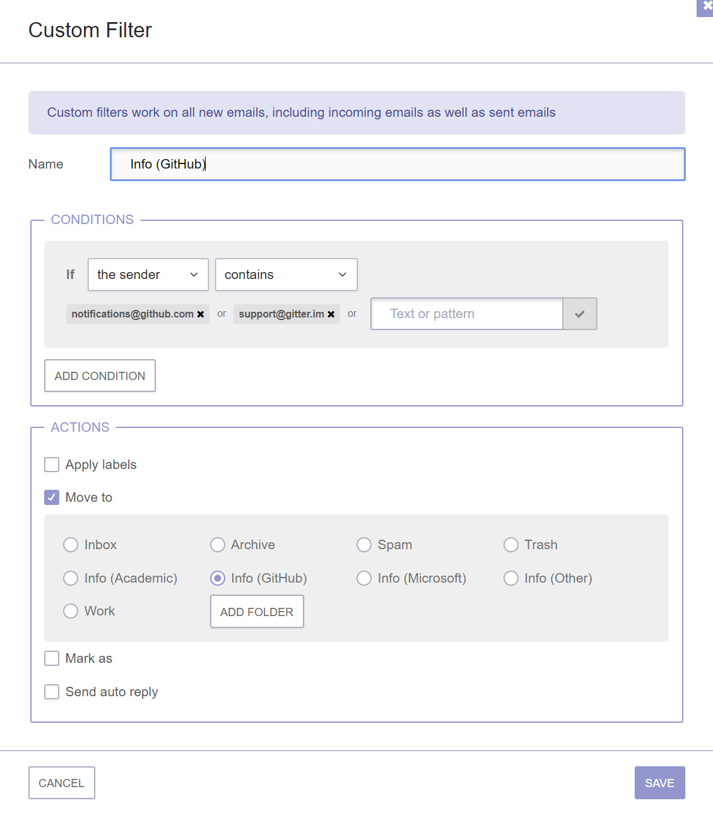

-----

### Scripting language

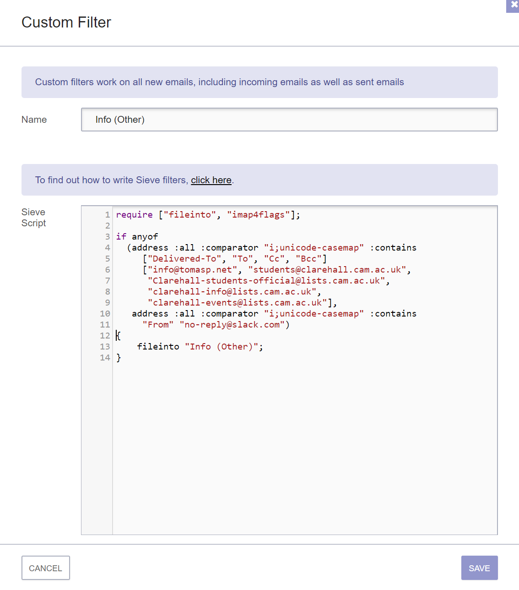

----------------------------------------------------------------------------------------------------
- template: image
- class: smaller

# Incrementation

Adding new condition  

----

**Viscosity**  
Not all additions possible

**Abstraction**    
Condition format is fixed

**Hard mental operations**  
Everything is simple & clear

----------------------------------------------------------------------------------------------------
- template: image
- class: smaller

# Incrementation

Adding new condition  

-----

**Viscosity**  
Edit text for any change

**Abstraction**  
Possible via a script

**Hard mental operations**
Understanding code is hard

----------------------------------------------------------------------------------------------------
- template: lists
- class: smaller border

# Two ways of specifying filters

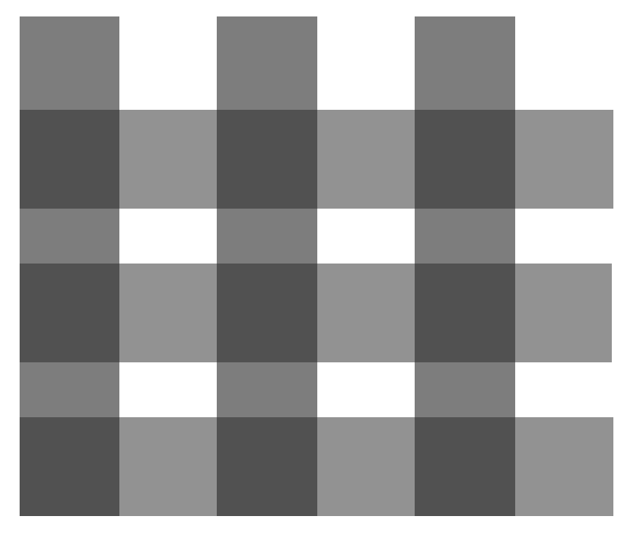

## Cognitive dimensions

 - Used for evaluation
 - Consider activities & dimensions
 - Clear lists to use

## What is a better notation?

- Wrong question: different trade-offs!
- UI is viscose, less abstract, but simpler
- Script has abstractions, less viscose, but harder

----------------------------------------------------------------------------------------------------
- template: image

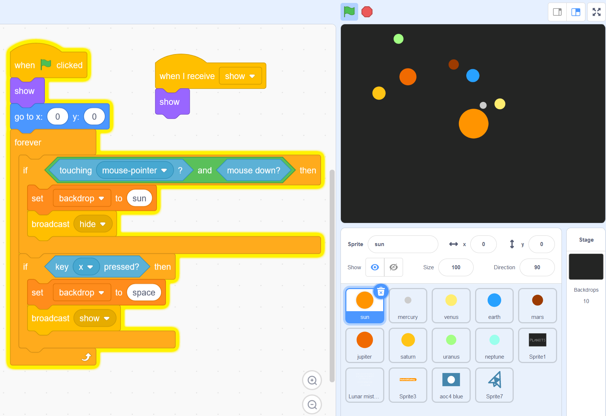

# Block based  visual languages

**Contrast with text for addition (writing code)**

Premature commit
Diffuseness / verbosity
Abstraction  
Error-proneness

*****************************************************************************************
- template: subtitle

# Programming systems
## Technical dimensions

-----------------------------------------------------------------------------------------
- template: lists
- class: smaller

# From languages to systems

## Programming system is

Integrated and complete set of  
tools sufficient for creating,  
modifying, and executing programs

## These will include

Notations for structuring programs  
and data, facilities for running and  
debugging programs, and interfaces  
for performing all of these tasks.

-----------------------------------------------------------------------------------------
- template: lists
- class: border

# Interesting programming systems

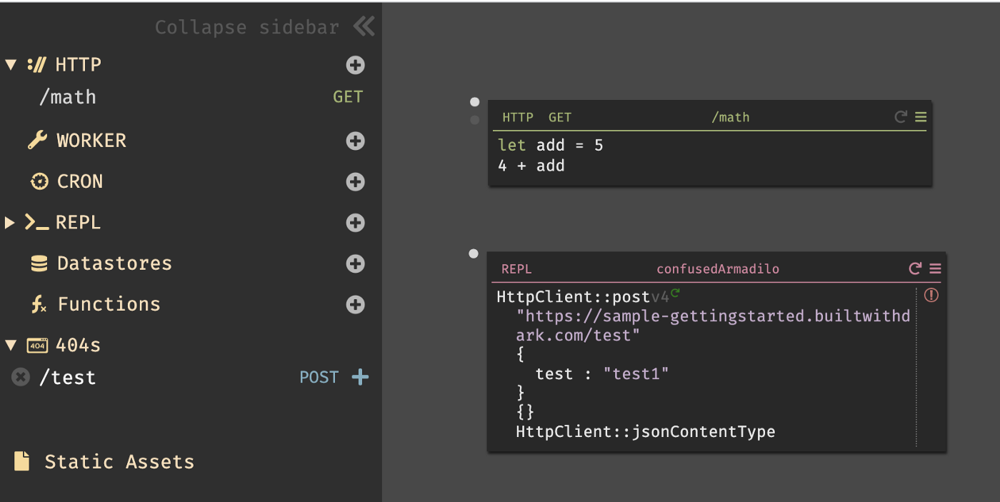

## Research and industry

- Low-code and no-code startups
- Live & interactive systems
- Interesting code editors

## How do we talk about these?

- Difficult to say what is new
- Hard to look beyond the interface
- Programming systems deserve a theory too!

-----------------------------------------------------------------------------------------
- template: image
- class: smaller

# Technical dimensions

Based on analysis of past and modern systems

**Capture their key characteristics**

**Describe a range of possible values**

Descriptive, not prescriptive

-----------------------------------------------------------------------------------------
- template: content
- class: two-column condensed

# Technical dimensions catalogue

**Interaction**  
Feedback Loops  
Modes of interaction  
Abstraction Construction  

**Notation**  
Notational Structure  
Surface/Internal  
Primary/Secondary  
Expression Geography  
Uniformity  

**Error Handling**  
Error Detection  
Error Response  

-----

**Conceptual Structure**  
Integrity/Openness  
Composability  
Convenience  
Commonality  

**Customizability**  
Staging  
Externalizability  
Additive Authoring  
Self-Sustainability  

**(Others)**  
Degrees of Automation  
Learnability & Sociability  

-----------------------------------------------------------------------------------------
- template: lists

# Notational uniformity

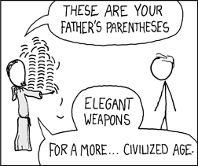

## Post-modernist

- Variety of different notations
- More to learn, but better problem fit
- Perl language, Web platform

## Modernist

- Small set of uniform primitives
- Not everything fits the notation
- Lisp and (partly) Smalltalk

-----------------------------------------------------------------------------------------
- template: lists
- class: border smaller

# Self-sustainability

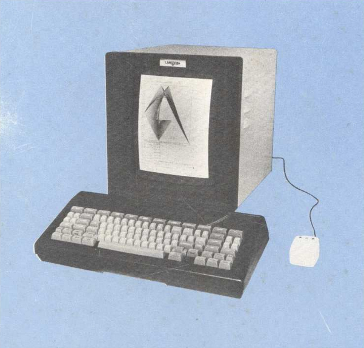

## Separate language level

- Implementation vs. user level
- Limited changeability from within
- Java and other languages

## Integrated systems design

- Implemented & modifiable in itself
- Often changeable at runtime
- Smalltalk, Lisp Machines

-----------------------------------------------------------------------------------------
- template: lists
- class: border

# Abstraction construction

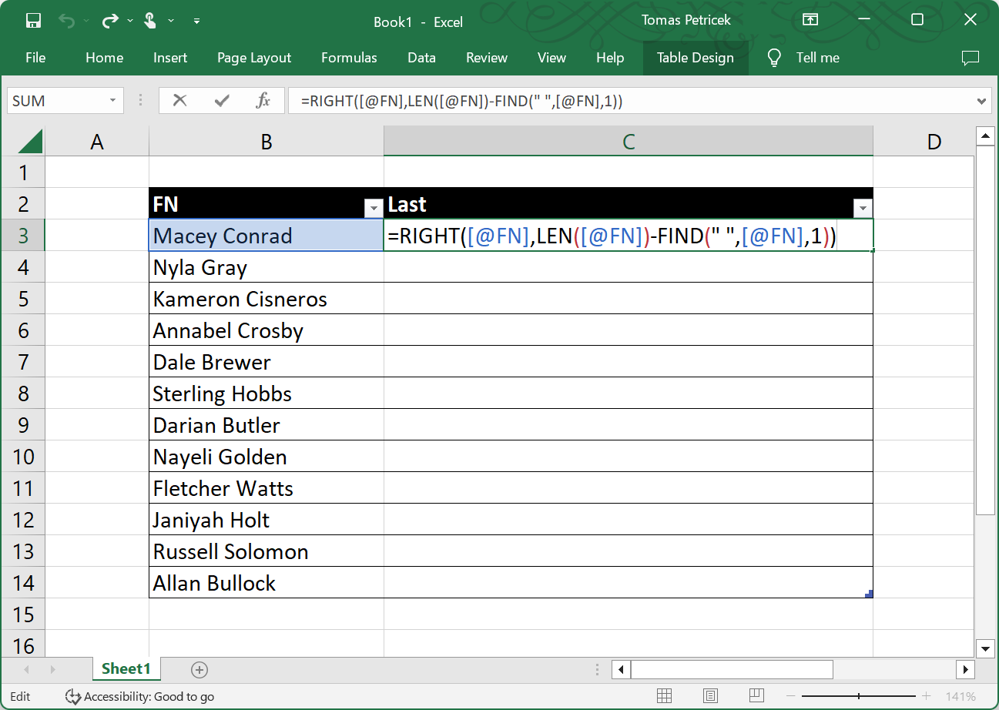

## From Concrete

- Generalize from examples
- Expanding range in Excel
- Pygmalion system

## From Abstract

- Define function first
- Most programming languages
- Coding done without values

-----------------------------------------------------------------------------------------
- template: icons

# Technical dimensions
## Programming system heuristic

- *fa-puzzle-piece* Making sense of different systems
- *fa-brush* Broad strokes and high-level
- *fa-scale-unbalanced* Useful for making comparisons
- *fa-map-location-dot* Useful for finding gaps in design space

*****************************************************************************************
- template: subtitle

# Conclusions
## Heuristic analysis

-----------------------------------------------------------------------------------------
- template: image
- class: smaller

# Heuristic analysis of languages

Both idea generation  
and evaluation

**Depends on the  
kind of heuristic**

Categorical allows questioning

Ordinal allows for  
degree comparison

-----------------------------------------------------------------------------------------
- template: lists
- class: smaller

# Reading

## CDs in the real-world!

- A Usability Analysis of Blocks-based Programming Editors using  
  Cognitive Dimensions
- [tinyurl.com/nprg075-blocks](https://ieeexplore.ieee.org/abstract/document/8506483)
  ([SciHub](https://sci-hub.se/https://ieeexplore.ieee.org/abstract/document/8506483))

## Why read this paper

- Example of rigorous analysis
- Based on a user study
- Equally possible with expert assessment

-----------------------------------------------------------------------------------------
- template: title

# Conclusions

**Heuristic evaluation of programming systems**

- Memory (categorical) and liveness (ordinal)
- Cognitive and technical dimension frameworks
- Broad-brush map of the design space
- Useful for evaluation and novel design ideas

---

**Tomáš Petříček**, 204 (2nd floor)  
_<i class="fa fa-envelope"></i>_ [petricek@d3s.mff.cuni.cz](mailto:petricek@d3s.mff.cuni.cz)  
_<i class="fa-solid fa-circle-right"></i>_ [https://tomasp.net](https://tomasp.net) | [@tomaspetricek](http://twitter.com/tomaspetricek)  
_<i class="fa-solid fa-circle-right"></i>_ https://d3s.mff.cuni.cz/teaching/nprg075

-----------------------------------------------------------------------------------------
- template: content
- class: condensed

# References (1/2)

**Live visual programming**

- Tanimoto, S. L. (1990). [VIVA: A visual language for image processing](https://sci-hub.se/https://www.sciencedirect.com/science/article/abs/pii/S1045926X05800126), Journal on Visual Languages
- Tanimoto, S. L. (2013). [A Perspective on the Evolution of Live Programming](http://projectsweb.cs.washington.edu/ole/Liveness2013.pdf), LIVE

**Language adoption & Heuristics**

- Meyerovich, L. A., Rabkin, A. S. (2013). [Empirical Analysis of Programming Language Adoption](https://raw.githubusercontent.com/lmeyerov/lmeyerov.github.io/master/projects/socioplt/papers/oopsla2013.pdf), OOPSLA
- Meyerovich, L. A., Rabkin, A. S. (2012). [Socio-PLT: Sociological Principles for Programming Language Adoption](https://raw.githubusercontent.com/lmeyerov/lmeyerov.github.io/master/projects/socioplt/papers/onward2012.pdf), Onward!
- Nielsen, J. (1994). [10 Usability Heuristics for User Interface Design](https://www.nngroup.com/articles/ten-usability-heuristics/). Norman-Nielsen Group

-----------------------------------------------------------------------------------------
- template: content
- class: condensed

# References (2/2)

**Cognitive, technical & memory models**

- Sitaker, K. J. (2016). [The memory models that underlie programming languages](http://canonical.org/~kragen/memory-models/), Online
- Jakubovic, J. et al. (2023). [Technical Dimensions of Programming Systems](https://raw.githubusercontent.com/jdjakub/papers/master/prog-2022/prog22-master.pdf), Programming
- Holwerda, R., Hermans, F. (2018). [A usability analysis of blocks-based programming editors using cognitive dimensions](https://ieeexplore.ieee.org/document/8506483), VL/HCC
- Blackwell, A., Green, T. (2002). [Notational Systems – the Cognitive Dimensions of Notations framework](https://www.cl.cam.ac.uk/~afb21/publications/CarrollChapter.pdf). (Chapter)

**A bit of history**

- Goldstine, H., von Neumann, J. (1947). [Planning and coding of problems for an electronic computing](https://www.ias.edu/sites/default/files/library/pdfs/ecp/planningcodingof0103inst.pdf), Princeton
