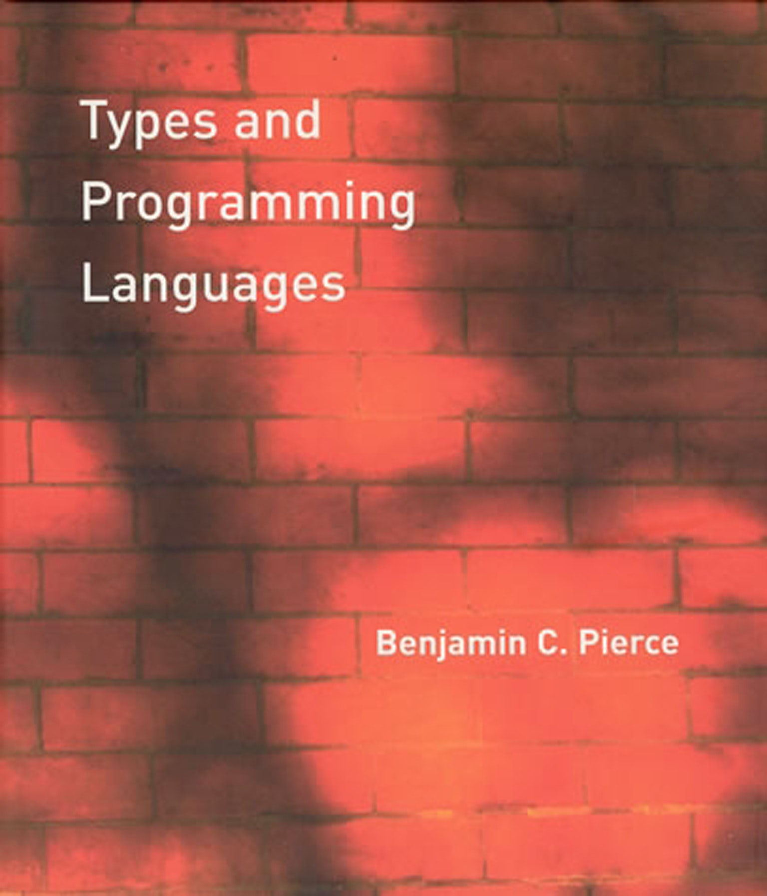
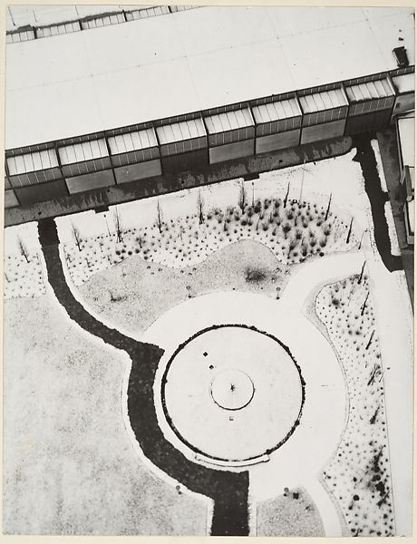

- title: How to do programming language research | Programming language design (NPRG075)

*****************************************************************************************
- template: title

# NPRG075
## Assignment & How to do programming language research

---

**Tomáš Petříček**, 204 (2nd floor)  
_<i class="fa fa-envelope"></i>_ [petricek@d3s.mff.cuni.cz](mailto:petricek@d3s.mff.cuni.cz)  
_<i class="fa-solid fa-circle-right"></i>_ [https://tomasp.net](https://tomasp.net) | [@tomaspetricek](http://twitter.com/tomaspetricek)

**Lectures:** Tuesday 12:20, S6  
_<i class="fa-solid fa-circle-right"></i>_ https://d3s.mff.cuni.cz/teaching/nprg075

*****************************************************************************************
- template: subtitle

# Assignment
## Requirements & expectations

-----------------------------------------------------------------------------------------
- template: icons

# Assignment
## What the course page says

- *fa-pen-to-square* Complete a small independent project
- *fa-flask* Use one of the methodologies discussed
- *fa-search* Study or design an aspect of system
- *fa-file-lines* Produce a brief report about your work

-----------------------------------------------------------------------------------------
- template: lists
- class: smaller border

# Scope of the project

## Formal quantification

- Course is 3 ECTS credits
- Credit is 20-30 hours of work
- $75 - (12*1.5 + 10) = 47$

## What does this mean

- About a week of actual work
- Includes all stages of the project
- Idea, research, implementation, write-up

-----------------------------------------------------------------------------------------
- template: icons

# Project
## Research and implementation

- *fa-shapes* Depends on the methodology!
- *fa-pencil* Writing code, formal models, design patterns
- *fa-magnifying-glass-chart* Analysing past or contemporary systems
- *fa-diagram-next* Sketching a new idea for a design
- *fa-clock* You cannot write much code in two days!

-----------------------------------------------------------------------------------------
- template: image
- class: smaller

# Programming language?

**Anything involved in instructing the computer!**

Language, programming environment, runtime system, framework, library, command line tool or AI

Small aspect or a feature!

-----------------------------------------------------------------------------------------
- template: lists
- class: smaller border

# Writing a report

## Communicate your work

- What is the main idea?
- What did you do, learn, conclude?
- Think a brief research paper

## Research paper

- Contribute a tiny piece of knowledge!
- Shorter for design, longer for analysis
- From lab report to an essay
- [How to write a research paper](https://www.microsoft.com/en-us/research/uploads/prod/2016/07/How-to-write-a-great-research-paper.pdf)
  by SPJ

-----------------------------------------------------------------------------------------
- template: image

# It is your project

Do something you actually care about

**Reuse & overlap is encouraged!**

Thesis, other courses, work project, hobby topic, blog post, workshop paper

*****************************************************************************************
- template: subtitle

# Programming languages
## How to do research?

-----------------------------------------------------------------------------------------
- template: icons

# Programming
## Getting research ideas

- *fa-face-angry* **Frustration** - fix a problem I'm facing!
- *fa-face-grin-stars* **Methodology** - use a method I like for something
- *fa-face-flushed* **User-centric** - identify what others need
- *fa-face-dizzy* **Analytical** - understand something properly

-----------------------------------------------------------------------------------------
- template: lists
- class: smaller

# Fix a problem I have

## Example problems

- Client-server programming is hard  
  [Write webs as single F# program?](http://tomasp.net/academic/theses/webtools/)
- Managing large PHP repo is hard  
  [Add types and an efficient VM to PHP?](https://hacklang.org/)

## How to do this

- Use your knowledge expertise!
- "Look I did this cool thing!" is not research claim
- Describe design, formal model, positioning, evaluation

-----------------------------------------------------------------------------------------
- template: image
- class: smaller

# Spiralling abstraction

-----

**Web programming is hard**  
Write a new language!

-----

**Creating languages is hard**  
Define a formal model!

-----

**Defining models is hard**  
Use category theory!

-----

**Category theory is hard**  
Use category theory...?

-----------------------------------------------------------------------------------------
- template: lists
- class: smaller border

# Use a method I like

## Example methods

- Types for correctness  
  [Check network communication](https://en.wikipedia.org/wiki/Session_type)
- Close reading of code  
  [Look at BASIC, UNIX, etc.](https://10print.org)

## How to do this

- Find problem to fit a method
- Reshape problem so that method applies
- May be hard to motivate for new methods

-----------------------------------------------------------------------------------------
- template: lists
- class: smaller border

# User-centric programming research

## Example areas

- Developer tools  
  [How programmers search? reCode](https://www.cs.cmu.edu/~jssunshi/assets/pdf/ni2021recode.pdf)
- Data journalists  
  [Interactive documents language Idyll](https://idl.cs.washington.edu/files/2018-Idyll-UIST.pdf)

## How to do this

- Small-scale formative interviews
- Analyse answers & define design goals
- (Implement and evaluate solution.)

-----------------------------------------------------------------------------------------
- template: lists
- class: border

# Understand something properly

## Example problems

- Modern web frameworks  
  [A formal semantics of React](https://par.nsf.gov/servlets/purl/10157540)
- Empirical code studies    
  [Large-scale analysis of GitHub](https://d3s.mff.cuni.cz/teaching/courses/nprg075/slides/nprg075-analysis.pdf)

## How to do this

- Start by being confused or surprised!
- Formalization, reproduction, comparative analysis
- Result should make the matter clear

*****************************************************************************************
- template: subtitle

# Research methods
## Ways of looking at programming

-----------------------------------------------------------------------------------------
- template: animicons

# Methods: Historical study

- *fa-dna* **Evolution of a programming concept**  
   How has a concept changed over time?
- *fa-om* **Cultures of programming analysis**  
   Do different communities talk about a thing differently?
- *fa-search* **Close look at a past system**  
   In-depth analysis of how something in the past worked

-----------------------------------------------------------------------------------------
- template: animicons

# Methods: Design and culture

- *fa-font* **Critical study of interesting source**  
  Close look at a clever hack, famous snippet, etc.
- *fa-table* **Design of a pattern language**  
  How to design a specific kind of application or system
- *fa-tree* **Exploring a design metaphor**  
  Programming as architecture, writing, gardening, etc.

-----------------------------------------------------------------------------------------
- template: animicons

# Methods: Empirical and formal

- *fa-github fa-brands* **Empirical analysis of source code**  
  How do different kinds of source code differ?
- *fa-person-chalkboard* **Small experimental user study**  
  Formative interview or small usability study
- *fa-not-equal* **Formal semantics or a model**  
  Of something confusing, like React state management
- *fa-subscript* **Type system design description**  
  Small but confusing feature like overload resolution

-----------------------------------------------------------------------------------------
- template: animicons

# Methods: Heuristic analysis

- *fa-pen-nib* **Notation analysis using cognitive dimensions**  
  Comparative analysis of two possible notations
- *fa-computer* **System analysis using technical dimensions**  
  Evaluation of non-standard programming environment
- *fa-brain* **Design or explanation using cognitive model**  
  Programmer misconceptions, design for cognitive fit

*****************************************************************************************
- template: subtitle

# Past projects
## Inspiration and ideas

-----------------------------------------------------------------------------------------
- template: lists
- class: smaller border

# Past projects

## Quantitative coding style analysis
- Empirical analysis
- Style of different kinds of Python

## Evolution of CLOS system
- History of the LISP object model

## Patterns in Package Managers
- Pattern language for designing package managers.

*****************************************************************************************
- template: subtitle

# Conclusions
## Final tips

-----------------------------------------------------------------------------------------
- template: lists
- class: smaller

# Reading

## How to write a research paper

- By Simon Peyton-Jones
- [tinyurl.com/nprg075-paper](https://www.microsoft.com/en-us/research/uploads/prod/2016/07/How-to-write-a-great-research-paper.pdf) (PDF)

## Why should you read this?

- Report is like a mini-paper
- Not all advice applies, but...
- Good hints on writing, structure, etc.
