- title: Write your own tiny programming system(s)! (NPRG077)

*****************************************************************************************
- template: title
- class: nologo swapped

# Write your own tiny programming system(s)
## Why such a strange course topic?

---

**Tomas Petricek**, Charles University

_<i class="fa fa-envelope"></i>_ [tomas@tomasp.net](mailto:tomas@tomasp.net)  
_<i class="fa-brands fa-bluesky"></i>_ [@tomasp.net](https://bsky.app/profile/tomasp.net)  
_<i class="fa-solid fa-globe"></i>_ [https://tomasp.net](https://tomasp.net)  
_<i class="fa-solid fa-globe"></i>_ https://d3s.mff.cuni.cz/teaching/nprg077


<style>.h2condense h2 { letter-spacing:-1px } </style>

-----------------------------------------------------------------------------------------
- template: icons
- class: h2condense

# Research
## Understanding & improving programming

- *fa-code* Programming languages, types and theory
- *fa-hand-point-up* Interactive programming environments
- *fa-building-columns* History and philosophy of computing
- *fa-person-digging* Building tiny systems throughout!

-----------------------------------------------------------------------------------------
- template: largeicons

# Many different tiny systems!

- *fa-school* **PhD, University of Cambridge**  
  Context-aware programming languages

- *fa-industry* **Microsoft Research Cambridge**  
  F# and applied functional programming

- *fa-city* **The Alan Turing Institute, London**  
  Expert and non-expert tools for data science

- *fa-church* **University of Kent, Canterbury**  
  Principles of programming systems

- *fa-landmark* **Charles University, Prague**  
  Human-computer interaction and history

-----------------------------------------------------------------------------------------
- template: image
- class: smaller

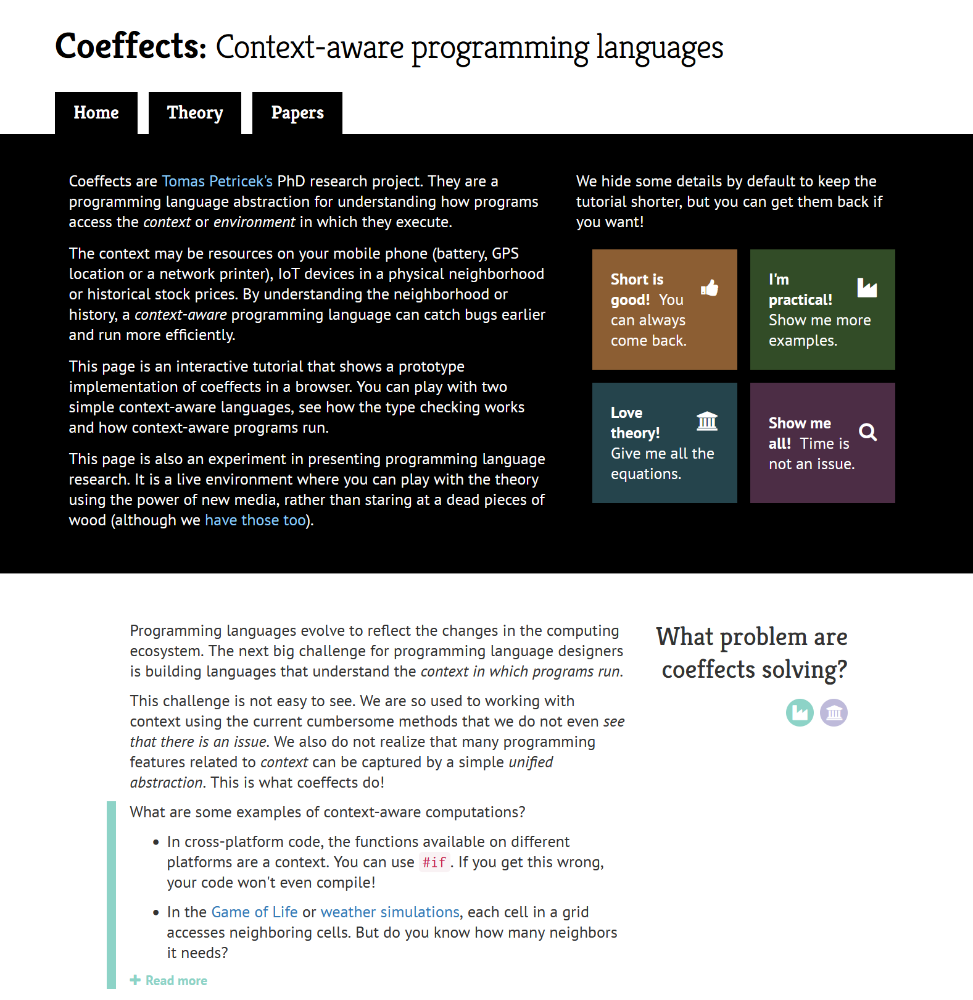

# Demo
## Coeffects playground

Needed "implementation" to finish my PhD!

**How to show potential uses of theoretical work?**

Tiny web demos of two potential applications

-----------------------------------------------------------------------------------------
- template: image
- class: smaller

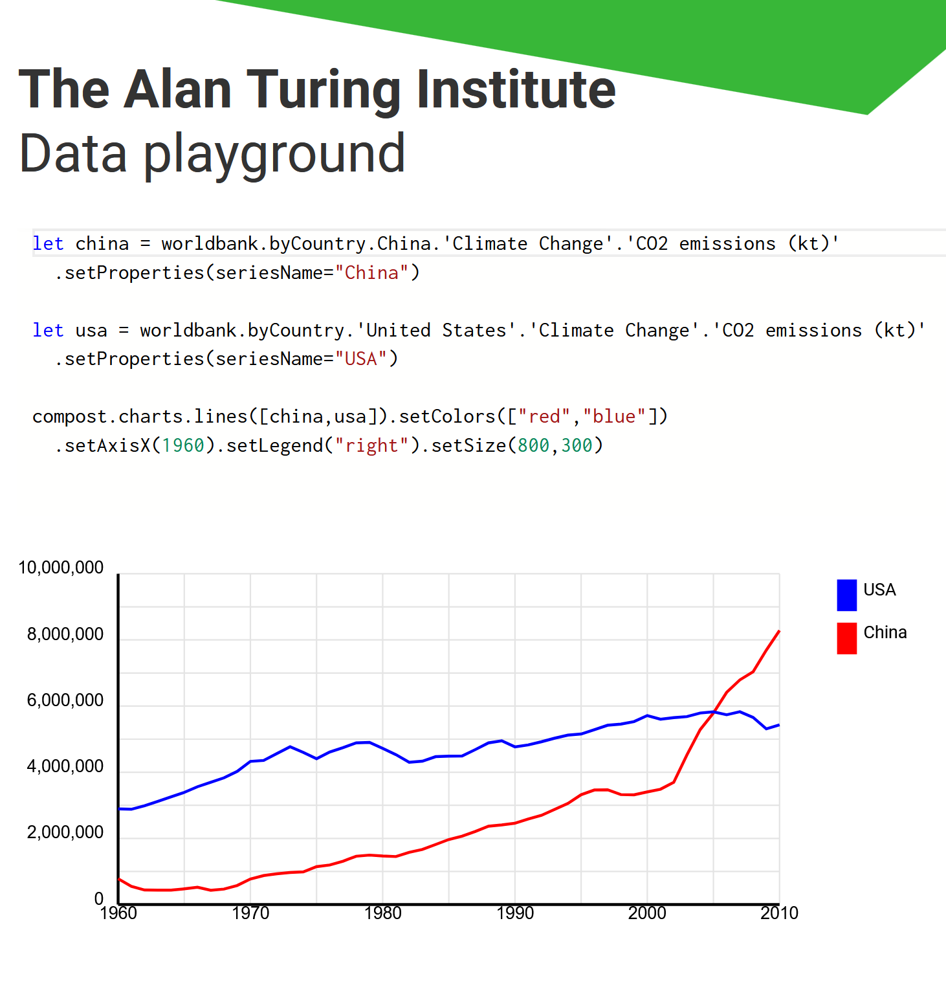

# Demo
## The Gamma project

Making programmatic data exploration accessible to non-programmers

**Small typed language, but interaction is why it works!**

-----------------------------------------------------------------------------------------
- template: image
- class: smaller noborder

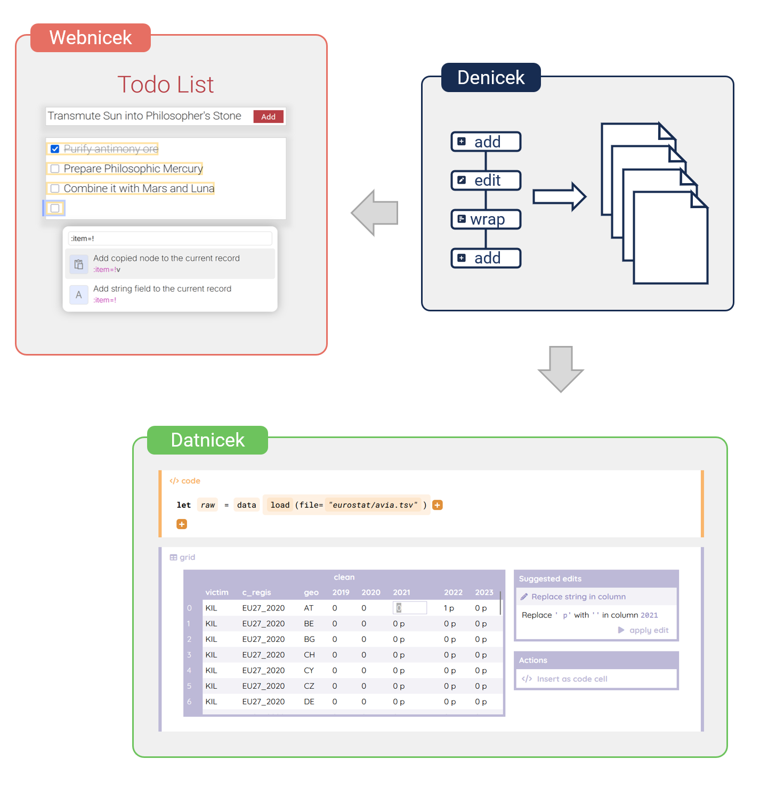

# Demo
## The Denicek project

Computational substrate for end-user programming

**Making implementation of end-user programming experiences easier...**

-----------------------------------------------------------------------------------------
- template: lists
- class: smaller noborder

# Practical details


## Course structure
- Videos to watch in advance
- Hands-on 3-hour labs
- Code skeleton with detailed comments

## Doing the course
- Six different languages or systems
- Come to the labs to get help!
- Complete basic tasks for 4/6 systems

-----------------------------------------------------------------------------------------
- template: image
- class: nologo

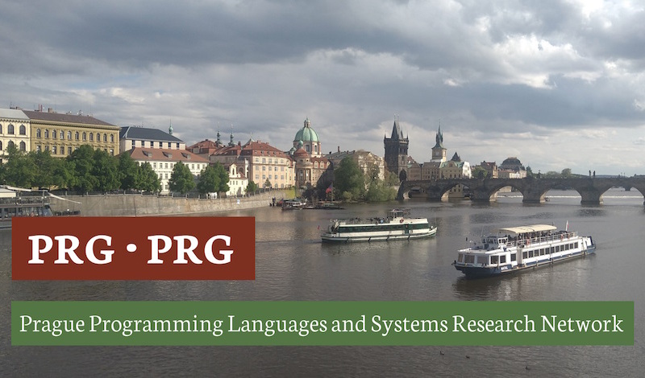

# PRG*PRG / Prague

Programming systems & languages research

**D3S at MFF CUNI**  
**PRL at FIT CTU**

Ask us about PhD & post-doc opportunities!

https://prgprg.org

*****************************************************************************************
- template: title
- class: nologo swapped

# Write your own tiny programming system(s)
## Tiny systems as a methodology

---

**Tomas Petricek**, Charles University

_<i class="fa fa-envelope"></i>_ [tomas@tomasp.net](mailto:tomas@tomasp.net)  
_<i class="fa-brands fa-bluesky"></i>_ [@tomasp.net](https://bsky.app/profile/tomasp.net)  
_<i class="fa-solid fa-globe"></i>_ [https://tomasp.net](https://tomasp.net)  
_<i class="fa-solid fa-globe"></i>_ https://d3s.mff.cuni.cz/teaching/nprg077


-----------------------------------------------------------------------------------------
- template: lists

# Academic research

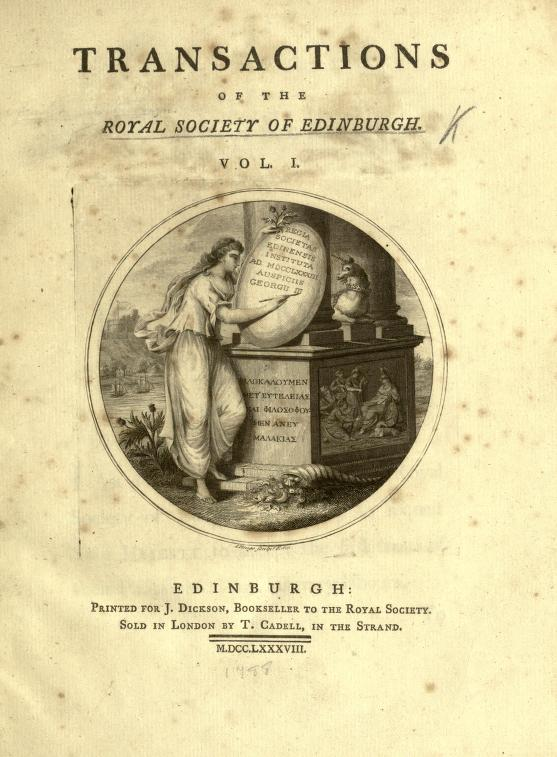

## What are we trying to study?

- Basic essential principles
- In isolation from other factors
- You have to ignore a lot!

## What to ignore in programming?

- Efficient implementation?
- Wide-spread user adoption?
- User interface of editor tools?

-----------------------------------------------------------------------------------------
- template: image

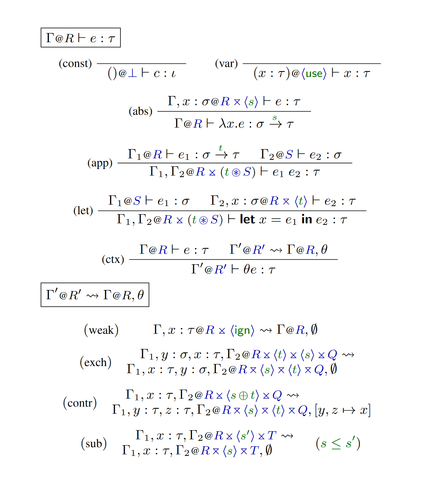

# Programming language theory

**Ignore implementation and practical features**

Prove that the core idea is formally sound

-----------------------------------------------------------------------------------------
- template: image

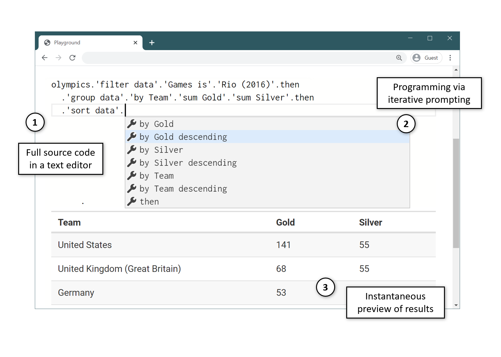

# Human-computer interaction (HCI)

**Ignore inner working and implementation**

Show that users can actually use it and how

-----------------------------------------------------------------------------------------
- template: image

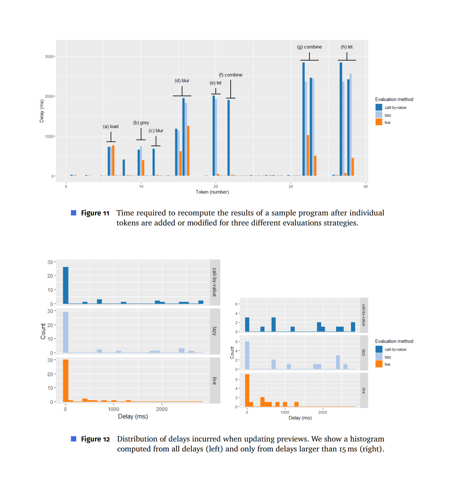

# Performance evaluation

**Ignore usability and design implications**

Show that you can do better than a baseline

-----------------------------------------------------------------------------------------
- template: icons

# Tiny systems
## What is not covered?

- *fa-code* Syntax choices and writing parsers
- *fa-hammer* Compilation and JIT-based runtimes
- *fa-pencil* Formal semantics and correctness
- *fa-cog* Supporting real-world use cases

-----------------------------------------------------------------------------------------
- template: icons

# Tiny systems
## What can we study?

- *fa-arrow-pointer* Can talk about stateful interactive systems
- *fa-cog* Implement key aspects of inner working
- *fa-floppy-disk* Reconstruct interesting past systems
- *fa-paperclip* But cannot be printed on 12 pages of A4

-----------------------------------------------------------------------------------------
- template: image
- class: smaller

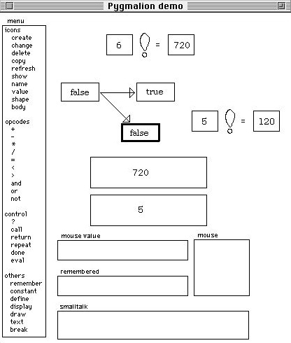

# Demo
## Pygmalion

**Why study 1908s programming systems?**

No code programming!

First us of an "icon"!

-----------------------------------------------------------------------------------------
- template: content
- class: two-column

# Two uses of tiny systems

### Education

*fa-keyboard* **Best way to learn?**  
*fa-xx* Write it on your own!

*fa-atom* **Understand principles**  
*fa-xx* As well as subtle details

*fa-spaghetti-monster-flying* **I hope you'll have fun!**  
*fa-xx* Little may be enough...

---

### Research

*fa-puzzle-piece* **Imagine new paradigms**  
*fa-xx* End-user programming?

*fa-arrow-pointer* **Focus on interaction**  
*fa-xx* How exactly did it work

*fa-spinner* **Ignore practical details**  
*fa-xx* They can often wait!

-----------------------------------------------------------------------------------------
- template: image
- class: smaller


# Teaching tiny systems
(Kamin, 1990)

**Used in multiple  
courses worldwide**

Examples in Pascal

Languages covered are APL, Clu, LISP, Prolog, Smalltalk, Scheme, SASL

**Not always focused  
on the key aspect**

-----------------------------------------------------------------------------------------
- template: image
- class: smaller


# Tiny systems and AI
(Schank, Riesbeck, 1981)

**Miniature implementations of 5 Yale AI lab programs**

Faster, more efficient, easier to understand, modify and extend

"Miniatures, demos and artworks" by Warren Sack

-----------------------------------------------------------------------------------------
- template: image
- class: smaller

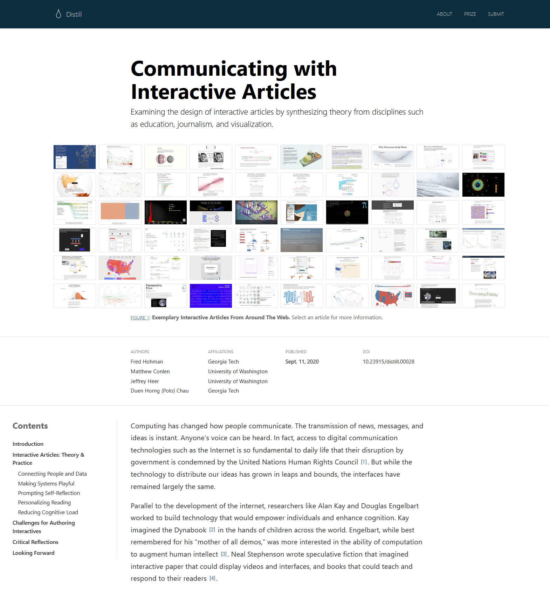

# Tiny systems and ML
(Distill, 2016-2021)

---

**Five affordances of interactive articles**

Connecting people & data  
Making systems playful  
Prompting self-reflection  
Personalizing reading  
Reducing cognitive load  

*****************************************************************************************
- template: title
- class: nologo swapped

# Write your own tiny programming system(s)
## Programming languages and systems

---

**Tomas Petricek**, Charles University

_<i class="fa fa-envelope"></i>_ [tomas@tomasp.net](mailto:tomas@tomasp.net)  
_<i class="fa-brands fa-bluesky"></i>_ [@tomasp.net](https://bsky.app/profile/tomasp.net)  
_<i class="fa-solid fa-globe"></i>_ [https://tomasp.net](https://tomasp.net)  
_<i class="fa-solid fa-globe"></i>_ https://d3s.mff.cuni.cz/teaching/nprg077


-----------------------------------------------------------------------------------------
- template: image

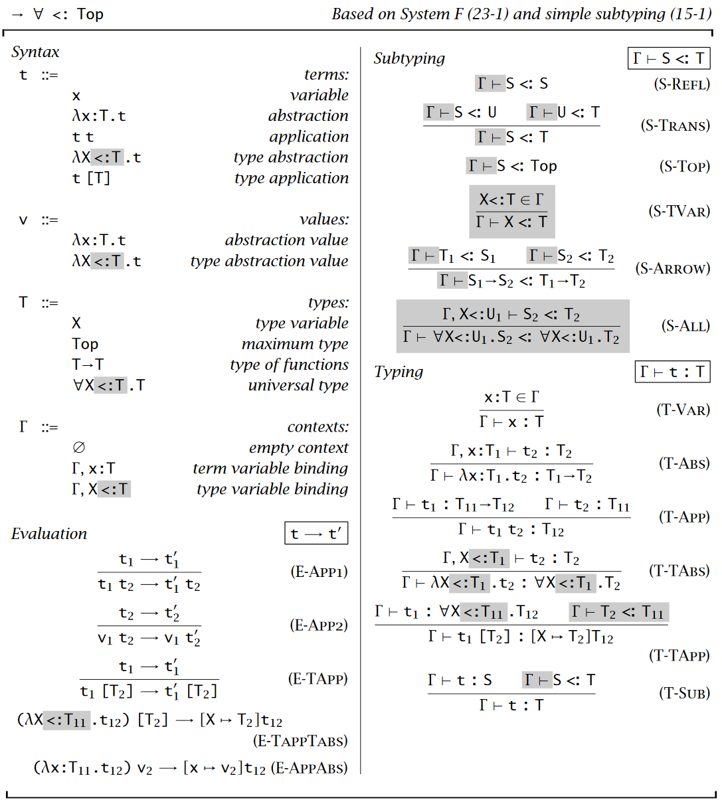

# Programming Languages

Programming is  
writing code

Formal semantics, implementation, paradigms, types

------

**We know how   
to study this!**

-----------------------------------------------------------------------------------------
- template: image
- class: noborder


# Programming Systems

Interacting with a stateful system

Feedback, liveness, interactive user interfaces

------

**But how do we  
study this?**

-----------------------------------------------------------------------------------------
- template: lists

# Paradigm shift in 1990s


## From systems to languages

- From running system to code
- From state & interaction to semantics
- Incommensurable ways of thinking!

## History of science matters!

- How did we get where we are?
- What ideas got lost along the way?
- How to recover them?

-----------------------------------------------------------------------------------------
- template: largeicons

# Language paradigms

- *fa-arrow-right* **Functional programming**   
  No mutable state, everything a function

- *fa-memory* **Imperative programming**  
  Mutable memory with pointers

- *fa-shapes* **Object-oriented programming**  
  Everything an object, hides its own logic

- *fa-database* **Logic programming**  
  Declare facts and use inference

-----------------------------------------------------------------------------------------
- template: subtitle

# Demo
## Logic programming in Prolog

-----------------------------------------------------------------------------------------
- template: largeicons

# System interaction

- *fa-terminal* **Command line programming systems**  
  Code editor, compiler, build tools, etc.

- *fa-image* **Image-based programming model**  
  Programming system is always running

- *fa-arrows-rotate* **Interactive and live programming**  
  System provides continuous feedback

- *fa-table* **Incremental or reactive evaluation**  
  Recompute on edit or when new data come

-----------------------------------------------------------------------------------------
- template: subtitle

# Demo
## Object-orientation in Smalltalk

-----------------------------------------------------------------------------------------
- template: lists
- class: bigger

# What really matters?

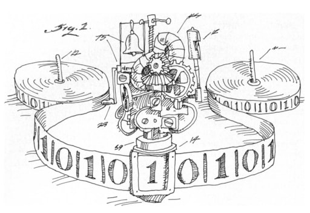

## Static structure (program)

- Source code of the program
- What you have at the start

## Dynamic structure (process)

- Runtime data structures
- What else do you need to run

## Logic of evaluation (execution)

- How the dynamic state evolves?

-----------------------------------------------------------------------------------------
- template: image

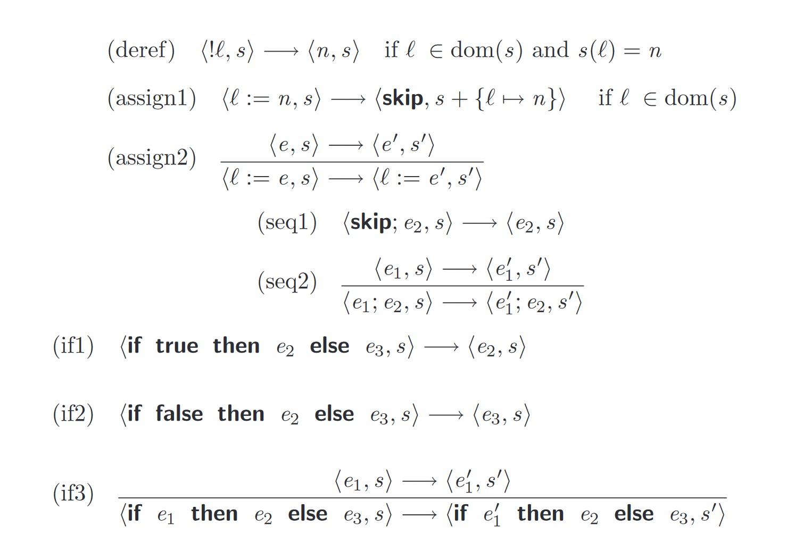

# Operational semantics

Standard approach<br/> to programming language theory

---

**Why write small interpreters instead?**

-----------------------------------------------------------------------------------------
- template: code
- class: smallcode

```ocaml
(* A term like 'father(william, X)'
   consists of predicate 'father',
   atom 'william' and variable 'X' *)
type Term =
  | Atom of string
  | Variable of string
  | Predicate of string * Term list

(* A rule 'head(...) :- body.' *)
type Rule =
  { Head : Term
    Body : Term list }

(* A program is a list of rules *)
type Program = Rule list
```

# Code can run!

**A good way to explain the structures!**

1) Functional data types for the static and dynamic structure

2) A function to model the evaluation logic

*****************************************************************************************
- template: title
- class: nologo swapped

# Write your own tiny programming system(s)
## A tase of the F# language

---

**Tomas Petricek**, Charles University

_<i class="fa fa-envelope"></i>_ [tomas@tomasp.net](mailto:tomas@tomasp.net)  
_<i class="fa-brands fa-bluesky"></i>_ [@tomasp.net](https://bsky.app/profile/tomasp.net)  
_<i class="fa-solid fa-globe"></i>_ [https://tomasp.net](https://tomasp.net)  
_<i class="fa-solid fa-globe"></i>_ https://d3s.mff.cuni.cz/teaching/nprg077


-----------------------------------------------------------------------------------------
- template: lists
- class: noborder smaller

# The F# programming language

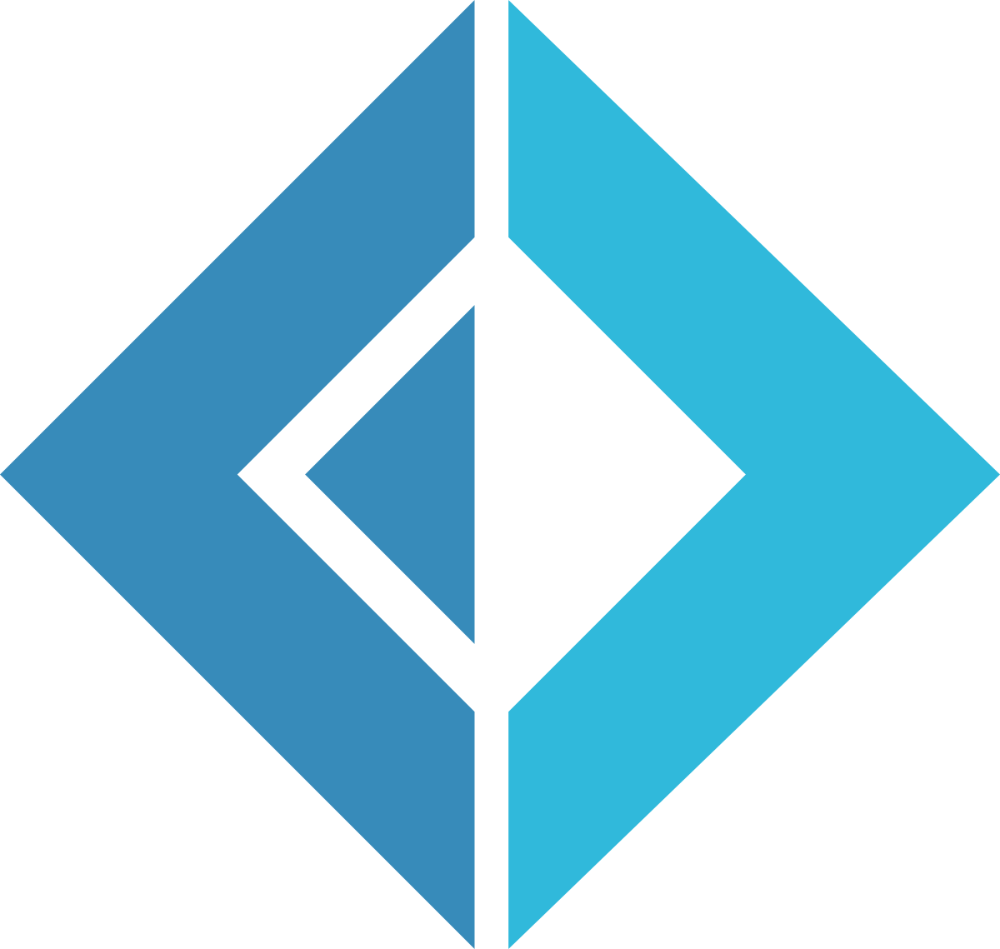

## What is F# about?

- Functional-first based on OCaml
- Great interop with .NET and JS
- Open-source (MIT) with team in Prague!

## Who uses F# for what?

- Consultancies for full-stack web dev
- Finance and insurance companies for modelling
- TU Kaiserslautern for systems biology
- Success stories like Jet.com

-----------------------------------------------------------------------------------------
- template: icons

# Why F#?
## Building tiny programming systems

- *fa-shapes* Algebraic data types for structure modelling
- *fa-cog* Mostly functional is great for logic
- *fa-pen-to-square* Runs everywhere & has nice tools
- *fa-face-smile* I like the language and can help you!

-----------------------------------------------------------------------------------------
- template: subtitle

# Demo
## First look at F#

-----------------------------------------------------------------------------------------
- template: image
- class: smaller

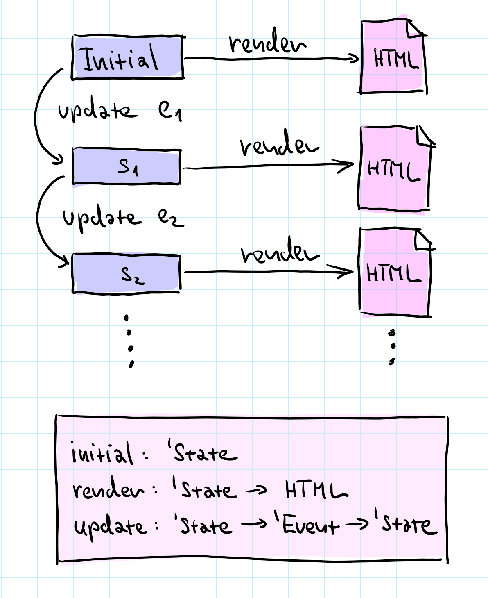

# Elmish architecture

**Functional interactive user interface development**

Types for application  
`State` and user `Event`

Functions to `render`  
and `update` state

-----------------------------------------------------------------------------------------
- template: subtitle

# Demo
## Building a counter in F#

-----------------------------------------------------------------------------------------
- template: subtitle

# Demo
## Building a TODO list in F#

-----------------------------------------------------------------------------------------
- template: image

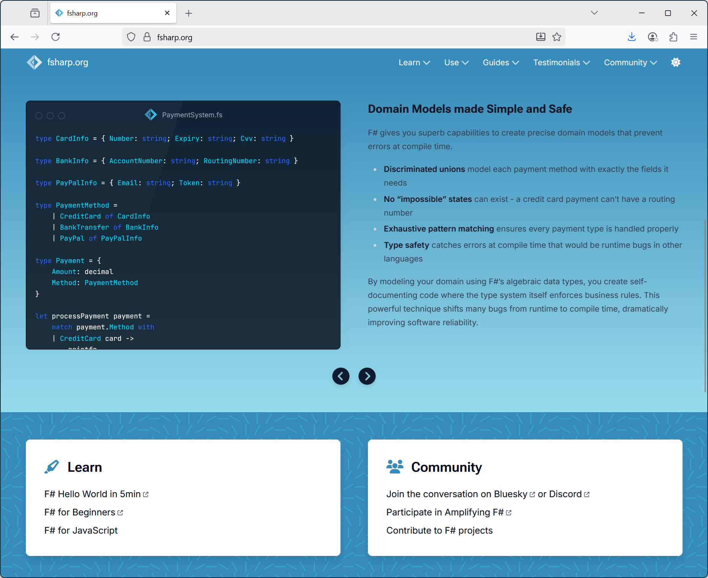

# More about F#

**https://fsharp.org**

We will only need a small part of the language!

**I will introduce all constructs we will need as we go...**

*****************************************************************************************
- template: content
- class: condensed

# References

**Tiny system examples**

- [Coeffects: Context-aware programming languages](https://tomasp.net/coeffects/)
- [The Gamma: Democratizing data science](http://turing.thegamma.net/)
- [The Lost Ways of Programming: Commodore 64 BASIC](https://tomasp.net/commodore64/)

**Starting points**

- Ingalls, D. (2020). [The Smalltalk Zoo: Smalltalk-78 (NoteTaker)](https://smalltalkzoo.thechm.org)
- Hohman, F. et al. (2020). [Communicating with Interactive Articles](https://distill.pub/2020/communicating-with-interactive-articles/)
- Schank, R. C., Riesbeck, C. K. (1981). [Inside Computer Understanding Five Programs Plus Miniatures](https://www.routledge.com/Inside-Computer-Understanding-Five-Programs-Plus-Miniatures/Schank-Riesbeck/p/book/9780898590715)
- Kamin, S. (1990) [Programming languages: an interpreter-based approach](https://dl.acm.org/doi/10.5555/78092). Addison-Wesley.
- Kamin, S. (1990) [PLIBA source code mirror on GitHub](https://github.com/pliba)
- Sack. W. (2020). [Miniatures, Demos and Artworks: Three <br/> Kinds of Computer Program, Their Uses and Abuses](https://www.shift-society.org/hapop5/boa.pdf)
