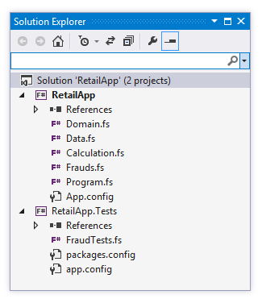
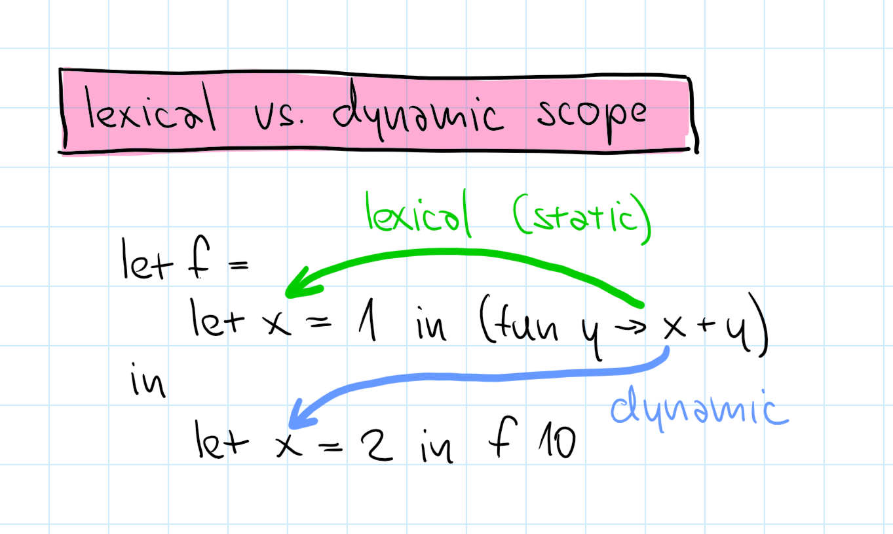
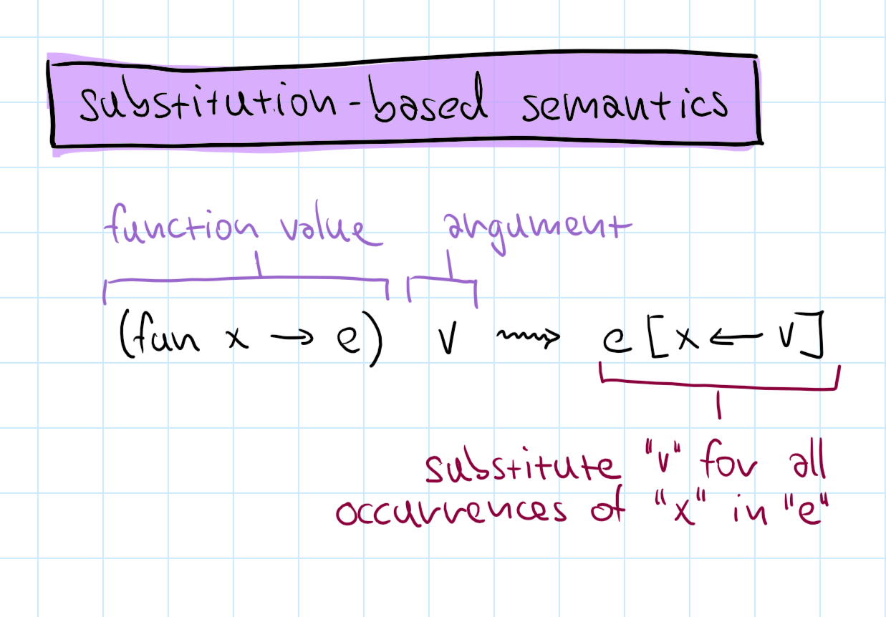
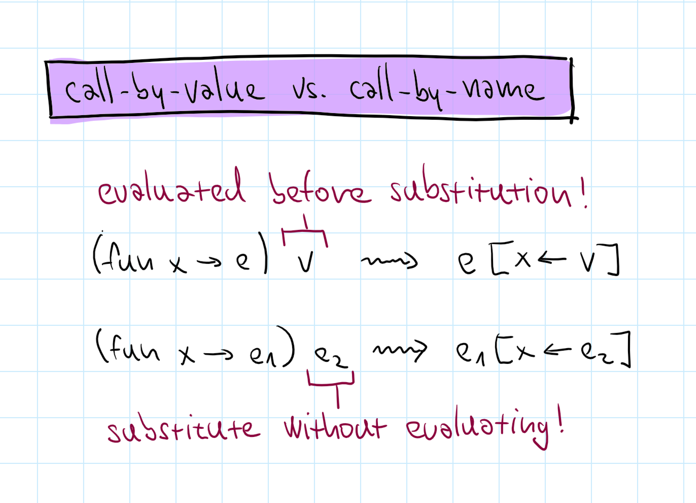

- title: TinyML: Tiny functional programming langauge interpreter | Write your own tiny programming system(s)! (NPRG077)

*****************************************************************************************
- template: title
- class: nologo swapped

# TinyML: Tiny functional language interpreter
## What you need to know about F#

---

**Tomas Petricek**, Charles University

_<i class="fa fa-envelope"></i>_ [tomas@tomasp.net](mailto:tomas@tomasp.net)  
_<i class="fa-brands fa-bluesky"></i>_ [@tomasp.net](https://bsky.app/profile/tomasp.net)  
_<i class="fa-solid fa-globe"></i>_ [https://tomasp.net](https://tomasp.net)  
_<i class="fa-solid fa-globe"></i>_ https://d3s.mff.cuni.cz/teaching/nprg077


-----------------------------------------------------------------------------------------
- template: lists

# Two sides of this video


## Introducing the F# language

- Some practical information
- Enough so that you can use it!
- Some important things omitted

## Introducing ML-style languages

- Background for our TinyML
- Basic features & principles
- Some weird corner cases!

-----------------------------------------------------------------------------------------
- template: lists
- class: smaller noborder

# Getting started with F#


## F# and .NET runtime

- .NET SDK for Mac, Linux, Windows
- OSS with .NET Foundation since 2017
- https://dotnet.microsoft.com

## F# editors and tools

- Microsoft Visual Studio (Win only)
- JetBrains Rider (Win, Linux, Mac)
- VS Code with Ionide (Win, Linux, Mac)
- https://ionide.io

-----------------------------------------------------------------------------------------
- template: lists
- class: smaller noborder

# F# project types


## Script-based development

- Write code in `.fsx` file
- Run using F# Interactive REPL
- Can select & run out-of-order!

## Project-based development

- Project `.fsproj` with `.fs` sources
- Standard build and run workflow
- Live reload with Fable and JavaScript

-----------------------------------------------------------------------------------------
- template: lists
- class: noborder

# F# project structure



## Declaration order matters!

- Helper function and types
- Types defining domain model
- Operations for working with it
- User interface

## How to organize F# projects

- Namespaces or modules
- Type declarations
- Functions (inside modules)

-----------------------------------------------------------------------------------------
- template: largeicons

# Data type declarations in F#

- *fa-clipboard* **Tuples and records**  
  Store multiple values of different types
- *fa-code-fork* **Discriminated unions**  
  Represent one of multiple possible options
- *fa-bars* **Collections, lists and maps**  
  Multiple values of the same type
- *fa-arrow-rotate-right* **Recursive declarations**  
  Type that can include values of itself
- *fa-user-secret* **Type aliases**  
  Shorthand for a type with a long name

-----------------------------------------------------------------------------------------
- template: subtitle

# Demo
## Simple expression evaluator

-----------------------------------------------------------------------------------------
- template: lists

# Selected advanced features


## Lists and maps

- Immutable collections
- Linked (cons) lists with head/tail
- Key-value maps with lookup

## Recursion and laziness

- Recursive functions using `let rec`
- Works also for values, but beware!
- `Lazy<T>` to represent lazy values

-----------------------------------------------------------------------------------------
- template: subtitle

# Demo
## Maps, lazy values, recursion

*****************************************************************************************
- template: title
- class: nologo swapped

# TinyML: Tiny functional language interpreter
## Language features and theory

---

**Tomas Petricek**, Charles University

_<i class="fa fa-envelope"></i>_ [tomas@tomasp.net](mailto:tomas@tomasp.net)  
_<i class="fa-brands fa-bluesky"></i>_ [@tomasp.net](https://bsky.app/profile/tomasp.net)  
_<i class="fa-solid fa-globe"></i>_ [https://tomasp.net](https://tomasp.net)  
_<i class="fa-solid fa-globe"></i>_ https://d3s.mff.cuni.cz/teaching/nprg077


-----------------------------------------------------------------------------------------
- template: code

```ocaml
(* Functions *)
let f = (fun x -> 10 + x)
f 32

(* Tuples *)
let t = (1, "hi")
fst t
snd t

(* Unions *)
let c1 = Case1(10)
let c2 = Case2(32)
match c1 with
| Case1 n -> n + 32
| Case2 n -> n + 10
```

# Language features of TinyML (1/2)

**Functions** but only with single argument

**Tuples** of two element with getters

**Unions** without tag name with two cases

-----------------------------------------------------------------------------------------
- template: code

```ocaml
(* Let bindings *)
let x = 10 in x * 32

(* Let desugaring *)
(fun x -> x * 32) 10

(* Conditionals *)
if e then 10 else 32

(* Both are expressions *)
1 + (if e then 41 else 1)
1 + (let x = 1 in x + x)

(* Currying *)
let add = fun a -> fun b -> a + b
in (add 10) 32
```

# Language features of TinyML (2/2)

`let` is a syntactic sugar

Everything (`if` and `let` too) is an expression

Functions that return functions (currying) if
you need multiple parameters

-----------------------------------------------------------------------------------------
- template: image
- class: smaller



# Variable scoping

**Lexical**

Based on static block structure in code

Function value needs to capture variables (closure)

**Dynamic**

Based on dynamic evaluation structure

-----------------------------------------------------------------------------------------
- template: image



# Operational semantics

Formally specify how expression evaluate

**Substitution-based**

We do not need variable context!

-----------------------------------------------------------------------------------------
- template: image



# Call-by-name vs. call-by-value

**Call-by-value** (strict)

Evaluates function arguments first (ML)

**Call-by-name** (lazy)

Evaluates arguments when needed (Haskell)

*****************************************************************************************
- template: title
- class: nologo swapped

# TinyML: Tiny functional language interpreter
## Interpreter and step-by-step guide

---

**Tomas Petricek**, Charles University

_<i class="fa fa-envelope"></i>_ [tomas@tomasp.net](mailto:tomas@tomasp.net)  
_<i class="fa-brands fa-bluesky"></i>_ [@tomasp.net](https://bsky.app/profile/tomasp.net)  
_<i class="fa-solid fa-globe"></i>_ [https://tomasp.net](https://tomasp.net)  
_<i class="fa-solid fa-globe"></i>_ https://d3s.mff.cuni.cz/teaching/nprg077


-----------------------------------------------------------------------------------------
- template: code
- class: smaller

```ocaml
type Expression =
  | Constant of int
  | Binary of
      string *
      Expression *
      Expression

val evaluate :
  Expression -> int
```

# Basic interpreter structure (0/2)

`Expression` is the source  
code that user writes

`evaluate` takes expression  
and returns the result

-----------------------------------------------------------------------------------------
- template: code
- class: smaller

```ocaml
type Value =
  | Number of int

type Expression =
  | Constant of int
  | Binary of
      string *
      Expression *
      Expression

val evaluate :
  Expression -> Value      
```

# Basic interpreter structure (1/2)

Adding values as the  
result of evaluation

`Value` is what we  
get as the result

`evaluate` takes expression  
and returns value


-----------------------------------------------------------------------------------------
- template: code
- class: smaller

```ocaml
type Value =
  | Number of int

type Expression =
  | Constant of int
  | Binary of   
      string *
      Expression *
      Expression
  | Variable of string

type VariableContext =
  Map<string, Value>

val evaluate :
  Expression -> VariableContext -> Value      
```

# Basic interpreter structure (2/2)

**Adding variables and variable context**

Variable can store only values (call-by-value)

`evaluate` takes context

-----------------------------------------------------------------------------------------
- template: subtitle

# Demo
## Adding values and variables

-----------------------------------------------------------------------------------------
- template: subtitle

# Lab overview
## TinyML interpreter step-by-step

-----------------------------------------------------------------------------------------
- template: content

# TinyML - Basic tasks

1. **Simple numerical evaluator as the starting point**  
This has already been done for you :-)

2. **Add unary operators (-) and conditional**  
We only have numbers, so treat `1` as `true`

3. **Functions and application**  
Tricky! Closure needs to capture variables!

4. **Let binding as syntactic sugar**  
Evaluate `let` by treating it as apply/lambda

5. **Add a simple data type - tuples**  
New value, constructor and destructor

-----------------------------------------------------------------------------------------
- template: content

# TinyML - Bonus & super tasks

1. **Add more data types - unions**  
New value, constructor and destructor (match)

2. **Add support for recursion**  
Needs `Lazy<Value>` in variable context to work

3. **Add unit and create a list value**  
`Case1(Const(1), Case1(Const(2), Case2(Unit)))`

4. **Implement call-by-name semantics**  
Change variable context to store expressions

5. **Implement evaluation by substitution**  
Toy approach, but you learn the semantics

-----------------------------------------------------------------------------------------
- template: icons

# Lessons learned
## Functional language interpreter

- *fa-box* Distinguishing `Value` and `Expression`
- *fa-arrows-rotate* Recursive function with variable scope
- *fa-bug* Call-by-value and lexical variable scoping!
- *fa-scale-balanced* Nice constructor and destructor symmetry
