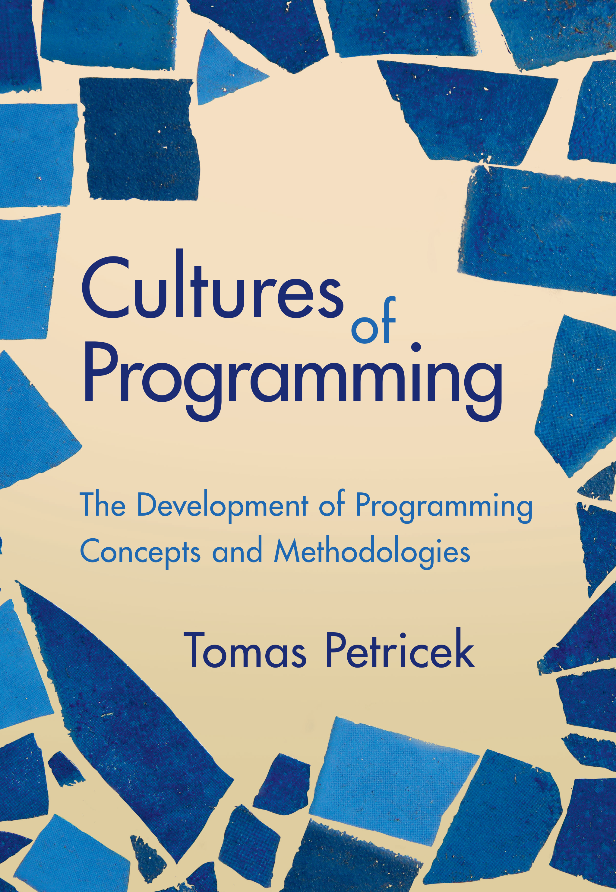

- title: Cultures of Programming - Part 1 - History of programming and why it matters today

****************************************************************************************************
- template: title

# History of programming  and why it matters today
## Cultures of Programming &mdash; Part 1

---

**Tomas Petricek**, Charles University, Prague  

_<i class="fa fa-envelope"></i>_ [tomas@tomasp.net](mailto:tomas@tomasp.net)  
_<i class="fa fa-globe"></i>_ [https://tomasp.net](https://tomasp.net)  
_<i class="fa-brands fa-bluesky"></i>_ [@tomasp.net](https://bsky.app/profile/tomasp.net)    

----------------------------------------------------------------------------------------------------
- template: image
- class: nologo smaller
- background-color: #153374
- style: p { color:#F1DEC2; } p strong { color:#F1DEC2; } .body1 img { border-color:#F1DEC2; }

**The history of programming, told through the lens of interactions between five cultures of programming.**

Cultures cooperate, exchange ideas, disagree, struggle for control.

----------------------------------------------------------------------------------------------------
- template: image
- class: smaller

----------------------------------------------------------------------------------------------------
- template: image
- class: smaller

# What went wrong?

Software update activated unused and wrong code

---

**Reflections on the issue**

- Engineering blogs
- Formal verification talks
- SEC commission analysis

----------------------------------------------------------------------------------------------------
- template: lists
- style: p { margin:5px 0px 20px 0px; }

# Reflections on the Knight glitch

## Mathematical culture
Software not formally verified correct!

## Engineering culture
Poor testing and engineering practice

## Managerial culture
Incorrect implementation of oversight processes

----------------------------------------------------------------------------------------------------
- template: content
- background-color: #153374
- class: nologo
- style: .cult { margin-right:30px; text-align:center; padding:0px 10px 0px 10px;display:inline-block;
    background:#2C68AC;} strong { color:#F1DEC2; font-size:20pt; }
   img { max-height:250px; border-style:none; margin-top:5px; }

<strong>Managerial</strong> 

<strong>Hacker</strong> 

<strong>Humanistic</strong> 

<strong>Mathematical</strong> 

<strong>Engineering</strong> 

----------------------------------------------------------------------------------------------------
- template: lists
- class: bigger
- style: p { margin:5px 0px 20px 0px; } h2 { margin-top:30px;}

# Reflections harder to trace

## Hacker culture
System continued running  
for 45 minutes! It should  
have been turned off sooner!

## Humanistic culture
Threats of high-frequency trading  
Automation reorganizes the human

****************************************************************************************************
- template: subtitle

# Clashes
## What is the problem of programming

----------------------------------------------------------------------------------------------------
- template: image
- class: smaller

# Hacker origins

“Programming in the early 1950s was a black art,  
a private arcane matter involving only a program&shy;mer,
a problem, a computer, ... and a primitive assembly program.”

**John Backus (1976)**

----------------------------------------------------------------------------------------------------
- template: image
- style: .body1 { width:400px; } .body1 img { max-width:360px; }

# Managerial problem

“With SAGE, we were faced with programs too large for one person to grasp entirely and also with the need to hire and train large numbers of people to become programmers... We were faced with organizing and managing a whole new art.”

**Herbert Benington (1956)**

----------------------------------------------------------------------------------------------------
- template: image
- class: smaller

# Mathematical science

“Program testing can be used to show the presence of bugs, but never to show their absence!” Rather than verifying programs through their testing, we should prove them correct.

**Edsger Dijkstra (1969)**

----------------------------------------------------------------------------------------------------
- template: image
- style: .body1 { width:400px; } .body1 img { max-width:360px; }
- class: nologo

# Software engineering

“The phrase software engineering was deliberately chosen as provocative... We undoubtedly produce software by backward techniques.”

The black art of programming has to make way for the science of software engineering!

**NATO Conference on
Software Engineering (1968)**

----------------------------------------------------------------------------------------------------
- template: image
- style: .body1 { width:400px; } .body1 img { max-width:360px; }

# Humanistic problem

“Alan Kay is more interested in us kids. He repudiates the manipulative arrogance .. and serves the dictum of Seymour Papert, Should the computer program the kid or should the kid program the computer?”

**Brand, Rolling Stone (1972)**

****************************************************************************************************
- template: subtitle

# Clashes
## Correctness, programming education

----------------------------------------------------------------------------------------------------
- template: image

# Program errors

Glitch art uses errors for critical & aesthetic goals

---

**Different cultures see errors differently!**

What is error-free?  
How to create it?

----------------------------------------------------------------------------------------------------
- template: largeicons

# Program errors
## What program is correct?

- *fa-person-dress* **Managerial and engineering cultures**  
  Program does what the customer needs
- *fa-file-contract* **Mathematical culture**  
  Matches a given formal specification
- *fa-tiktok fa-brands* **Humanistic culture**  
  Programs shape world, question is ill-defined

----------------------------------------------------------------------------------------------------
- template: image

# Programming education

Floor turtle programmed in the LOGO language using a button box

---

**How to educate good programmers?**

Fundamental concepts!

----------------------------------------------------------------------------------------------------
- template: largeicons

# Programming education

- *fa-computer* **Engineering and mathematical origins**  
  Numerical analysis, logic circuits, programming
- *fa-person-chalkboard* **Growth of the mathematical culture**  
  Abstract programming concepts and algorithms
- *fa-terminal* **Hacker culture disagrees**  
  Programming as a practical skill, taught by doing
- *fa-brain* **Broader humanistic concerns**  
  Teach "powerful ideas," not programming

****************************************************************************************************
- template: icons

# History
## Cultures of programming view

- *fa-landmark-dome* Cultures emerge early in the history
- *fa-image* Unique values, views, methods, aesthetics
- *fa-chess-rook* Stable over history of programming
- *fa-comments* Not always shared communities
- *fa-people-line* Inherently pluralistic discipline?

****************************************************************************************************
- template: subtitle

# Cultures of Programming
## [<i class="fa fa-house"></i> Home](/) &nbsp;&nbsp;  [<i class="fa fa-arrow-right"></i>Continue to Part 2](02-cultures.html)
