- title: Cultures of Programming - Part 2 - Hackers, engineers, managers, mathematicians and humanists

****************************************************************************************************
- template: title

# Hackers, engineers, managers, mathematicians and humanists
## Cultures of Programming &mdash; Part 2

---

**Tomas Petricek**, Charles University, Prague  

_<i class="fa fa-envelope"></i>_ [tomas@tomasp.net](mailto:tomas@tomasp.net)  
_<i class="fa fa-globe"></i>_ [https://tomasp.net](https://tomasp.net)  
_<i class="fa-brands fa-bluesky"></i>_ [@tomasp.net](https://bsky.app/profile/tomasp.net)    

****************************************************************************************************
- template: subtitle

# Mathematical
## Program as a mathematical entity

----------------------------------------------------------------------------------------------------
- template: image
- class: larger

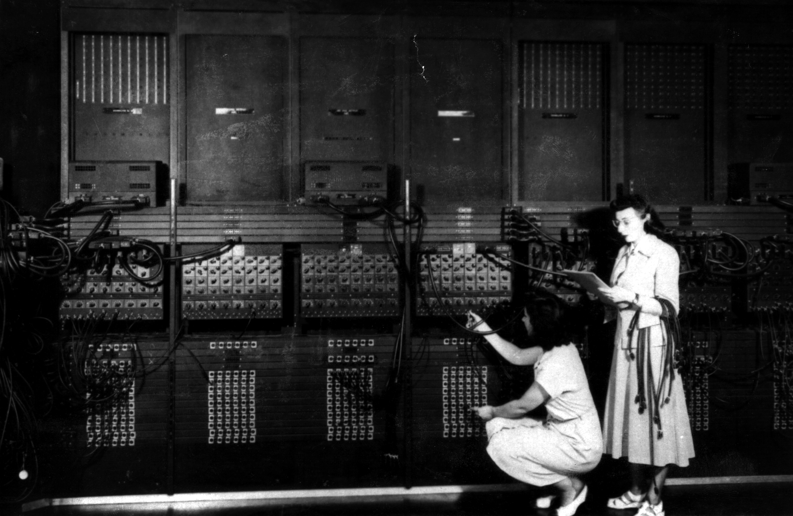

# Programming  in the 1940s

Plugging cables to connect ENIAC units

 

---

**Mathematics?**

Mathematical problems  
Numerical analysis  

----------------------------------------------------------------------------------------------------
- template: lists
- style: img { max-height:280px !important; margin-left:40px; } p { line-height:1.2em; }

# Computing in academia

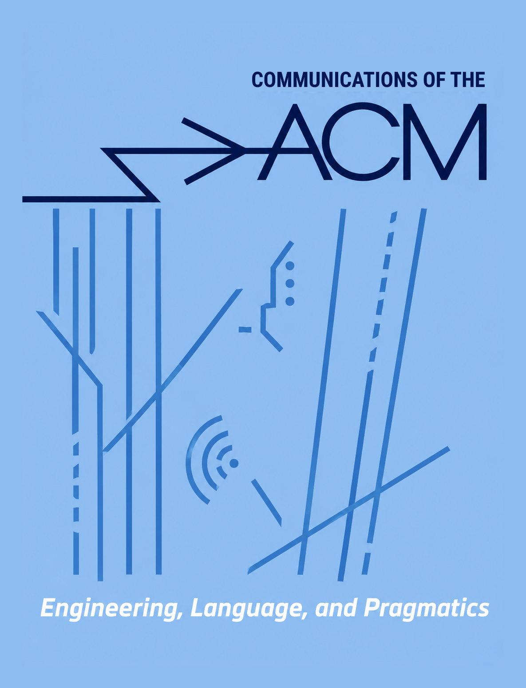

## Letter to the editor (1966)

_The creation of computer science depart&shy;ments is analogous to
creating new de&shy;partments for the railroad, automobile, radio, airplane
or television technologies._

## Mathematical science shift

- Program as a mathematical entity
- Analysis of program correctness
- Theoretical computer science

----------------------------------------------------------------------------------------------------
- template: image

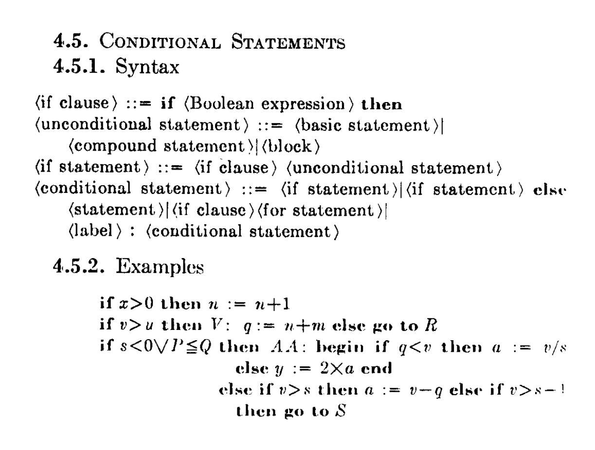

# Algol (1958)

Language definition using formal grammar

**Recognized as an object of beauty but implementation lagged**

Reference language,
publication language,  
& implementation language

----------------------------------------------------------------------------------------------------
- template: content
- style: img { max-width:40%; max-height:600px; vertical-align:top; } .fr img { float:right; margin-right:140px;} .mt img { margin-top:55px; }

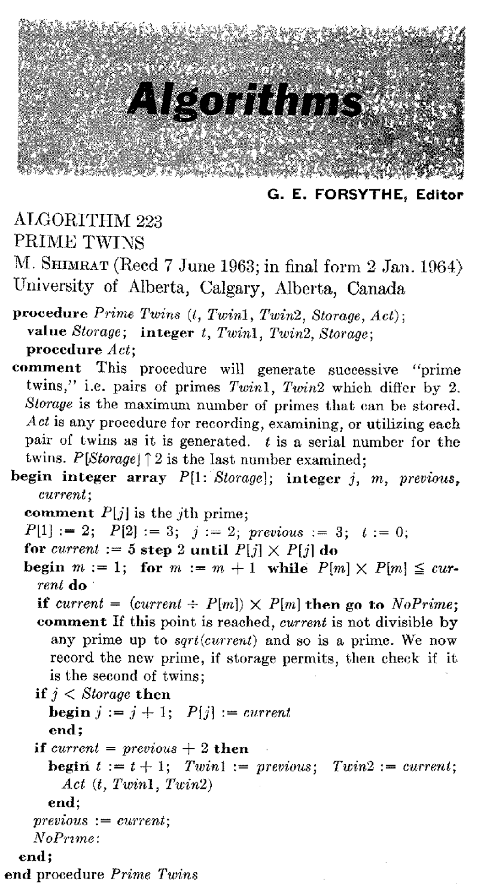

# Algorithms

**Established as a central object of computer science**

Talked about, published

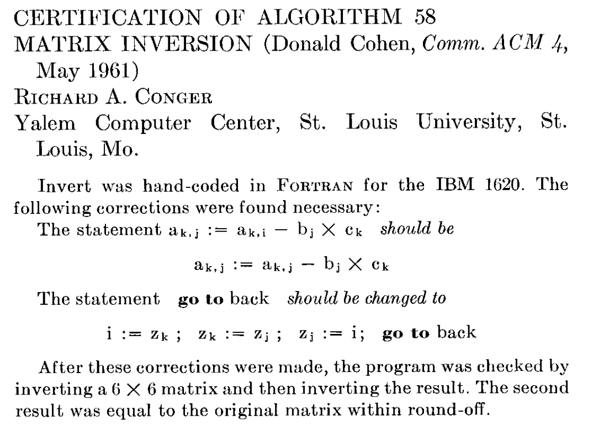

----------------------------------------------------------------------------------------------------
- template: icons

# Achievements
## Mathematical culture today

- *fa-language* Formal language specifications
- *fa-divide* Theory of programming languages
- *fa-chart-line* Complexity theory of algorithms
- *fa-shield-halved* Type systems in Rust or TypeScript
- *fa-helicopter* Real systems like CompCert and sel4

----------------------------------------------------------------------------------------------------
- template: image

# Real-world verified software systems

No longer just a mathematical problem

Requires large-scale engineering efforts

**One culture is  
rarely enough!**

****************************************************************************************************
- template: subtitle

# Hacker
## The hands-on imperative

----------------------------------------------------------------------------------------------------
- template: content
- class: two-column
- style: img { max-height:400px;  }

# Early history of programming

**Hands-on in the 1940s**

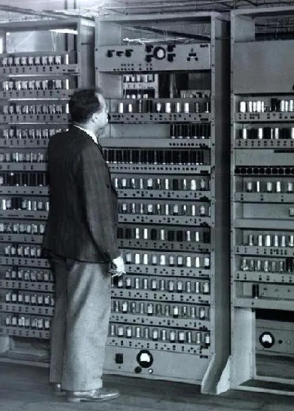

---

**Batch processing in the 1950s**

----------------------------------------------------------------------------------------------------
- template: lists
- style: img { max-width:400px !important; }

# MIT Hacker culture (late 1950s)

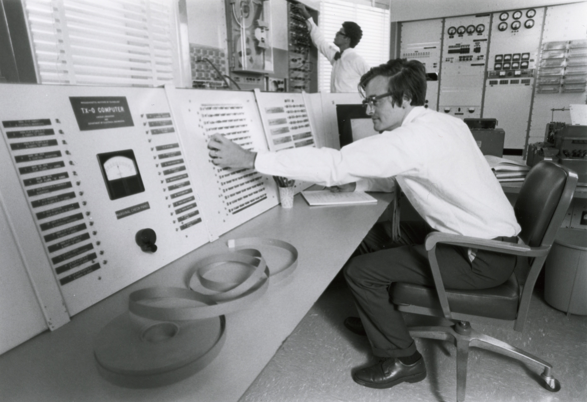

## TX-0 and PDP-1 at MIT

- Test computer with transistors
- Donated to MIT RLE/AI lab
- Hands-on access possible

## Hacker culture

- Playing around to   
  test what it can do
- Tech Model Railway Club (TMRC) hackers

----------------------------------------------------------------------------------------------------
- template: lists
- style: img { max-width:400px !important; margin-left:20px; }

# Hacker culture

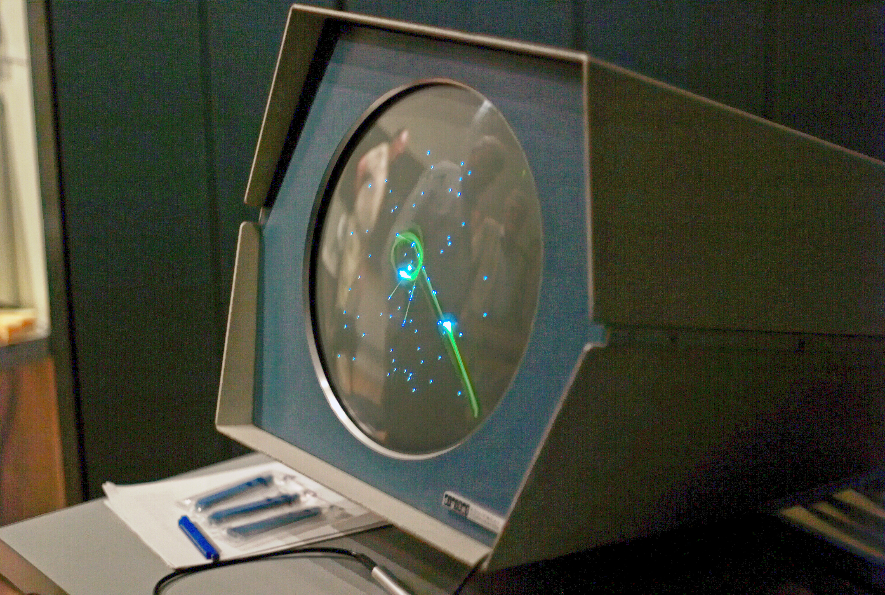

## Typical projects

- **ARPANET** origins and used for information sharing
- **Spacewar!** game to test PDP-1 capabilities
- Interactive debuggers, interpreters and tools

## What the culture says

Only skill matters not "bogus criteria such  
as degrees, age, race, sex, position."

----------------------------------------------------------------------------------------------------
- template: image
- style: img { margin-top:60px; }

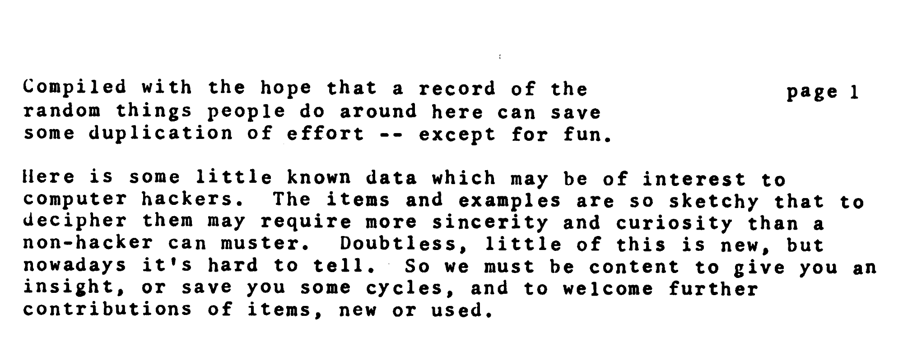

# HAKMEM

**Typical hacker product**

Information should be free!
Idiosyncratic style,
Informal tech report

---

<strong>"Submitted without further explanation  
or cautions"</strong>

Topics from pseudo-Gaussian distributed random variable to
an electrical circuit for an amplifier

----------------------------------------------------------------------------------------------------
- template: lists

# Technical and social achievements

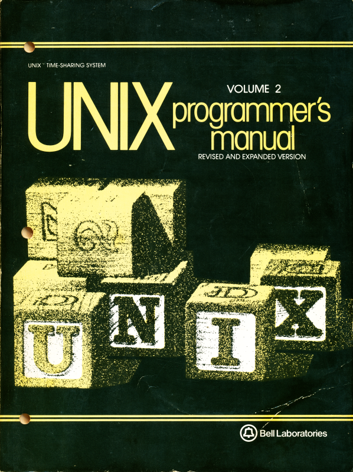

## UNIX and C

- Historical community links
- Lets can exploit machine understanding
- Values clever tricks and skills

## Free software

- Response to proprietary nature of UNIX
- Embodies hacker culture values
- More interesting and difficult history!

****************************************************************************************************
- template: subtitle

# Managerial
## Software development lifecycles

----------------------------------------------------------------------------------------------------
- template: image
- class: smaller

# Semi-Automatic Ground Environment

**Started operation in 1955**

Radar detection of soviet bomber nuclear strike

Largest software project  
at the time by far

----------------------------------------------------------------------------------------------------
- template: icons

# The problem
## Managing teams not code

- *fa-computer* Estimated 27 programmers grew to 2,000
- *fa-people-roof* SDC spin-off trained 7,000 programmers
- *fa-shuttle-space* Large-scale military and business projects
- *fa-industry* Software development as a production line

----------------------------------------------------------------------------------------------------
- template: lists

# How to build software

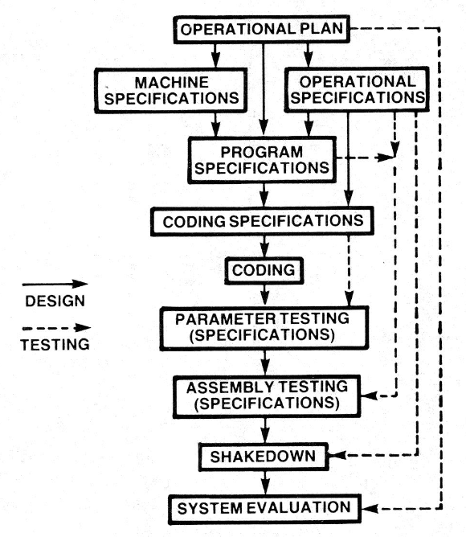

## Development process

- Focus on specifications and process
- Aim for predictable costs and time
- Don't rely on individual skill

## Avoiding risks

- Apollo mission guidance computer
- Bugs despite careful planning
- Risk of fixing higher than risk of mitigation!

----------------------------------------------------------------------------------------------------
- template: image

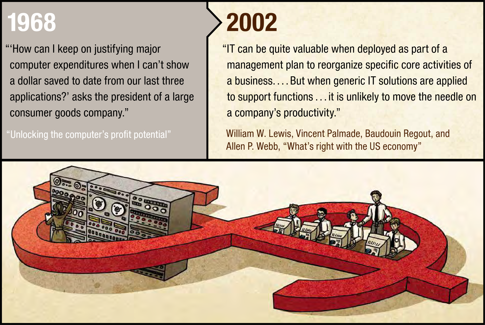

# Unlocking the computer profit potential (1968)

Now that paper processes have been digitized, how can computers bring profit?

---

**Mangers, not programmers,  
should lead!**

****************************************************************************************************
- template: subtitle

# Engineering
## A Proper engineering discipline

----------------------------------------------------------------------------------------------------
- template: content
- class: two-column
- style: img { margin:30px 0px 10px 40px !important; max-height:250px; }

# Software bugs

**First actual bug (1947)**

"Bugs" are small and easy  
to correct, not failures.

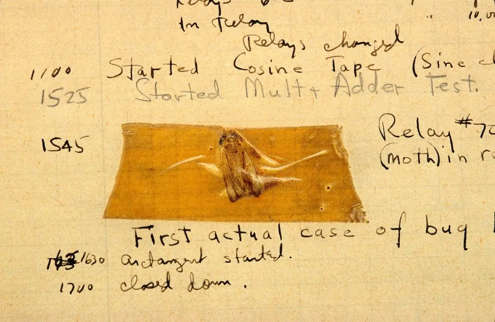

---

**Y2K bug (2000)**

Estimated $300bn spent  
fixing the expected "bug".

----------------------------------------------------------------------------------------------------
- template: lists
- style: h1 { font-size:38pt; letter-spacing:-1px }
- class: bigger

# NATO Conference on Software Engineering

## Provocative title

"Black art of programming has to make way for the science of  
software engineering!"

## New way of thinking

- Hackers do not have reliable methods
- Mathematics is too complicated (Algol 68)
- Follow-up 1969 conference considered a failure

----------------------------------------------------------------------------------------------------
- template: icons

# Engineering
## Practices and values

- *fa-calendar-days* Careful development planning
- *fa-weight-scale* Rigorous testing and measurements
- *fa-toolbox* Documentation and use of tools
- *fa-bug* Overengineering and error handling
- *fa-file-code* Professionalism and code quality

----------------------------------------------------------------------------------------------------
- template: lists

# Engineering methodology

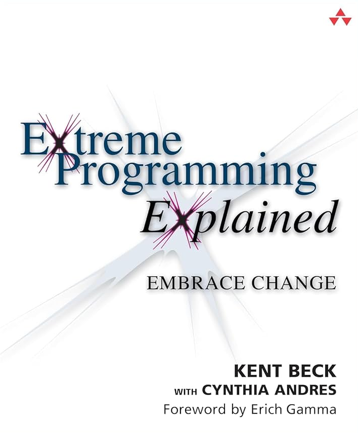

## Extreme programming

Reduce the cost of changes, shorter product cycles, direct contact with customer and their needs

## Focused on code

- Customer part of the team
- Writing tests before programming
- Tests become product specification

****************************************************************************************************
- template: subtitle

# Humanistic
## New Media for Thinking

----------------------------------------------------------------------------------------------------
- template: content
- background-color: #153374
- class: nologo
- style: h1 { color:#F1DEC2; font-family:Felipa;  }

# Focus on human, learning, thinking

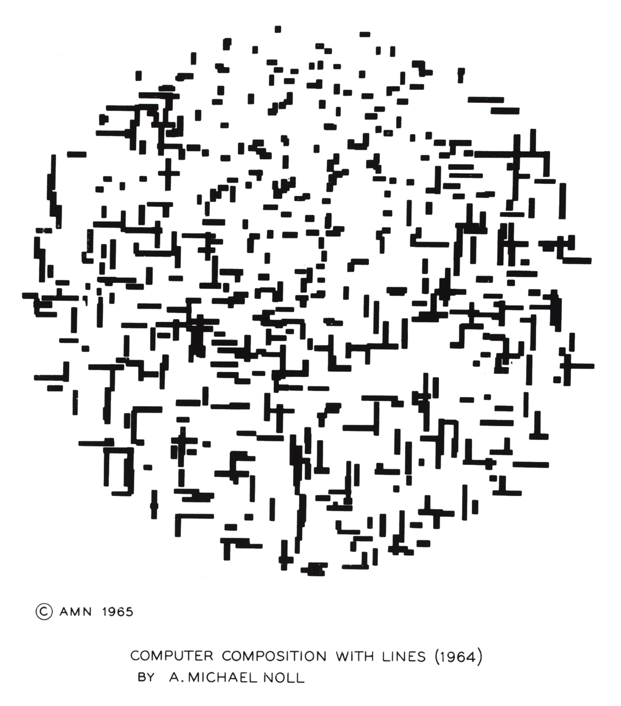

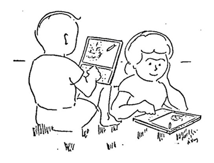
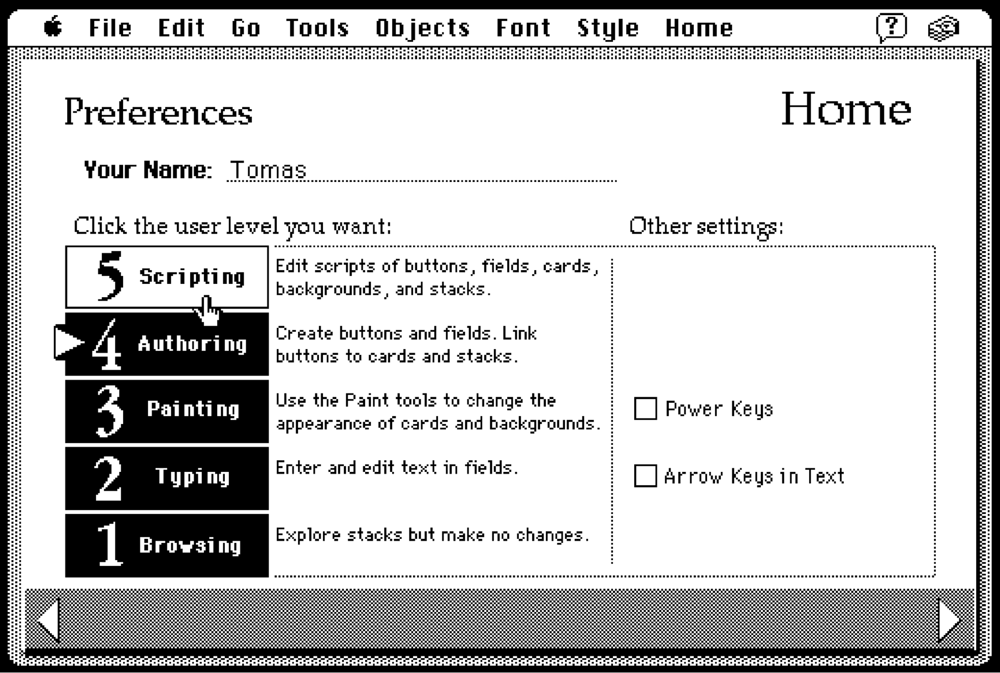

----------------------------------------------------------------------------------------------------
- template: content
- class: two-column nologo
- style: img { max-height:280px !important; max-width:1000px !important; }

# Two visions of computing

**As We May Think (1945)**

Memory machine making knowledge accessible

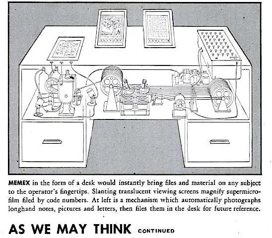

---

**Augmenting Human Intellect**

Improve intellectual effective&shy;ness of human beings (1962)

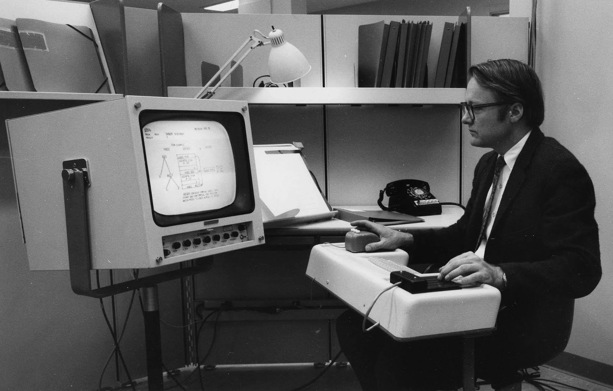

----------------------------------------------------------------------------------------------------
- template: lists
- class: bigger

# Programming as a new literacy

## Logo programming language

- Known for turtle graphics
- Rethinking education from scratch
- Whole learning environment

## Smalltalk language

- "A personal computer  
  for children of all ages"
- Manage all user's informational needs
- Language for "talking" to the system

----------------------------------------------------------------------------------------------------
- template: image

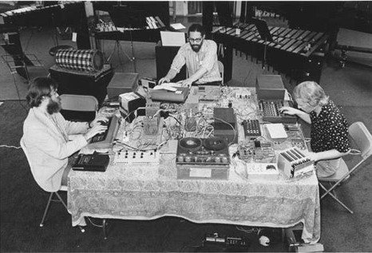

# Computers to support creativity

The League of Automatic Music Composers (1970s)

Automatic music production with microcomputers (KIM-1)

----------------------------------------------------------------------------------------------------
- template: image
- class: smaller

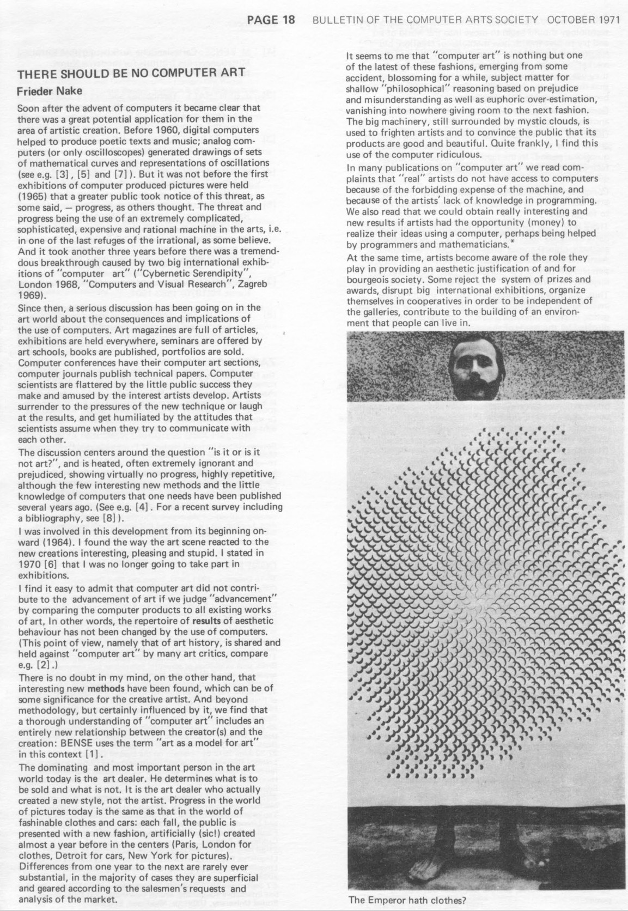

# Frieder Nake (1971)

Computer art is becoming the latest fashion

---

**Instead we should ask**

Use computer to analyse aesthetics and its use

How computers alienate artists from their work?

****************************************************************************************************
- template: icons
- style: li { margin-top:0px; margin-bottom:10px; }

# Cultures of programming
## Hackers, engineers, managers,   mathematicians and humanists

- *fa-brain* Typical values and ways of thinking
- *fa-timeline* Applies to the past and the present
- *fa-bucket* Not intended as strict classification
- *fa-handshake-simple* Interesting things happen when they meet

****************************************************************************************************
- template: subtitle

# Cultures of Programming
## [<i class="fa fa-house"></i> Home](/) &nbsp;&nbsp;  [<i class="fa fa-arrow-right"></i>Continue to Part 3](02-cultures.html)
