- title: Functions, trees, processes (NPRG086)

****************************************************************************************************
- template: title
- style: h1 { font-size:42pt; } h2 { font-size:35pt; margin-top:-30px; }

# NPRG086: **Functions, trees, processes**
## Course introduction

---

**Tomáš Petříček**, 204 (2nd floor)  
_<i class="fa fa-envelope"></i>_ [petricek@d3s.mff.cuni.cz](mailto:petricek@d3s.mff.cuni.cz)  
_<i class="fa-brands fa-bluesky"></i>_ [@tomasp.net](https://bsky.app/profile/tomasp.net)   
_<i class="fa fa-globe"></i>_ [https://tomasp.net](https://tomasp.net)  

----------------------------------------------------------------------------------------------------
- template: content
- class: three-column

# Who are we

**David Corfield**

philosophy of mathematics

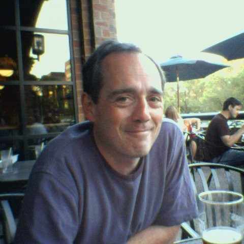

---

**Jaroslav Nesetril**

discrete mathematics

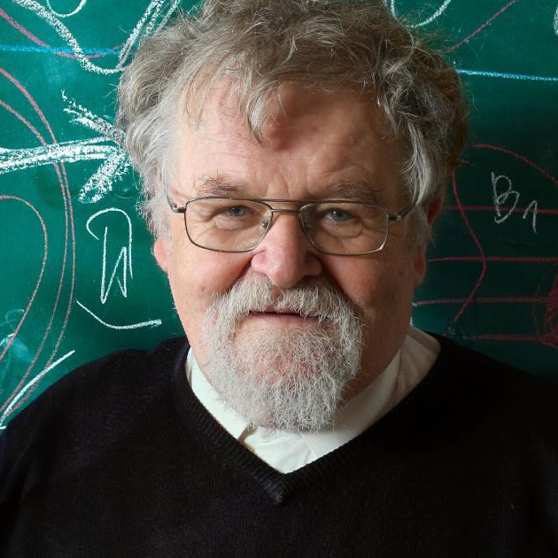

---

**Tomas Petricek**

programming languages

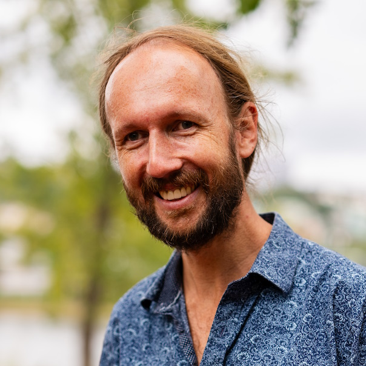

----------------------------------------------------------------------------------------------------
- template: content
- style: p { font-weight:400; font-size:32pt }

# Computer science concepts

----------------------------------------------------------------------------------------------------
- template: icons

# Philosophy
## Computer science concepts

- *fa-tree* Where do they come from?
- *fa-clock-rotate-left* How do they change over time?
- *fa-comments* Do we agree what they mean?
- *fa-flask* How they cross disciplines?

----------------------------------------------------------------------------------------------------
- template: lists
- class: bigger
- style: h1 { font-size:40pt; }

# Philosophy of mathematics and physics

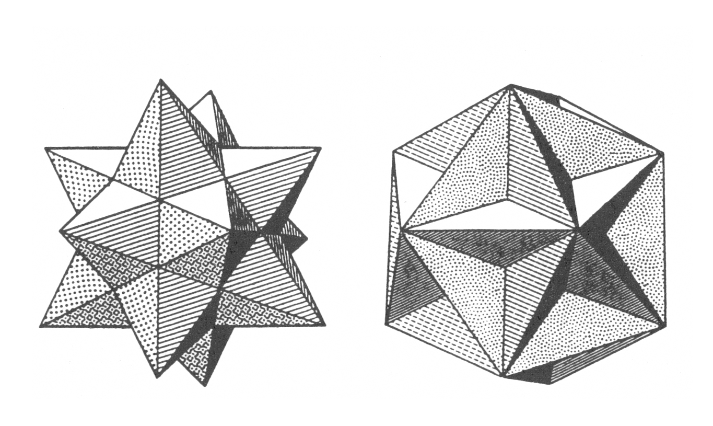

## Mathematics

- **Polyhedra** ($E = V + F - 2$)
- **Functions** (non-differentiable)
- **Groups** (monster group)

## Physics

- **Phlogiston** (fire-like element)
- **Electrons** (can spray them)
- **Temperature** (and measurement)

----------------------------------------------------------------------------------------------------
- template: lists
- class: bigger

# Why three people

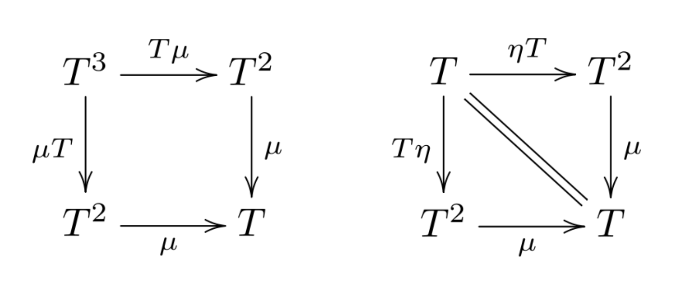

## Monad

- Originates in category theory
- Used in formal semantics
- Implemented in Haskell and C#

## Tree

- Minimum spanning tree
- B-tree in databases and file systems
- Decision trees in machine learning

****************************************************************************************************
- template: subtitle

# Course
## Practical info

----------------------------------------------------------------------------------------------------
- template: content
- style: li { font-size:24pt; } h1 { margin-bottom:10px; } h3 { margin-top:30px; }

# Course timeline (1/2)

### Winter semester - Oct, Nov (NPRG086)

- **Week 1** (1 Oct) - Introduction
- <strike>**Week 2** (8 Oct) - Cancelled due to travel</strike>
- **Week 3** (15 Oct) - Functions in mathematics (DC)
- **Week 4** (22 Oct) - Functions in early days of programming (TP)
- **Week 5** (29 Oct) - Functions and constructivism (DC)
- **Week 6** (5 Nov) - Functional programming (TP)
- **Week 7** (12 Nov) - Monads and their origins (DC)
- **Week 8** (19 Nov) - Monads in functional programming (TP)
- **Week 9** (26 Nov) - Monads, continuations, constructivism (DC)

**Please note that the plan is subject to change!**

----------------------------------------------------------------------------------------------------
- template: content
- style: li { font-size:24pt; } h1 { margin-bottom:10px; } h3 { margin-top:30px; }

# Course timeline (2/2)

### Winter semester - Dec, Jan (NPRG086)

- **Week 10** (3 Dec) - Trees as a programming construct (TP)
- **Week 11** (10 Dec) - Trees and their origins (JN)
- **Week 12** (17 Dec) - Trees in discrete mathematics (JN)
- **Week 13** (7 Jan) - Trees in discrete mathematics (JN)

### Summer semester (NPRG087)

- Continue by looking at more entities
- **Objects** - in philosophy, object-oriented languages
- **Types** - from foundations of mathematics to programming
- **Processes** - operating systems, formal models and biology
- **Others** - Graphs, Matrices, Quaternions, ???

----------------------------------------------------------------------------------------------------
- template: content
- style: blockquote { margin-left:0px; }

# How to get credits

> The exam can be completed either as an oral exam covering topics discussed during the given semester, or as an individual project on a topic agreed with the instructors.

---

 

### Individual project

- Look at a concept or entity of your own choice!
- Look at a perspective that we've missed!
- Talk to us to discuss practical arrangements  
- Write about it or present your findings

**Talk to us to discuss ideas!**

****************************************************************************************************
- template: subtitle

# Background
## History of computing

----------------------------------------------------------------------------------------------------
- template: lists

# Histories of programming

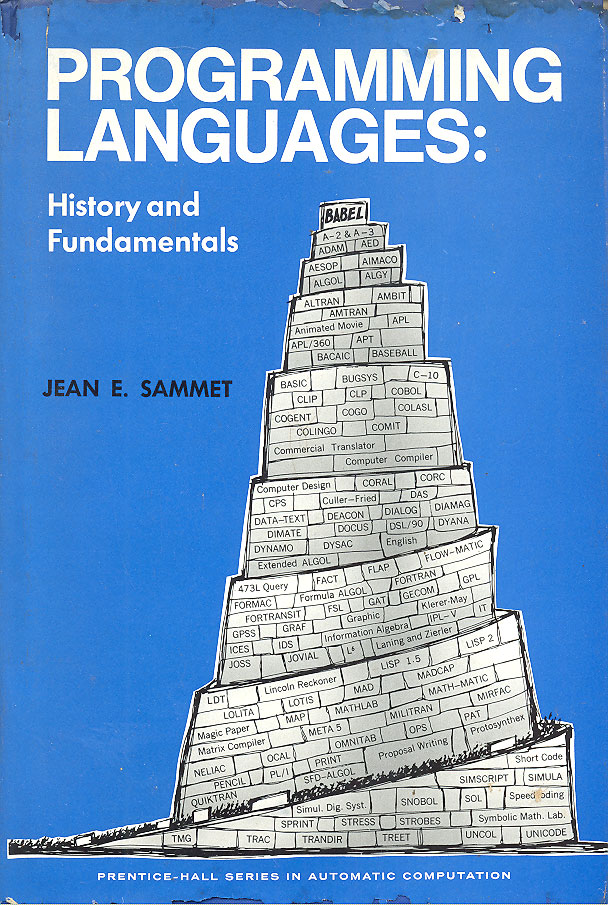

## First hand accounts

- Framing and own history
- ACM HOPL, talks and blogs

## History of science

- History from technical perspective
- Each claim needs hard evidence!

## Technology and society

- Broader socio-technical issues
- Archives, letters, oral interviews

----------------------------------------------------------------------------------------------------
- template: content
- style: img { max-height:400px; }

# Science, technology, society (STS)

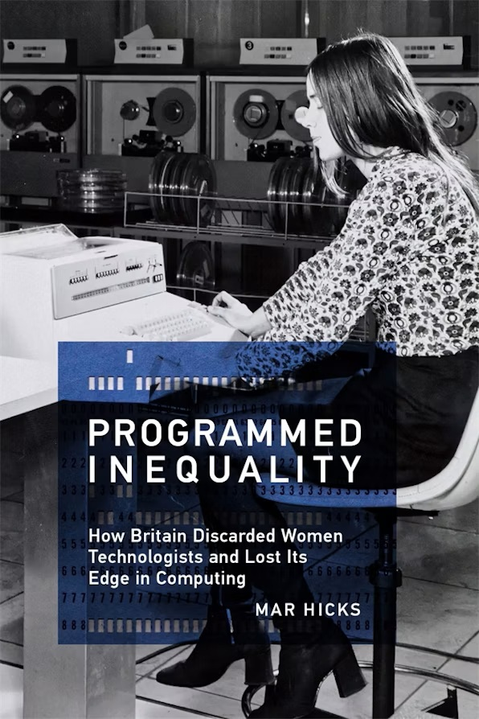
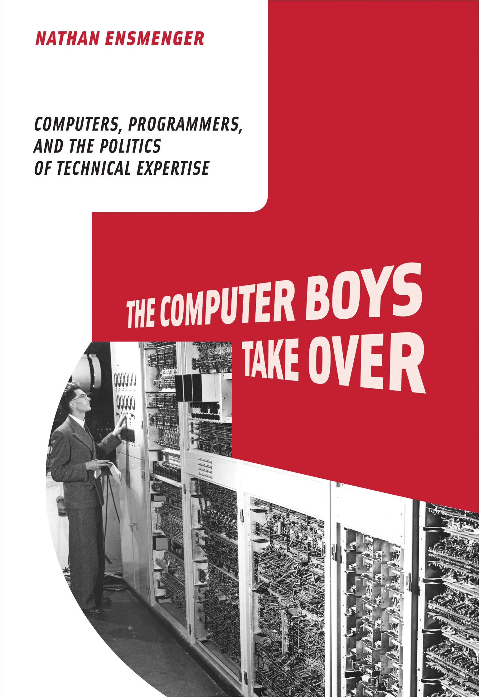
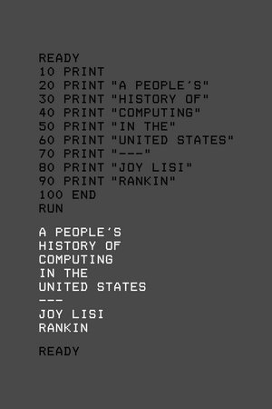

----------------------------------------------------------------------------------------------------
- template: lists
- class: bigger

# Programming the ENIAC

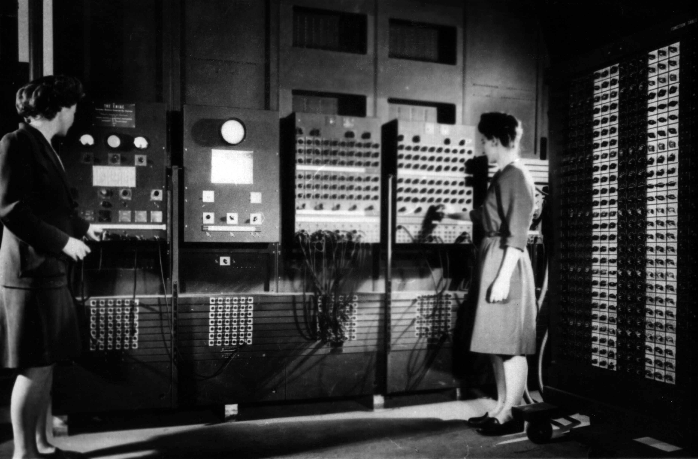

## ENIAC (1945)

- First "programmable, electronic, general-purpose digital" computer
- Programmed by plugging cables

## Questioning the "first"

- Program not stored in memory
- Not that different from Harvard Mark I?

## How exactly did the programming work?

----------------------------------------------------------------------------------------------------
- template: image

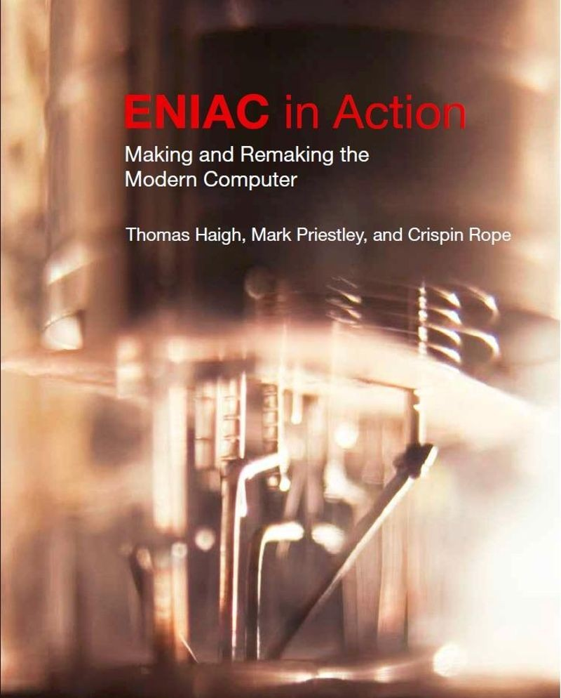

# History of  the ENIAC

Document design, construction, testing, and use by the military

**Reconfiguration of ENIAC in 1947-48**  
and the atomic  
fission simulation

----------------------------------------------------------------------------------------------------
- template: image
- class: bigger

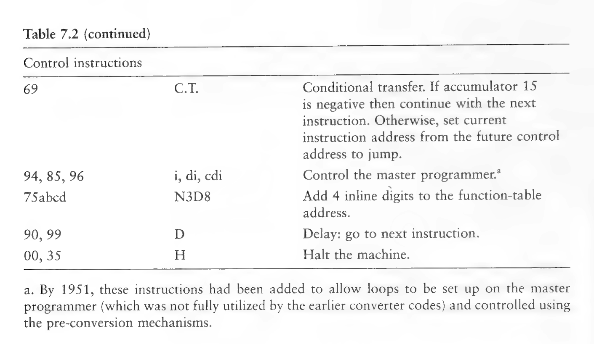

# Conversion

Inspired by later EDVAC report

"the storage of programming data by means of the function table"

**51 Order Code**  
developed in 1947

****************************************************************************************************
- template: subtitle

# Histories
## Functional programming

----------------------------------------------------------------------------------------------------
- template: content
- class: nologo
- style: img { float:right; max-width:300px; margin-left:20px; } h1 { font-size:38pt; letter-spacing:-1px }

# Popular history of functional programming

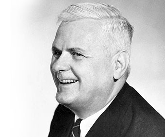

### Alonzo Church (1936)

Lambda calculus model  
based on pure functions

  

### John McCarthy (1960)

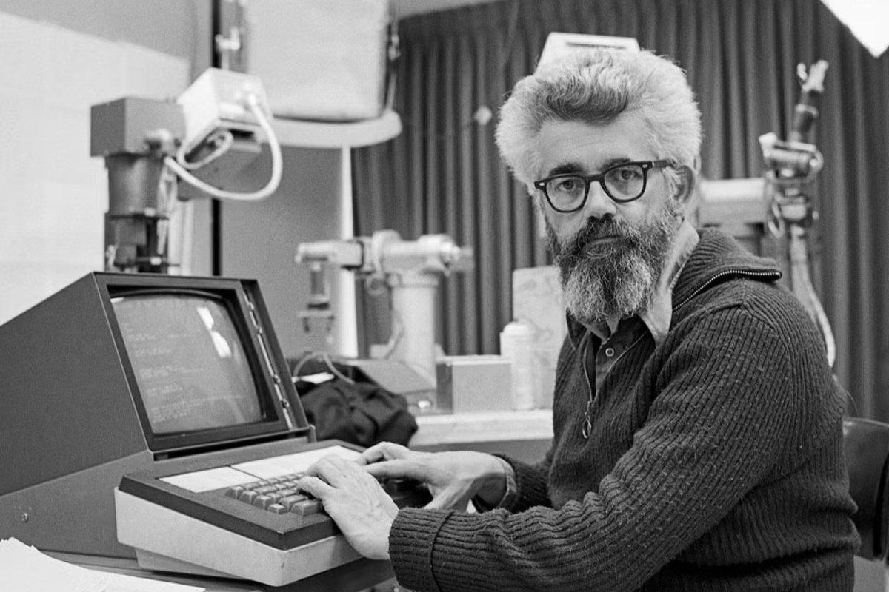

Creates the LISP language   
based on the lambda calculus

----------------------------------------------------------------------------------------------------
- template: content
- class: nologo
- style: img { float:right; max-width:300px; margin-left:20px; } h1 { font-size:38pt; letter-spacing:-1px }

# Popular history of functional programming

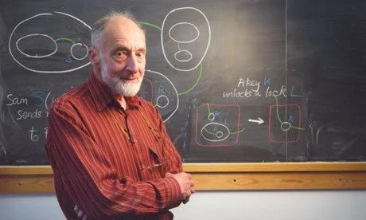

### Robin Milner (1973)

ML language adds static types  
with automatic type inference

 
 

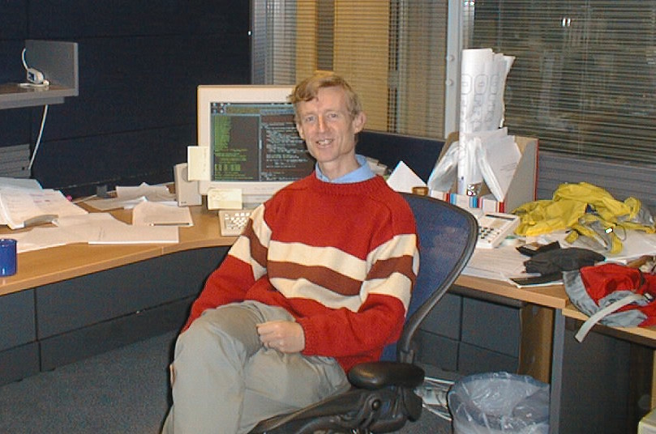

### Simon Peyton Jones (1990)

Created Haskell, a statically-typed  
and lazy functional language

----------------------------------------------------------------------------------------------------
- template: largeicons

# What is wrong?
## Just about everything...

- *fa-brands fa-black-tie* **Narrow "great men" reading**  
  None of these were created by a single person
- *fa-diamond-turn-right* **Retrospective reading**  
  Lambda calculus not a programming language!
- *fa-user-xmark* **Many claims factually wrong**  
  LISP had AI origins, not lambda calculus
- *fa-seedling* **Invents a story of progress**  
  Towards static types and laziness

****************************************************************************************************
- template: subtitle

# Histories
## Looking more carefully

----------------------------------------------------------------------------------------------------
- template: lists

# Lambda calculus and programming

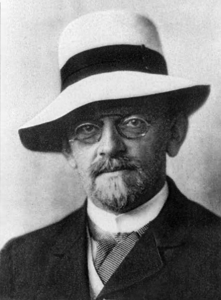

## Origins of lambda calculus (1930s)

- Foundations of mathematics (Hilbert)
- Russell's paradox $R = \{ x \,|\, x \notin x \}$
- Avoid paradox without types
- Based on _functions_ not _sets_

## Lambda calculus is inconsistent

- Kleene-Rosser paradox
- Let $R = \lambda x.\neg (x ~ x)$ then $R~R = \neg (R ~ R)$
- Does not work! Unless you add types ala Russell

----------------------------------------------------------------------------------------------------
- template: image
- class: smaller

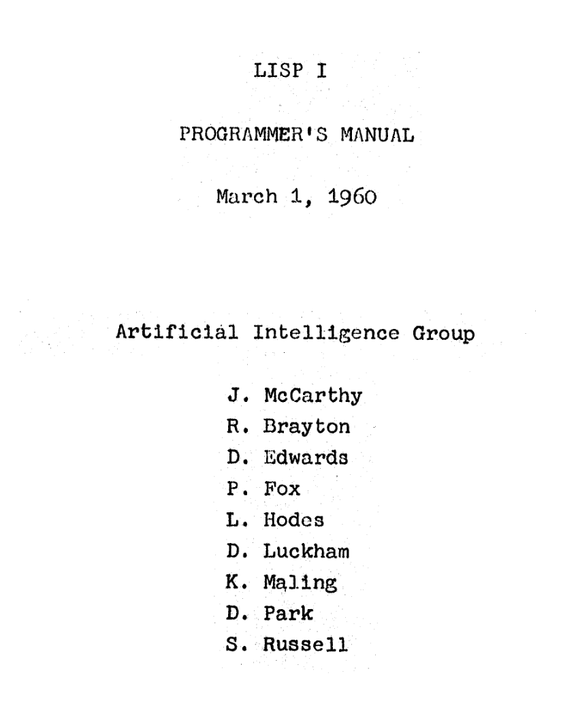

# LISP origins

**FOTRAN** for numerical computing, **COBOL** for business records

Manipulation of symbolic expressions in the context of _good old fashioned AI_

**Initial project was an addition to for FOTRAN**

----------------------------------------------------------------------------------------------------
- template: icons

# LISP origins
## Demystifying the history of LISP

- *fa-book* Only thing from lambda calculus is `LAMBDA`
- *fa-route* Had assignments and `goto` before conditionals
- *fa-quote-left* Used first-order M-expressions at first
- *fa-square-root-variable* Had dynamic scoping until Scheme (1975)

----------------------------------------------------------------------------------------------------
- template: lists

# Rediscovering lambda calculus

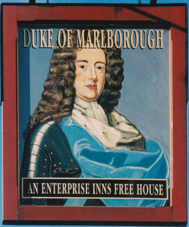

## Mervyn Pragnell's group

- Unofficial logic reading group
- Got to know about the $\lambda$-calculus
- Penrose $\rightarrow$ Strachey $\rightarrow$ Landin

## Landin and lambda calculus

- Formal model of the Algol language
- Mostly forgotten languages...
- Work on abstract data types

----------------------------------------------------------------------------------------------------
- template: imageanim
- class: image smaller

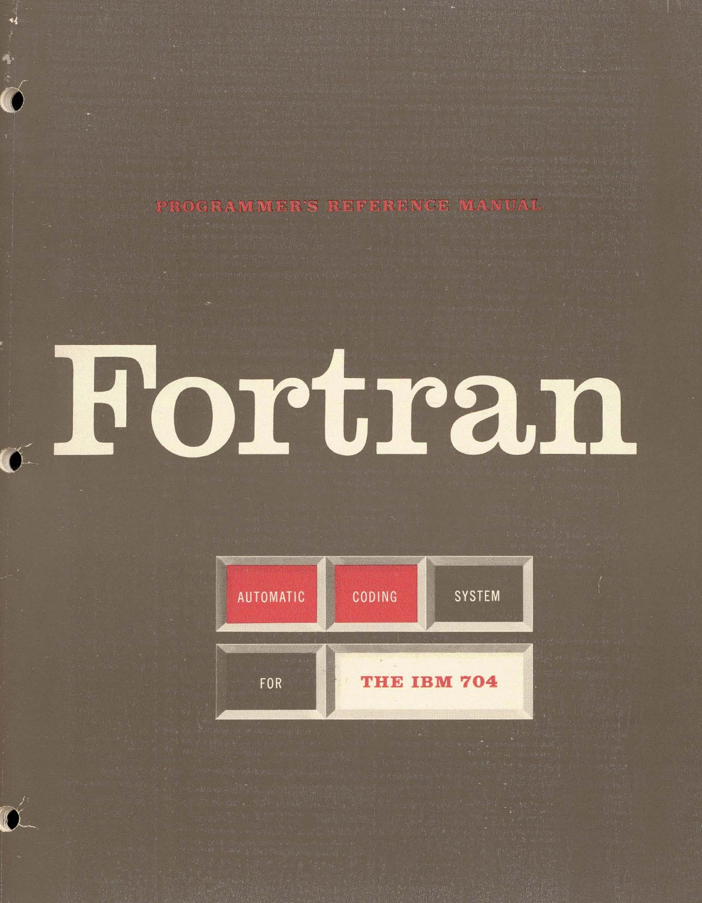

# Origins of types

---

**FORTRAN for IBM 704**

[A function] may be desired to state the argument either in _fixed or floating point_;
similarly the function itself may be in either of these **modes**. Thus a function
of a single argument has 4 possible mode configurations.

----------------------------------------------------------------------------------------------------
- template: lists
- class: bigger
- style: blockquote { margin-left:0px; margin-top:-10px }

# Types appear in Algol 58

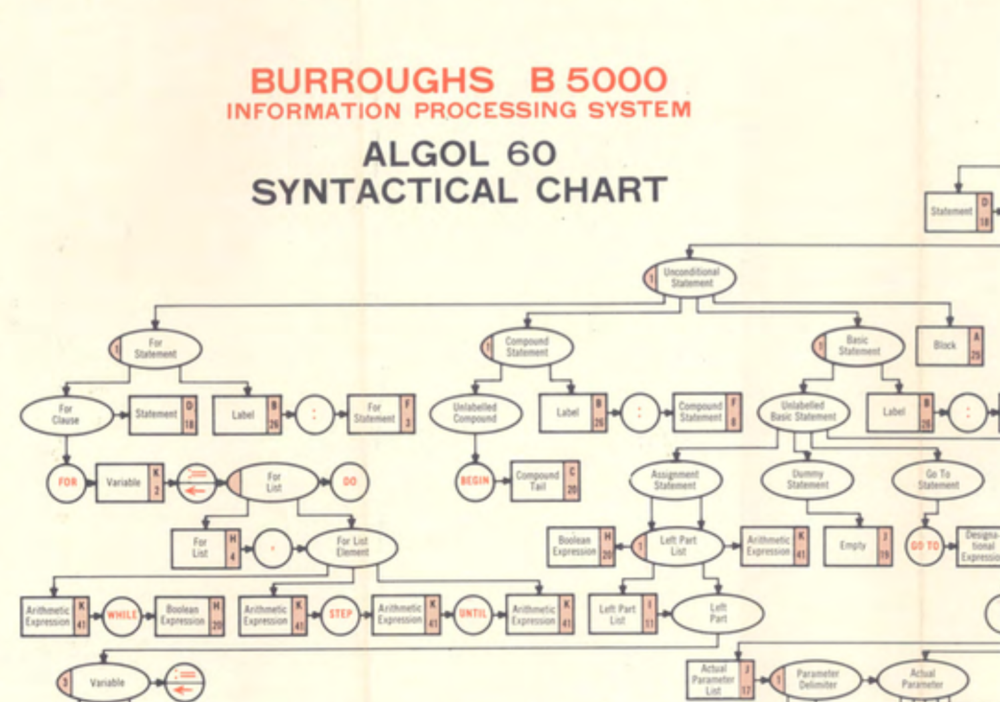

## May 58 meeting

- European and US group meeting
- None uses _type_ in prior reports  

## Preliminary report
No reference to logic or $\lambda$-calculus

> Integers are of type integer. All other numbers are of type real. (...)
The various "types" (integer, real, Boolean) basically denote properties of values.

----------------------------------------------------------------------------------------------------
- template: imageanim
- class: image smaller2x noborder

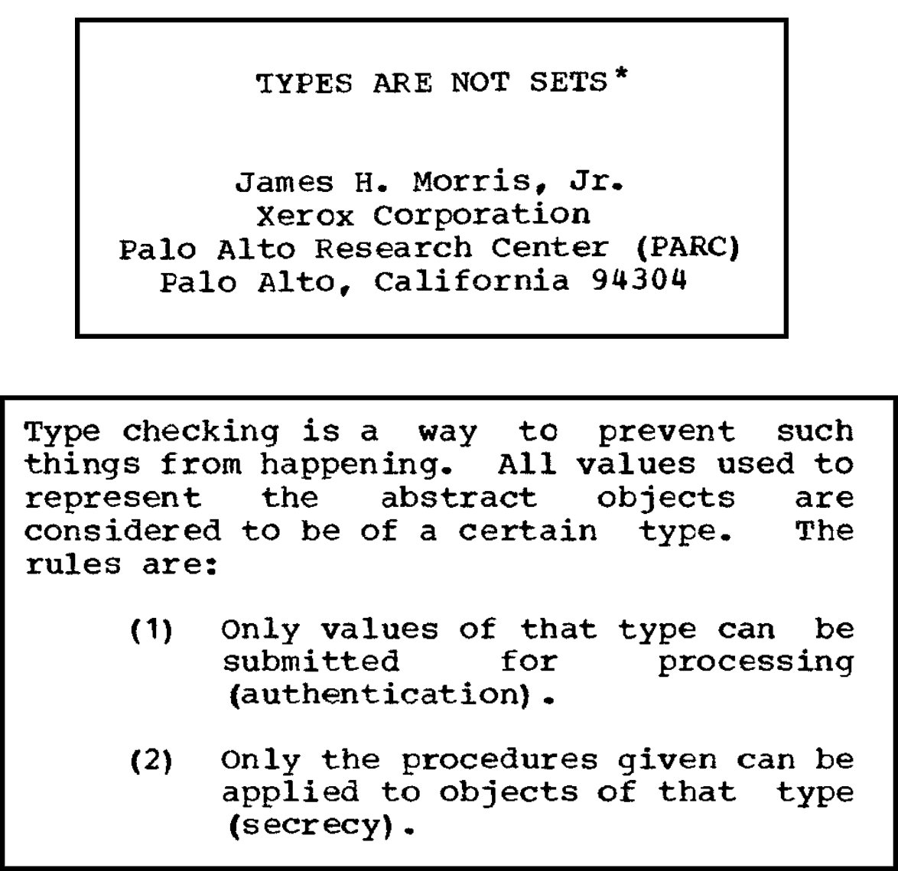

# What are types?

Sets of possible values

Cartesian products  
to model records

---

**Types are not sets (1974)**

Inspired by Landin's work  
but does not cite typed  
lambda calculus

----------------------------------------------------------------------------------------------------
- template: lists

# Logic of computable functions

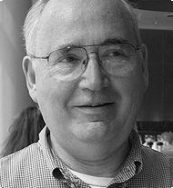

## Dana Scott (1969)
- _A type-theoretical alternative to ISWIM, CUCH, OWHY_ (unpublished manuscript)
- Logic for reasoning about computation

## Ensures meaning using types

> The first confusion we should avoid is that between _logical_ types and what we might call _data_ types. The former are what we invoke to study the latter.

----------------------------------------------------------------------------------------------------
- template: icons

# Types
## Towards types in ML

- *fa-arrow-up-right-dots* Directly inspired by the LCF logic
- *fa-lock* Authentication and secrecy for proof objects
- *fa-eye* Unaware of a lot of work in logic (Hindely-Milner)
- *fa-shapes* Later additions add tuples and data types

****************************************************************************************************
- template: subtitle

# Conclusions
## Functions, trees, processes

----------------------------------------------------------------------------------------------------
- template: largeicons

# Conclusions

- *fa-microchip* **We need rigorous technical history too!**  
  Complement first-hand accounts and social history

- *fa-laptop-code* **Programming entities are interesting!**  
  They change meaning and cross boundaries

- *fa-eye* **Starting with functions, monads and trees**  
  Help us look deeper and broader!
