- title: Theory of Programming Languages

****************************************************************************************************
- template: title
- style: h1 { font-size:36pt; letter-spacing:-1px } h2 { font-size:32pt; margin-top:-35px; }

# NPRG085: **Theory of Programming Languages**
## Course introduction

---

**Tomáš Petříček** and **Vít Šefl**  

_<i class="fa fa-envelope"></i>_ [petricek@d3s.mff.cuni.cz](mailto:petricek@d3s.mff.cuni.cz) | [sefl@ksvi.mff.cuni.cz](mailto:sefl@ksvi.mff.cuni.cz)  
_<i class="fa fa-globe"></i>_ [@tomasp.net](https://bsky.app/profile/tomasp.net) &nbsp;|&nbsp; [https://tomasp.net](https://tomasp.net)  

****************************************************************************************************
- template: content
- style: img { float:right; max-width:260px;margin:0px 0px 10px 10px; } p { font-size:22pt; } li { font-size:22pt; }

# Examination

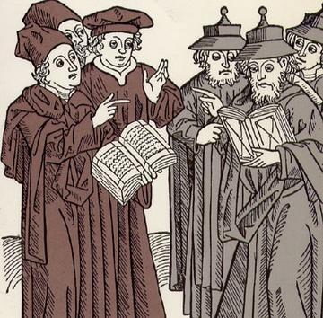

To pass the course, you need to suc&shy;cessfully pass an oral exam at the end.

**Test understanding of semantics & types**

- Use semantics to perform reduction
- Show that a property holds for given rules
- General questions

**Practical details and arrangements**  

- Only topics covered during the lectures
- Extra literature is helpful but not required
- Sign up via SIS

----------------------------------------------------------------------------------------------------
- template: lists
- class: smaller
- style: li { font-size:22pt; } .body img { position:relative; top:-20px }

# Literature

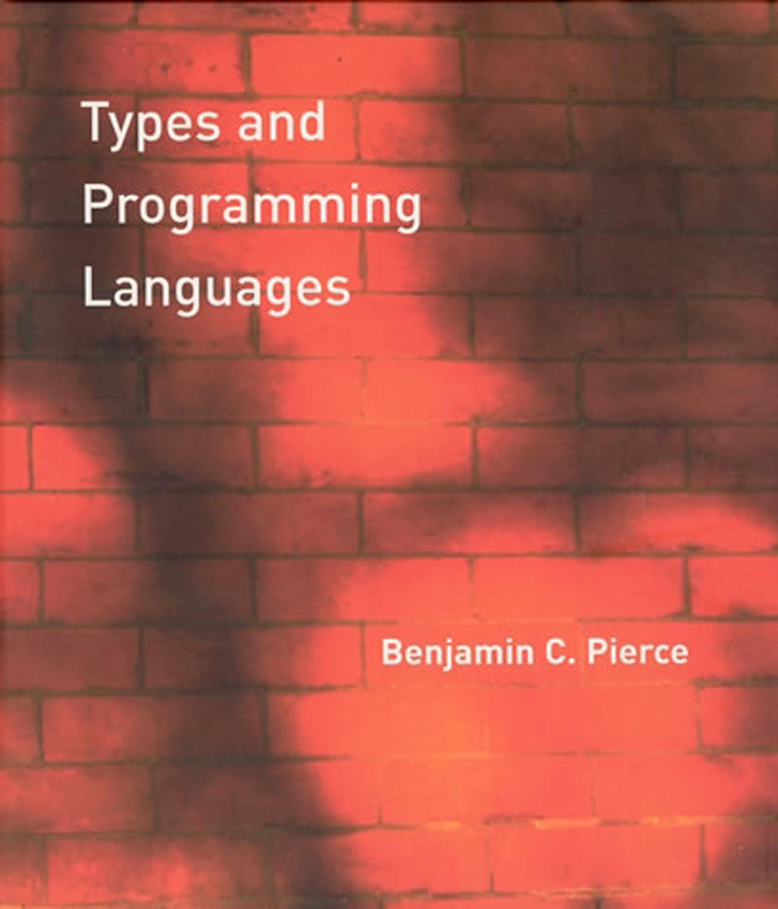

## Langauge semantics

* [Semantics of Programming Languages](https://www.cl.cam.ac.uk/teaching/2526/Semantics/materials.html) (Cambridge)
* Types and programming languages  (Pierce)

## Types and lambda calculus

* Practical foundations for programming languages (R. Harper)
* Software foundations (B. Yorgey et al)
* Advanced topics in types and programming languages (ed: Pierce)
* The lambda calculus: its syntax and semantics (H. P. Barendregt)

----------------------------------------------------------------------------------------------------
- template: content
- style: p { font-size:30pt; }

# Study materials

1. **The lectures will be recorded**. The recordings  
will be made available in some way.

1. If there's interest, we could make a **Discord server** like we did last year (for Principles) and share the study materials there as well.

----------------------------------------------------------------------------------------------------
- template: largeicons

# Goals
## After the course, you should be able to:

* *fa-arrow-right* Define an operational model of a PL
* *fa-square-check* Add a type system to a programming language
* *fa-divide* Read, write and use formal derivation rules
* *fa-chalkboard* Understand basic properties of these models & systems
* *fa-volume-high* Appreciate how the simplest systems can be expressive

----------------------------------------------------------------------------------------------------
- template: content
- style: li { font-size:30pt; margin-bottom:30px; padding-right:40px } p { font-size:30pt; }

# Goals

1. **Type systems and semantics are deep topics** and we'll only scratch the surface.

2. For example, we won't cover **denotational semantics, axiomatic semantics**, subtyping, set-theoretic types, gradual typing, etc.

2. However, the course will give you the  
   **core tools to delve deeper**.

----------------------------------------------------------------------------------------------------
- template: content

# Outline (1/2)

The imperative part of the course will mostly  
be given by Tomáš; the functional part by *Vít*.

**The current plan for this semester is:**

1. Intro, motivation, simple imperative language (now!)
2. *Refresher on semantics, lambda calculus, and types*
3. Simple type system for an imperative language
4. Basic properties of these models
5. Data types, evaluation contexts, evaluation order
6. *Deeper dive into lambda calculus, data via functions*

----------------------------------------------------------------------------------------------------
- template: content
- style: ol { counter-reset: item 6; list-style: none; } ol li { counter-increment: item; } ol li::before { content: counter(item) ". "; }


# Outline (2/2)

7. *Term representation, simply typed lambda calculus*
8. *Church/Curry-style formulation, quantification*
9. *Hindley-Milner type system, type inference*
10. Adding functions to an imperative language
11. *Advanced type systems* (bonus topic)
12. Practical applications (bonus topic)


****************************************************************************************************
- template: subtitle

# Motivation
## Why theory of programming languages

----------------------------------------------------------------------------------------------------
- template: content
- class: three-column
- style: .body { margin-left:-10px; }

# What is a language?
## What is the meaning of a program

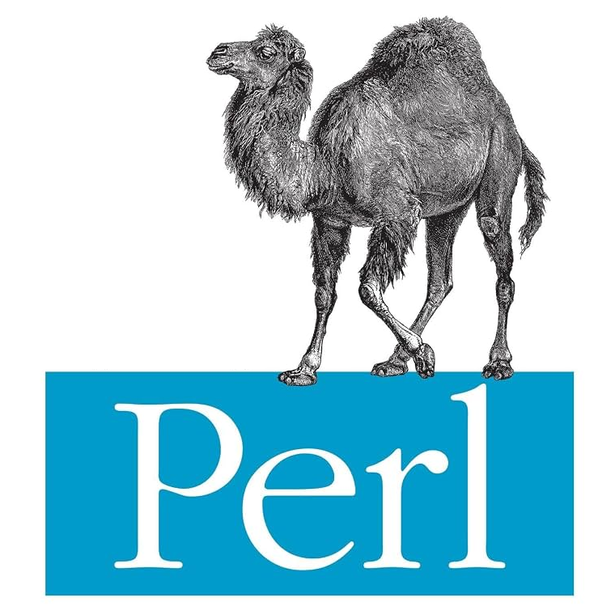

**Whatever the interpreter does**

---

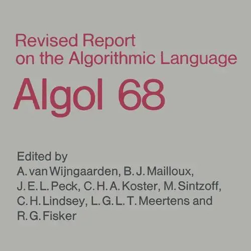

**English language specification**

---

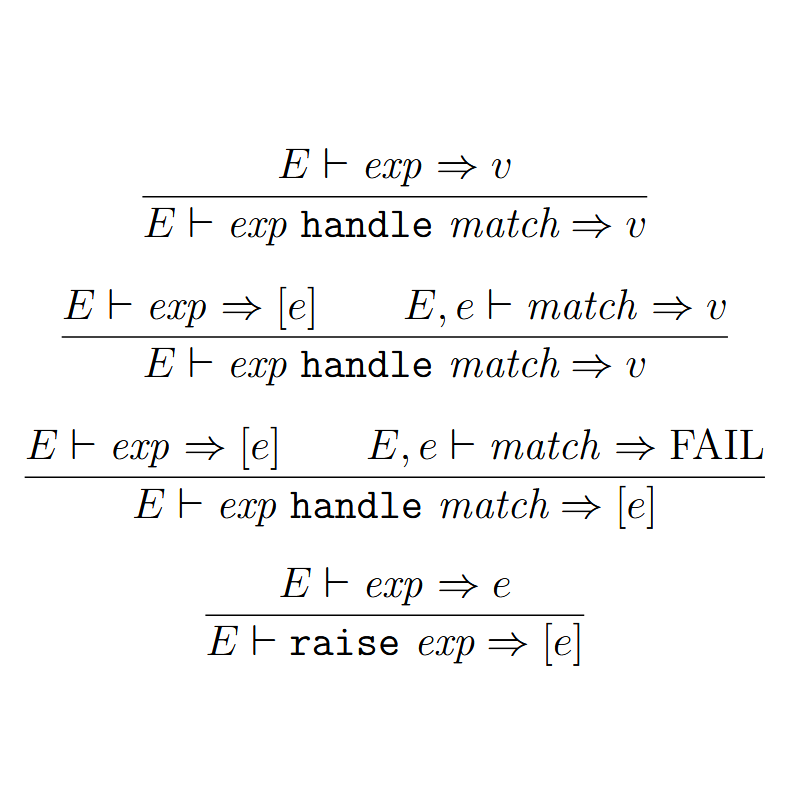

**Mathematical formal definition**

----------------------------------------------------------------------------------------------------
- template: lists
- class: bigger

# Mathematical formal definition

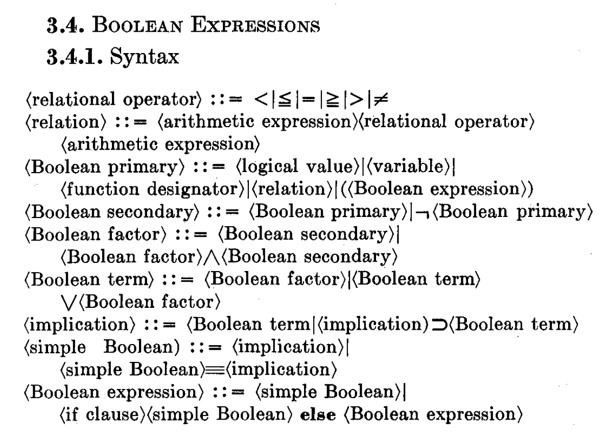

## Language syntax

- What is a valid program
- BNF definition from Algol 60
- Abstract syntactic structure

## Language semantics

- What happens when program runs
- This took much longer to figure out!
- Reduction rules ala lambda calculus (one option)

----------------------------------------------------------------------------------------------------
- template: largeicons

# Type systems and safety

- *fa-shapes* **Typed and untyped languages**  
  Define (nontrivial) set of possible values of variable
- *fa-bug* **Trapped errors** vs. **untrapped errors**  
  Trapped stopped execution, untrapped go unnoticed
- *fa-plug-circle-xmark* **Safe programming language**  
  No program can produce an untrapped error
- *fa-brands fa-js* **Safe programming languages**  
  Can be both typed (OCaml) and untyped (JavaScript)
- *fa-up-right-from-square* See [Type Systems](https://courses.grainger.illinois.edu/cs421/fa2018/CS421A/resources/cardelli.pdf) by Luca Cardelli

----------------------------------------------------------------------------------------------------
- template: subtitle

# Demo
## Why theory of programming languages

----------------------------------------------------------------------------------------------------
- template: lists
- class: bigger

# Semantics and type-safety

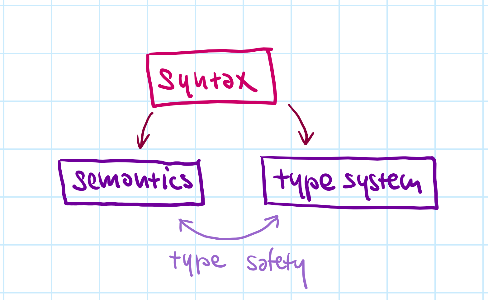

## Operational semantics

- Define how programs run
- Program produces a value

## Type systems

- Define what is well-typed
- No invalid operations can happen

## Type-safe language

- Well-typed programs do not go wrong
- Also - determinacy, unique typing

****************************************************************************************************
- template: subtitle

# Operational semantics
## Small imperative language

----------------------------------------------------------------------------------------------------
- template: code
- style: pre code { font-size:20pt; }
- class: nologo

```fsharp
// Computing a factorial
// of value in 'l1'. Stores
// the result in 'l2'.

let l1 = ref 5
let l2 = ref 1

while !l1 >= 1 do
  l2 := !l2 * !l1
  l1 := !l1 + -1
done
```

# L1 language

Minimal imperative language a bit like subset of ML or F#

---

**No normal variables!**

Stores are special  
and assumed (no let)

**Expression-based**

assign, read, `if`, `while`, sequencing, operators

----------------------------------------------------------------------------------------------------
- template: subtitle

# Demo
## Factorial in a subset of F#

----------------------------------------------------------------------------------------------------
- template: image

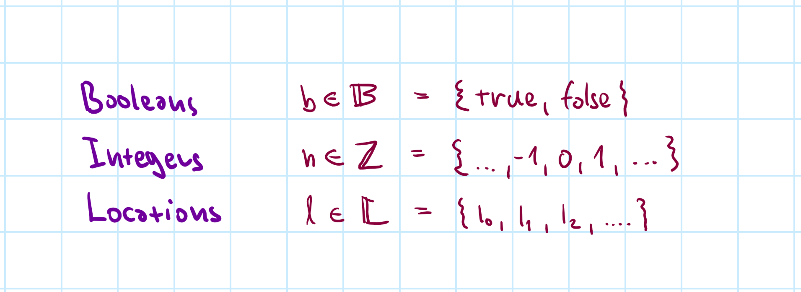

# Syntax definition

**Concrete primitives and abstract locations**

We treat primitives  
as sets and name members as $b \in \mathbb{B}$,  
$n\in\mathbb{Z}$ and $l\in\mathbb{L}$

----------------------------------------------------------------------------------------------------
- template: image
- class: image

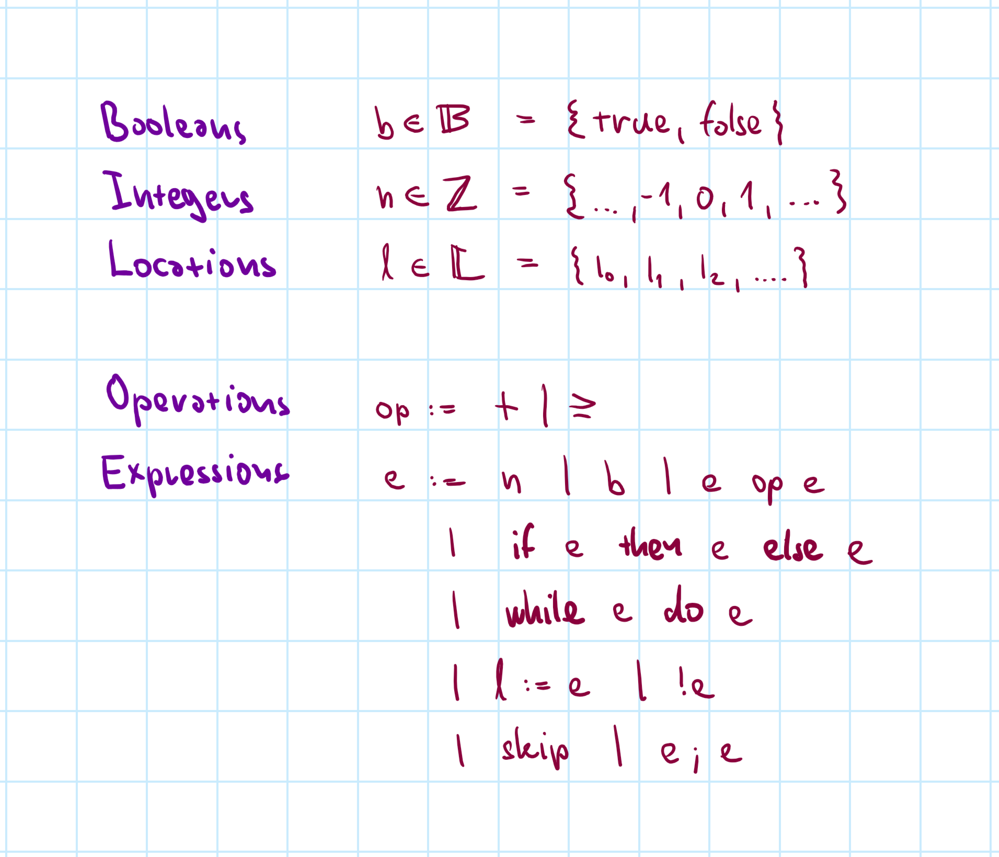

# Syntax definition

**BNF-like notation,  
but think of it as a definition of a set.**

$:=$ defines a set  
$|$ lists options

Keywords are **bold**  
and $n,b,l,e,op$ are members of other sets

----------------------------------------------------------------------------------------------------
- template: content

# Modelling store

### What is the evaluation state

- How does the expression $l_1\!:=\,!l_1\!+\!1;\; !l_1$ evaluate?
- Depends on what is the value of $l_1$ at the start!

---

### Modelling store

- Stores $s$ are final partial functions from $\mathbb{L}$ to $\mathbb{Z}$
- Assign integer to some of the possible locations

---

### Evaluation, revisited

- Evaluate $l_1\!:=\,!l_1\!+\!1;\; !l_1$ with store $s = \{ l_1 \mapsto 41 \}$

----------------------------------------------------------------------------------------------------
- template: content

# Evaluation as transition

### Program evaluates step-by-step

- One-step reduction relation $\langle e, s \rangle \rightarrow \langle e', s' \rangle$
- Program $e$ with store $s$ reduces to $e'$ with store $s'$
- One step is one primitive operation!

### Whole program reduction

- Keep reducing $\langle e, s \rangle \rightarrow \ldots \rightarrow \langle e', s' \rangle$
- Until $e'$ is a value, i.e., $e \in \mathbb{Z} \;\cup\; \mathbb{B} \;\cup\; \{ \texttt{skip} \}$
- Some programs can keep reducing indefinitely!
- Some programs can get stuck, i.e., $1 + \texttt{true}$

----------------------------------------------------------------------------------------------------
- template: imageanim
- class: image

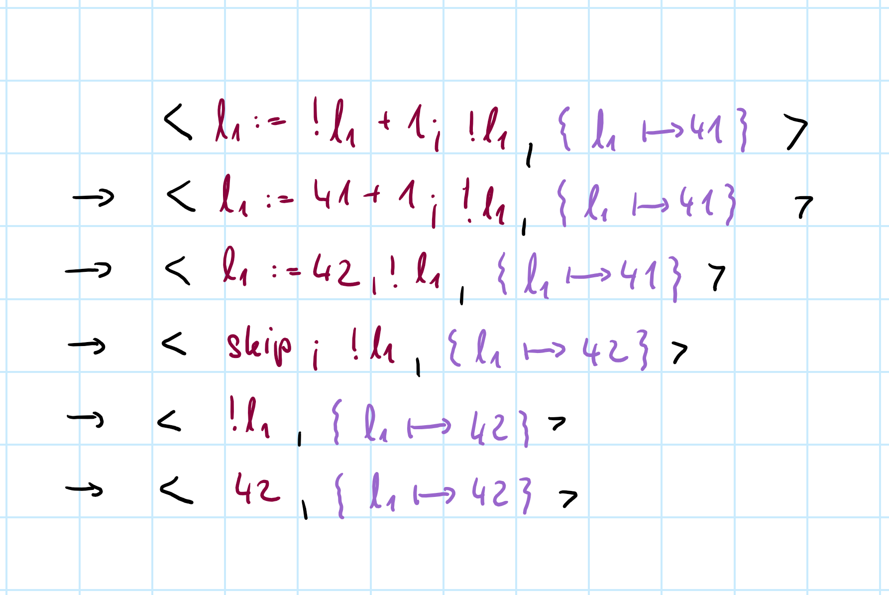

# Reduction example

---

**Proceeds step-by-step**

Not how real programs run on a computer!

**Formal model**

Defined by a set of reduction rules

----------------------------------------------------------------------------------------------------
- template: content

# More formally

### Transition system

- A set $\textit{Config}$ and a binary relation $\rightarrow\;\in\textit{Config}\times\!\textit{Config}$
- In our case $\textit{Config}=\textit{Expr}\times(\mathbb{L}\rightarrow\mathbb{Z})$

---

### What can happen

- _Values_ represent results $v \in V = \mathbb{Z} \;\cup\; \mathbb{B} \;\cup\; \{ \texttt{skip} \}$
- $\langle e, s \rangle \not\rightarrow$ _cannot be reduced_, i.e.,   
  there is no $\langle e', s' \rangle$ such that $\langle e, s \rangle \rightarrow \langle e', s' \rangle$
- Expression is _stuck_ if it cannot be reduced & is not a value

----------------------------------------------------------------------------------------------------
- template: image

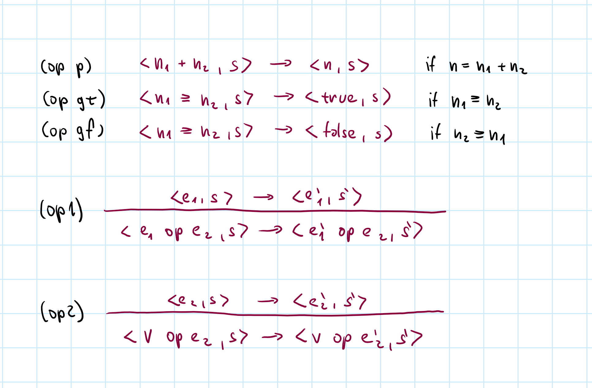

# Basic rules

If the _preconditions_ (above) and _side conditions_ (beside) holds, transition applies

**Some reductions require a derivation tree with several rules!**

----------------------------------------------------------------------------------------------------
- template: imageanim
- class: image

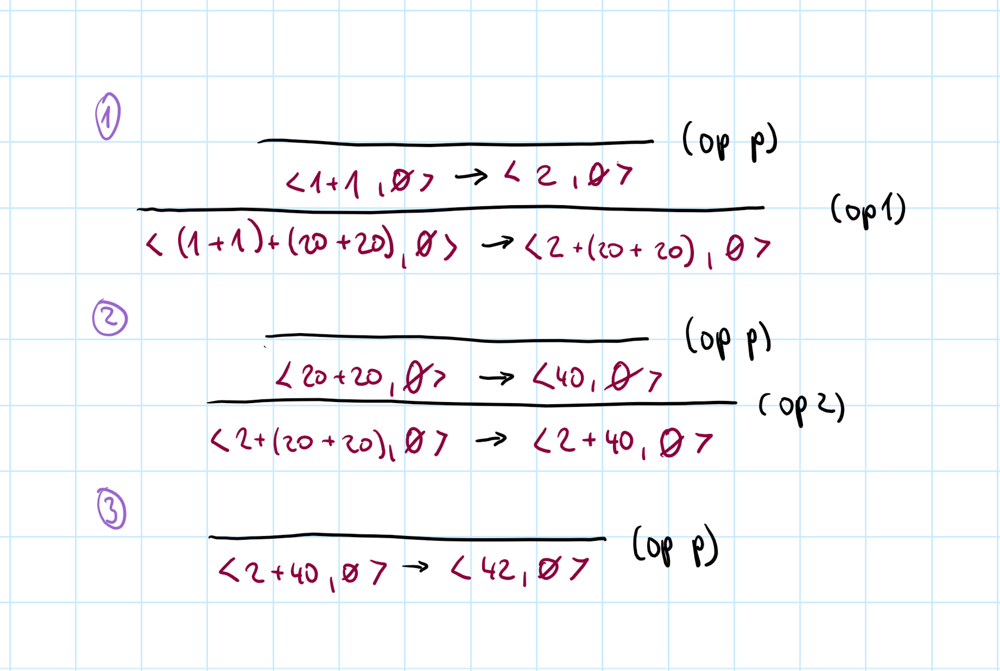

# Basic example

$(1+1)+(20+20)$

Simple enough, but what exact steps?

---

**Evaluation order can matter in subtle ways!**

For example C pattern

`if (nd && nd->next)`  
&nbsp;&nbsp;&nbsp;`nd->next = NULL;`

----------------------------------------------------------------------------------------------------
- template: content


# Store and sequencing rules

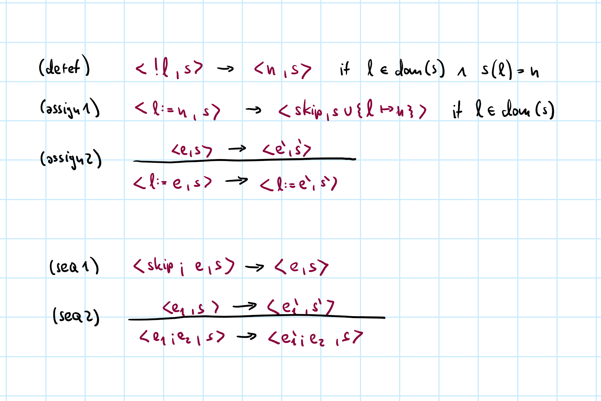

----------------------------------------------------------------------------------------------------
- template: content

# Conditionals and while rules

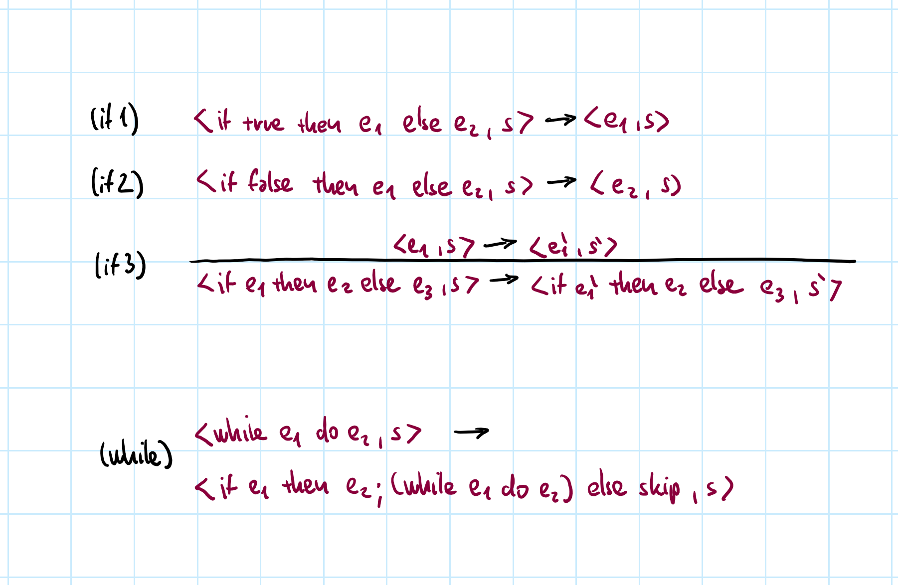

----------------------------------------------------------------------------------------------------
- template: icons

# Reduction
## Modelling program execution

- *fa-traffic-light* Reductions must exactly follow rules!
- *fa-explosion* Details matter in subtle ways (TypeScript..)
- *fa-arrow-down-short-wide* Evaluation order, store preconditions, & more
- *fa-tree* Sequence of steps $\rightarrow$ with derivation trees
- *fa-triangle-exclamation* Learn how to apply rules!

****************************************************************************************************
- template: subtitle

# Conclusions
## Introduction & small imperative language

----------------------------------------------------------------------------------------------------
- template: icons

# Conclusions

- *fa-video* Recordings will appear on the course web page
- *fa-arrow-right* Operational semantics to model execution
- *fa-check* Types and properties to follow soon
- *fa-not-equal* Functional features based on lambda calculus
- *fa-shapes* Types are more than sets of values
