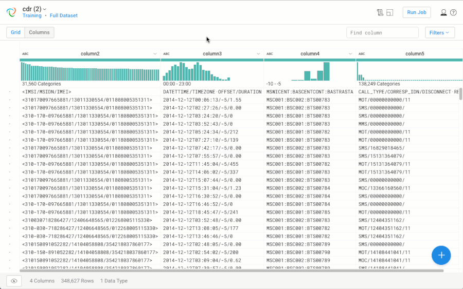
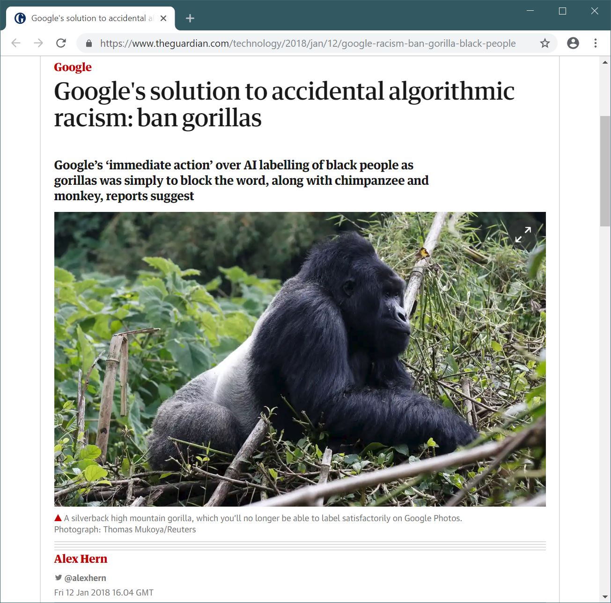
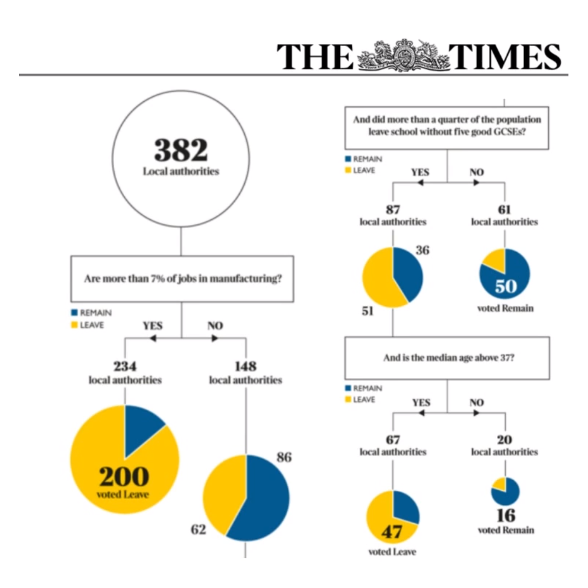
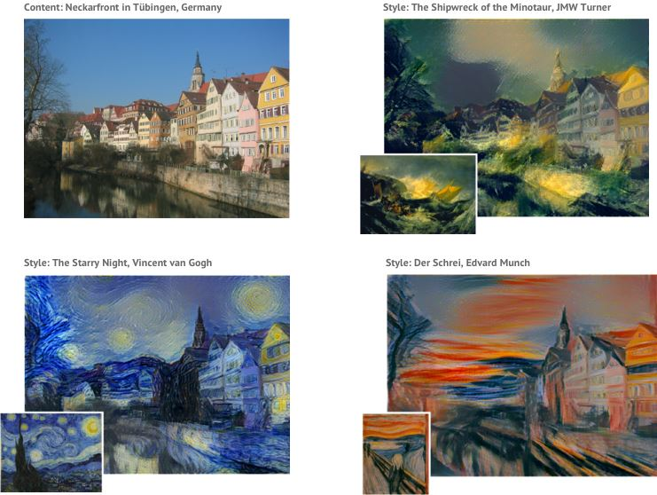
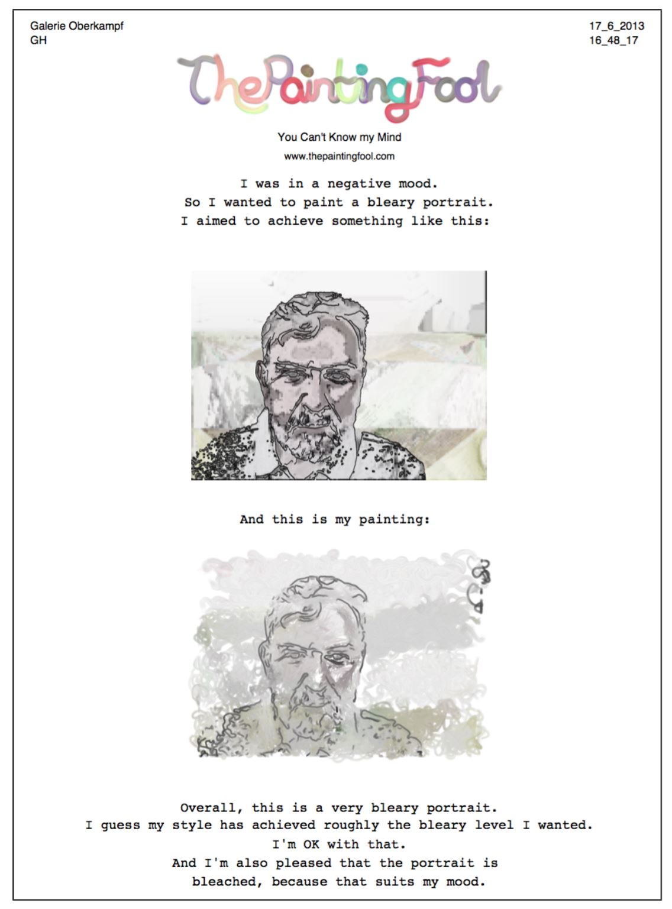
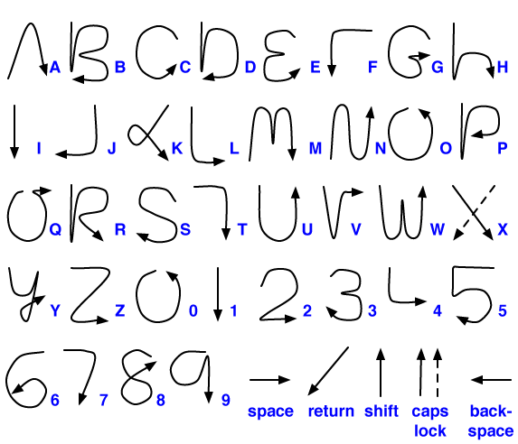

- title : Human Computer Interaction: Specialist users
- description : Human Computer Interaction: Specialist users
- author : Tomas Petricek
- theme : simple
- transition : none
  
****************************************************************************************************

# **CO582: Computer Interaction and User Experience**  Interacting with AI systems

  
   

**Tomas Petricek**

email: [t.petricek@kent.ac.uk](mailto:t.petricek@kent.ac.uk) 
twitter: [@tomaspetricek](http://twitter.com/tomaspetricek) 
office: [S129A](https://www.cs.kent.ac.uk/rooms/S129A.gif) 

****************************************************************************************************
 - class: part
 
# **Interacting with AI systems**

----------------------------------------------------------------------------------------------------

**ELIZA (1964)**  
Written by Joseph Weizenbaum at MIT

_To demonstrate that the communication between man and machine was superficial_

----------------------------------------------------------------------------------------------------

# **Eliza**: The AI psychotherapist

**1. Looks for simple patterns in text**  

**2. Replace words to form a question**  

----------------------------------------------------------------------------------------------------

# **Eliza**: The AI psychotherapist

**Surprisingly effective**

_Weizenbaum's own secretary asked Weizenbaum to leave the room so that she and ELIZA 
could have a real conversation._

**Weizenbaum's commentary**

_I had not realized (..) that short exposures to a simple 
computer program could induce powerful  
delusional thinking in quite normal people."_

----------------------------------------------------------------------------------------------------

**Unintended consequences of Artificial Intelligence**

_We know how it works technically..._

_But no idea how it works in the world!_

----------------------------------------------------------------------------------------------------

**Deep Blue vs Gary Kasparov (1997)**

_First computer to beat a world champion._

----------------------------------------------------------------------------------------------------

**Advanced Chess  
(since 1998)**

_Can a computer program complement a human?_

Human thinking  
State space search

----------------------------------------------------------------------------------------------------

# Interacting with AI systems

**Automation or symbiosis?**

 - _Computers will replace humans!_
 - _Can computers assist humans instead?_
 - _What is more beneficial for whom?_

**How users think about AI systems**

 - _Anthropomorphic metaphor is misleading_
 - _Can we understand how AI systems decide?_
 - _Can AI systems be creative?_

----------------------------------------------------------------------------------------------------

**Should we expect new wave of HCI soon?**  
_Perhaps accidentally, AI winters are HCI summers!_

****************************************************************************************************
 - class: part
 
# **Human in the loop**

----------------------------------------------------------------------------------------------------

# Human in the loop data science

**Data science tasks**

 - _Cleaning and processing data_
 - _Classifying or identifying objects_
 - _Whenever it's mission critical_

**Human and computer**

 - _AI can generalize from samples_
 - _AI can offer a range of suggestions_
 - _Human corrects and gives good samples_

----------------------------------------------------------------------------------------------------

**Trifacta Wrangler**

_Combining UX and AI techniques for generating data extraction scripts_

----------------------------------------------------------------------------------------------------

# Trifacta Wrangler

### Human in the loop data cleaning

_<i class="fa fa-yin-yang"></i> Human computer symbiosis_

_<i class="fa fa-shoe-prints"></i> User provides examples to refine answer_

_<i class="fa fa-magic"></i> AI attempts to fit model to samples_

_<i class="fa fa-code"></i> Model is readable source code_

----------------------------------------------------------------------------------------------------

**Visipedia**

Human in the loop for image recognition

_AI asks for help, using questions easy for human_

----------------------------------------------------------------------------------------------------

# Visipedia

### Human in the loop image recognition

_<i class="fa fa-yin-yang"></i> Human computer symbiosis_

_<i class="fa fa-user"></i> Humans are good at recognizing key features_

_<i class="fa fa-desktop"></i> Computers can efficiently search_

_<i class="fa fa-theater-masks"></i> Dialog metaphor for the interaction_

****************************************************************************************************
 - class: part
 
# **Explainable AI**

----------------------------------------------------------------------------------------------------

**Racist Google Photos**  
Example of biased AI

_What is the reason why the app does this?_

_What was the training data used by Google?_

_How to avoid this?_

----------------------------------------------------------------------------------------------------

# Why explainability matters
 

**Right to explanation**

 - _Right to obtain an explanation of a de-cision based on automated processing_
 - _What does_ explanation _mean?_

**Explainable AI and user interaction**

 - _Interacting with models inferred from big data_
 - _Can user understand the system?_
 - _Not easy for modern neural nets_

----------------------------------------------------------------------------------------------------

**How Britain Voted**  
The Times

_Using decision trees to map the structure of the Brexit referendum_

----------------------------------------------------------------------------------------------------

# Different kinds of AI models

**Statistical models**

 - Work great in practice!
 - All we know are the weights
 - Not much we can do with them

**Explicit logical model**

 - Produce an interpretable structure
 - Decision trees, if-then rules
 - Can be further manipulated by user
  
----------------------------------------------------------------------------------------------------

# Challenges posed by modern AI methods

### Design considerations when creating AI systems

_<i class="fa fa-car"></i> Agency and training data sets_

_<i class="fa fa-chalkboard-teacher"></i> Programming by example such as Wrangler_

_<i class="fa fa-robot"></i> The nature of human and AI reasoning styles_

_<i class="fa fa-gavel"></i> Legal status of non-symbolic intellectual property_

----------------------------------------------------------------------------------------------------

****************************************************************************************************
 - class: part
 
# **Can AI systems be creative?**

----------------------------------------------------------------------------------------------------

# Can AI systems be creative?

### User experience and artificial creativity

_<i class="fa fa-university"></i> What does it mean to be creative?_

_<i class="fa fa-image"></i> Does output look like a result of creative action?_

_<i class="fa fa-paint-brush"></i> Is computer following creative processes?_

_<i class="fa fa-sign-language"></i> How do users interact with the system?_

----------------------------------------------------------------------------------------------------

**Deep style transfer**  
Using machine learning to change image style

_Looks pretty, but is there any creativity behind the system?_

----------------------------------------------------------------------------------------------------

**The Drawing Fool**  
Software that explains  
its artistic decisions

_Uses newspaper to decide mood, AI for drawing and  
AI for reflection_

_Rethink human-centric notion of creativity_

----------------------------------------------------------------------------------------------------

# AI creativity as a human-computer interaction problem

**Computers and creativity**

 - What comes from the programmer?
 - What comes from the algorithm?

**Why explanation matters**

 - Creativity is user experience question
 - Humans expect human reasoning
 - How do we know program is creative?

****************************************************************************************************
 - class: part
 
# **AI for user interfaces**

----------------------------------------------------------------------------------------------------

# Tensions between HCI and AI

**The problem with AI**

_Shneiderman (1989) has argued that
AI in interfaces reduces predictability,
which is essential for usability._

**AI in user interfaces**

 - _Handwriting recognition_
 - _Predictive and swipe keyboards_
 - _Speech recognition and chatbots_
 

----------------------------------------------------------------------------------------------------

# AI in user interfaces

### Format shapes the style of interaction

_<i class="fa fa-mobile-alt"></i> Phones changes what we can fit on the screen_

_<i class="fa fa-futbol"></i> Motion sensing introduced new kinds of games_

_<i class="fa fa-robot"></i> Chatbots (try to) make computers easier to use_

_<i class="fa fa-volume-up"></i> Voice recognition allows hands-free interactions_

----------------------------------------------------------------------------------------------------

 

**Mobile text-entry methods**

T9 predictive text  
_One key for three letters_

Graffiti for Palm OS  
_Letter recognition_

Predictive keyboards  
_Guess word from a stroke_

----------------------------------------------------------------------------------------------------

# Intelligent text entry methods

**Principles of AI for text entry**

 - _Minimize the amount of information that  
   user needs to provide_
 - _Exploit language redundancies_

**User experience questions**

 - _What is the most efficient method?_
 - _What is the learning curve?_
 - _Usability of error correction_

****************************************************************************************************
 - class: part

# **Summary**

----------------------------------------------------------------------------------------------------

# Different kinds of evaluation

**Human in the loop data science**  
Ways of efficient collaboration   
Dialog and programming by example

**The problem of AI explainability**  
Avoiding bias in AI systems  
Statistical and logical models  

**The problem of AI creativity**  
Creativity as a user-defined criteria  
Human reasoning as an inspiration

----------------------------------------------------------------------------------------------------

# CO582: Interacting with AI systems

**What you should remember from this lecture**

 - Problems posed by interaction with AI systems
 - Explainability in law and creative uses
 - Programming by example and decision trees

 
 

Tomas Petricek 
_[t.petricek@kent.ac.uk](mailto:t.petricek@kent.ac.uk) | [@tomaspetricek](http://twitter.com/tomaspetricek)_

****************************************************************************************************
 - class: part
 
# **References**

----------------------------------------------------------------------------------------------------

**Papers and links**

 - [ELIZA—a computer program for the study of natural language communication between man and machine](https://dl.acm.org/citation.cfm?id=365168)
 - [On Acid Drops and Teardrops: Observer Issues in Computational Creativity](http://doc.gold.ac.uk/aisb50/AISB50-S03/AISB50-S3-Colton2-paper.pdf)
 - [Interacting with an inferred world: the challenge of machine learning for humane computer interaction](https://www.repository.cam.ac.uk/handle/1810/248690)
 - [Human-in-the-loop Artificial Intelligence](https://arxiv.org/pdf/1710.08191.pdf)
 - [Visual Recognition with Humans in the Loop](http://edithlaw.ca/cs889/2014/reading/Visipedia20q.pdf)
 - [AI and HCI: Two Fields Divided by a Common Focus](https://pdfs.semanticscholar.org/e22b/e3642660d6a779e477124cae7cbfdfa5b0a5.pdf)
 - [User Interface Goals, AI Opportunities](https://pdfs.semanticscholar.org/f59a/f9178ecf033fdb9c16574516397e25b2e4af.pdf)
 - [Opportunities and Challenges in  
    Intelligent Mobile Text Entry](http://www.ai.sri.com/~spauldin/usableAI/FinalSubmissions/Kristensson.pdf)

