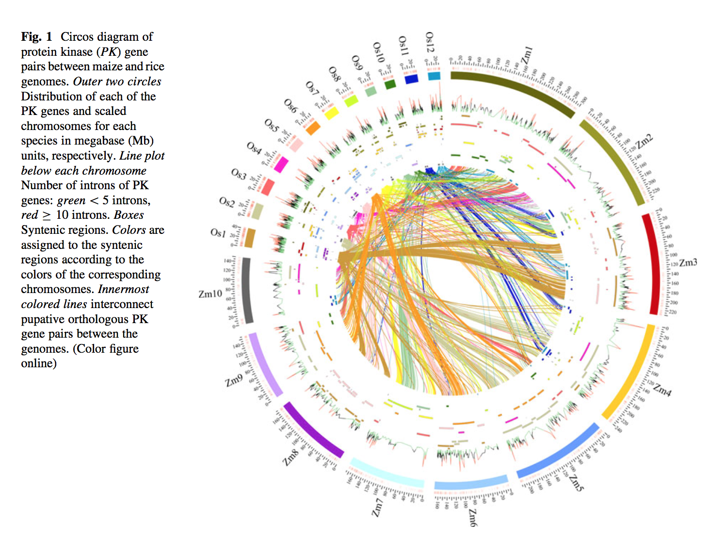
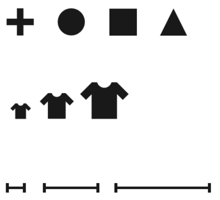
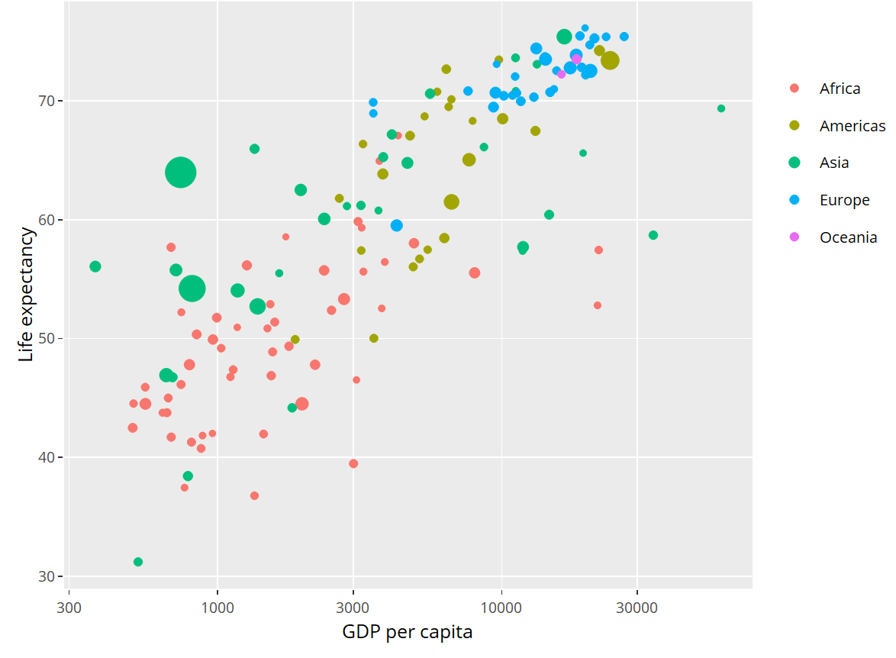
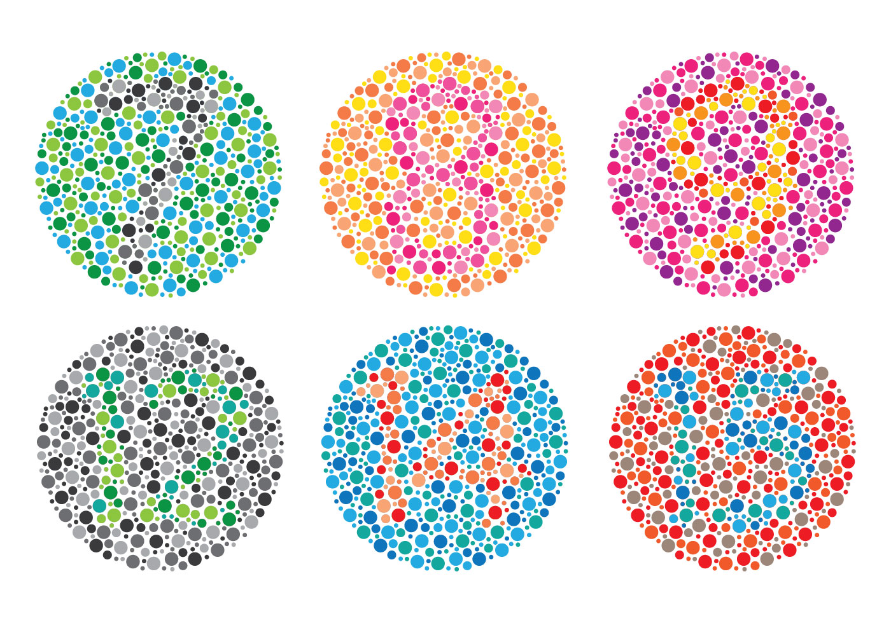
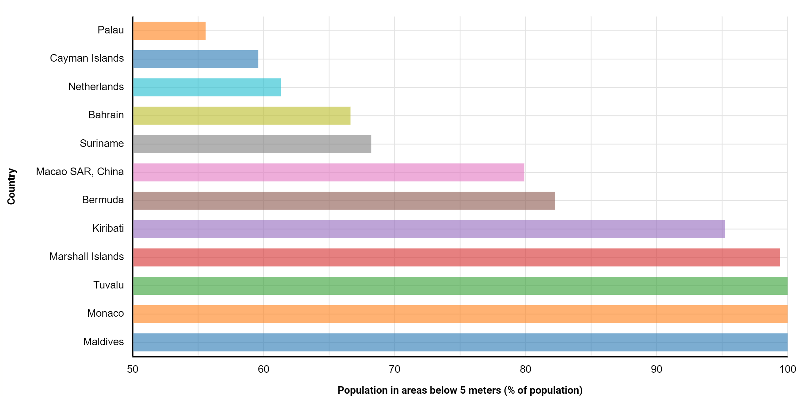

- title : Human Computer Interaction: Data visualization
- description : Human Computer Interaction: Data visualization
- author : Tomas Petricek
- theme : simple
- transition : none
  
****************************************************************************************************

# **CO582: Computer Interaction and User Experience**  Data visualization

  
   

**Tomas Petricek**

email: [t.petricek@kent.ac.uk](mailto:t.petricek@kent.ac.uk) 
twitter: [@tomaspetricek](http://twitter.com/tomaspetricek) 
office: [S129A](https://www.cs.kent.ac.uk/rooms/S129A.gif) 

****************************************************************************************************
 - class: part
 
# **Data science and data visualization**

----------------------------------------------------------------------------------------------------

# **Data age 2025**: What sort of data is there?

_<i class="fa fa-crown"></i>_ Open data collected by governments, e.g. [data.gov.uk](http://data.gov.uk)

_<i class="fa fa-user-secret"></i>_ Not so open data collected by governments

_<i class="fa fa-users"></i>_ Social networks and other user data

_<i class="fa fa-briefcase"></i>_ Data collected by businesses or scientists

_<i class="fa fa-video"></i>_ Multimedia data such as photos, videos, books

_<i class="fa fa-microchip"></i>_ Devices, sensors and internet of things

----------------------------------------------------------------------------------------------------

# **Data age 2025**: The growth of the global datasphere

----------------------------------------------------------------------------------------------------

# **Data age 2025**: The growth of the global datasphere

----------------------------------------------------------------------------------------------------

# **Data visualization**: What is the goal?

> _The goal is to_ aid our understanding _of data by  
> leveraging the human visual system's ability to_  
> see patterns, spot trends _and_ identify outliers.

----------------------------------------------------------------------------------------------------

Scientific data visualization

_Helping experts make sense of complex data_

----------------------------------------------------------------------------------------------------

Telling stories with data in media

_Make data and facts more accessible_

----------------------------------------------------------------------------------------------------

# **Data visualization**: How is it a HCI problem?

**Understanding user needs**

 - Easy for novices or rich for experts?
 - Trigger a surprise or be neutral?
 - Is the goal exploration or explanation?
 

**Using user experience methods**

 - Using perception and cognitive theories
 - Empirical testing in controlled setting

**Do people care about understanding data?**

----------------------------------------------------------------------------------------------------

_I think that the people of this country have had enough of experts..._

Can good visualization get people interested in data?

****************************************************************************************************
 - class: part
 
# **How data visualizations work**

----------------------------------------------------------------------------------------------------

# **Data visualization**: What is a visualization?

> _Principled mapping of_ data variables _to_ visual  
> features _such as position, shape, size and color_.

----------------------------------------------------------------------------------------------------

_What are the variables?_

What visual features?

_What tasks does it enable?_

Could perception mislead us?

----------------------------------------------------------------------------------------------------

## **Form follows function**

 
----------------------------------------------------------------------------------------------------

# **Design principles**

**Form follows function**

- Find the best mapping from variables to features
- Considering human perception properties
- Is there objectively best visualization?

**Beyond conveying facts**

- Visualizations with less straightforward goals
- Trigger emotions, convey complexity, have fun

****************************************************************************************************
 - class: part
 
# **Systematic visualization design**

----------------------------------------------------------------------------------------------------
 - class: part
 
# **Part I**: Data types

----------------------------------------------------------------------------------------------------

# **Systematic visualization**: Data types

**Types of data attributes**

 - Categorical _(e.g. countries, people)_
 - Ordinal _(e.g. education level)_
 - Quantitative _(e.g. time, money, distance)_

 
**Types of quantitative scales**

 - Sequential _(e.g. only positive values)_
 - Diverging _(e.g. price change)_
 - Cyclic _(e.g. month, time of day)_

More types are maps, hierarchies and networks 

----------------------------------------------------------------------------------------------------
 - class: part
 
# **Part II**: Visual channels

----------------------------------------------------------------------------------------------------

# **Systematic visualization**: Categorical channels

**Cannot be measured and ordered** 

_Categories represented as shapes_

_Categories represented as colors_

----------------------------------------------------------------------------------------------------

# **Systematic visualization**: Magnitude channels

**Can compare and guess distance**

 - _Position on common scale_
 - _Position on separate scale_
 - _Length of an element_
 - _Angle of rotation_
 - _Area in 2D space_
 - _Color luminance or saturation_

----------------------------------------------------------------------------------------------------
 - class: part

# **EXAMPLES**: Mapping data to channels

----------------------------------------------------------------------------------------------------

X position  
_GDP (quantitative)_

Y position  
_Age (quantitative)_

Bubble size  
_Pop. (quantitative)_

Bubble color  
_Cont. (categorical)_

----------------------------------------------------------------------------------------------------

X position  
_Country (category)_

Y position  
_CO2 (quantitative)_

Bar color / offset 
_Year (category)_

----------------------------------------------------------------------------------------------------
 - class: part
 
# **Part III**: Perception properties

----------------------------------------------------------------------------------------------------

# **Perception**: How to use color

**Can encode categories and magnitudes**

**How to use it correctly**

 - Choose **distinguishable** categorical colors 
 - Use linear scale that is perceived **linearly**
 

----------------------------------------------------------------------------------------------------

_ Choose  colors that colorblind people can distinguish!_

----------------------------------------------------------------------------------------------------

_Use luminance scale that is perceived as linear!_

_Rainbow can model magnitude (but not linear by default) or categories._

----------------------------------------------------------------------------------------------------

# **Perception**: Choosing channels

### Can we estimate relative values in charts?

 1. _Aligned on common scale_
 2. _Unaligned on common scale_
 3. _Length encoding _
 4. _Angles_
 5. _Circular areas_
 6. _Rectangular areas_

----------------------------------------------------------------------------------------------------

**Position**  
_(+/- 2x)_

**Length**  
_(+/- 3x)_

**Angles**  
_(+/- 5x)_

**Areas**  
_(+/- 6x)_

----------------------------------------------------------------------------------------------------
 - class: part
 
# **Part IV**: Task analysis

----------------------------------------------------------------------------------------------------

#  **Systematic visualization**: Task analysis

**Data analytical task (high-level)**
  
_<i class="fa fa-eye"></i> Discover new hypothesis_  
_<i class="fa fa-highlighter"></i> Present some discovery_
   

**Nature of search (mid-level)**
 
_<i class="fa fa-crosshairs"></i> Lookup (know where) or locate (know what)_  
_<i class="fa fa-arrows-alt"></i> Browse general area of interest_

   
**Querying of data points (low-level)**

_<i class="fa fa-mouse-pointer"></i> Identify information about data point_  
_<i class="fa fa-sliders-h"></i> Compare multiple data points_

****************************************************************************************************
 - class: part
 
# **How to lie with charts**

----------------------------------------------------------------------------------------------------

# How to lie with charts

### Presenting correct data in misleading ways

_<i class="fa fa-chart-pie"></i> Poor choice of visual channels_

_<i class="fa fa-puzzle-piece"></i> Misusing our ability to spot patterns_

_<i class="fa fa-align-left"></i> Ignoring implicit channel properties_

_<i class="fa fa-ruler"></i> Misleading perception of scaling_

----------------------------------------------------------------------------------------------------

_Area is harder to see than position_

_Easy to confuse length (radius) and area_
 

----------------------------------------------------------------------------------------------------

_Humans are too good at seeing patterns!_

_Implied correlation with too few data points._

----------------------------------------------------------------------------------------------------

_Value is position on common axis, not length!_

_Position channel suggests zero as minimum._

----------------------------------------------------------------------------------------------------

**Value is length!**  
_(height of the barrel)_

_Perception of three-dimensional objects is misleading and difficult._

****************************************************************************************************
 - class: part
 
# **Beyond static charts**

----------------------------------------------------------------------------------------------------

# Beyond static charts

### Animations and interactive charts

_<i class="fa fa-search"></i> Allow exploration of large data_

_<i class="fa fa-book-open"></i> Tell a story through data_

_<i class="fa fa-surprise"></i> Element of surprise in visualization_

_<i class="fa fa-brain"></i> Make the viewer think critically_

----------------------------------------------------------------------------------------------------

----------------------------------------------------------------------------------------------------

# Beyond static charts

**Visualization for data exploration**

 - _Designed for experts_
 - _Viewer has motivation to explore_

**Visualization for data presentation**

 - _Readers do not interact with dashboards in NYT_
 - _How to tell a story with data?_
 - _Adapting standard reading metaphors_
 
----------------------------------------------------------------------------------------------------

Animation makes the point stronger.

_Neat use of radial projection for circular value!_

----------------------------------------------------------------------------------------------------

**Scrollytelling**

_Adapts standard online reading interaction._

 

[_See article online at NYT_](http://www.nytimes.com/interactive/2016/09/06/world/middleeast/2015-hajj-stampede.html)

----------------------------------------------------------------------------------------------------

**You draw it!**

_Can data visualization make you think more critically?_

 

[_UK spending_](http://gamma.turing.ac.uk/expenditure/)  
[_NYT article_](https://www.nytimes.com/interactive/2017/01/15/us/politics/you-draw-obama-legacy.html)

****************************************************************************************************
 - class: part

# **Summary**

----------------------------------------------------------------------------------------------------

# **Summary**: Data visualizations

**What is data visualization?**

_Principled mapping of data variables to visual  
features such as position, shape, size and color._

### What we need to understand

 - Different types of data variables
 - Visual features and possible mappings
 - Limitations of human perception

----------------------------------------------------------------------------------------------------

# **Summary**: Data variables and visual channels

**Data variables**  

 - Categorical _(can distinguish between them)_
 - Ordinal _(can be ordered, but not measured)_
 - Quantitative _(sequential, diverging or cyclic)_

**Visual channels**  

 - Categorical _(color, shapes)_
 - Quantitative _(position, length, angle, area and color)_
 
**Remember error rates of visual channels!**

----------------------------------------------------------------------------------------------------

# CO582: Data visualization

**What you should remember from this lecture**

 - Systematic approach to data visualization
 - Mapping data variables to visual channels
 - Relevant properties of human perception
 
 
 

Tomas Petricek 
_[t.petricek@kent.ac.uk](mailto:t.petricek@kent.ac.uk) | [@tomaspetricek](http://twitter.com/tomaspetricek)_

****************************************************************************************************
 - class: part
 
# **References**

----------------------------------------------------------------------------------------------------

**Related courses**

 - [Visualization in HCI course by Adam Perer](https://cmu-vis-course.github.io/2017/schedule/)
 - [Research Skills course by Neil Dodgson](http://neildodgson.com/index.php/research-skills)

**Textbooks and papers**

 - [Visualization Analysis and Design](https://proquest.safaribooksonline.com/9781466508910)
 - [A Tour Through the Visualization Zoo](http://cacm.acm.org/magazines/2010/6/92482-a-tour-through-the-visualization-zoo/pdf)
 
**Online links** 

 - [Genomics Visualization - Aprameya Mysore](https://invizibility.github.io/blog/background/)
 - [How statistics lost their power - The Guardian](https://www.theguardian.com/politics/2017/jan/19/crisis-of-statistics-big-data-democracy)
 - [Data Age 2025 - Segate](https://www.seagate.com/files/www-content/our-story/trends/files/Seagate-WP-DataAge2025-March-2017.pdf)

