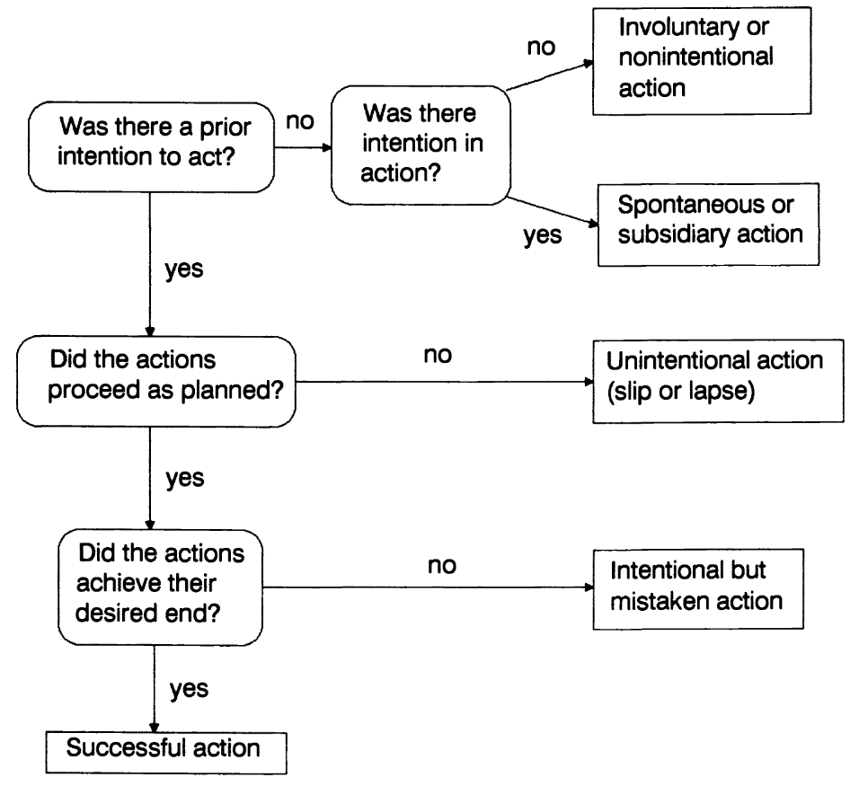
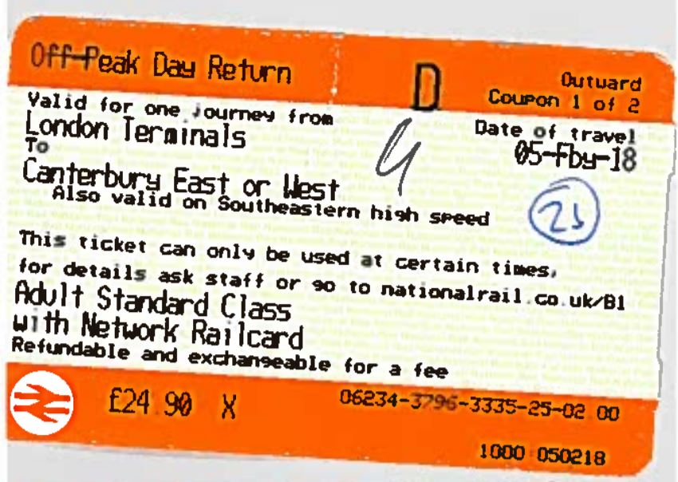
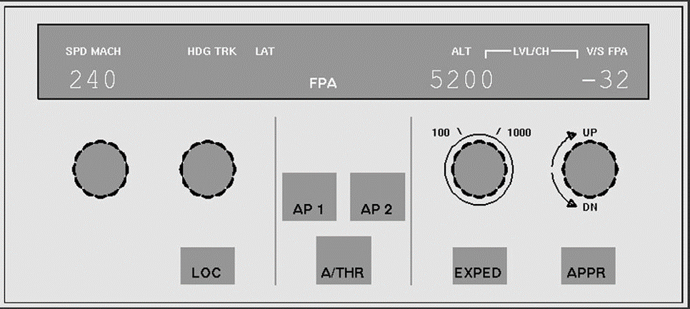
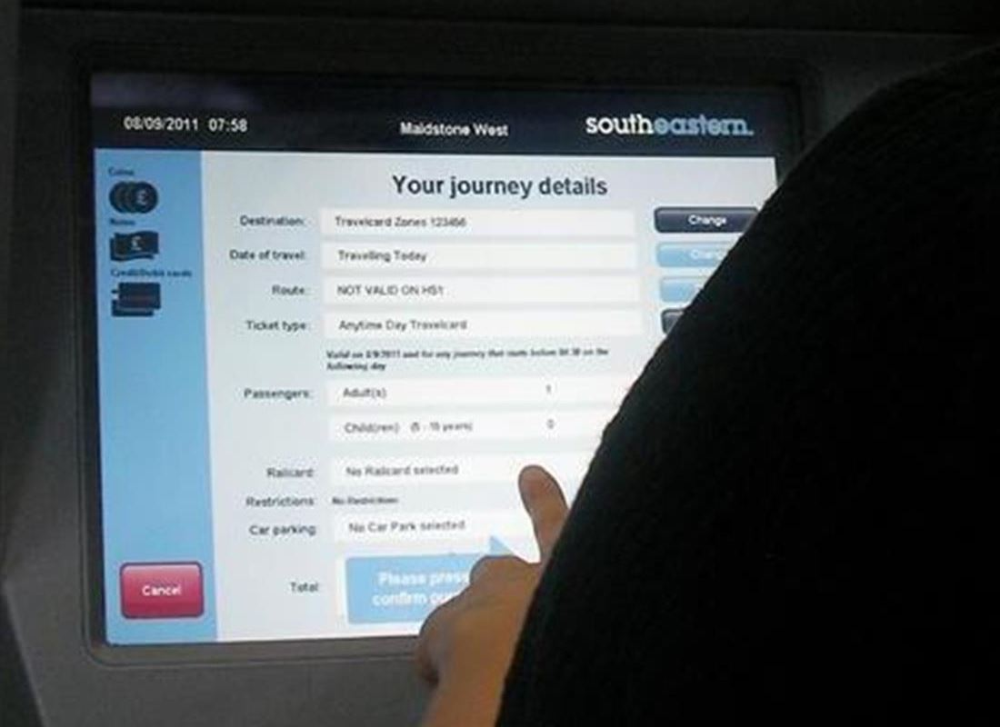
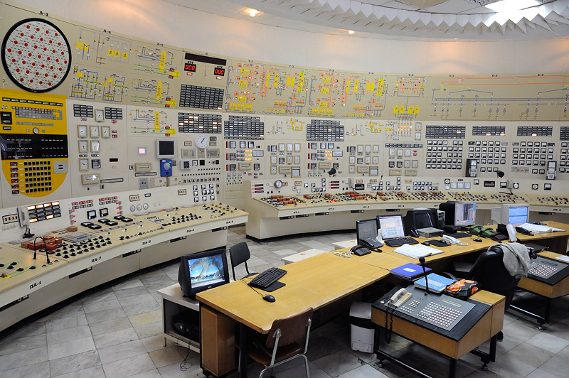

- title : Human Computer Interaction: Evaluation
- description : Human Computer Interaction: Evaluation
- author : Tomas Petricek
- theme : simple
- transition : none
  
****************************************************************************************************

# **CO582: Computer Interaction and User Experience**  Errors

  
   

**Tomas Petricek**

email: [t.petricek@kent.ac.uk](mailto:t.petricek@kent.ac.uk) 
twitter: [@tomaspetricek](http://twitter.com/tomaspetricek) 
office: [S129A](https://www.cs.kent.ac.uk/rooms/S129A.gif) 

****************************************************************************************************
 - class: part
 
# **Human and computer errors**

----------------------------------------------------------------------------------------------------

# **Human error** (Reason, 1990)

#### Error-free performance
_The odds against error-free performance are high.  
There is one way of performing a task correctly, but  
each step provides a multitude of inappropriate pathways._

#### Forms of errors
_The reality is different. Not only are errors rarer than correct actions,
they also take a limited number of forms._

----------------------------------------------------------------------------------------------------

# **Computer error** (Ensmenger, 2010)

_By the end of 1960s managers, academics and governments were talking of a crisis. 
In the next several decades, they released warnings about the desperate state of the software industry with ritualistic regularity._
 

How can we explain the perpetual crisis
in one of the most successful and
profitable industries of all time?

----------------------------------------------------------------------------------------------------

----------------------------------------------------------------------------------------------------

# How often do computers kill people?

### Mechanizing Proof (MacKenzie, 2001)

_<i class="fa fa-skull"></i> Collected around 1,100 deaths_

_<i class="fa fa-keyboard"></i> 90% caused by faulty human-computer interaction _

_<i class="fa fa-magnet"></i> 4% caused by physical faults (interference)_

_<i class="fa fa-bug"></i> 3% caused by software bugs (mostly Patriot missile)_

_<i class="fa fa-desktop"></i> Poor interfaces and organizational failings_
 
----------------------------------------------------------------------------------------------------

# Faulty human-computer interaction

> Human error usually is a result of poor design. 
> Human err continually; it is an intrinsic part  
> of our nature. System design should take this  
> into account.
>
> 
(Norman, 1988)

----------------------------------------------------------------------------------------------------

# How and why of error research 
 

**Why we need to understand errors**

 - Design resilient systems
 - Criminal responsibility implications
 - Teach us how cognition works

**How to learn from errors**

 - "Human error" does not tell us much
 - Detailed analysis of root causes
 - Computing can learn from aviation!

****************************************************************************************************
 - class: part
 
# **Classifying human errors**

----------------------------------------------------------------------------------------------------

Each step provides a multitude of inappropriate pathways

----------------------------------------------------------------------------------------------------

# Many kinds of errors

**When error occurs**

 - Perceptual errors
 - Cognitive errors
 - Motor errors

**How error occurs**
 
 - Was the action planned?
 - What caused the error?
 - Mistakes, failures, slips and lapses

----------------------------------------------------------------------------------------------------
 
# Perceptual, cognitive and motor errors

**Perceptual error**  
Misleading clues or sensory overload  
_Did not notice the batter indicator_

**Cognitive error**  
High level memory or cognitive processes  
_I remembered my password incorrectly_

**Motor error**  
Unnatural, special or too similar motor movement  
_I cannot touch the right virtual key on my phone_

----------------------------------------------------------------------------------------------------

James Reason (1990)

_Human Error_

----------------------------------------------------------------------------------------------------

# Four basic kinds of errors

**<i class="fa fa-map"></i> Mistake** - _Following a wrong plan_  
_Application of a bad rule or poor remembering_

**<i class="fa fa-hand-spock"></i> Failure** - _Good plan, but too hard_    
_Shooting all the monsters in a game_

**<i class="fa fa-calculator"></i> Lapse** - _Working memory failure_  
_I forgot what I was just doing_

**<i class="fa fa-coffee"></i> Slip** - _Failed execution_  
_Automatically getting off at your usual station_

----------------------------------------------------------------------------------------------------

What kind of error is this?

_Mistake, failure, lapse or slip?_

----------------------------------------------------------------------------------------------------

# Buying a wrong train ticket

**Wrong ticket by mistake**

 - _Cannot figure out what to buy_
 - _Have a rail card?_
 - _When is super off peak?_

**Wrong ticket as a slip**

 - _I always buy one particular ticket_
 - _Doing the same over weekend_
 - _The bloody machine resets your options!_

----------------------------------------------------------------------------------------------------

# Buying a wrong train ticket

### Why are we classifying kinds of errors?

_<i class="fa fa-user-secret"></i>_ Novices make mistakes

_<i class="fa fa-ticket-alt"></i> Do not understand how rail tickets work_

_<i class="fa fa-user-graduate"></i>_ Experts make slips

_<i class="fa fa-mouse-pointer"></i> Accidentally click on a wrong button_

----------------------------------------------------------------------------------------------------

# Many kinds of slips and lapses

### Empirical clustering of common errors

 1. Capture errors
 2. Description errors
 3. Data driven errors
 4. Associate activation
 5. Loss of activation
 6. Mode errors 

----------------------------------------------------------------------------------------------------

# Capture errors

**Capture error example**  
_I was using a copying machine, and I was counting the pages. I found
myself counting, "1, 2, 3, 4, 5, 6, 7, 8, 9, 10, Jack, Queen, King."  
I had been playing cards recently._

**How capture errors happen?**  
_A more familiar sequence of action captures a less familiar sequence of actions_

----------------------------------------------------------------------------------------------------

# Description errors

**Description error example**  
_Correct action using a  
similar but wrong object_

**How they happen?**  
_Accidentally perform different action with similar description_

----------------------------------------------------------------------------------------------------

# Data-driven and associate errors

**Data driven error**

 - Sensory information intrudes
 - Saying X because someone said it
 
**Associate activation error**

 - Internal thought intrudes
 - Enter login for another system
 - Dismiss an important message box

----------------------------------------------------------------------------------------------------

# Loss of activation and mode errors

**Loss of activation**

 - Forgot the goal in the middle
 - Go to Google but forget what you wanted to search for
 
**Mode error**

 - Do action in a wrong mode
 - Typing WITH CAPS LOCK ON
 - Crash an airplane...

----------------------------------------------------------------------------------------------------

**Air Inter Flight 148**

_Crashed at 19:20:33 CET in the mountains at an altitude of 800 m_

----------------------------------------------------------------------------------------------------

Controls with two descent modes

_1. Angle in degrees_  
_2. Feet per minute_

_Not the only cause, but one factor.._

----------------------------------------------------------------------------------------------------

 
Angle in degrees

_Descent by  
3.2 degrees_

 
 

Feet per minute

_Descent by 3200 feet per minute_

****************************************************************************************************
 - class: part
 
# **Finding and responding to errors**

----------------------------------------------------------------------------------------------------

# Detecting errors

**How to detect errors**

 - Self-monitoring 
 - Environment gives us hints
 - Another person notices it

**Why we miss errors**

- Accept simplistic partial explanation
- Minor mismatch of mental model
- Relevance bias prevents us from seeing big picture

----------------------------------------------------------------------------------------------------

# Detecting errors

### Why is error detection getting harder

_<i class="fa fa-car"></i> Experienced mechanics notice errors by sound_

_<i class="fa fa-microchip"></i> In complex systems you cannot see errors directly_

_<i class="fa fa-clock"></i> Latent errors more common than active errors_

_<i class="fa fa-circle"></i> Swiss cheese model of complex errors_

_<i class="fa fa-bug"></i> Resident pathogen metaphor for system errors_

----------------------------------------------------------------------------------------------------

**Cheese model**

_Many factors contribute to an error_

_All have to be aligned for accident to happen_

----------------------------------------------------------------------------------------------------

# System response to errors

### How can system respond to a detected error

_<i class="fa fa-eye-slash"></i>_ Do nothing - _Leave everything to the user_

_<i class="fa fa-ban"></i>_ Gagging - _Prevent unrealistic intentions_

_<i class="fa fa-exclamation-triangle"></i>_ Warnings - _Warn about unrealistic intentions_

_<i class="fa fa-check-circle"></i>_ Self-correct - _Automatically do the right thing_

_<i class="fa fa-question-circle"></i>_ Dialogue - _Ask user to explain or clarify_

****************************************************************************************************
 - class: part
 
# **Designing for errors**

----------------------------------------------------------------------------------------------------

# Designing for avoiding errors

> Human error usually is a result of poor design. 
> Human err continually; it is a part
> of our nature. System design should take this
> into account.

----------------------------------------------------------------------------------------------------

# Designing for avoiding errors

### Consider conversation between two people

_<i class="fa fa-magic"></i> Grammatical errors are not even noticed_

_<i class="fa fa-strikethrough"></i> Restarts and corrections are ignored_

_<i class="fa fa-filter"></i> Misstatements interpreted approximately_

_<i class="fa fa-user-check"></i> Statements checked for common sense_

_<i class="fa fa-surprise"></i> Confusion corrected via a dailogue_

----------------------------------------------------------------------------------------------------

# Designing for avoiding errors

### What can computer system do?

_<i class="fa fa-route"></i> Understand root causes behind errors_

_<i class="fa fa-wrench"></i> Implement common sense checks for inputs_

_<i class="fa fa-backward"></i> Allow undoing an action_

_<i class="fa fa-search"></i> Support error discovery & allow corrections_

_<i class="fa fa-recycle"></i> Do not reject, but allow to correct_

----------------------------------------------------------------------------------------------------

 
How to improve ticket machines?

_Expert slips vs. novice mistakes_

_Common sense checks?_

_Support error discovery?_

----------------------------------------------------------------------------------------------------

# Errare humanum est

> If it is impossible to guarantee the elimination of errors, then we must 
> discover ways of mitigating their consequences in unforgiving 
> situations.

----------------------------------------------------------------------------------------------------

# What to do when errors happen

  
**Learning to live with errors**

 - Users learn to avoid errors
 - Do not hide too many details
 - Leave room for workarounds

**Resilience engineering**

 - Monitoring so that experts can notice
 - Allow manual correction 
 - Analyze developments in advance 

****************************************************************************************************
 - class: part

# **Summary**

----------------------------------------------------------------------------------------------------

# Different kinds of evaluation

**Different types of errors**  
Mistakes, failures, lapses, slips  
Experts make slips, novices mistakes

**Two ways of grouping errors**  
Was the action planned? What went wrong?   
Analysis of common errors empirically

**How to prevent and correct errors**  
Design tips to prevent errors  
Different ways of responding to errors 

----------------------------------------------------------------------------------------------------

# CO582: Errors

**What you should remember from this lecture**

 - Recognize mistakes, failures, slips and lapses
 - Capture, description, data, association & mode errors
 - How can systems prevent & respond to errors

 
 

Tomas Petricek 
_[t.petricek@kent.ac.uk](mailto:t.petricek@kent.ac.uk) | [@tomaspetricek](http://twitter.com/tomaspetricek)_

****************************************************************************************************
 - class: part
 
# **References**

----------------------------------------------------------------------------------------------------

**Books**

- [Human Error](https://books.google.co.uk/books/about/Human_Error.html?id=WJL8NZc8lZ8C), James Reason
- [The Design of Everyday Things](https://en.wikipedia.org/wiki/The_Design_of_Everyday_Things), Don Norman

**Papers and links**

 - [Experimental Study of Vertical Flight Path Mode Awareness](https://www.sciencedirect.com/science/article/pii/S1474667017452256),
   Eric N. Johnson, Amy R. Pritchett
