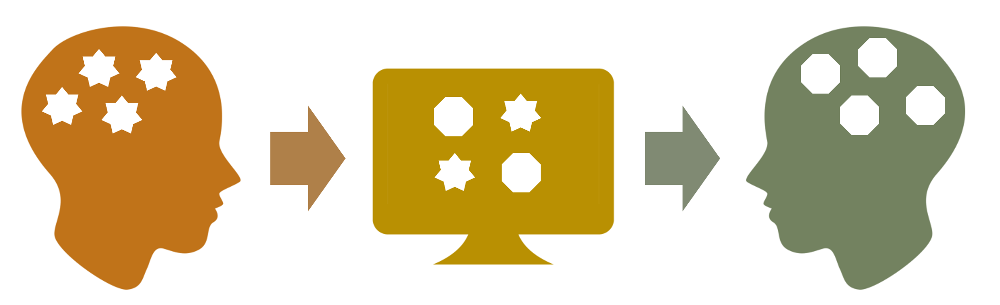
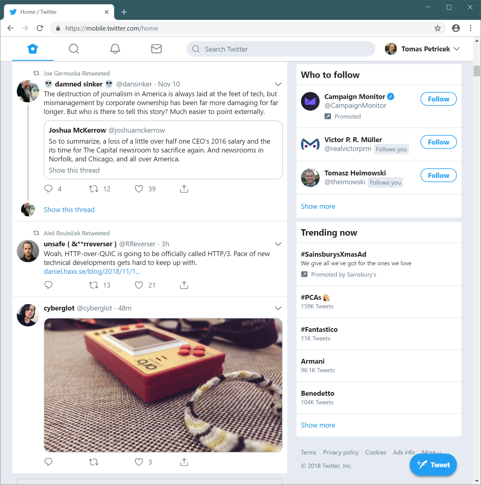
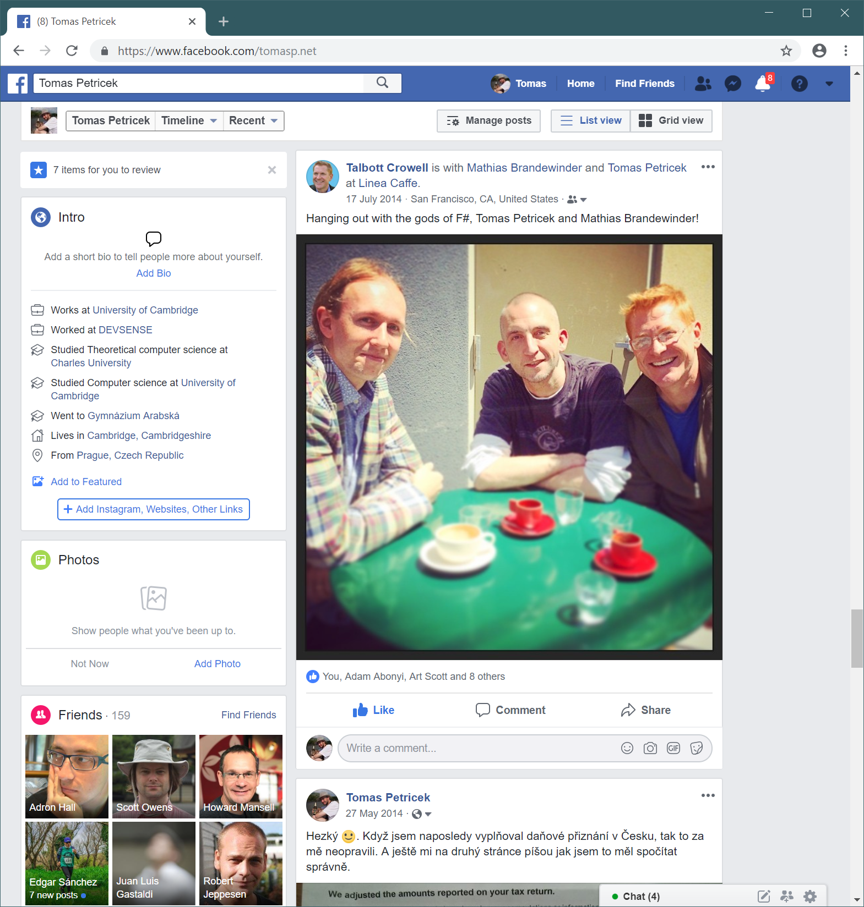
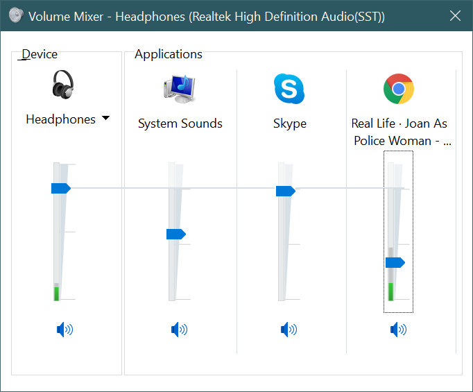
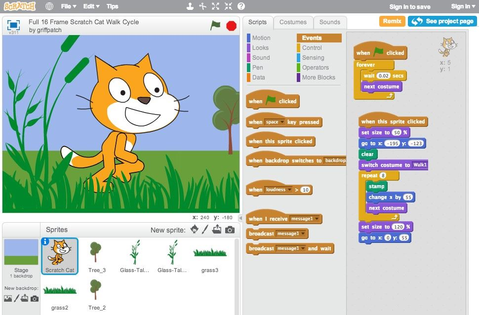

- title : Human Computer Interaction: Metaphors
- description : Human Computer Interaction: Metaphors
- author : Tomas Petricek
- theme : simple
- transition : none
  
****************************************************************************************************

# **CO582: Computer Interaction and User Experience**  Metaphors

  
   

**Tomas Petricek**

email: [t.petricek@kent.ac.uk](mailto:t.petricek@kent.ac.uk) 
twitter: [@tomaspetricek](http://twitter.com/tomaspetricek) 
office: [S129A](https://www.cs.kent.ac.uk/rooms/S129A.gif) 

****************************************************************************************************
 - class: part
 
# **What are metaphors good for**

----------------------------------------------------------------------------------------------------

**Computers can do almost anything!**

_Sometimes expected, sometimes unexpected_

How to help user  
make sense of it?

----------------------------------------------------------------------------------------------------

# What are metaphors good for

> _An expression that describes a person or object by referring to something that is considered to possess similar characteristics._
>
> 

>
> _[Cambridge Dictionary](https://dictionary.cambridge.org/dictionary/english/metaphor#dataset-cacd) (online)_
>
> 

----------------------------------------------------------------------------------------------------

**Xerox Star (1981)**

_Computer is like a desk with documents_

_Icons represent documents_

_Clicking opens the document or a folder_

----------------------------------------------------------------------------------------------------

**Microsoft Bob (1995)**

_Beware of too literal interpretations_

_In physical world, you know you can do, but what about here?_

Nobody likes Clippy!

----------------------------------------------------------------------------------------------------

**Siri, Google, Echo**

_Personal assistant metaphor is back!_

_This time without childish graphics..._

****************************************************************************************************
 - class: part
 
# **Thinking using metaphors**

----------------------------------------------------------------------------------------------------

# Metaphor in literature

> _[Metaphor is a] figure of speech in which a name or descriptive word or phrase is
> transferred to an object or action different from, but analogous to, that to which
> it is literally applicable._

----------------------------------------------------------------------------------------------------

# Metaphor in literature

**Romeo and Juliet**

_But, soft! what light through yonder window breaks?
It is the east, and Juliet is the sun!
Arise, fair sun, and kill the envious moon._

**Juliet is the sun**

 - _Has warmth, radiance and the giving of life_
 - _Not luminous ball of hydrogen and helium_
 - _Interpreted according to reader's culture_

 
----------------------------------------------------------------------------------------------------

# Metaphor in cognitive science

**Metaphors are central to thought**

 - _Explain new thing in terms of familiar_
 - _Explain abstract concept in concrete terms_
 - _Apparent from the language we use_
 

**Good is up**

 - _"He has such high spirits"_
 - _"I fell into a depression"_
 - _"We hit a peak last year; it's been downhill since"_

----------------------------------------------------------------------------------------------------

# Mathematics is constructed via metaphors
 
**Innate arithmetic**  
_Babies have basic mathematical capabilities_  
_Addition and subtraction up to three_

**Grounding metaphors**  
_Sets are like physical containers_  
_Arithmetic is like motion along a path_

**Linking metaphors**  
_Numbers are like sets, i.e. $\emptyset, \{ \emptyset \}, \{ \emptyset, \{ \emptyset \} \}$_  
_Infinity as the end of an iterative process_
 
----------------------------------------------------------------------------------------------------

# Metaphors in user experience design

_Transfer mental model from designer's to user's brain!_

----------------------------------------------------------------------------------------------------

# Metaphors in user experience design

### Why and how of metaphors in UX design

_<i class="fa fa-shopping-cart"></i> Help build a metaphor that users will use anyway_

_<i class="fa fa-school"></i> Use familiar concepts to help learning_

_<i class="fa fa-clipboard"></i> Give an abstract idea a concrete form_

_<i class="fa fa-save"></i> All metaphors are imperfect by design_

****************************************************************************************************
 - class: part
 
# **Metaphors and computing**

----------------------------------------------------------------------------------------------------

# First Draft of a Report on the EDVAC (1945)

_Computer is like a living system, components are organs_

----------------------------------------------------------------------------------------------------

# Common computing metaphors 

<table style="width:100%"><tr><td style="width:50%">

**General computing**

_Electronic brains_  
_Languages_  
_Libraries_  
_Spreadsheet_  
_Office_  
_Loops, etc._

</td><td style="width:50%">

**User interfaces**

_Dialog, menu_  
_Shopping basket_  
_Toolbox_  
_Document_  
_Wizard_  
_Button, etc._

</td></tr></table>

----------------------------------------------------------------------------------------------------

**Twitter timeline**

_Showing tweets in chronological order_

----------------------------------------------------------------------------------------------------

**Facebook wall**

_The original profile space where you post things_

_Renamed from "wall" to "timeline" in 2011_

****************************************************************************************************
 - class: part
 
# **Three types of metaphors**

----------------------------------------------------------------------------------------------------

# Three types of metaphors plus a bonus

**Orientational metaphors**  
_How to use the screen space in user interface_

**Ontological metaphors**  
_Explain computer ideas in concrete terms_

**Structural metaphors**  
_Exploit structural similarity between concepts_

**Metonymy**  
_Refer to something using an understood related thing_

----------------------------------------------------------------------------------------------------

# Orientational metaphors

### Spatial and temporal orientation

_<i class="fa fa-book"></i> Based on physical and cultural experience_

_<i class="fa fa-thumbs-up"></i> Good is up, happiness is up, high status is up_

_<i class="fa fa-forward"></i> Next is to the right, backwards is to the left_

_<i class="fa fa-desktop"></i> Locate abstract operations on 2D screen space_

----------------------------------------------------------------------------------------------------

**Magnitude controls**

_More is up_  
_Less is down_

----------------------------------------------------------------------------------------------------

**Installers and wizards**

_Back is left_  
_Next is right_

----------------------------------------------------------------------------------------------------

# Ontological metaphors

### Understanding the nature of things

_<i class="fa fa-file"></i> Explain ideas in more concrete terms_

_<i class="fa fa-chart-line"></i> Inflation is an entity, we need to combat inflation_

_<i class="fa fa-archive"></i> Container metaphor, such as set is a container_

_<i class="fa fa-list"></i> Referring to things and identifying their aspects_

----------------------------------------------------------------------------------------------------

**File is an object**

_It has properties  
such as size_  

_Enables commands such  
as move the document  
into a trash bin_

----------------------------------------------------------------------------------------------------

**Textbox is a container**

_"Type some text_ into _the textbox"_

----------------------------------------------------------------------------------------------------

# Structural metaphors

### Similarity between a computer and the real-world

_<i class="fa fa-shapes"></i> Structural similarity between two things_

_<i class="fa fa-bolt"></i> Argument is war, i.e. "he attacked her position"_

_<i class="fa fa-align-center"></i> Never a perfect match - there are always misfits_

_<i class="fa fa-star-of-david"></i> May be more culturally dependent than others_

----------------------------------------------------------------------------------------------------

**Moving files to trash**

_Empty the trash to permanently delete_

_But you can always add more files to it._  
_Also does not smell!_

----------------------------------------------------------------------------------------------------

**Block languages**

_Program constructs  
are pieces  
of a puzzle_

_Can only fit in certain ways_

----------------------------------------------------------------------------------------------------

# Metonymy

**Not a metaphor but related**

 - _Explains concept in terms of another_
 - _Use one entity to refer to another that is related_
 - _Used in user interfaces in the form of icons _
 - _Not used as heavily as it used to be..._
 

****************************************************************************************************
 - class: part
 
# **Are metaphors good or evil?**

----------------------------------------------------------------------------------------------------

# Criticism of metaphors
 
**Don Norman** - The Invisible Computer (1998)

_Metaphors are an attempt to use one thing to represent another, when the other
is not the same. But if it is not the same, how can the metaphor help?_

**Alan Kay** - User interface: A personal view (1990)

_[Should designers] transfer the paper metaphor so perfectly that the 
screen is as hard as paper to erase (...)?_

----------------------------------------------------------------------------------------------------

# Criticism of metaphors

### Why metaphors might not be good design device

_<i class="fa fa-balance-scale"></i> Differences may outweigh the value of similarities_

_<i class="fa fa-graduation-cap"></i> They are only useful when learning the system_

_<i class="fa fa-magic"></i> Not everything can be seen via a metaphor_

_<i class="fa fa-stopwatch"></i> Empirical evidence against usefulness of metaphors_

****************************************************************************************************
 - class: part
 
# **Designing with metaphors**

----------------------------------------------------------------------------------------------------

# Designing with metaphors

**Helpful when used carefully**

 - _Often obvious in hindsight_
 - _Shopping basket in e-shops_
 - _Help designers think_
 
**Understand matches and mismatches**

 - _Matches are where the similarity works_
 - _Mismatch when computer cannot do something_
 - _Mismatch when computer can do more_

----------------------------------------------------------------------------------------------------

# Designing with metaphors

### Structured method for metaphorical design

1. _Identify system functionality_
2. _Generate possible metaphors_
3. _Identify metaphor-interface matches_
4. _Identify interface-metaphor mismatches_
5. _Handle mismatches_

----------------------------------------------------------------------------------------------------

# Designing with metaphors

### Handling mismatches in metaphors

_<i class="fa fa-eye"></i> Make actions without metaphorical equivalent visible_

_<i class="fa fa-trash-alt"></i> Expect users to try things that work in the world_

_<i class="fa fa-times-circle"></i> Use composite (or backup) metaphor for misfits_

_<i class="fa fa-book"></i> Avoid being too literal to avoid misfits_

----------------------------------------------------------------------------------------------------

**Composite metaphor**

Primary  
_Traffic lights  
(red, orange green)_ 

Secondary  
_Familiar signs  
(cross, bar, stretch)_

****************************************************************************************************
 - class: part

# **Summary**

----------------------------------------------------------------------------------------------------

# **Metaphors:**  From literature to computing

**Where metaphors come from**

 - _Metaphor as a literary device_
 - _Metaphor as fundamental cognitive science concept_

**Metaphors in computing**

 - Computing: _Electronic brains, libraries, office_
 - User interface: _Desktop, wall, timeline, basket_

----------------------------------------------------------------------------------------------------

# **Metaphors:**  Designing with metaphors

**Three kinds of user interface metaphors**

 - Organizational _for mapping ideas to a space_
 - Ontological _for explaining what abstract concepts are_
 - Structural _for mapping between similar things_

**Understanding metaphorical fits and misfits**

 - _Metaphors cannot, in principle, be perfect_
 - _Exploit where it fits, careful about where it does not_

----------------------------------------------------------------------------------------------------

# CO582: Metaphors

**What you should remember from this lecture**

 - What is a metaphor and user interface examples
 - Orientational, ontological and structural
 - Arguments for and against; fits and misfits
 
 
 

Tomas Petricek 
_[t.petricek@kent.ac.uk](mailto:t.petricek@kent.ac.uk) | [@tomaspetricek](http://twitter.com/tomaspetricek)_

****************************************************************************************************
 - class: part
 
# **References**

----------------------------------------------------------------------------------------------------

### Books, theses and resources

- [Interaction Design: Beyond Human-Computer Interaction](https://www.amazon.co.uk/Interaction-Design-Beyond-Human-Computer/dp/0470018666), H. Sharp, Y. Rogers, J. Preece
- [Where Mathematics Comes From](https://en.wikipedia.org/wiki/Where_Mathematics_Comes_From), G. Lakoff, R. Núñez
- [Metaphors We Live By](https://en.wikipedia.org/wiki/Where_Mathematics_Comes_From), G. Lakoff, M. Johnsen
- [User-Interface Metaphors in Theory and Practice](http://researcharchive.vuw.ac.nz/xmlui/bitstream/handle/10063/45/thesis.pdf?sequence=2), Pippin Barr's MSc thesis