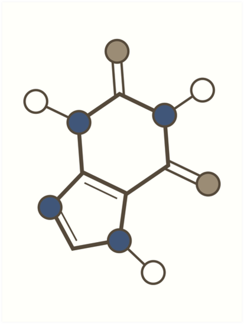
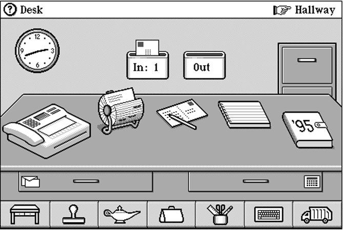
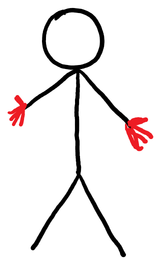
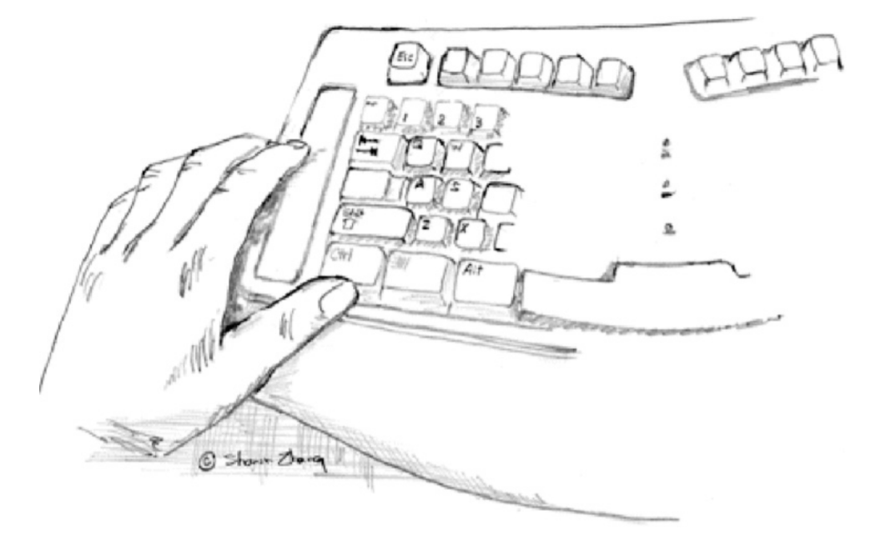
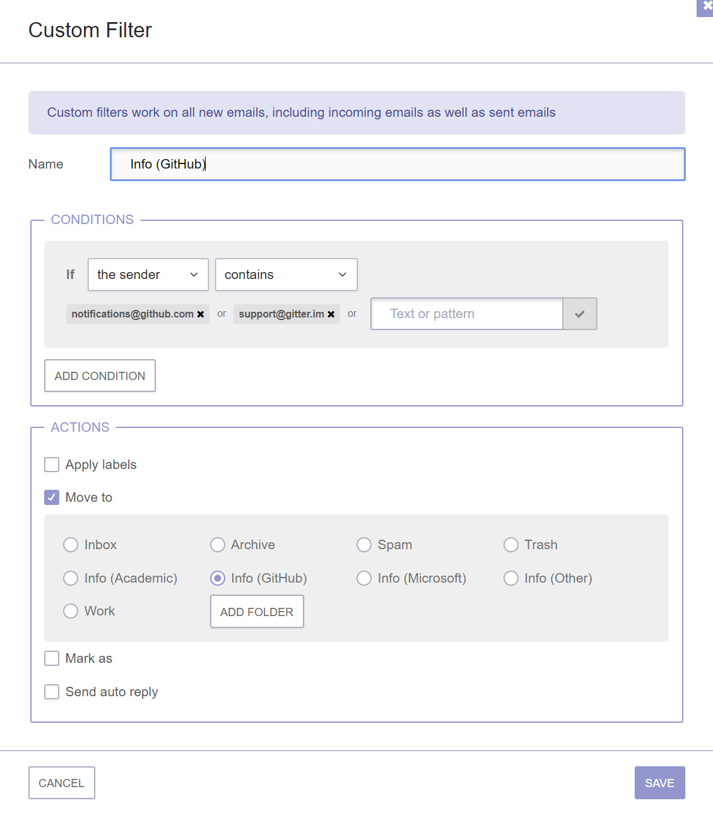

- title : Human Computer Interaction: Models and theories
- description : Human Computer Interaction: Models and theories
- author : Tomas Petricek
- theme : simple
- transition : none
  
****************************************************************************************************

# **CO582: Computer Interaction and User Experience**  Models and theories

  
   

**Tomas Petricek**

email: [t.petricek@kent.ac.uk](mailto:t.petricek@kent.ac.uk) 
twitter: [@tomaspetricek](http://twitter.com/tomaspetricek) 
office: [S129A](https://www.cs.kent.ac.uk/rooms/S129A.gif) 

****************************************************************************************************
 - class: part
 
# **Models and theories**

----------------------------------------------------------------------------------------------------

# Models and theories

**How to design a user interaction?**

- Look for problems and try to fix them
- Try whatever comes to mind!
- Try whatever, but test it empirically
- Follow good intuitions of experts

**How to do it more systematically?**

- Design a scientifically justified model
- Base decisions on the model

----------------------------------------------------------------------------------------------------

# Models - what and why?

> Model is a simplification of reality. It is useful  
> if it helps in designing, evaluating or otherwise  
> providing a basis for understanding the behavior  
> of a computer system.

----------------------------------------------------------------------------------------------------

# A range of models

<table class="mods"><tr><td>

**Metaphor**  
_is a lightweight model_

</td><td>

**Formula**  
_is a heavyweight model_

</td></tr><tr>
<td></td>
<td>

$ID=log_2(A/W+1)$

$MT=a+b\times ID$

</td></tr></table>

----------------------------------------------------------------------------------------------------

# Different models have different aims

### Predictive models

_<i class="fa fa-clock"></i>_ Know performance a priori

_<i class="fa fa-chart-line"></i>_ Make quantitative prediction

### Descriptive models

_<i class="fa fa-brain"></i>_ Provide framework for thinking

_<i class="fa fa-universal-access"></i>_ Raise important design issues

----------------------------------------------------------------------------------------------------

# Models by level of description

<table class="sticks"><tr>
<td class="fragment">

**Perception**  
_Colour_  
_Pattern recognition_

</td>
<td></td>
<td></td>
<td class="fragment">

**Motoric**  
_Keyboard, mouse, touch_

</td></tr><tr>
<td class="fragment">

**Cognitive**  
_Mental models of users_

</td>
<td></td>
<td></td>
<td class="fragment">

**Social**  
_Distributed cognition_

</td>
</tr></table>

----------------------------------------------------------------------------------------------------

# Three examples

#### ❶ Motor model of bimanual skill
_How to design interfaces for two hands_

#### ❷ Cognitive dimensions of notations
_Comprehensive, high-level evaluation_

#### ❸ Distributed cognition model
_Modelling systems with multiple participants_

****************************************************************************************************
 - class: part
 
# **Motor model of bimanual skill**

----------------------------------------------------------------------------------------------------

# Models of keyboard and mouse entry

$ID=log_2(A/W+1)$  
$MT=a+b\times ID$

### Keystroke level model

_Predictive model of hand moving towards a target_

### Key action model

_Simple descriptive model of keyboard keys. Is this model correct?_ 

----------------------------------------------------------------------------------------------------

**Two-handed interaction paradigm**

_Sketching using a curve drawing tool_

----------------------------------------------------------------------------------------------------

# Bimanual control and desktop computing 

Our hands have different roles & perform different tasks

<table style="margin-left:-20px"><tr><td class="fragment" style="width:50%">

**Nonpreferred hand**

 - _Leads preferred hand_
 - _Performs coarse movements_
 - _Sets spatial frame of reference for the preferred hand_

</td><td class="fragment" style="width:50%">
 
**Preferred hand**

 - _Follows non-preferred_
 - _Performs fine movements_
 - _Works within frame of reference established by preferred_

</td></tr></table>

----------------------------------------------------------------------------------------------------

# Bimanual control and desktop computing 

### What is this model good for?

_<i class="fa fa-stopwatch"></i>_ Evaluating design: _Will an operation be easy to do?_

_<i class="fa fa-pen-nib"></i>_ Informing design: _How to improve usability?_

----------------------------------------------------------------------------------------------------

# Evaluation using bimanual model of interaction

**Delete a file**

Left: _Move to a file icon & select_

Right: _Press the DELETE key_

----------------------------------------------------------------------------------------------------

# Learning from bimanual model of interaction

**Scrolling panel**

_Use nonpreferred hand to set spatial frame of reference_

****************************************************************************************************
- class: part

# **Cognitive dimensions of notations**

----------------------------------------------------------------------------------------------------

# Notations and human computer interaction

**Notations used in computing**

 - Programming languages  
 - Markup and config files
 - Rule and macro editors
 

 
**User experience questions**

 - Does the notation structure support activities of the user?
 - Is one notation the best?

----------------------------------------------------------------------------------------------------

# Cognitive dimensions of notations

### Properties of the cognitive dimensions model

_<i class="fa fa-paint-brush"></i> Comprehensible broad-brush evaluation_

_<i class="fa fa-user"></i> Understandable for non-specialists_

_<i class="fa fa-shoe-prints"></i> Distinguish different user needs_

_<i class="fa fa-eye"></i> Prompt designers to see more choices_

----------------------------------------------------------------------------------------------------

# Cognitive dimensions of notations

----------------------------------------------------------------------------------------------------

# Generic activities with different requirements

_<i class="fa fa-plus-circle"></i>_ Incrementation - _e.g. adding formulas to spreadsheet_

_<i class="fa fa-copy"></i>_ Transcription - _e.g. copying data from paper_

_<i class="fa fa-edit"></i>_ Modification - _e.g. changing formula in a spreadsheet_

_<i class="fa fa-certificate"></i>_ Exploratory design - _e.g. designing software structure_

_<i class="fa fa-search"></i>_ Searching - _e.g. finding uses of a function_

_<i class="fa fa-filter"></i>_ Exploratory understanding - _e.g. understanding code_

----------------------------------------------------------------------------------------------------

# Cognitive dimensions of notations

----------------------------------------------------------------------------------------------------

# Cognitive dimensions of notations

----------------------------------------------------------------------------------------------------

# Cognitive dimensions of notations

### Example cognitive dimensions (1/2)

_<i class="fa fa-ban"></i>_ Viscosity _- resistance to change_

_<i class="fa fa-eye"></i>_ Visibility _- ability to view components easily_

_<i class="fa fa-location-arrow"></i>_ Premature commitment _- constraints on work order_

_<i class="fa fa-archive"></i>_ Hidden dependencies _- important links not visible_

_<i class="fa fa-key"></i>_ Role-expressiveness _- purpose of an entity is clear_

----------------------------------------------------------------------------------------------------

# Cognitive dimensions of notations

### Example cognitive dimensions (2/2)

_<i class="fa fa-atom"></i>_ Error-proneness _- notation invites mistakes_

_<i class="fa fa-calculator"></i>_ Abstraction _- types and availability of mechanisms_

_<i class="fa fa-align-center"></i>_ Consistency _- similar syntax means similar semantics_

_<i class="fa fa-font"></i>_ Diffuseness _- verbosity of language_

_<i class="fa fa-lightbulb"></i>_ Hard mental operations _- high cognitive demand_

----------------------------------------------------------------------------------------------------

**Case study**

_Two ways of specifying email filters_

Visual rule editor _vs._
scripting language

----------------------------------------------------------------------------------------------------

<h2 style="text-align:center">Two ways of specifying email filters</h2>

<em style="display:inline-block;padding:35px;position:relative;top:-200px">vs.</em>

----------------------------------------------------------------------------------------------------

**Incrementation**  
Adding new condition

Viscosity  
_Not all additions possible_

Abstraction  
_Condition format is fixed_

Hard mental operations
_Everything is simple & clear_

----------------------------------------------------------------------------------------------------

**Incrementation**  
Adding new condition

Viscosity  
_Edit text for any change_

Abstraction  
_Possible via a script_

Hard mental operations
_Understanding code is hard_

----------------------------------------------------------------------------------------------------

# **Case study**: Two ways of specifying email filters

**Cognitive dimensions framework**

 - Framework for evaluation
 - Consider activities & dimensions
 - List of dimensions to consider
 

**What is a better notation?**

- Wrong question: different trade-offs!
- UI is viscose, less abstract, but simpler
- Script has abstractions, less viscose, but harder

****************************************************************************************************
- class: part

# **Distributed cognition model**

----------------------------------------------------------------------------------------------------

**Analysing typical work situation**

_Multiple people, interacting with multiple computer systems_

----------------------------------------------------------------------------------------------------

**Analysing typical work situation**

_Multiple people, interacting with multiple computer systems_

_Distributed information processing system_

----------------------------------------------------------------------------------------------------

# Distributed cognition model

**Properties of the model**

 - How humans & systems interact
 - Extend the scope of UX research
 - Most of work is teamwork
 

**Mission-critical systems**
 
 - Air traffic control, ship navigation
 - Hospital working with medical records

----------------------------------------------------------------------------------------------------

# Distributed cognition model

### Principles of distributed cognition model

_<i class="fa fa-brain"></i>_ Traditional cognitive science model

_<i class="fa fa-cogs"></i>_  Uses the information processing metaphor

_<i class="fa fa-robot"></i>_ Same model for a machine and a user

_<i class="fa fa-file"></i>_ Information representation and exchange is the key

----------------------------------------------------------------------------------------------------

## Study of work in a hospital radiology unit

Mobile unit  
_Radiology unit working within a large hospital, 
processing examination requests from other doctors_

How does it work?  
_What are important practices?_  
_Can computer system help?_

----------------------------------------------------------------------------------------------------

# **Case study**: Hospital radiology unit

**Request Form (RF)**

 1. Conveys request for patient examination
 2. Provide information about patient to radiographer
 3. Retains results of examination

**Radiology unit practice** 

 1. Requests with background info received by phone
 2. Also needs information on location of equipment!
 3. Examination results stored in computer system
 4. 'Request Form' is used as a check 

----------------------------------------------------------------------------------------------------

# **Case study**: Hospital radiology unit

### Surprising points we learned

_<i class="fa fa-clock"></i>_ Information about request comes before patient
 
_<i class="fa fa-unlink"></i>_ Request not linked to patient details 

_<i class="fa fa-h-square"></i>_ Request form is token for examination
 
_<i class="fa fa-desktop"></i>_ Computer system only at the end of examination
 
****************************************************************************************************
 - class: part

# **Summary**

----------------------------------------------------------------------------------------------------

# Models by level of description

<table class="sticks2"><tr>
<td>

**Perception**  
_Color & vision_

</td>
<td>

**Motor**  
_Touch etc._

</td>
<td>

**Cognitive**  
_Mental model_

</td>
<td>

**Distributed**  
_Teamwork_

</td>
</tr><tr>
<td align="center"></td>
<td align="center"></td>
<td align="center"></td>
<td align="center"></td>
</tr></table>

----------------------------------------------------------------------------------------------------

# Examples of models we discussed

**Motor model of bimanual skill**  
_Roles of preferred and non-preferred hands_  
_How to evaluate and improve interactions_
 
**Cognitive dimensions of notations**  
_Activities and cognitive dimensions_  
_Evaluating two ways of specifying mail filters_
 
**Distributed cognition model**   
_Distributed information processing_  
_Understanding radiology unit_
 
----------------------------------------------------------------------------------------------------

# CO582: Models and theories

**What you should remember from this lecture**

 - Recognize predictive and descriptive models
 - Metaphors, formulas & information processing models
 - Motor, cognitive and distributed models
 
 
 

Tomas Petricek 
_[t.petricek@kent.ac.uk](mailto:t.petricek@kent.ac.uk) | [@tomaspetricek](http://twitter.com/tomaspetricek)_

****************************************************************************************************
 - class: part
 
# **References**

----------------------------------------------------------------------------------------------------

### Books

- [HCI Models, Theories and Frameworks](https://www.elsevier.com/books/hci-models-theories-and-frameworks/carroll/978-1-55860-808-5), ed. J. Carroll   
  _Chapter 3 (Motor behavior), Chapter 5 (Cognitive dimensions), Chapter 8 (Distributed cognition)_

### Papers

- [Distributed Cognition: an alternative framework for analysing and explaining collaborative working](http://www.dourish.com/classes/ics234bs03/14-RogersEllis-DistCog.pdf)