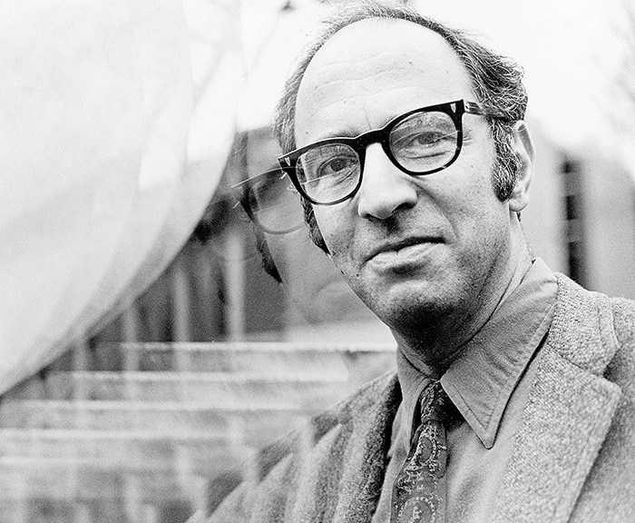
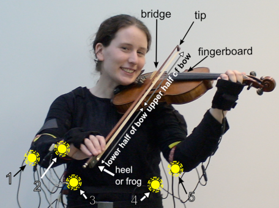

- title : Human Computer Interaction
- description : Human Computer Interaction
- author : Tomas Petricek
- theme : simple
- transition : none
  
****************************************************************************************************

# **CO582: Computer Interaction and User Experience**  History and research paradigms

  
   

**Tomas Petricek**

email: [t.petricek@kent.ac.uk](mailto:t.petricek@kent.ac.uk) 
twitter: [@tomaspetricek](http://twitter.com/tomaspetricek) 
office: [S129A](https://www.cs.kent.ac.uk/rooms/S129A.gif) 

****************************************************************************************************
 - class: part
 
# **Why history and research paradigms**

----------------------------------------------------------------------------------------------------

# The Structure of Scientific Revolutions

**Research paradigms**

 - Determine what questions matter
 - Assumptions are not questioned
 - Provide methods for answering 

**Scientific revolutions**

 - There is one dominant paradigm
 - Problems cause paradigm shifts
 - Knowledge is incommensurable

----------------------------------------------------------------------------------------------------

# Research paradigms in computer interaction and UX

**What questions do we ask?**

 - How to prevent certain kind of errors
 - How to design a pleasant interface

**How do we answer them?**

 - Run a controlled experiment
 - Work with users on a design

----------------------------------------------------------------------------------------------------

# Research paradigms in computer interaction and UX

**Four paradigms**

 1. Human factors (1950s)
 2. Cognitive models (1980s)
 3. Human actors (1990s)
 4. Experience and emotion (2000s)

**Nature of the paradigms**

 - They overlap and some can be grouped
 - They focus on complementary aspects

****************************************************************************************************
 - class: part

# **I: Human factors (1950s)**

----------------------------------------------------------------------------------------------------

# Electronic equipment in World War II

**Equipment interaction incidents**

 - Airplane crashes by trained pilots
 - Missed enemies on radars
 - Controls & instrument displays

**Goal is to optimize man-machine fit**

 - Minimize potential for problems
 - Experimental psychology
 - Testing inside and outside lab

 
----------------------------------------------------------------------------------------------------

 

What if it turns out that finding the right knob is hard?

----------------------------------------------------------------------------------------------------

----------------------------------------------------------------------------------------------------

# **Example:** Knobs distinguishable by touch alone

### Typical for human factors paradigm

_<i class="fa fa-car-crash"></i>_ Motivated by a critical incident _(albeit hypothetical)_

_<i class="fa fa-wrench"></i>_ Pragmatic solution to a practical problem

_<i class="fa fa-flask"></i>_ Experimentally tested _(different sizes don't work)_

****************************************************************************************************
 - class: part

# **II: Cognitive models (1980s)**

----------------------------------------------------------------------------------------------------

# Cognitive models and information processing

**Understand how users think**

 - Use models to guide design
 - Models with predictive power
 - Model both brain and computer 
 

**Assumptions and methods**

 - Task-focused problems
 - Allows systematic evaluation
 - Limitations of the model are acceptable
 

----------------------------------------------------------------------------------------------------

Does this start screen allow efficient use of Word?

_Hard to answer from human factors perspective!_

----------------------------------------------------------------------------------------------------

# **Example:** Information processing model

**Information processing models**

 - Series of stages acting on mental representation
 - Information can be images, rules, models, etc.
 - Predict what components are involved
 - Predict user reaction time

----------------------------------------------------------------------------------------------------

# **Example:** Information processing model

### Typical for cognitive models paradigm

_<i class="fa fa-brain"></i>_ Model of how brain works _(not ad-hoc human factors)_

_<i class="fa fa-chart-line"></i>_ Predictive power _(can be tested in a lab)_

_<i class="fa fa-user"></i>_ Simplifying assumptions _(not actual users in context)_

----------------------------------------------------------------------------------------------------

# Classical cognitive models of computer interaction

**Human processor model**  
Stages in perceptual, cognitive and motor subsystems

**Goals, operators, methods, selection (GOMS)**  
Select method consisting of operators to achieve a goal

**Keystroke-level model (KLM)**  
How expensive is an operation such as drag and drop?

****************************************************************************************************
 - class: part

# **III: From human factors to human actors (1990s)**

----------------------------------------------------------------------------------------------------

# From human factors to human actors

**Improve how users work**

 - Study actual, not model users
 - In a real workplace environment
 - Help improve work efficiency
 

**Assumptions and methods**

 - Users are part of the process
 - Ethnography, prototyping, participatory design
 - Knowledge has limited generalizability 
 

----------------------------------------------------------------------------------------------------

How to add features to Excel?

_How people learn about them?_

----------------------------------------------------------------------------------------------------

# How do people learn to use spreadsheets? (Sarkar et al., 2018)

**Conducted interviews with small number of users**

 - Including beginners and experts
 - Asking how they learned about new features
 - Summarizing important points

**Important lessons from users**

 - Learn from experienced users in organization
 - Learn from spreadsheets using the feature 

**How can we add a new learnable feature?**

----------------------------------------------------------------------------------------------------

# **Example:** How do people learn to use spreadsheets?

### Typical for human actors paradigm

_<i class="fa fa-users"></i>_ Involves users _(ethnography and surveys)_

_<i class="fa fa-building"></i>_ Rich context _(colleagues and existing spreadsheets)_

_<i class="fa fa-comment"></i>_ Qualitative rather than quantitative _(hard to test)_

_<i class="fa fa-thumbs-up"></i>_ No definite answers _(but useful design hints)_

****************************************************************************************************
 - class: part

# **IV: Cultural and emotional experience (2000s)**

----------------------------------------------------------------------------------------------------

# Cultural and emotional experience

**Changing nature of computing**

 - Ambient and ubiquitous
 - Move from work to leisure use
 - Technological advances  
   enable new experiences
 

**Assumptions and methods**

 - Take it or leave it approach
 - Ideas from art or philosophy
 

----------------------------------------------------------------------------------------------------

Reddit [/r/place](http://reddit.com/r/place) allowed users to change 1 pixel in a 1000x1000 grid
per 5-20 minutes.

----------------------------------------------------------------------------------------------------

# Third-wave human computer interaction

### Methods and concerns of the third wave

_<i class="fa fa-question-circle"></i>_ Can ask questions rather than giving answers

_<i class="fa fa-sync"></i>_ Think about entire digital ecosystems

_<i class="fa fa-shoe-prints"></i>_ Understanding human body and mind

_<i class="fa fa-robot"></i>_ Explore new forms and shapes of interaction

----------------------------------------------------------------------------------------------------

## MusicJacket (van der Linden et al., 2010)

 

Wearable system to support the teaching of good posture and bowing technique to novice violin players.

----------------------------------------------------------------------------------------------------

# **Example:** MusicJacket

### Typical for emotional experience paradigm

_<i class="fa fa-american-sign-language-interpreting"></i>_ Uses human body as an interface

_<i class="fa fa-music"></i>_ Designed for leisure application _(somewhat)_

_<i class="fa fa-flask"></i>_ Experimentally tested _(unlike more art projects)_

****************************************************************************************************
 - class: part

# **Summary**

----------------------------------------------------------------------------------------------------

# **Four paradigms**: Motivations and methods (1/2)

**Human factors (1950s)**  

 - Avoid incidents caused by bad interaction
 - Pragmatic solution, experimental testing

**Cognitive models (1980s)**  

 - Make interaction efficient in less ad-hoc way
 - Cognitive models with predictive power

----------------------------------------------------------------------------------------------------

# **Four paradigms**: Motivations and methods (2/2)

**From human factors to human actors (1990s)**  

 - Improve efficiency in a real work environment
 - Ethnography, prototyping, participatory design

**Cultural and emotional experience (2000s)**  

 - New formats of computing and non-work focus
 - Inspiration from art, qualitative evaluation

----------------------------------------------------------------------------------------------------

# CO582: History and research paradigms

**What you should remember from this lecture**

 - Why paradigms matter
 - Four paradigms of human-computer interaction
 - Their motivations and methods they use
 
 
 

Tomas Petricek 
_[t.petricek@kent.ac.uk](mailto:t.petricek@kent.ac.uk) | [@tomaspetricek](http://twitter.com/tomaspetricek)_

****************************************************************************************************
 - class: part
 
# **References**

----------------------------------------------------------------------------------------------------

### Papers

- [When second wave HCI meets third wave challenges](https://pure.au.dk/ws/files/93115128/nordichipreprint.pdf), S. Bødker 
- [Three faces of human-computer interaction](http://www.jonathangrudin.com/wp-content/uploads/2017/03/Annals.pdf), J. Grudin 
- [The three paradigms of HCI](http://people.cs.vt.edu/~srh/Downloads/HCIJournalTheThreeParadigmsofHCI.pdf), S. Harrison et al.
- [Third-wave HCI, 10 years later - Participation and sharing](http://interactions.acm.org/archive/view/september-october-2015/third-wave-hci-10-years-later-participation-and-sharing), S. Bødker
- [A brief survey on user modelling in HCI](https://www.cl.cam.ac.uk/~pr10/publications/ihci10.pdf), P. Biswas, P. Robinson 
- [MusicJacket—Combining Motion Capture and Vibrotactile Feedback to Teach Violin Bowing](https://ieeexplore.ieee.org/document/5585755),  
  J. Van Der Linden et al.

----------------------------------------------------------------------------------------------------

### Books

- [The Structure of Scientific Revolutions](https://en.wikipedia.org/wiki/The_Structure_of_Scientific_Revolutions), Thomas Kuhn
- [Interaction Design: Beyond Human-Computer Interaction](https://www.amazon.co.uk/Interaction-Design-Beyond-Human-Computer/dp/0470018666), H. Sharp, Y. Rogers, J. Preece

### Web links

- [What is Human Factors and Ergonomics?](http://www.benchmarkrs.com/main/human-factors/what.aspx)
- [Ethnography - The Encyclopedia of HCI](https://www.interaction-design.org/literature/book/the-encyclopedia-of-human-computer-interaction-2nd-ed/ethnography)
- [Human Factors - The Glossary of HCI](https://www.interaction-design.org/literature/book/the-glossary-of-human-computer-interaction/human-factors)
- [Place (Reddit) - Wikipedia](https://en.wikipedia.org/wiki/Place_(Reddit))

