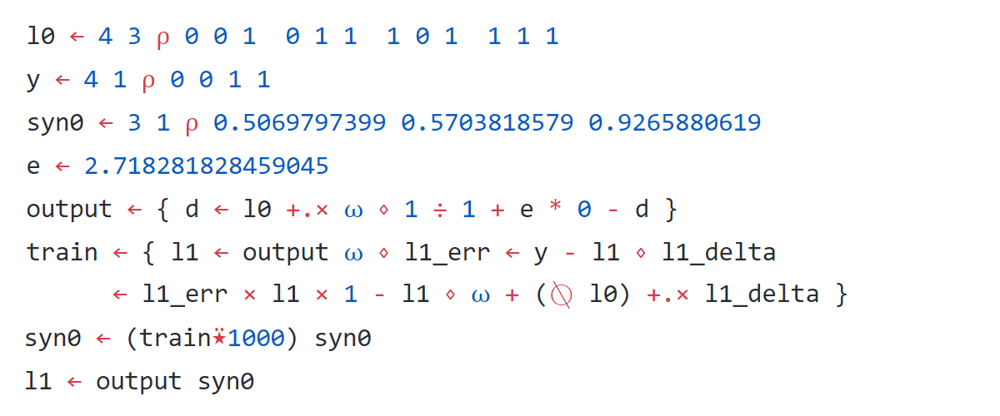
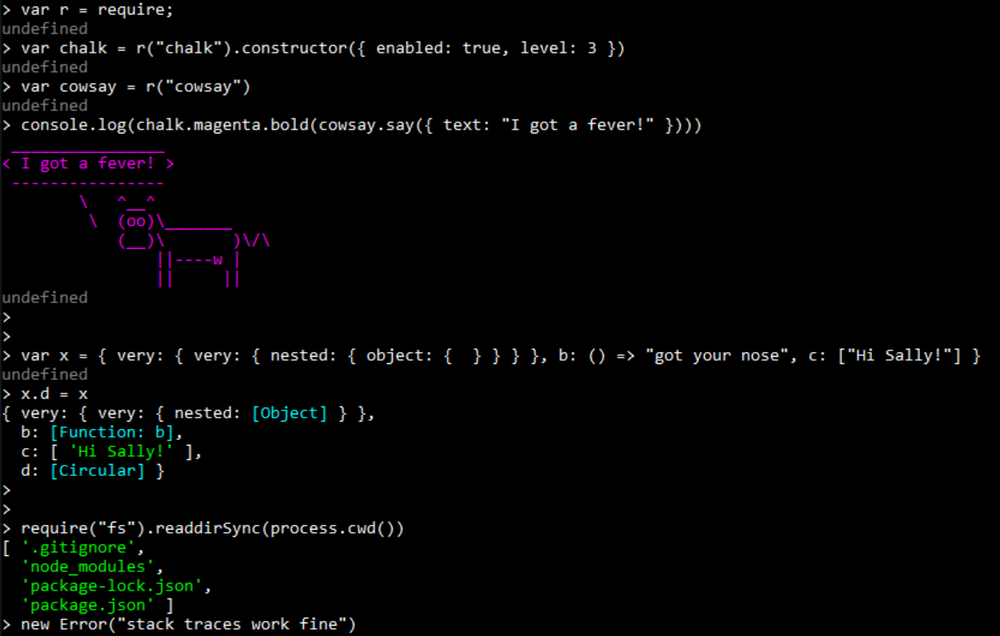
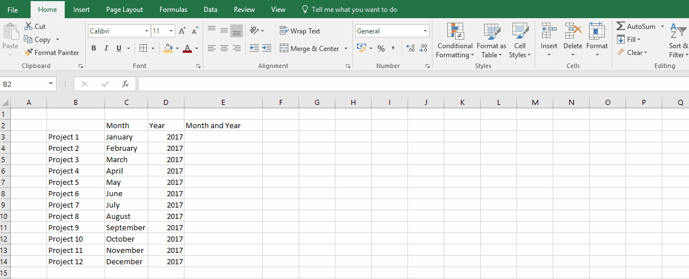
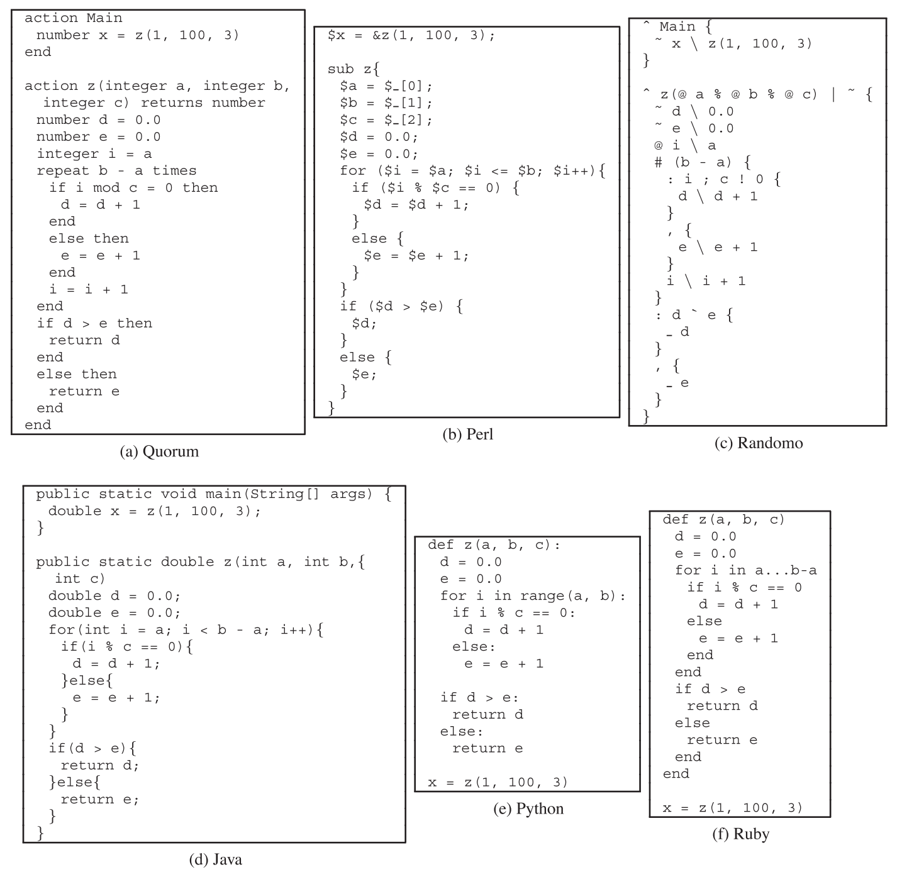
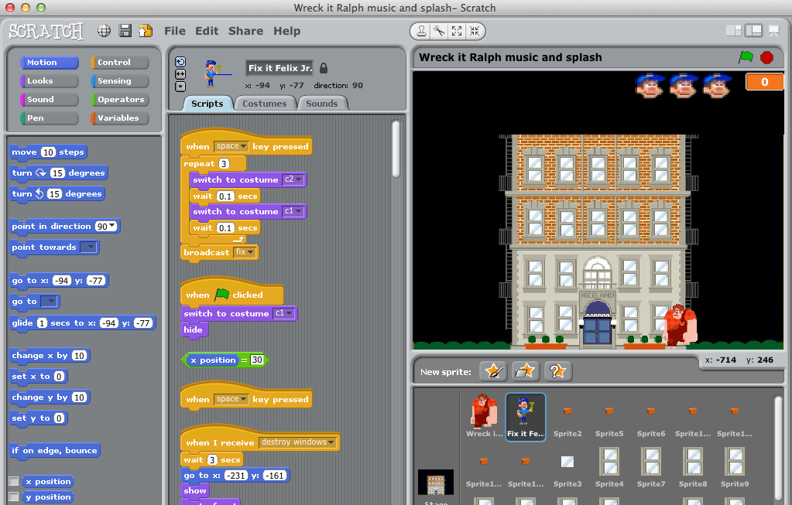
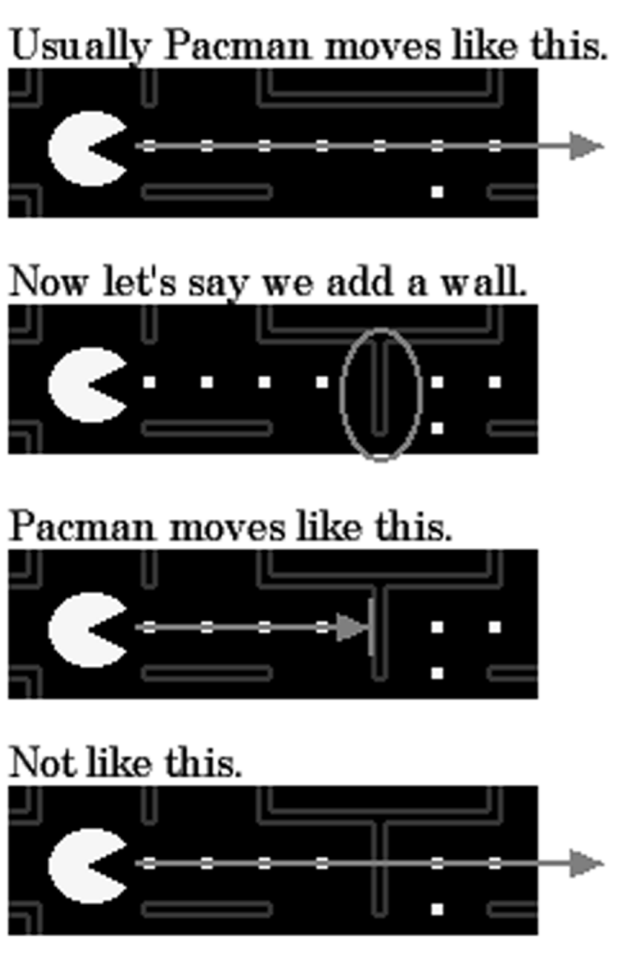

- title : Human Computer Interaction: Specialist users
- description : Human Computer Interaction: Specialist users
- author : Tomas Petricek
- theme : simple
- transition : none
  
****************************************************************************************************

# **CO582: Computer Interaction and User Experience**  Programmers and other specialist users

  
   

**Tomas Petricek**

email: [t.petricek@kent.ac.uk](mailto:t.petricek@kent.ac.uk) 
twitter: [@tomaspetricek](http://twitter.com/tomaspetricek) 
office: [S129A](https://www.cs.kent.ac.uk/rooms/S129A.gif) 

****************************************************************************************************
- class: part

# **Programming languages and tools**

----------------------------------------------------------------------------------------------------

# Programming languages and tools
 

**What programmers work with**

 - _Language syntax_
 - _Development environments_
 - _Debugging & reading tools_

**How programmers interact**

 - _Bring punch cards and wait (1950s)_
 - _Connect to mainframe using terminal (1970s)_
 - _Editor with graphical interface (1980s)_ 

----------------------------------------------------------------------------------------------------

# Programming languages and tools

### Programmers are users too!

_<i class="fa fa-font"></i> What language syntax is easy to understand?_

_<i class="fa fa-puzzle-piece"></i> What programming abstractions fit mental models?_

_<i class="fa fa-search"></i> What tools can help making sense of code?_

_<i class="fa fa-keyboard"></i> What real programmers actually struggle with?_

----------------------------------------------------------------------------------------------------

 
**Syntax: APL and Visual Basic .NET**

User experience

_What is easier to write or read?_

_What matters more in practice?_

_Does this matter for expert users?_

----------------------------------------------------------------------------------------------------

**Integrated Development Environments**

_Offer relevant help in context_

_How to assist with writing, debugging, navigating_

----------------------------------------------------------------------------------------------------

# Interacting with programming systems

**Classic software engineering**

 - _Implement one feature_
 - _Compile your project_
 - _Run and provide inputs_
 

 
**Live coding, data science**

 - _Load data in advance_
 - _Edit program interactively_
 - _See new results on the fly and repeat_

----------------------------------------------------------------------------------------------------

**REPL - Read, Eval, Print Loop**

_Type line, run it, see result_

_Immediate feedback, but limited interaction_

----------------------------------------------------------------------------------------------------

**Jupyter Notebooks**

_REPL with chart output_

_Can edit previous notebook cells_

What is the mental model of execution?

----------------------------------------------------------------------------------------------------

**Excel**

_Why finance and insurance companies (over)use it  
so much?_

----------------------------------------------------------------------------------------------------

**Other forms of interactions**  
_Programming by example_

----------------------------------------------------------------------------------------------------

# Programming languages and tools

### What can we study using user experience methods

_<i class="fa fa-flask"></i> Compare syntax using controlled studies_

_<i class="fa fa-battery-quarter"></i> Heuristic evaluation (consistency, system status)_

_<i class="fa fa-user-tie"></i> How are systems used in corporate environment?_

_<i class="fa fa-database"></i> GOMS models of data analysis tasks_

_<i class="fa fa-industry"></i> Metaphors for understanding code abstractions_

****************************************************************************************************
- class: part

# **Code, languages and notations**

----------------------------------------------------------------------------------------------------

# Code, languages and notations

**Language syntax**

 - _Symbols or words_
 - _Structure of nesting_
 - _How much it matters?_
 
**Programming as writing**

 - _How we compose programs?_
 - _Top-down vs. bottom-up_
 - _Metaphors used in code_

----------------------------------------------------------------------------------------------------

An empirical investigation into program-ming lang-uage syntax

_Which of them is easier to use?_

----------------------------------------------------------------------------------------------------

Controlled lab study, using 6 simple tasks

----------------------------------------------------------------------------------------------------

# Code, languages and notations

### An empirical look at programming language syntax

_<i class="fa fa-calculator"></i> Statistically significant, scientific results_

_<i class="fa fa-school"></i> Used as a basis for Quorum language design_

_<i class="fa fa-poop"></i> Random language is better than Perl!_

_<i class="fa fa-paw"></i> Limited scope - syntax might be detail_

_<i class="fa fa-user-ninja"></i> Novices only - hard to evaluate with experts_

----------------------------------------------------------------------------------------------------

# Metaphors for variables

**Variable is like a label**

_A variable is like a label that one can place on one value, like a temperature or the age of a person_

**Variable is like a box**

_A variable is like a box that can contain a value, like a piggy bank or a shoe box._

----------------------------------------------------------------------------------------------------

# Comparing metaphors for variables in programming education

### Variable as a label or as a box

_<i class="fa fa-university"></i> Taught ~200 using label and ~200 using box_

_<i class="fa fa-trophy"></i> Student using box metaphor did better_

_<i class="fa fa-archive"></i> Box leads to multiple values misconception_

_<i class="fa fa-chalkboard-teacher"></i> Metaphor used for learning programming_

****************************************************************************************************
- class: part

# **Teaching programming**

----------------------------------------------------------------------------------------------------

# Teaching programming 

**Learning how to program is hard**

 - _How to make it easier?_
 - _What language to teach?_
 - _Design a better one?_
 

 
**Designing a teaching language**

 - _Using principles from psychology_
 - _Experiments to drive design_
 - _Experiments to evaluate options_

----------------------------------------------------------------------------------------------------

**LOGO and Turtle graphics**

_Turtle moves around screen with a pen_

----------------------------------------------------------------------------------------------------

# **Logo**: Developmental psychology principles

**Learning by doing**

 - _Jean Piaget's constructivism_
 - _Create knowledge by interacting_

**Stages of cognitive development**

 1. _Sensorimotor stage_
 2. _Preoperational stage_
 3. _Concrete operational stage_
 4. _Formal operational stage_

----------------------------------------------------------------------------------------------------

**Scratch**

_Learning by doing tradition_

_Supports multiple cognitive stages_

----------------------------------------------------------------------------------------------------

# Teaching programming 

### Using experiments to guide language design

_<i class="fa fa-child"></i> How novices think about programming?_

_<i class="fa fa-lightbulb"></i> Conceiving vs. formalising solution_

_<i class="fa fa-pen-fancy"></i> Write natural language solution_

_<i class="fa fa-code"></i> Design language to support the patterns_

----------------------------------------------------------------------------------------------------

**"Programming" a Pacman**

Write a statement that summarizes how computer should move Pacman

_Twelve 10 year olds_

_Responses categorized  
by 5 CS students_

----------------------------------------------------------------------------------------------------

**Programming style**

54% - rules or event-based  
_When Pacman eats all dots, he goes to the next level_

18% - global constraints
_Cannot go through a wall_

16% - declarations/other  
_There are 4 monsters._

12% - imperative  
_Display this string.  
Play this sound._

----------------------------------------------------------------------------------------------------

**HANDS System:** Logic written using event-based rules!

****************************************************************************************************
- class: part

# **Code, navigation and search**

----------------------------------------------------------------------------------------------------

# Code, navigation and search

**Searching through code**

 - _Most of time is spent understanding code_
 - _Navigation through codebase_ 

**Searching through possibilities**

 - _Search as a metaphor for problem solving_
 - _Searching for the right program_
 
----------------------------------------------------------------------------------------------------

**Code search**

_Study what developers search for  
and why_

----------------------------------------------------------------------------------------------------

# Searching through code

### Code search study from Google

_<i class="fa fa-bars"></i> Using data from logs and surveys_

_<i class="fa fa-search"></i> Analyze techniques and motivations for search_

_<i class="fa fa-code"></i> Finding very (17%) or somewhat (44%) familiar code_

_<i class="fa fa-puzzle-piece"></i> Learning how code works (46%) or how to use it (21%)_

----------------------------------------------------------------------------------------------------

# Searching through state space

**State space**

 - _Possible game states_
 - _User interface options_
 - _Possible programs_

**Interaction questions**

 - _Depth of the goal_
 - _Breath-first or depth-first_
 - _Allow lookahead when searching_
 
----------------------------------------------------------------------------------------------------

 

**Programming interaction as search**  
_Searching for a program in program space_

****************************************************************************************************
 - class: part

# **Summary**

----------------------------------------------------------------------------------------------------

# Programmers and other specialist users

**Applying HCI methods in practice**  
Problems: Improving efficiency and understanding  
Methods: Surveys, studies, metaphors, log analysis

**Teaching programming to novices**  
What is the best metaphor for variables?  
What is natural language of programming?

**Human computer interaction as search**  
Searching for options in user interface  
Searching the space of possible programs

----------------------------------------------------------------------------------------------------

# CO582: Programmers and other specialist users

**What you should remember from this lecture**

 - Kinds of question and methodology, not problems
 - Usability, efficiency, ease of comprehending
 - Expert analysis, experiments and their limitations

 
 

Tomas Petricek 
_[t.petricek@kent.ac.uk](mailto:t.petricek@kent.ac.uk) | [@tomaspetricek](http://twitter.com/tomaspetricek)_

****************************************************************************************************
 - class: part
 
# **References**

----------------------------------------------------------------------------------------------------

**Books**

- [Human Error](https://books.google.co.uk/books/about/Human_Error.html?id=WJL8NZc8lZ8C), James Reason
- [The Design of Everyday Things](https://en.wikipedia.org/wiki/The_Design_of_Everyday_Things), Don Norman

**Papers and links**

 - [Experimental Study of Vertical Flight Path Mode Awareness](https://www.sciencedirect.com/science/article/pii/S1474667017452256),
   Eric N. Johnson, Amy R. Pritchett

code search
https://static.googleusercontent.com/media/research.google.com/en//pubs/archive/43835.pdf

hands
https://faculty.washington.edu/ajko/papers/Myers2016ProgrammersAreUsers.pdf
https://www.cs.cmu.edu/~NatProg/papers/Myers2004NaturalProgramming.pdf

pacman
http://alumni.cs.ucr.edu/~ratana/PaneRatanamahatanaMyers00.pdf

hci
http://www.pgbovine.net/what-is-hci-research.htm

felienne
http://www.felienne.com/archives/6063

learning scratch
https://www.tandfonline.com/doi/full/10.1080/08993408.2013.832022?casa_token=MrxrpNkWjo0AAAAA%3APtWPbArMp4_mTUHfMNz1ewPopN7f7-rbeYTuZs7HF1empsl9I883sB8Dsmx_qrnqZ9bwAcckyW0L&

How do people naturally think about computation?
Cyrus Omar
https://www.cs.cmu.edu/~comar/NaturalComputation.pdf