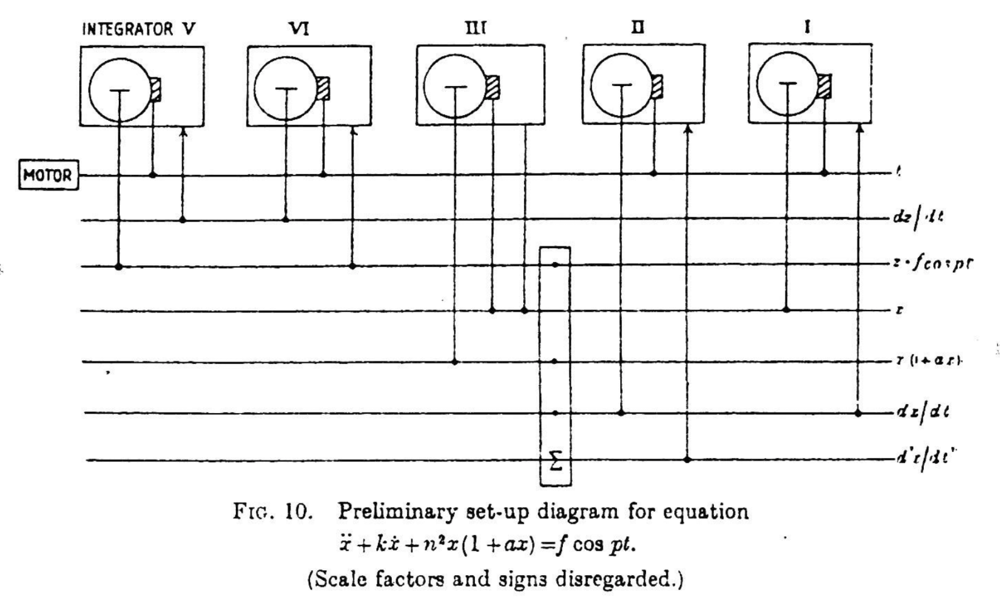
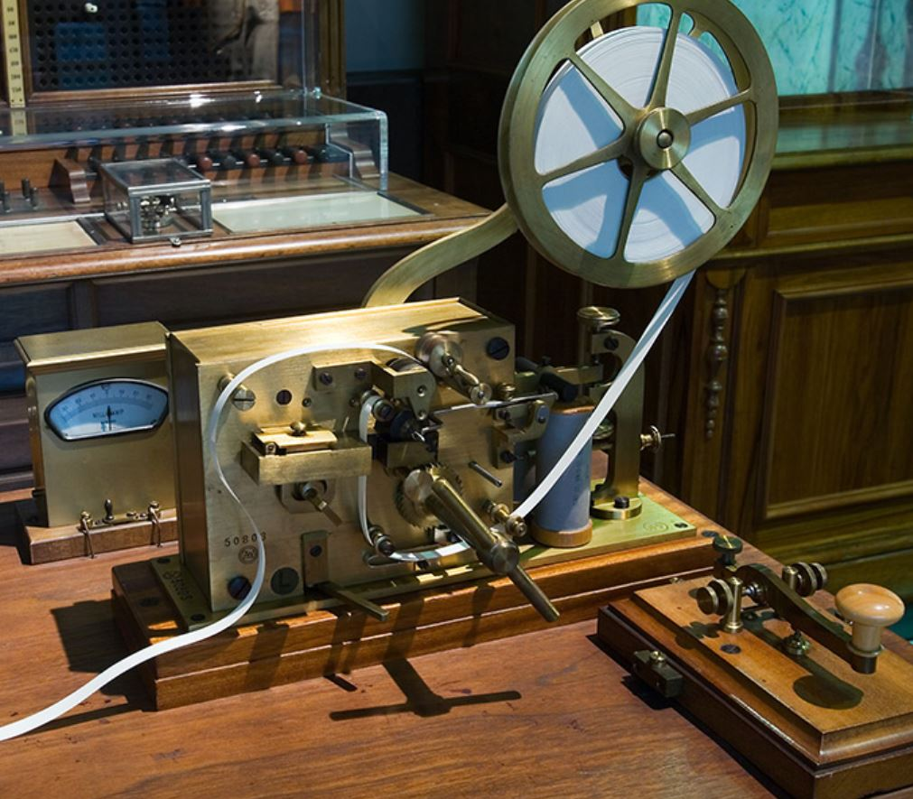
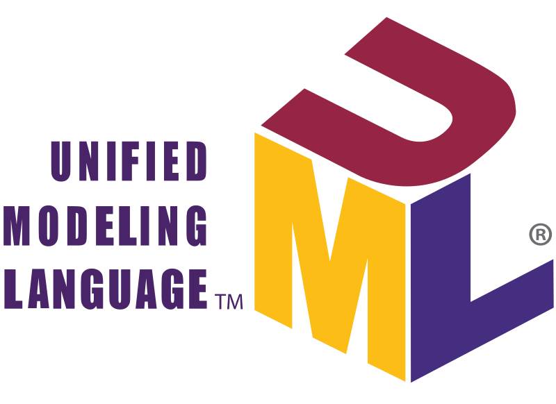
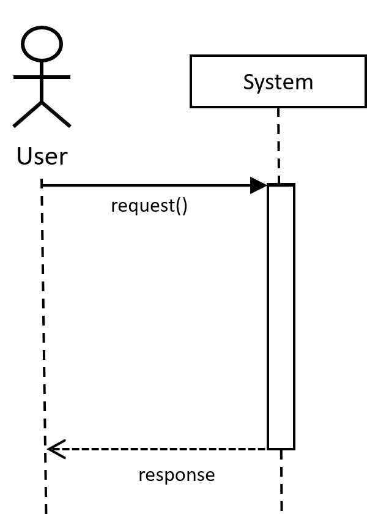
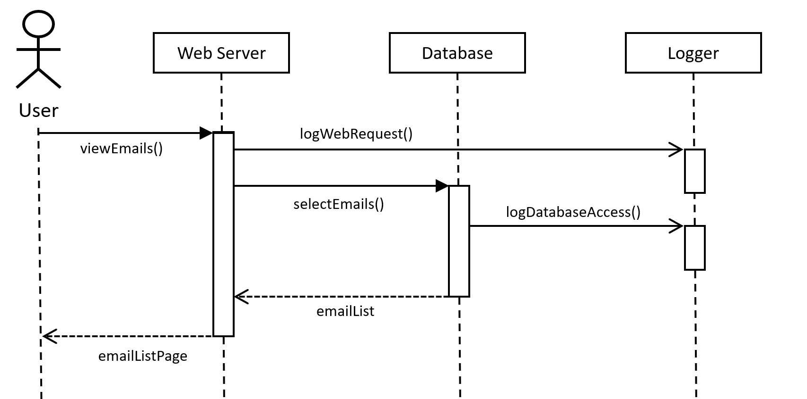

- title : Software Engineering: Modelling behaviour
- description : Software Engineering: Modelling behaviour
- author : Tomas Petricek
- theme : simple
- transition : none

****************************************************************************************************

# **CO886: Software Engineering**  Modelling behaviour

  
   

**Tomas Petricek**

email: [t.petricek@kent.ac.uk](mailto:t.petricek@kent.ac.uk) 
twitter: [@tomaspetricek](http://twitter.com/tomaspetricek) 
office: [S129A](https://www.cs.kent.ac.uk/rooms/S129A.gif) 

****************************************************************************************************
- class: part

# **Prehistory and behaviour modelling**

----------------------------------------------------------------------------------------------------

**Hartree Differential Analyzer**, circa 1935

_Analog computer solving differential equations_

_Information flow between components_

----------------------------------------------------------------------------------------------------

**Herman Goldstine & John von Neumann**, circa 1947

_Program described as a flow diagrams_

_Sequence of individual steps with loops and branching_

----------------------------------------------------------------------------------------------------

# Two aspects of behaviour

**Communication patterns**

 - _Interactions of services_
 - _Sending messages over network_
 - _Communication in teams_

**State change patterns**

 - _Changing state of an object_
 - _Workflow or a process to follow_

----------------------------------------------------------------------------------------------------

# Modelling behaviour

### Tools and practices for state and communication

_<i class="fa fa-chalkboard-teacher"></i> Lightweight use in whiteboard discussions_

_<i class="fa fa-cogs"></i> Heavyweight software tools with code generation_

_<i class="fa fa-layer-group"></i> Range from function logic to business processes_

_<i class="fa fa-code"></i> Various directions of programming language support_

****************************************************************************************************
- class: part

# **Capturing communication using sequence diagrams**

----------------------------------------------------------------------------------------------------

# UML sequence diagrams

**Interactions between objects**

 - _Actions in sequential order_
 - _What is passed between what parts_
 - _Explain how business works_

**Features beyond this lecture**

 - _Actors, objects, anonymous instances_
 - _Deleting and creating entities_
 - _Alternatives, parallelism, options, loops, etc._

----------------------------------------------------------------------------------------------------

# UML sequence diagrams

**Actors and objects**

 - _Stick figures or objects_
 - _Lifeline with periods of activity_
 - _Write_ sys:Sytem _for an instance_

**Communication via messages**

 - _Sequential top-to-bottom process_
 - _Written as function calls_
 - _Different kinds of arrows_

----------------------------------------------------------------------------------------------------

# Fancy arrows

<table style="width:100%" class="tc"><tr>
<td style="width:33%;text-align:center">

**Synchronous**  

_Call another component and wait until it responds_

</td>
<td style="width:33%;text-align:center" class="fragment">

**Asynchronous**  

_Call another component but continue running_

</td>
<td style="width:33%;text-align:center" class="fragment">

**Response**

_Sent at the end of sync or async call_

</td>
</tr></table>

----------------------------------------------------------------------------------------------------

**Guess the system!**

Checking your Gmail

_Web server fetches data from database_

_Logger records  
all events asynchronously_

----------------------------------------------------------------------------------------------------

- class: part

# **Demo:** Modelling PhD application process

----------------------------------------------------------------------------------------------------

# Implementing sequence diagrams

**Object-oriented programming**

_I thought of objects being like biological cells
and/or individual computers on a network, only able to communicate with messages._

**Network and workflows**

 - _HTTP calls between services_
 - _Erlang language and Akka library for Java_

----------------------------------------------------------------------------------------------------

**Programming Language Support**

Formal language  
_model circa 1978_

Session types  
_to check the communication protocol today_

****************************************************************************************************
- class: part

# **Capturing workflows using state diagrams**

----------------------------------------------------------------------------------------------------

state of an order

user interfaces
imperative implementation
recursive implementation

biztalk scale

****************************************************************************************************
- class: part

# **???**

----------------------------------------------------------------------------------------------------

****************************************************************************************************
- class: part

# **Summary**

----------------------------------------------------------------------------------------------------

# Modelling structure

**Decomposing systems into modules**  
_From subroutines to abstract modules and objects_  
_Abstract data types, object-oriented programming_

**Object-oriented modelling**  
_Heavyweight and lightweight methodologies_  
_Is-A, Has-A and dependency relations_

**Beyond object-oriented modelling**  
_Functional programming and the expression problem_  
_Solving repetitive problems with DSLs_

----------------------------------------------------------------------------------------------------

# CO886: Modelling structure

**What you should remember from this lecture**

 - Abstraction and origins of objects
 - Class diagrams and three kinds of arrows
 - Be aware that there are other options!

 
 

Tomas Petricek 
_[t.petricek@kent.ac.uk](mailto:t.petricek@kent.ac.uk) | [@tomaspetricek](http://twitter.com/tomaspetricek)_

****************************************************************************************************
 - class: part

# **References**

----------------------------------------------------------------------------------------------------

references

routines of substitution

Marie-José Durand-Richard, Towards programming before flowcharts : diagrams from Babbage to Wilkes
https://programme.hypotheses.org/794

**Academic papers**

 - David Parnas (1972). [On The Criteria To Be Used in Decomposing Systems into Modules](https://www.win.tue.nl/~wstomv/edu/2ip30/references/criteria_for_modularization.pdf)
 - Barbara Liskov, Stephen Zilles (1974). [Programming with Abstract Data Types](https://dl.acm.org/citation.cfm?id=807045)
 - Alan Kay (1993). [The Early History of Smalltalk](http://worrydream.com/EarlyHistoryOfSmalltalk/)

**Tools, books and articles**

 - [Domain Specific Languages: The Functional Way](https://vimeo.com/97315970)
 - [The Expression Problem](http://homepages.inf.ed.ac.uk/wadler/papers/expression/expression.txt)
 - [UML Class Diagrams](http://agilemodeling.com/artifacts/classDiagram.htm)
