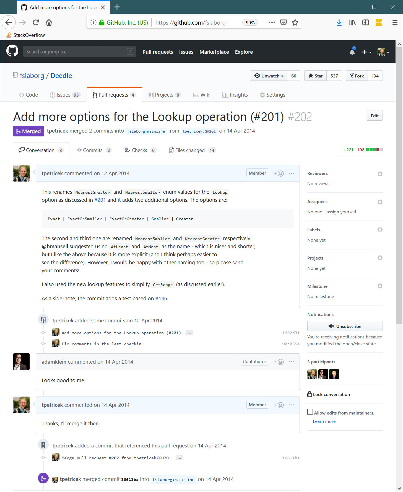

- title : Software Engineering: Tools for collaborative development
- description : Software Engineering: Tools for collaborative development
- author : Tomas Petricek
- theme : simple
- transition : none

****************************************************************************************************

# **CO886: Software Engineering**  Tools for collaborative development

  
   

**Tomas Petricek**

email: [t.petricek@kent.ac.uk](mailto:t.petricek@kent.ac.uk) 
twitter: [@tomaspetricek](http://twitter.com/tomaspetricek) 
office: [S129A](https://www.cs.kent.ac.uk/rooms/S129A.gif) 

****************************************************************************************************
- class: part

# **Collaborative development**

----------------------------------------------------------------------------------------------------

# GitHub, GitLab, etc.

### Commercial infrastructures around git

_<i class="fa fa-code-branch"></i> Git for source control with extra features_

_<i class="fa fa-chess-king"></i> Help teams plan and collaborate_

_<i class="fa fa-leaf"></i> Manage issues, notes, plans, contributions_

_<i class="fa fa-industry"></i> "Social network" for open source software_

----------------------------------------------------------------------------------------------------

# GitHub collaboration platform

**Other things a project needs**

 - _Tracking issues and feature requests_
 - _Hosting documentation and notes_
 - _Integration with test runners, etc._

**Why open source uses GitHub**

 - _Convenient way of storing my projects_
 - _Active developer community_
 - _GitHub is (a bit) like your CV_
 - _Why not? Not open-source itself..._

----------------------------------------------------------------------------------------------------

**GitHub as a CV**

Use your GitHub profile to show your work!

_Great if you are looking for your first job_

_Valid criticism of the GitHub as a CV idea_

****************************************************************************************************
- class: part

# **Collaboration and GitHub**

----------------------------------------------------------------------------------------------------

**GitHub projects**

_Git repository with history, branches etc._

_README and a few other special files_

_Additional features  
not based on Git_

----------------------------------------------------------------------------------------------------

# Additional GitHub features

### What exists in GitHub, but not in git

_<i class="fa fa-code-branch"></i>_ Fork _a project to create your clone in your profile_

_<i class="fa fa-forward"></i> Send_ pull requests _between multiple forks_

_<i class="fa fa-bug"></i> Track_ issues _and organise_ projects

_<i class="fa fa-font"></i> Use_ wiki _for keeping notes and documentation_

----------------------------------------------------------------------------------------------------

**Working with remote repositories**  
_Same thing as your  
local repository!_

Clone _to copy data_  
Pull _to fetch changes_    
Push _to update remote_

----------------------------------------------------------------------------------------------------

# Working with remote repositories (1/3)

**Clone a remote repository from GitHub**

    [lang=text]
    $ git clone https://github.com/tpetricek/test.git
    Cloning into 'test'...
    remote: Enumerating objects: 3, done.
    remote: Counting objects: 100% (3/3), done.
    remote: Total 3 (delta 0), reused 0 (delta 0), pack-reused 0
    Unpacking objects: 100% (3/3), done.

### Go to the new folder and edit the code

    [lang=text]
    $ cd test/

----------------------------------------------------------------------------------------------------

# Working with remote repositories (2/3)

**Modify repository locally offline**

    [lang=text]
    $ git commit -am "Modifying readme for test project"
    [master 59bb116] Modifying readme for test project
    1 file changed, 1 insertion(+), 1 deletion(-)

**Push local changes to remote repository**

    [lang=text]
    $ git push origin master
    Enumerating objects: 5, done.
    Counting objects: 100% (5/5), done.
    Writing objects: 100% (3/3), 271 bytes | 271.00 KiB/s, done.
    Total 3 (delta 0), reused 0 (delta 0)
    To https://github.com/tpetricek/test.git
       59ea774..59bb116  master -> master

----------------------------------------------------------------------------------------------------

# Working with remote repositories (3/3)

**Retrieve changes done by others**

    [lang=text]
    $ git pull origin master
    remote: Enumerating objects: 5, done.
    remote: Counting objects: 100% (5/5), done.
    remote: Total 3 (delta 0), reused 0 (delta 0), pack-reused 0
    Unpacking objects: 100% (3/3), done.
    From https://github.com/tpetricek/test
     * branch            master     -> FETCH_HEAD
       59bb116..1fd8ceb  master     -> origin/master
    Updating 59bb116..1fd8ceb
    Fast-forward
     README.md | 2 +-
     1 file changed, 1 insertion(+), 1 deletion(-)

----------------------------------------------------------------------------------------------------
- class: part

# **Demo:** GitHub projects, git push and pull

****************************************************************************************************
- class: part

# **Branches, forks and pull requests**

----------------------------------------------------------------------------------------------------

# Collaborating on GitHub

**Using branches in one project**

 - _Single GitHub project_
 - _Everyone in team has access_
 - _Good for small teams you trust_

**Using forks across projects**

 - _Each contributor has a fork_
 - _Main project has one or few owners_
 - _Good for allowing strangers to contribute_

----------------------------------------------------------------------------------------------------

**GitHub pull requests**
_Sending contributions  
back to project owner_

_Owner has write rights,_  
_way to discuss changes_

_Works within projects too_

_Linux uses patches and emails, not PRs!_

----------------------------------------------------------------------------------------------------

# Collaborating on a project

### Typical workflow when using branches

❶ Create project (GitHub) _- Add members as owners_

❷ Clone repository (git) _- From GitHub to your computer_

❸ Commit changes (git) _- All in your local repository_

❹ Push changes (git) _- Use a new branch to allow review_

❺ Send a pull request (GitHub) _- In a project to merge_

----------------------------------------------------------------------------------------------------

- class: part

# **Demo:** Working with branches on GitHub

----------------------------------------------------------------------------------------------------

# Contributing to a project

### Typical workflow when using forks

❶ Fork project (GitHub) _- Online copy in your profile_

❷ Clone repository (git) _- From GitHub to your computer_

❸ Commit changes (git) _- All in your local repository_

❹ Push changes (git) _- From your computer to GitHub_

❺ Send a pull request (GitHub) _- Online to the owner_

----------------------------------------------------------------------------------------------------

- class: part

# **Demo:** Working with forks on GitHub

****************************************************************************************************
- class: part

# **Contributing to open-source**

----------------------------------------------------------------------------------------------------

_Life of an open-source project maintainer can be tough!_

----------------------------------------------------------------------------------------------------

# Contributing to open-source

### What open-source projects need to live?

_<i class="fa fa-lock-open"></i>_ **Maintainer** _- 1 hour a day, week or month_   
_Someone to merge changes, build releases, explain issues_

_<i class="fa fa-code"></i>_ **Core developers** _- irregular, but more time_   
_To implement major new features in the software_

_<i class="fa fa-cogs"></i>_ **Contributors** _- a couple of hours or days_  
_Improvements, fixing bugs, better documentation_

----------------------------------------------------------------------------------------------------

# Contributing to open-source

**Even small things matter**

 - _Minor bug fixes and typos_
 - _Documentation improvements_
 - _Good bug reports_

**How to do it well**

 - _Follow style and contributing guidelines_
 - _Report issues with minimal example_
 - _Small to large builds trust & communicate well_

----------------------------------------------------------------------------------------------------

**Good contributing**

Read the guidelines  
_On Github typically in `CONTRIBUTING.md` file_

Follow guidelines    
_Where to discuss, how to comment and explain_

****************************************************************************************************
- class: part

# **Summary**

----------------------------------------------------------------------------------------------------

# Tools for collaborative development

**Collaborative development using GitHub**  
_Forks, pull requests, issues, etc._  
_Working with PRs, working with branches_

**GitHub and open source**  
_Typical open source contribution workflow_  
_Contributing to open-source projects_

----------------------------------------------------------------------------------------------------

# CO886: Tools for collaborative development

**What you should remember from this lecture**

 - GitHub forks, pull requests, etc.
 - What is in git vs. what is in GitHub

 
 

Tomas Petricek 
_[t.petricek@kent.ac.uk](mailto:t.petricek@kent.ac.uk) | [@tomaspetricek](http://twitter.com/tomaspetricek)_
