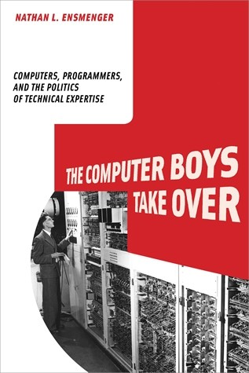
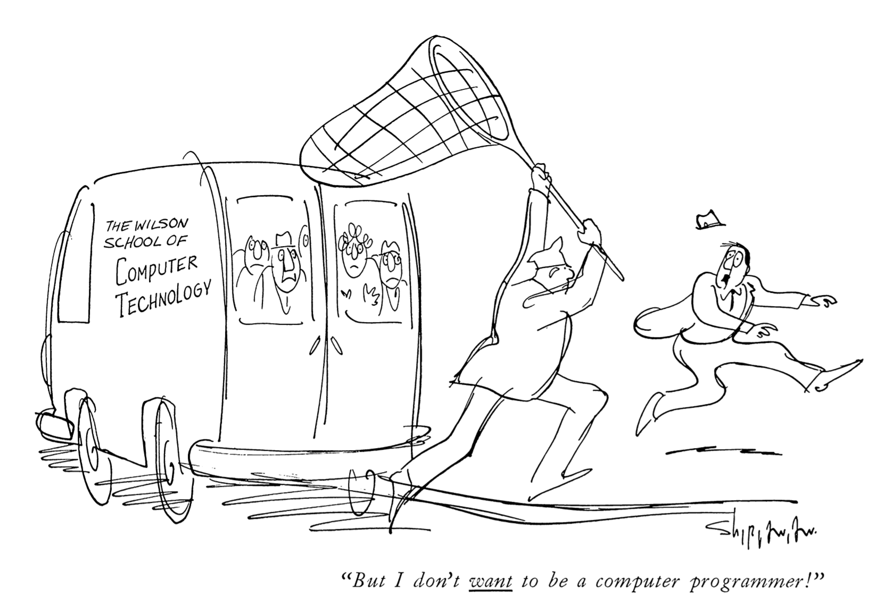

- title : Software Engineering: Origins and history
- description : Software Engineering: Origins and history
- author : Tomas Petricek
- theme : simple
- transition : none

****************************************************************************************************

# **CO886: Software Engineering**  Origins and history

  
   

**Tomas Petricek**

email: [t.petricek@kent.ac.uk](mailto:t.petricek@kent.ac.uk) 
twitter: [@tomaspetricek](http://twitter.com/tomaspetricek) 
office: [S129A](https://www.cs.kent.ac.uk/rooms/S129A.gif) 

****************************************************************************************************
- class: part

# **Software crises**

----------------------------------------------------------------------------------------------------

# **Charles Babbage** - Analytical Engine

On the mathematical powers of the calculating engine (1837)

_If trials of three or four simple cases have been made, and are found to agree with the results given by the engine, it is scarcely possible that there can be any error._

----------------------------------------------------------------------------------------------------

# **Nathan Ensmenger** - The Computer Boys Take Over

_The ENIAC women would simply set up the machine to perform these predetermined plans; that this work would turn out to be difficult and require radically innovative thinking was completely unanticipated._

----------------------------------------------------------------------------------------------------

By the end of [1960s] many were talking of a crisis (...).

_For the next several decades, [managers, academics and governments] would release warnings about the desperate state of the software industry with ritualistic regularity._

----------------------------------------------------------------------------------------------------

# **Nathan Ensmenger** - The Computer Boys Take Over

**Software paradox**

_How can we explain the [seemingly perpetual] crisis
in what is considered one of the most successful and
profitable industries of all time?_

### Software mostly works

_Surprisingly few people are killed as a result of a computer failure_

****************************************************************************************************
- class: part

# **Why is building software hard**

----------------------------------------------------------------------------------------------------

# Software systems and algorithms

**Algorithms**

 - _Abstract mathematical concept_
 - _Not affected by the real world_

**Software systems**

 - _Different scale of complexity_
 - _Socio-technological systems_
 - _Continually evolving environment_

----------------------------------------------------------------------------------------------------

# Inherent software complexity

### No Silver Bullet (Fred Brooks)

_<i class="fa fa-ellipsis-h"></i> Want 30 features? Have to program 30 features!_

_<i class="fa fa-microchip"></i> Digital systems are not continuous_

_<i class="fa fa-chart-line"></i> Small change can have unexpected consequences_

_<i class="fa fa-wrench"></i> We can only reduce accidental complexity_

----------------------------------------------------------------------------------------------------

# Software as a socio-technological entity

**Very large-scale systems**

 - _Information flow in a hospital_
 - _Evolving social networks_
 - _Defence systems of United States_

**Wicked problems**

_A_ wicked problem _is difficult or impossible to solve because of incomplete, contradictory, and changing requirements that are often difficult to recognize._

----------------------------------------------------------------------------------------------------

**Strategic Defence Initiative**

_"Since the missile defence environ-ment is hostile and
destabilizing by intent, the [software] is logically impossible."_

****************************************************************************************************
- class: part

# **1950s labour crisis**

----------------------------------------------------------------------------------------------------

From military and scientific applications to data processing.

_How to find and train good programmers?_

----------------------------------------------------------------------------------------------------

# Programming in 1950s

**Hacker culture**

_Programming was frequently seen as a black art
whose success or failure was dependent on the idiosyncratic abilities of
individual programmers._

**It is not clear how to**

 - _Identify good programmers_
 - _Train someone to be good_
 - _Produce software as a factory_

----------------------------------------------------------------------------------------------------

# Software in 1950s and 1960s

### Semi-Automatic Ground Environment (SAGE)

_<i class="fa fa-id-card"></i> Hired 3/5 of all available programmers (700)_  
_<i class="fa fa-chalkboard-teacher"></i> Trained 7000 more during the project_

### IBM OS/360 and Fred Brooks

_<i class="fa fa-clock"></i> Adding people to delayed project only makes it worse_  
_<i class="fa fa-industry"></i> Programming is resistant to industrial production_

****************************************************************************************************
- class: part

# **1970s software engineering**

----------------------------------------------------------------------------------------------------

**NATO Software Engineering Conference** (1968)

_Black art of programming had to make way for the science of software engineering_

**Follow-up 1969 Software Engineering Conference**  
_Shows disagreements about what this actually means_

----------------------------------------------------------------------------------------------------

# What might software engineering be?

**Mathematical culture**

 - Mathematical proofs
 - Abstract data types
 - Structured programming

**Managerial culture**

 - Control the workforce
 - Structured management of teams
 - Requirements and specifications

----------------------------------------------------------------------------------------------------

**Software engineering disciplinary repertoire**

_Software to reliably shoot down Soviet nuclear missiles cannot be built for_
software engineering _reasons_.

****************************************************************************************************
- class: part

# **1990s application crisis**

----------------------------------------------------------------------------------------------------

**Personal computing becomes ubiquitous**

_Business requirements change faster than software gets built_

Need methods that respond to change!

----------------------------------------------------------------------------------------------------

# Paradigm shift in Software Engineering (Christiane Floyd, 1987)

### From product-oriented approach...

_<i class="fa fa-file-alt"></i> Fixed context allows specification_  
_<i class="fa fa-clipboard-check"></i> Everything else is outside the scope_

### ...to process-oriented approach

_<i class="fa fa-paper-plane"></i> Development intertwined with learning_  
_<i class="fa fa-comments"></i> Different people continuously involved_

----------------------------------------------------------------------------------------------------

# Modern Software Engineering

### Recent and current trends in Software Engineering

_<i class="fa fa-rocket"></i> Manifesto of Agile software development_

_<i class="fa fa-bars"></i> Move beyond object oriented design_

_<i class="fa fa-code"></i> Open source software development_

_<i class="fa fa-leaf"></i> Programming as crafts or gardening_

****************************************************************************************************
 - class: part

# **Summary**

----------------------------------------------------------------------------------------------------

# Origins and history

**Software crises**  
_Continuous crisis in a profitable industry_  
_Labour ('50s), management ('70s), applications ('90s)_

**Why is building software hard**  
_Software systems are not algorithms_  
_Complexity, human aspects, changing environment_

**Four cultures of programming**  
_Hackers, managers, engineers, mathematicians_  
_Methods for building and trusting systems_

----------------------------------------------------------------------------------------------------

# Four cultures of programming (1/2)

### Hacker culture

_<i class="fa fa-terminal"></i> Trust programmers skilled in their craft_  
_<i class="fa fa-eye"></i> Apprenticeship model of learning_

### Managerial culture

_<i class="fa fa-users"></i> Trust well managed and organised teams_  
_<i class="fa fa-desktop"></i> Eliminates reliance on programmers_

----------------------------------------------------------------------------------------------------

# Four cultures of programming (2/2)

### Mathematical culture

_<i class="fa fa-graduation-cap"></i> Prove correctness mathematically_  
_<i class="fa fa-pen"></i> Assisted by various formal methods_

### Engineering culture

_<i class="fa fa-cubes"></i> Use a mix of good practices_  
_<i class="fa fa-wrench"></i> Testing, debugging, good structure_

----------------------------------------------------------------------------------------------------

# CO886: Origins and history

**What you should remember from this lecture**

 - Notable systems and reflections on them
 - Reasons why building software is hard
 - A range of approaches to addressing that

 
 

Tomas Petricek 
_[t.petricek@kent.ac.uk](mailto:t.petricek@kent.ac.uk) | [@tomaspetricek](http://twitter.com/tomaspetricek)_

****************************************************************************************************
 - class: part

# **References**

----------------------------------------------------------------------------------------------------

**Books**

 - Rebecca Slayton (2013). [Arguments that count](https://mitpress.mit.edu/books/arguments-count)
 - Nathan Ensmenger (2010). [Computer boys take over](https://mitpress.mit.edu/books/computer-boys-take-over)
 - Fred Brooks (1975). [The mythical man-month](https://www.amazon.co.uk/Mythical-Man-Month-Software-Engineering-Anniversary/dp/0201835959)

**Papers and articles**

 - Peter Varhol. [To agility and beyond: The history—and legacy—of agile development](https://techbeacon.com/agility-beyond-history%E2%80%94-legacy%E2%80%94-agile-development)
 - David Parnas (1985). [Software aspects of strategic defence systems](https://web.stanford.edu/class/cs99r/readings/parnas1.pdf)
